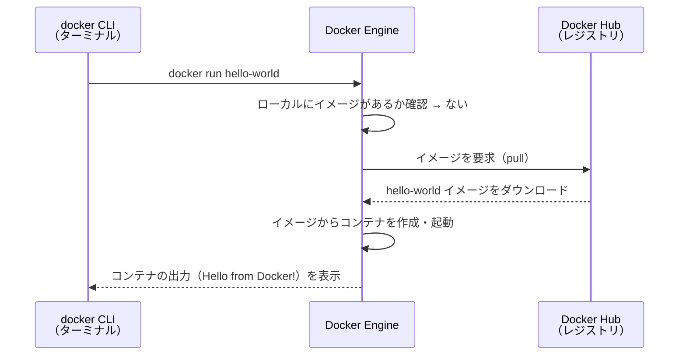
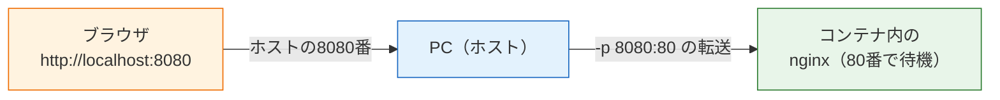

# Dockerのインストールと基本操作

前のページ（[コンテナとは何か](/docker/what_is_container/)）で、コンテナの概念と「イメージ＝設計図、コンテナ＝実行中の実体」という関係を学びました。このページでは、Docker Desktopをインストールし、実際にコマンドを打ちながら「イメージを取得する → コンテナを起動する → 中に入る → 片付ける」という一連の操作を身につけます。

ここで覚えるコマンドは、この先のすべてのセクションで日常的に使います。1つずつ実行結果を確認しながら進めてください。

## 学習目標

- Docker Desktopをインストールし、動作確認ができる
- `docker run` でイメージからコンテナを起動できる
- `docker ps` / `logs` / `stop` / `rm` でコンテナの状態確認と片付けができる
- `docker exec` で実行中のコンテナの中に入って操作できる
- ポート公開（`-p`）の意味を説明できる

## Docker Desktopのインストール

### Macの場合（このカリキュラムの標準環境）

1. [Docker Desktop公式サイト](https://www.docker.com/products/docker-desktop/) にアクセスし、「Download for Mac」からインストーラをダウンロードします。このとき、自分のMacのチップに合わせて **Apple Silicon**（M1/M2/M3など）か **Intel Chip** かを選びます。
   - 自分のチップが分からない場合は、画面左上のAppleメニュー →「このMacについて」で確認できます。「チップ Apple M1」のように表示されればApple Siliconです。
2. ダウンロードした `Docker.dmg` を開き、Dockerのアイコンを「Applications」フォルダにドラッグします。
3. アプリケーションフォルダから Docker を起動します。初回起動時に、利用規約への同意と、システムへの変更を許可するためのパスワード入力を求められるので従います。
4. メニューバー（画面右上）にクジラのアイコンが表示され、Docker Desktopのウィンドウに「Engine running」と表示されれば起動完了です。

アカウント登録（サインイン）を促す画面が出ることがありますが、学習用途ではスキップして構いません（Docker Hubから公式イメージを取得するだけならサインインは不要です）。

### Windowsの場合（補足）

Windowsでは、Docker Desktopは **WSL 2（Windows Subsystem for Linux 2）** という「Windows上でLinuxを動かす仕組み」を利用して動作します。

1. 先にWSL 2を有効化します。PowerShellを**管理者として実行**し、次のコマンドを実行してPCを再起動します。

   ```powershell
   wsl --install
   ```

2. [Docker Desktop公式サイト](https://www.docker.com/products/docker-desktop/) から「Download for Windows」でインストーラをダウンロードし、実行します。途中の「Use WSL 2 instead of Hyper-V」のチェックは入れたままにします。
3. インストール後にサインアウト/再起動を求められたら従い、Docker Desktopを起動します。タスクトレイにクジラのアイコンが表示されれば完了です。

以降の `docker` コマンドはMacもWindowsも共通です。WindowsではPowerShellまたはWSL 2のターミナルから実行してください。

### 動作確認

ターミナル（[ターミナルの使い方](/environment/terminal/)を参照）を開き、バージョンを確認します。

```bash
docker --version
```

実行結果の例:

```
Docker version 27.3.1, build ce12230
```

バージョン番号が表示されれば、CLIは正しくインストールされています（数字は手元の環境により異なります）。

次に、動作確認用の `hello-world` イメージを実行してみましょう。

```bash
docker run hello-world
```

実行結果の例:

```
Unable to find image 'hello-world:latest' locally
latest: Pulling from library/hello-world
c1ec31eb5944: Pull complete
Digest: sha256:d211f485f2dd1dee407a80973c8f129f00d54604d2c90732e8e320e5038a0348
Status: Downloaded newer image for hello-world:latest

Hello from Docker!
This message shows that your installation appears to be working correctly.
...
```

「Hello from Docker!」が表示されれば成功です。`docker` コマンドが `command not found` になる場合は、Docker Desktopが起動しているか（クジラのアイコンが出ているか）を確認してください。

### このとき何が起きたのか

たった1コマンドですが、裏側では次の処理が行われています。この流れはDockerの基本動作そのものなので、シーケンス図で確認しておきましょう。



つまり `docker run` は、「ローカルにイメージがなければレジストリから取得（pull、プル）し、イメージからコンテナを作って起動する」という複数の処理をまとめて実行するコマンドです。最初の実行結果に `Unable to find image ... locally`（ローカルにイメージが見つからない）と出ていたのは、この確認の痕跡です。

## イメージの操作

### イメージを取得する: docker pull

`docker run` は自動でイメージを取得しますが、取得だけを行うこともできます。Webサーバーとして有名な nginx（エンジンエックス）の公式イメージを取得してみましょう。

```bash
docker pull nginx:1.27
```

実行結果の例:

```
1.27: Pulling from library/nginx
a2318d6c47ec: Pull complete
095d327c79ae: Pull complete
...
Status: Downloaded newer image for nginx:1.27
docker.io/library/nginx:1.27
```

`nginx:1.27` の `:` の後ろの部分を**タグ（Tag）**と呼び、イメージのバージョンを指定します。タグを省略すると `latest`（最新版）が使われますが、「いつ実行するかで中身が変わる」ため、実務ではバージョンを明示するのが基本です。本カリキュラムでも原則タグを明示します。

### 手元のイメージを一覧する: docker images

```bash
docker images
```

実行結果の例:

```
REPOSITORY    TAG       IMAGE ID       CREATED        SIZE
nginx         1.27      ee2401dd0e0d   2 weeks ago    192MB
hello-world   latest    d2c94e258dcb   8 months ago   13.3kB
```

先ほど取得した2つのイメージが手元（ローカル）に保存されていることが分かります。

## コンテナの操作

ここからが本番です。nginxのコンテナを起動して、ブラウザからアクセスしてみましょう。

### コンテナを起動する: docker run

```bash
docker run --name my-nginx -d -p 8080:80 nginx:1.27
```

実行結果の例（コンテナID）:

```
3f1c2a9b8e7d6c5b4a3f2e1d0c9b8a7f6e5d4c3b2a1f0e9d8c7b6a5f4e3d2c1b
```

**コード解説**

- `docker run` — イメージからコンテナを作成して起動します。
- `--name my-nginx` — コンテナに `my-nginx` という名前を付けます。付けないとランダムな名前が自動で付きます。
- `-d` — **デタッチド（detached）モード**。コンテナをバックグラウンドで動かし、ターミナルをすぐ返します。これがないと、ターミナルがコンテナの出力に占有されます。
- `-p 8080:80` — **ポート公開**。「PC（ホスト）の8080番ポートへのアクセスを、コンテナの80番ポートに転送する」という意味です（詳細は後述）。
- `nginx:1.27` — 使用するイメージとタグです。

ブラウザで `http://localhost:8080` を開いてください。「Welcome to nginx!」というページが表示されれば、コンテナの中で動いているWebサーバーにアクセスできています。Webサーバーを自分でインストールせずに、コマンド1つで起動できました。これがDockerの威力です。

### ポート公開（-p）の意味

コンテナは隔離された環境なので、何もしなければ外から中のサーバーにはアクセスできません。`-p ホスト側ポート:コンテナ側ポート` で「通り道」を作ります。



コンテナ内のnginxは80番ポートで待ち受けていますが、私たちはホストの8080番を経由してアクセスしています。ホスト側のポート番号は空いていれば何番でも構いません。「左がホスト側、右がコンテナ側」という順序を覚えておいてください。

### 実行中のコンテナを一覧する: docker ps

```bash
docker ps
```

実行結果の例:

```
CONTAINER ID   IMAGE        COMMAND                  CREATED         STATUS         PORTS                  NAMES
3f1c2a9b8e7d   nginx:1.27   "/docker-entrypoint.…"   2 minutes ago   Up 2 minutes   0.0.0.0:8080->80/tcp   my-nginx
```

`STATUS` が `Up` なら実行中です。`PORTS` 列に `8080->80` という転送設定も確認できます。

なお、`docker ps` が表示するのは**実行中の**コンテナだけです。停止中も含めてすべて表示するには `-a` を付けます。

```bash
docker ps -a
```

実行結果の例:

```
CONTAINER ID   IMAGE         COMMAND                  CREATED          STATUS                      PORTS                  NAMES
3f1c2a9b8e7d   nginx:1.27    "/docker-entrypoint.…"   3 minutes ago    Up 3 minutes                0.0.0.0:8080->80/tcp   my-nginx
b8a7f6e5d4c3   hello-world   "/hello"                 20 minutes ago   Exited (0) 20 minutes ago                          gallant_morse
```

最初に実行した `hello-world` のコンテナが `Exited`（終了）状態で残っていることが分かります。コンテナは停止しても自動では消えず、明示的に削除するまで残り続けます。

### ログを見る: docker logs

`-d` でバックグラウンド起動したコンテナの出力（ログ）は、`docker logs` で確認します。

```bash
docker logs my-nginx
```

実行結果の例（抜粋）:

```
/docker-entrypoint.sh: Configuration complete; ready for start up
2026/06/12 10:15:32 [notice] 1#1: nginx/1.27.0
172.17.0.1 - - [12/Jun/2026:10:16:01 +0000] "GET / HTTP/1.1" 200 615 "-" "Mozilla/5.0 ..."
```

先ほどブラウザでアクセスした記録（`GET / ... 200`）が残っています。アプリが期待どおり動かないとき、最初に見るべき場所がこのログです。`-f` を付けるとログを流しっぱなしで監視できます（`Ctrl + C` で抜けます）。

```bash
docker logs -f my-nginx
```

### コンテナの中に入る: docker exec

実行中のコンテナの中でコマンドを実行するのが `docker exec` です。コンテナの中に「入って」調査したいときによく使います。

```bash
docker exec -it my-nginx bash
```

実行結果の例:

```
root@3f1c2a9b8e7d:/#
```

**コード解説**

- `docker exec` — 実行中のコンテナ内でコマンドを実行します。
- `-it` — `-i`（入力を受け付ける）と `-t`（端末として接続する）の組み合わせ。対話的にシェルを使うときのお決まりのセットです。
- `my-nginx` — 対象のコンテナ名です。
- `bash` — コンテナ内で実行するコマンド。ここではシェル（bash）を起動して「中に入った」状態にしています。

プロンプトが `root@3f1c2a9b8e7d` に変わりました。ここはもうコンテナの中、つまり**Linuxの世界**です。試しにnginxの初期ページを見てみましょう。

```bash
cat /usr/share/nginx/html/index.html
```

実行結果の例（抜粋）:

```html
<!DOCTYPE html>
<html>
<head>
<title>Welcome to nginx!</title>
...
```

ブラウザで見た「Welcome to nginx!」の正体がこのファイルです。コンテナから出るには `exit` と入力します。

```bash
exit
```

なお、コンテナの中で行った変更はそのコンテナ限りで、元のイメージには影響しません。コンテナを削除すれば変更も消えます（前ページで学んだ「イメージは読み取り専用」の性質です）。

### コンテナを停止・削除する: docker stop / docker rm

使い終わったコンテナは停止して削除します。

```bash
docker stop my-nginx
```

実行結果の例:

```
my-nginx
```

`docker ps` で確認すると一覧から消えていますが、`docker ps -a` ではまだ `Exited` 状態で残っています。完全に削除するには `docker rm` を使います。

```bash
docker rm my-nginx
```

実行結果の例:

```
my-nginx
```

`hello-world` の使い終わったコンテナも削除しておきましょう（コンテナ名は `docker ps -a` で確認した自分の環境のものを使ってください）。

```bash
docker rm gallant_morse
```

イメージが不要になった場合は `docker rmi` で削除できます。

```bash
docker rmi hello-world
```

「停止（stop）」と「削除（rm）」が別の操作である点に注意してください。stopしたコンテナはrunし直さなくても `docker start my-nginx` で再開できます。一方rmで削除すると、コンテナ内での変更ごと消えます。

## 基本コマンドまとめ

このページで学んだコマンドを整理します。これらはこの先のページでも前提知識として使います。

| コマンド | 役割 |
|---|---|
| `docker pull イメージ:タグ` | レジストリからイメージを取得する |
| `docker images` | ローカルのイメージを一覧する |
| `docker run [オプション] イメージ:タグ` | イメージからコンテナを作成・起動する |
| `docker ps` / `docker ps -a` | 実行中（`-a`で全て）のコンテナを一覧する |
| `docker logs [-f] コンテナ名` | コンテナのログを見る |
| `docker exec -it コンテナ名 bash` | コンテナ内でシェルを起動する（中に入る） |
| `docker stop コンテナ名` / `docker start コンテナ名` | コンテナを停止 / 再開する |
| `docker rm コンテナ名` / `docker rmi イメージ名` | コンテナ / イメージを削除する |

`docker run` の頻出オプションも再掲します。

| オプション | 役割 |
|---|---|
| `--name 名前` | コンテナに名前を付ける |
| `-d` | バックグラウンドで実行する |
| `-p ホスト:コンテナ` | ポートを公開する |
| `-it` | 対話的に操作する（execでも使用） |

## 理解度チェック

**Q1. `docker run nginx:1.27` を初めて実行したとき、Dockerの内部では何が起こりますか。順を追って説明してください。**

<details markdown="1">
<summary>解答を見る</summary>

(1) Docker Engineがローカルに `nginx:1.27` イメージがあるか確認する、(2) なければDocker Hubなどのレジストリからイメージをpull（ダウンロード）する、(3) イメージからコンテナを作成する、(4) コンテナを起動する、という流れです。2回目以降はイメージがローカルにあるため、pullは省略されコンテナの作成・起動だけが行われます。

</details>

**Q2. `-p 8080:80` というオプションの意味を説明してください。`8080` と `80` はそれぞれどちら側のポートですか。**

<details markdown="1">
<summary>解答を見る</summary>

「ホスト（PC）の8080番ポートへのアクセスを、コンテナの80番ポートへ転送する」という意味です。左（8080）がホスト側、右（80）がコンテナ側です。コンテナは隔離されているため、この設定がないと外からコンテナ内のサーバーにアクセスできません。

</details>

**Q3. `docker stop` と `docker rm` の違いは何ですか。**

<details markdown="1">
<summary>解答を見る</summary>

`docker stop` はコンテナを停止するだけで、コンテナ自体（中での変更を含む）は残っており、`docker start` で再開できます。`docker rm` はコンテナそのものを削除する操作で、コンテナ内での変更も失われます。`docker ps -a` で確認すると、stopしたコンテナは `Exited` 状態で一覧に残っていることが分かります。

</details>

**Q4. バックグラウンドで起動したコンテナの様子（出力）を確認したいとき、どのコマンドを使いますか。**

<details markdown="1">
<summary>解答を見る</summary>

`docker logs コンテナ名` を使います。リアルタイムで監視し続けたい場合は `docker logs -f コンテナ名` です。アプリが期待どおり動かないときに最初に確認すべき場所であり、この後NestJSアプリをコンテナ化したときのデバッグでも頻繁に使います。

</details>

**Q5. イメージのタグ（例: `nginx:1.27` の `1.27`）を省略せず明示するのが望ましいのはなぜですか。**

<details markdown="1">
<summary>解答を見る</summary>

タグを省略すると `latest`（その時点の最新版）が使われるため、実行する時期によって取得されるイメージの中身が変わってしまうからです。チームメンバー間や開発環境と本番環境とでバージョンがずれる原因になります。バージョンを固定することで「誰がいつ実行しても同じ環境」というDockerの利点を確実にできます。

</details>

## セルフレビュー

- [ ] Docker Desktopをインストールし、`docker run hello-world` の成功を確認した
- [ ] `docker run` 実行時の内部の流れ（ローカル確認 → pull → 作成 → 起動）を説明できる
- [ ] イメージとタグの関係（`nginx:1.27` の読み方）を説明できる
- [ ] `-p` によるポート公開の仕組みを図を描いて説明できる
- [ ] nginxコンテナの起動・ログ確認・停止・削除を、このページを見ずに実行できる
- [ ] `docker exec -it コンテナ名 bash` でコンテナの中に入り、抜けることができる
- [ ] `docker ps` と `docker ps -a` の違いを説明できる

## 次のステップ

ここまでは「他人が作ったイメージ」を使ってきました。次のページ[Dockerfileを書く](/docker/dockerfile/)では、いよいよ自分のアプリ——[バックエンド基礎](/backend/)で作ったNestJSのメモAPI——を自分のイメージにします。

このページで学んだ `docker run -p` や `docker logs` は、自作イメージの動作確認でそのまま使います。また、[Docker Compose + DB](/docker/database_compose/)では、今回のnginxと同じ要領でPostgreSQL 16の公式イメージを起動します。
