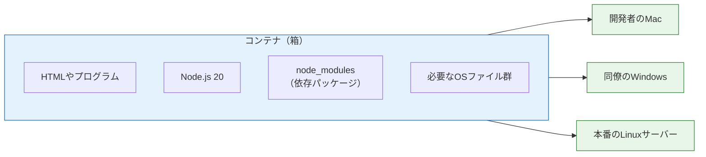
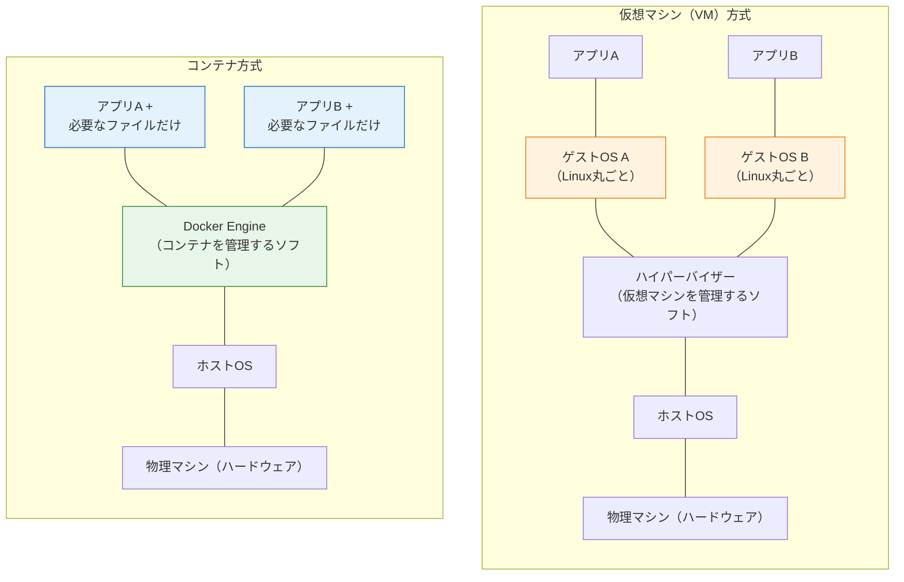
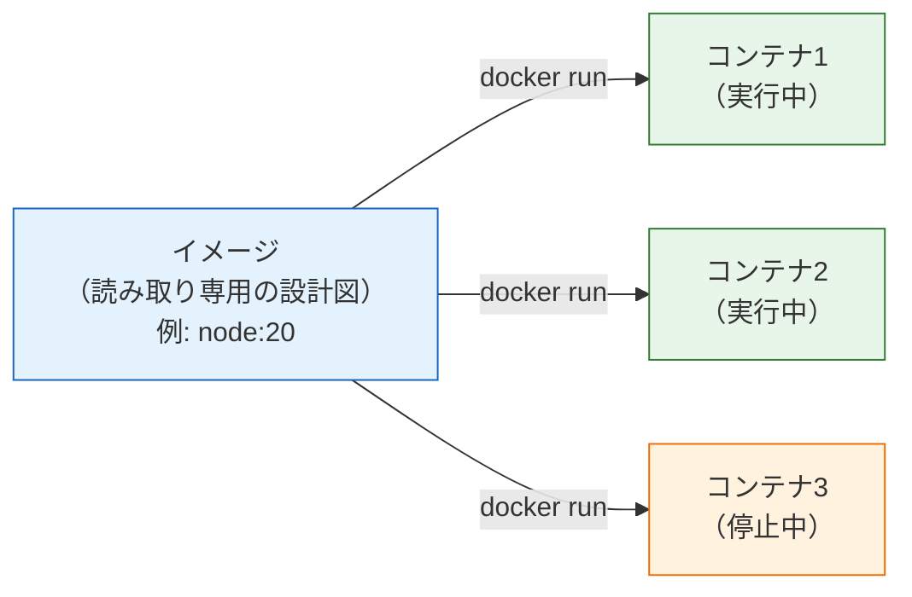
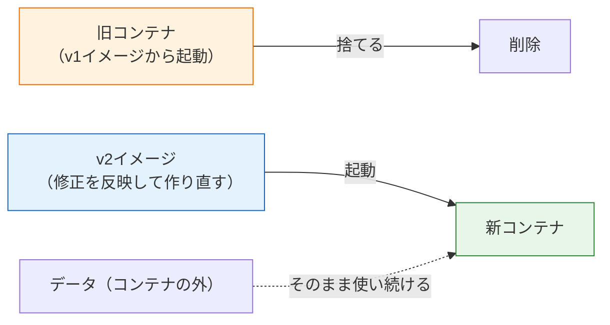

# コンテナとは何か

このページでは、Dockerを触り始める前に「コンテナ（Container）とは何か」という概念を理解します。ソフトウェアを動かすときに何が環境差分になるのか、コンテナがそれをどう解決するのかを、仮想マシン（VM）との比較を交えて見ていきます。

コマンドはまだ登場しません。ここで概念をしっかり押さえておくと、次のページ以降でコマンドの意味がすっと頭に入るようになります。

## 学習目標

- 「自分のPCでは動くのに他では動かない」問題がなぜ起こるのかを説明できる
- コンテナとは何か、何を解決する技術なのかを自分の言葉で説明できる
- コンテナと仮想マシン（VM）の違いを図で説明できる
- 「イメージ」と「コンテナ」という2つの用語の関係を説明できる

## 「自分のPCでは動くのに」問題

まず、コンテナが解決しようとしている問題から見ていきましょう。

たとえば、同じWebページや小さなプログラムを友人のPCやサーバーで動かすことを考えてみます。ソフトウェアが動くためには、コード以外にもたくさんの「前提条件」が必要です。

- Node.js がインストールされていること（しかもバージョン20であること）
- pnpm で依存パッケージがインストールされていること
- 環境変数が正しく設定されていること
- OSが想定どおりであること（macOS / Windows / Linux で挙動が微妙に違うことがあります）

このうち1つでも食い違うと、「自分のPCでは動くのに、他の環境では動かない」という事態になります。これは冗談ではなく、ソフトウェア開発の歴史で最も繰り返されてきたトラブルの1つです。

- 開発者AはNode.js 20、開発者BはNode.js 16を使っていて、Bの環境だけエラーが出る
- 開発PCはmacOS、本番サーバーはLinuxで、ファイルパスの扱いが違って動かない
- 半年後に新メンバーが入ったが、開発環境の構築手順書が古くて1日かかっても環境ができない

根本原因は、**アプリケーションが「コード」だけでは完結せず、「実行環境」に依存している**ことです。

## コンテナ＝アプリと実行環境をまるごと詰めた箱

コンテナは、この問題を「アプリケーションと、その実行に必要な環境一式を、1つの箱に詰めて持ち運べるようにする」というアプローチで解決します。

コンテナという名前は、海運の輸送コンテナに由来します。輸送コンテナが発明される前、船への荷物の積み下ろしは、荷物の形や性質ごとに個別の扱いが必要で大変な作業でした。コンテナという「規格化された箱」が生まれたことで、中身が何であれ同じクレーン・同じ船・同じトラックで運べるようになりました。

ソフトウェアのコンテナも同じ発想です。

- 箱の中身: アプリのコード + Node.js + 依存パッケージ + 必要なOSのファイル群
- 箱の外側: 規格化されているので、Dockerが動く環境ならどこでも同じように動く

つまり、**「コードを渡して、相手の環境でセットアップしてもらう」のではなく、「動く環境ごと渡す」**のがコンテナです。これにより、開発者のmacでも、同僚のWindowsでも、本番のLinuxサーバーでも、まったく同じ環境でアプリが動きます。

この図のとおり、1つのコンテナ（箱）を作れば、それをどの環境に持っていっても同じように動きます。「環境構築手順書」の代わりに「動く環境そのもの」を共有するイメージです。

## 仮想マシン（VM）との違い

「環境ごと持ち運ぶ」というアイデア自体は、コンテナが最初ではありません。**仮想マシン（Virtual Machine、バーチャルマシン。略してVM）**という技術が以前からあります。

VMは、1台の物理的なコンピュータの上に、ソフトウェアで「もう1台の仮想的なコンピュータ」をまるごと作る技術です。仮想的なコンピュータには、OS（ゲストOSと呼びます）から何からすべてが入ります。

コンテナとVMの構造を並べて比べてみましょう。

図の左（VM方式）では、アプリ1つごとに**ゲストOSがまるごと**含まれています（橙色の部分）。OSは数GBのサイズがあり、起動にも数十秒〜数分かかります。

図の右（コンテナ方式）では、各コンテナは**ホストOSのカーネル（OSの中核部分）を共有**し、アプリと必要なファイルだけを持ちます（青色の部分）。OSをまるごと複製しないため、軽くて速いのです。

カーネル（Kernel、カーネル）とは、OSの中核としてハードウェアの管理やプログラムの実行を司る部分のことです。コンテナは「OSのカーネルは共有しつつ、ファイルシステムやプロセスは互いに隔離する」というLinuxの仕組みを利用しています。

違いを表にまとめます。

| 観点 | 仮想マシン（VM） | コンテナ |
|---|---|---|
| OSの扱い | ゲストOSをまるごと含む | ホストOSのカーネルを共有 |
| サイズ | 数GB〜数十GB | 数十MB〜数百MB |
| 起動時間 | 数十秒〜数分 | 数秒以下 |
| 隔離の強さ | 強い（完全に別のマシン） | VMよりは弱い（同じカーネルを共有） |
| 1台で動かせる数 | 数個程度 | 数十〜数百個 |

どちらが優れているという話ではなく、用途が違います。VMは「完全に独立したマシンが必要なとき」、コンテナは「アプリを軽量に隔離して、たくさん・速く動かしたいとき」に向いています。現代のWebアプリケーション開発・運用では、軽さと速さが活きるコンテナが主流になっています。

なお、Docker DesktopをMacやWindowsで使う場合、内部的には軽量なLinux VMが1つ動いていて、その中でコンテナが動きます（コンテナはLinuxカーネルの機能を使うため）。ただしこれはDocker Desktopが自動で管理してくれるので、利用者が意識する必要はほとんどありません。

## イメージとコンテナ

Dockerを学ぶうえで最初につまずきやすいのが、**イメージ（Image）**と**コンテナ（Container）**という2つの用語の関係です。

- **イメージ**: コンテナの「設計図」あるいは「型」。アプリと実行環境一式を固めた、読み取り専用のパッケージです。
- **コンテナ**: イメージから作られた「実行中の実体」。1つのイメージから何個でもコンテナを作れます。

プログラミングの言葉で例えるなら、イメージは「クラス」、コンテナは「インスタンス」に近い関係です。たい焼きで例えるなら、イメージが「金型」、コンテナが「焼き上がったたい焼き」です。

この図のように、1つのイメージ（青）から複数のコンテナ（緑＝実行中、橙＝停止中）を作れます。イメージ自体は変化せず、各コンテナはそれぞれ独立して動きます。コンテナの中でファイルを書き換えても、元のイメージには影響しませんし、他のコンテナにも影響しません。

イメージは**レジストリ（Registry、レジストリ）**と呼ばれる保管場所で共有されます。代表的なレジストリが [Docker Hub](https://hub.docker.com/) で、Node.js、PostgreSQL、nginxなど、主要なソフトウェアの公式イメージが公開されています。「PostgreSQLを使いたければ、公式イメージを取ってきてコンテナとして起動するだけ」という手軽さが、Dockerの大きな魅力です。

この「イメージ → コンテナ」の流れは、次のページで実際にコマンドを打ちながら体験します。

## コンテナを使うと何がうれしいのか

ここまでの内容を、実際の開発でのメリットとして整理します。

### 1. 環境構築が一瞬で終わる

たとえばPostgreSQL（データベース）を使いたいとき、従来はインストーラのダウンロード、インストール、初期設定、起動設定…と手順が多く、OSごとに方法も違いました。Dockerなら、コマンド1つで公式イメージから起動できます。不要になったらコンテナを消すだけで、PCはきれいなままです。

実際に[Docker Compose + DB](/docker/database_compose/)では、この方法でPostgreSQL 16を起動します。

### 2. チーム全員・本番環境まで同じ環境になる

イメージには環境一式が固められているので、誰がどこで動かしても同じです。「新メンバーの環境構築に1日かかる」「本番だけ動かない」という問題が大幅に減ります。

### 3. デプロイの単位として扱える

「アプリ＝イメージ」として扱えるので、デプロイ（サーバーへの配置）は「イメージをサーバーに持っていって起動する」だけになります。AWSをはじめとするクラウドには、コンテナをそのまま動かすサービス（AWSならECS）が用意されており、[AWSデプロイ](/aws/)の章で実際に使います。

### 4. 複数のアプリを安全に同居させられる

コンテナ同士は隔離されているため、「アプリAはNode.js 18、アプリBはNode.js 20」のように、本来衝突しそうな環境を1台のマシンに同居させられます。

### 注意: 万能ではない

公平のために、コンテナにも不得意があることに触れておきます。

- **隔離はVMより弱い** — カーネルを共有するため、完全な分離が必要な場面（他社のコードを預かって実行するサービスなど）ではVMが選ばれます。
- **学習コストがある** — イメージ、レイヤー、ネットワークなど、覚えるべき概念が一定数あります（まさに今学んでいるところです）。
- **GUIアプリには不向き** — コンテナはサーバーやコマンドラインのプログラム向けの技術で、デスクトップアプリの配布には通常使いません。

とはいえ、Webサーバーやデータベースは、コンテナが最も得意とする領域です。まずは小さな題材で、コンテナの考え方を押さえましょう。

## コンテナは「使い捨て」が前提

コンテナを学ぶうえで、もう1つ押さえておきたい考え方があります。それは、**コンテナは使い捨てにするもの**だという文化です。

従来のサーバー運用では、1台のサーバーを長く使い続け、設定変更やアップデートを「そのサーバーに対して」積み重ねていくのが普通でした。この方式には問題があります。何年も手を入れ続けたサーバーは「今どういう状態なのか誰も正確に分からない」存在になりがちで、壊れたときに同じものを作り直せないのです。

コンテナの世界では発想を逆にします。

- コンテナの中の状態は、いつ消えてもよいものとして扱う
- 変更したいときは、コンテナの中をいじるのではなく、**イメージを作り直して、コンテナを丸ごと交換する**
- 消えては困るデータ（データベースの中身など）は、コンテナの外に置く

イメージという「いつでも同じものを作れる設計図」があるからこそ、実体であるコンテナは気軽に捨てて作り直せます。この性質を**イミュータブル（Immutable、不変）**な運用と呼びます。

この図のように、アプリの更新は「旧コンテナを捨てて、新しいイメージから新コンテナを起動する」だけです。データはコンテナの外（図の下）に置いてあるので影響を受けません。「コンテナの外にデータを置く」具体的な方法（ボリューム）は、[Docker Composeのページ](/docker/docker_compose/)で学びます。

この「使い捨て」の考え方は、後の章で活きてきます。[AWSデプロイ](/aws/)の章で使うECSは、まさに「新しいイメージができたら、コンテナを順番に入れ替える」方式でアプリを更新しますし、障害時には壊れたコンテナを自動で捨てて新しいものを起動します。コンテナを大事に修理するのではなく、ポンと交換する——この感覚を覚えておいてください。

## Dockerとは

最後に、ここまで「コンテナ」と呼んできたものと「Docker」の関係を整理します。

**Docker（ドッカー）**は、コンテナを「作る・動かす・共有する」ための一連のツールを提供するプラットフォームです。コンテナ技術そのものはLinuxの機能が基盤ですが、それを誰でも簡単に使えるようにしたのがDockerで、2013年の登場以降、コンテナの事実上の標準ツールになりました。

Dockerは主に次の要素で構成されます。

- **Docker Engine（ドッカーエンジン）**: コンテナを実際に動かす本体（デーモンと呼ばれる常駐プログラム）
- **Docker CLI（コマンドラインツール）**: `docker` コマンド。利用者はこれを通じてEngineに指示を出す
- **Docker Desktop（ドッカーデスクトップ）**: MacやWindowsでEngine・CLI・GUIをまとめて使えるようにしたアプリ
- **Docker Hub**: イメージを共有する公式レジストリ

次のページでは、Docker Desktopをインストールして、実際にコンテナを動かしていきます。

## 理解度チェック

**Q1. 「自分のPCでは動くのに他の環境では動かない」問題は、なぜ起こるのでしょうか。**

解答を見る

アプリケーションはコードだけでは動かず、Node.jsのバージョン、依存パッケージ、環境変数、OSの種類といった「実行環境」に依存しているためです。環境のどれか1つでも食い違うと、同じコードでも動作が変わったり、エラーになったりします。コンテナは、アプリと実行環境を1つの箱に詰めて持ち運ぶことで、この食い違いをなくします。

**Q2. コンテナと仮想マシン（VM）の最も大きな構造上の違いは何ですか。また、その違いがもたらすメリットは何ですか。**

解答を見る

VMはアプリごとにゲストOSをまるごと含むのに対し、コンテナはホストOSのカーネルを共有し、アプリと必要なファイルだけを持ちます。この違いにより、コンテナはサイズが小さく（数十MB〜数百MB）、起動が速く（数秒以下）、1台のマシンでより多くの数を動かせます。一方、隔離の強さではVMに分があります。

**Q3. 「イメージ」と「コンテナ」の関係を、例えを使って説明してください。**

解答を見る

イメージは「設計図（型）」、コンテナは「そこから作られた実行中の実体」です。たい焼きの金型（イメージ）と焼き上がったたい焼き（コンテナ）、あるいはプログラミングのクラス（イメージ）とインスタンス（コンテナ）の関係に例えられます。1つのイメージから複数のコンテナを作ることができ、イメージ自体は読み取り専用で変化しません。

**Q4. Node.js公式の `node:20` イメージのようなイメージは、どこから入手できますか。**

解答を見る

レジストリと呼ばれるイメージの保管・共有場所から入手します。代表的なレジストリはDocker公式のDocker Hubで、Node.js、PostgreSQL、nginxなど主要なソフトウェアの公式イメージが公開されています。後のAWSの章では、自分で作ったイメージをAWSのレジストリ（ECR）に保管します。

**Q5. アプリを修正したいとき、コンテナの世界では「実行中のコンテナの中を直接書き換える」のではなく、どうするのが基本ですか。またそれはなぜですか。**

解答を見る

イメージを作り直し、旧コンテナを捨てて新しいイメージからコンテナを起動し直すのが基本です（イミュータブルな運用）。実行中のコンテナを直接書き換えると、その変更はイメージに残らないため再現できず、「今どういう状態か分からないコンテナ」が生まれてしまいます。設計図であるイメージを正とし、実体のコンテナは使い捨てにすることで、いつでも同じ環境を作り直せる状態を保ちます。

**Q6. MacでDocker Desktopを使うとき、内部では何が起きているでしょうか。**

解答を見る

コンテナはLinuxカーネルの機能を利用する技術なので、macOS上では直接動きません。そのためDocker Desktopは、内部で軽量なLinux VMを1つ起動し、その中でコンテナを動かしています。この仕組みはDocker Desktopが自動で管理するため、利用者が普段意識する必要はありません。

## セルフレビュー

- [ ] 「自分のPCでは動くのに他では動かない」問題の原因を自分の言葉で説明できる
- [ ] コンテナが何を解決する技術なのかを、輸送コンテナの例えを使って説明できる
- [ ] コンテナとVMの構造の違いを、図を描いて説明できる
- [ ] コンテナとVMのそれぞれの長所・短所を1つずつ挙げられる
- [ ] イメージとコンテナの関係を、例えを使って説明できる
- [ ] 「コンテナは使い捨て、変更はイメージの作り直しで行う」という考え方を説明できる
- [ ] Docker Engine / Docker CLI / Docker Desktop / Docker Hub の役割の違いを説明できる

## 次のステップ

コンテナの概念がつかめたら、次は[Dockerのインストールと基本操作](/docker/install_and_basics/)に進み、Docker Desktopを導入して実際にコンテナを動かしてみましょう。「イメージからコンテナを起動する」という今回学んだ流れを、コマンドで体験します。

ここで学んだ「イメージ＝持ち運べる実行環境」という考え方は、[Dockerfileを書く](/docker/dockerfile/)で自分のアプリをイメージ化するとき、そして[AWSデプロイ](/aws/)の章でそのイメージを本番環境にデプロイするときの土台になります。
