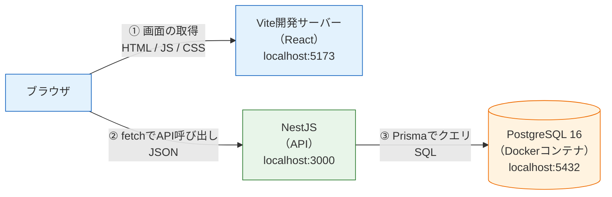
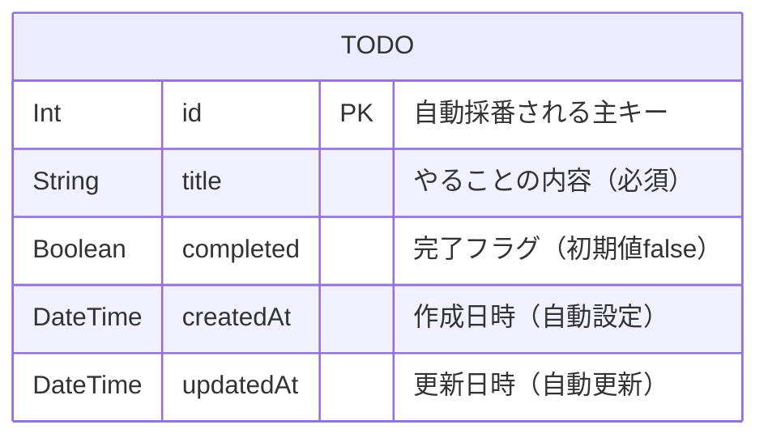

# 実践: フルスタックTodoアプリ

このセクションでは、ここまでに学んだ知識を総動員して、**フロントエンド・API・データベースがすべてつながった「フルスタック」のTodoアプリ**を一から作ります。

これまでの学習を振り返ると、部品はすべて揃っています。

- [React基礎](/react/) — 画面を作り、`fetch` でAPIを呼ぶ方法
- [バックエンド基礎（NestJS）](/backend/) — Controller / Service / DTOでAPIを作る方法
- [Docker基礎](/docker/) — Docker Composeでコンテナを動かす方法
- [データベースとPrisma](/database/) — PostgreSQLにデータを永続化する方法

しかし、部品を個別に動かせることと、**部品を自分の手で組み合わせて1つのアプリケーションとして動かせること**の間には、大きな隔たりがあります。実際に組み合わせてみると、「フロントからAPIが呼べない（CORS）」「DBにつながらない」「どの順番で起動すればいいのか分からない」といった、個別の章では出会わなかった問題に必ずぶつかります。この「つなぎ込み」の経験こそが、このセクションの目的です。

もう1つの大きな目的は、**RESTの感覚を体で掴むこと**です。[HTTPとREST](/backend/http_and_rest/)で学んだ「リソースをURLで表し、操作をHTTPメソッドで表す」という設計を、今回は自分でゼロから設計し、実装し、ブラウザから呼び出すところまで通しで行います。

## 言語別Todo開発の進め方

Todo開発は、Reactフロントエンドを共通にし、バックエンドだけを言語・フレームワークごとに差し替えられる構成にします。まず [共通要件定義・仕様書](/fullstack-todo/requirements/) で、画面、API、データモデル、エラー形式、完成条件を固定します。その後、作りたいバックエンド版のページを選びます。

<div class="course-grid wide">
  <a class="course-card project" data-accent="green" href="/fullstack-todo/requirements/">
    <span>Common</span>
    <h3>共通要件定義・仕様書</h3>
    <p>全スタックで変えない仕様。画面、API、DB、エラー形式、完成条件を定義します。</p>
  </a>
  <a class="course-card project" data-accent="blue" href="/fullstack-todo/nestjs/">
    <span>TypeScript</span>
    <h3>Todo NestJS + Prisma版</h3>
    <p>既存の詳細チュートリアル。まず動くTodoアプリを作る標準ルートです。</p>
  </a>
  <a class="course-card project" data-accent="amber" href="/fullstack-todo/spring_boot/">
    <span>Java</span>
    <h3>Todo Spring Boot + JPA版</h3>
    <p>同じ共通仕様をJavaで実装します。Controller、Service、Repository、EntityでCRUDを作ります。</p>
  </a>
</div>

各バックエンド版は、上のカードから個別ページとして開きます。共通仕様は [共通要件定義・仕様書](/fullstack-todo/requirements/) に置き、フレームワークごとの実装手順や解答コードは各版のページに分けます。サイドバーも版ごとに分けているため、NestJS版を開いたときにSpring Boot版の手順が混ざることはありません。

## 学習目標

- フロントエンド（React）・API・データベース（PostgreSQL）の3層構成を自分の手で組み上げ、通しで動かせる
- Todoというリソースに対するREST APIを、URL・HTTPメソッド・ステータスコードまで含めて設計できる
- 開発環境の標準形（DBはDocker Compose、APIとフロントは `pnpm run dev`）を構築できる
- フロントとAPIのつなぎ込みで起きる問題（CORSなど）の原因を説明し、対処できる

## 作るもの: 完成イメージ

シンプルなTodo管理アプリです。画面は1つだけで、次の機能を持ちます。

- **一覧表示** — 登録済みのTodoを新しい順に表示する
- **追加** — テキストボックスに入力してTodoを登録する
- **完了の切り替え** — チェックボックスでTodoの完了/未完了を切り替える（完了したものは打ち消し線で表示）
- **削除** — 不要になったTodoを削除する

画面のイメージは次のとおりです。

```
┌──────────────────────────────────┐
│  Todoアプリ                        │
│                                  │
│  [ やることを入力...    ] [追加]   │
│                                  │
│  ☐ レポートを提出する        [削除] │
│  ☐ 牛乳を買う               [削除] │
│  ☑ ̶部̶屋̶を̶掃̶除̶す̶る̶          [削除] │
│                                  │
└──────────────────────────────────┘
```

機能としては最小限ですが、**作成（Create）・読み取り（Read）・更新（Update）・削除（Delete）のCRUDがすべて含まれている**点が重要です。この4つの操作を3層構成で通せれば、後の[SNS開発](/sns/)で作る投稿・いいね・フォローなども、本質的には同じことの繰り返しだと分かるはずです。

## 全体の構成図

このアプリは次の3つの要素で構成されます。



流れを言葉にすると次のようになります。

1. ブラウザはまずVite開発サーバー（`localhost:5173`）からReactアプリの画面（HTML/JavaScript/CSS）を受け取ります
2. 画面上のReactアプリが、`fetch` でNestJSのAPI（`localhost:3000`）を呼び出し、JSON形式でデータをやり取りします（→ [fetchでAPI通信](/react/api_fetch/)）
3. NestJSはPrismaを通じてPostgreSQLにSQLを発行し、データを読み書きします（→ [Prisma ClientでCRUD](/database/crud_with_prisma/)）

「ブラウザ→Vite」と「ブラウザ→NestJS」の2本の矢印が**別のサーバーに向かっている**ことに注目してください。ポート番号が違う（5173と3000）ため、ブラウザから見るとこの2つは「別のサイト」です。これが後で[CORSという問題](/fullstack-todo/nestjs/integration/)を引き起こします。詳しくはつなぎ込みのページで扱います。

## 開発環境の標準形

このセクションで組む開発環境は、次の形に統一します。

| 要素 | 起動方法 | 理由 |
|---|---|---|
| PostgreSQL | Docker Compose（`docker compose up -d`） | DBはバージョン・初期設定を固定して再現可能にしたい。コンテナが最適（→ [Docker Compose](/docker/docker_compose/)） |
| API（選択したバックエンド） | ローカルで開発サーバーを起動 | コードを書き換えるたびに即座に再起動・反映してほしい。ローカル実行が最速 |
| フロント（React） | ローカルで `pnpm run dev` | 同上。ViteのHMR（保存即反映）をフルに活かす |

つまり、**「データベースだけコンテナ、アプリはローカル」**という形です。[Docker Compose](/docker/docker_compose/)ではAPIもコンテナで動かしましたが、[開発環境をcomposeで組む](/docker/dev_environment/)で確立した標準形のとおり、開発中はコードの変更を高速に反映したいため、APIとReactはローカルで動かすほうが快適です。アプリのコンテナ化は、本番環境へのデプロイ（[AWSデプロイ](/aws/)）のための技術として位置づけます。

この「DBはcompose、アプリは `pnpm run dev`」という形は、本カリキュラムの**開発環境の標準形**です。最終プロジェクトの[SNS開発](/sns/)でも、まったく同じ形をそのまま使います。ここで手順を体に染み込ませておきましょう。

## API設計

実装に入る前に、APIを設計します。[HTTPとREST](/backend/http_and_rest/)で学んだRESTの考え方に従い、「Todo」というリソースをURL `/todos` で表し、操作をHTTPメソッドで表現します。

| 操作 | メソッド | URL | リクエストボディ | 成功時のステータス | レスポンスボディ |
|---|---|---|---|---|---|
| Todo一覧の取得 | GET | `/todos` | なし | 200 OK | Todoの配列 |
| Todo1件の取得 | GET | `/todos/:id` | なし | 200 OK | Todo1件 |
| Todoの作成 | POST | `/todos` | `{ "title": "..." }` | 201 Created | 作成されたTodo |
| Todoの更新 | PATCH | `/todos/:id` | `{ "title"?: "...", "completed"?: true }` | 200 OK | 更新後のTodo |
| Todoの削除 | DELETE | `/todos/:id` | なし | 204 No Content | なし |

設計のポイントを確認しておきます。すべて[HTTPとREST](/backend/http_and_rest/)で学んだ原則の応用です。

- **URLは名詞（リソース名の複数形）にする** — `/getTodos` や `/createTodo` のように動詞を入れません。「何をするか」はHTTPメソッドが表すからです
- **`:id` で個別のリソースを指す** — `/todos/3` は「IDが3のTodo」という1つのリソースを表します
- **更新はPATCH** — PUTが「リソース全体の置き換え」を意味するのに対し、PATCHは「一部だけの変更」を意味します。今回は「タイトルだけ変える」「完了フラグだけ変える」という部分更新なのでPATCHを選びます
- **作成の成功は201 Created** — 同じ「成功」でも、何かが新しく作られたときは200ではなく201を返すのがRESTの慣習です
- **削除の成功は204 No Content** — 削除後に返す内容は何もないため、「成功したがボディは空」を意味する204を使います

エラー時のステータスコードも決めておきます。

| 状況 | ステータス | 例 |
|---|---|---|
| リクエストボディが不正（バリデーションエラー） | 400 Bad Request | `title` が空文字でPOSTされた |
| 指定されたIDのTodoが存在しない | 404 Not Found | `/todos/999` にPATCHしたが999番は存在しない |

このように**実装の前にAPIを表で設計する**習慣は、チーム開発で特に重要です。フロント担当とバックエンド担当が同じ表を見て並行に作業できるようになります。

## データベース設計（ER図）

次にデータベースを設計します。今回のアプリに必要なテーブルは1つだけです。



[RDBとは](/database/what_is_database/)で学んだとおり、`id` は各行を一意に識別する**主キー（PK: Primary Key）**です。自動採番にして、アプリ側でIDを管理しなくて済むようにします。

「ユーザーごとにTodoを分けなくていいの？」と思った人は良い着眼です。実際のアプリならUserテーブルとの**1対多のリレーション**（→ [リレーション](/database/relations/)）が必要ですが、今回はあえてユーザーの概念を省きます。理由は、**このセクションの主題は3層の「つなぎ込み」であって、認証ではない**からです。ログインやユーザー管理は[SNS開発の認証](/sns/nestjs/auth/)でじっくり扱います。一度に学ぶことを絞るのは、挫折しないための重要な戦略です。

## このセクションの進め方

次の順番で進めます。各ページは前のページの成果物の上に積み上げていくので、順番どおりに進めてください。

| ページ | 内容 |
|---|---|
| [共通要件定義・仕様書](/fullstack-todo/requirements/) | 全スタックで変えない画面、API、DB、エラー形式、完成条件 |
| [Todo NestJS + Prisma版](/fullstack-todo/nestjs/) | NestJS + PrismaでTodo CRUDを作る詳細チュートリアル |
| [Todo Spring Boot + JPA版](/fullstack-todo/spring_boot/) | Spring Boot + JPAで同じTodo仕様を作るルート |
| [プロジェクトのセットアップ](/fullstack-todo/nestjs/setup/) | pnpmの導入、リポジトリ構成、DBの起動、Prismaの初期化 |
| [バックエンド: Todo APIの実装](/fullstack-todo/nestjs/backend/) | NestJS + PrismaでCRUD APIを実装し、curlで動作確認 |
| [フロントエンド: 画面の実装](/fullstack-todo/nestjs/frontend/) | Reactで一覧・追加・完了切替・削除の画面を実装 |
| [つなぎ込み: CORSとエラーハンドリング](/fullstack-todo/nestjs/integration/) | フロントとAPIを接続し、CORSを理解して解決する |
| [練習問題](/fullstack-todo/nestjs/practice/) | 期限・絞り込み・編集などの拡張課題 |

作業時間の目安は、セットアップから一通り動くまでで半日〜1日です。エラーが出ても焦らず、**エラーメッセージを読む → どの層（フロント/API/DB）の問題かを切り分ける**、という手順を意識してください。この切り分け能力こそ、フルスタック開発で最も価値のあるスキルです。

## 理解度チェック

**Q1. 「Todoを1件削除する」操作に対応するHTTPメソッドとURL、成功時のステータスコードを答えてください。**

<details markdown="1">
<summary>解答を見る</summary>

`DELETE /todos/:id`（例: `DELETE /todos/3`）で、成功時は **204 No Content** を返します。

削除に成功した後、クライアントに返すべきデータは特にないため、「成功したがレスポンスボディは空である」ことを意味する204を使うのがRESTの慣習です。

</details>

**Q2. Todoの完了フラグだけを変更する操作に、PUTではなくPATCHを使うのはなぜですか。**

<details markdown="1">
<summary>解答を見る</summary>

PUTは「リソース全体を送られた内容で置き換える」、PATCHは「リソースの一部だけを変更する」という意味を持つためです。

完了フラグの切り替えでは `completed` だけを変更し、`title` などの他の項目はそのまま残したいので、部分更新を意味するPATCHが適切です。意味論（セマンティクス）に合ったメソッドを選ぶことで、APIを見た人が動作を正しく予想できるようになります。

</details>

**Q3. このセクションの開発環境では、PostgreSQLだけをDockerコンテナで動かし、APIとReactはローカルの開発サーバーで動かします。アプリをコンテナに入れない理由を説明してください。**

<details markdown="1">
<summary>解答を見る</summary>

開発中はコードを頻繁に書き換えるため、保存したら即座に反映される（APIのwatchモードやViteのHMR）ローカル実行のほうが開発効率が高いからです。

一方、PostgreSQLは開発中に中身を書き換えるものではなく、「バージョンと初期設定を固定して誰の環境でも同じように動かしたい」ものなので、コンテナが適しています。アプリのコンテナ化は、本番デプロイのための技術として[AWSデプロイ](/aws/)で学びます。

</details>

**Q4. ブラウザはVite開発サーバー（localhost:5173）とNestJS（localhost:3000）の両方と通信します。ブラウザから見てこの2つが「別のサイト」と見なされるのはなぜですか。**

<details markdown="1">
<summary>解答を見る</summary>

ブラウザはオリジン（スキーム + ホスト + ポート番号の組）でサイトを区別するためです。`http://localhost:5173` と `http://localhost:3000` は、スキーム（http）とホスト（localhost）は同じでも**ポート番号が異なる**ため、別のオリジン＝別のサイトとして扱われます。

このため、フロントからAPIへの `fetch` は「別のサイトへのリクエスト」となり、CORSという仕組みの制約を受けます。詳細は[つなぎ込みのページ](/fullstack-todo/nestjs/integration/)で学びます。

</details>

**Q5. 今回のER図にUserテーブルがないのはなぜですか。**

<details markdown="1">
<summary>解答を見る</summary>

このセクションの主題が「フロント・API・DBの3層を通しでつなぐ経験」と「RESTの感覚を掴むこと」であり、認証・ユーザー管理まで同時に扱うと学ぶことが多くなりすぎるためです。

ユーザー管理と認証（ログイン）は[SNS開発](/sns/)で本格的に扱います。学習範囲を意図的に絞ることで、1つ1つを確実に身につけます。

</details>

## セルフレビュー

- [ ] フロントエンド・API・DBの3層構成を、図を見ずに自分で描ける
- [ ] 5つのエンドポイント（一覧・1件取得・作成・更新・削除）のメソッドとURLを言える
- [ ] 201 Createdと204 No Contentをいつ使うか説明できる
- [ ] PATCHとPUTの違いを自分の言葉で説明できる
- [ ] 「DBはcompose、アプリは `pnpm run dev`」という開発環境の標準形の理由を説明できる
- [ ] このアプリにUserテーブルを入れない理由を説明できる

## 次のステップ

それでは実装を始めましょう。まずは[プロジェクトのセットアップ](/fullstack-todo/nestjs/setup/)で、pnpmの導入とリポジトリ構成の作成、データベースの起動を行います。

このセクションで確立する開発スタイルとAPI設計の感覚は、[コード品質と開発ツール](/tooling/)（このTodoアプリにPrettier/ESLintを導入します）と、最終プロジェクトの[SNS開発](/sns/)でそのまま土台になります。

> **完成形のコード**: [practice/fullstack-todo](https://github.com/dik-ab/curriculum/tree/main/practice/fullstack-todo)（動作検証済み）。手詰まりになったら参照してください。
