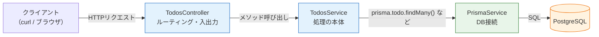

# バックエンド: Todo APIの実装

このページでは、[セットアップ](/fullstack-todo/nestjs/setup/)で作成した `backend/` プロジェクトに、[セクションの概要](/fullstack-todo/)で設計した5つのエンドポイントを実装します。NestJSのModule / Controller / Serviceの構成、DTOによるバリデーション、PrismaによるDBアクセスと、[バックエンド基礎](/backend/)・[データベースとPrisma](/database/)で学んだことをすべて組み合わせます。

実装の流れは、[メモAPIを作る](/backend/crud_practice/)で経験したCRUD実装とほぼ同じです。違いは、データの保存先がメモリ上の配列ではなく**PostgreSQL**になることと、最初に設計したステータスコード（201 / 204 / 400 / 404）を意識して作り込むことです。

## 学習目標

- PrismaServiceを作り、NestJSのDI（依存性注入）でServiceから利用できる
- DTOとclass-validatorで、POST / PATCHのリクエストボディを検証できる
- 設計どおりのステータスコード（200 / 201 / 204 / 400 / 404）を返すAPIを実装できる
- curlで5つのエンドポイントすべての動作を確認できる

## 実装の全体像

これから作るファイルと、リクエストが処理される流れを確認します。構造は[NestJSのアーキテクチャ](/backend/what_is_nestjs/)で学んだModule / Controller / Serviceの3点セットに、Prisma用のModule / Serviceが加わった形です。



- **TodosController** — URLとHTTPメソッドを受け取り、適切なServiceのメソッドを呼びます。HTTPの世界とTypeScriptの世界の境界です（→ [Controller](/backend/controller/)）
- **TodosService** — 「Todoをどう扱うか」というロジックの本体です（→ [ServiceとDI](/backend/service_and_di/)）
- **PrismaService** — Prisma Clientをラップし、DIで配れるようにしたものです（→ [NestJSへの組み込み](/database/crud_with_prisma/)）

作成するファイルは次のとおりです。

```
backend/src/
├── main.ts                     # （修正）ValidationPipeを有効化
├── app.module.ts               # （修正）TodosModuleを取り込み
├── prisma/
│   ├── prisma.module.ts        # PrismaServiceを提供するModule
│   └── prisma.service.ts       # Prisma Clientのラッパー
└── todos/
    ├── todos.module.ts         # Todo機能のModule
    ├── todos.controller.ts     # ルーティング
    ├── todos.service.ts        # ロジック本体
    └── dto/
        ├── create-todo.dto.ts  # POST用のDTO
        └── update-todo.dto.ts  # PATCH用のDTO
```

## PrismaServiceを作る

まず、NestJSの中でPrisma Clientを使えるようにします。[Prisma ClientでCRUD](/database/crud_with_prisma/)で学んだとおり、Prisma Clientを継承した**PrismaService**を作り、Module経由で配るのが定石です。

`backend/` ディレクトリで、[Nest CLI](/backend/setup/)を使ってファイルを生成します。CLIはプロジェクトの開発依存に含まれているので、`pnpm exec`（プロジェクト内のコマンドを実行する）で呼び出せます。

```bash
pnpm exec nest generate module prisma
pnpm exec nest generate service prisma --no-spec
```

実行結果の例:

```
CREATE src/prisma/prisma.module.ts (84 bytes)
CREATE src/prisma/prisma.service.ts (90 bytes)
UPDATE src/app.module.ts (...)
```

`--no-spec` はテストファイル（`.spec.ts`）を生成しないオプションです。テストは[バックエンドテスト](/testing/)の章で本格的に扱うため、ここでは省略します。

生成されたファイルを次のように実装します。

**`backend/src/prisma/prisma.service.ts`**

```typescript
import { Injectable, OnModuleInit, OnModuleDestroy } from '@nestjs/common';
import { PrismaClient } from '@prisma/client';

@Injectable()
export class PrismaService
  extends PrismaClient
  implements OnModuleInit, OnModuleDestroy
{
  async onModuleInit() {
    await this.$connect();
  }

  async onModuleDestroy() {
    await this.$disconnect();
  }
}
```

**コード解説**

- `extends PrismaClient` — PrismaServiceはPrisma Clientそのものを継承します。これにより `this.todo.findMany()` のようにPrismaの全機能が使えます
- `@Injectable()` — このクラスをDI（依存性注入）の対象にします（→ [ServiceとDI](/backend/service_and_di/)）
- `onModuleInit` — NestJSの起動時に呼ばれるライフサイクルフックで、ここでDBに接続します。起動時に接続しておくことで、最初のリクエストが遅くなるのを防ぎます
- `onModuleDestroy` — アプリ終了時に接続を閉じ、DB側に接続が残り続けるのを防ぎます

**`backend/src/prisma/prisma.module.ts`**

```typescript
import { Module } from '@nestjs/common';
import { PrismaService } from './prisma.service';

@Module({
  providers: [PrismaService],
  exports: [PrismaService],
})
export class PrismaModule {}
```

**コード解説**

- `providers: [PrismaService]` — このModuleがPrismaServiceを生成・管理することを宣言します
- `exports: [PrismaService]` — **他のModuleからもPrismaServiceを使えるように公開**します。これがないと、後で作るTodosModuleから注入できません（→ [Module](/backend/service_and_di/)）

## Todoリソース一式を生成する

次にTodo機能のModule / Controller / Serviceを生成します。

```bash
pnpm exec nest generate module todos
pnpm exec nest generate controller todos --no-spec
pnpm exec nest generate service todos --no-spec
```

実行結果の例:

```
CREATE src/todos/todos.module.ts (82 bytes)
UPDATE src/app.module.ts (...)
CREATE src/todos/todos.controller.ts (101 bytes)
UPDATE src/todos/todos.module.ts (...)
CREATE src/todos/todos.service.ts (90 bytes)
UPDATE src/todos/todos.module.ts (...)
```

CLIが `app.module.ts` と `todos.module.ts` への登録を自動で行ってくれます。TodosModuleには、PrismaServiceを使うための取り込み( `imports` )を手で追加します。

**`backend/src/todos/todos.module.ts`**

```typescript
import { Module } from '@nestjs/common';
import { PrismaModule } from '../prisma/prisma.module';
import { TodosController } from './todos.controller';
import { TodosService } from './todos.service';

@Module({
  imports: [PrismaModule],
  controllers: [TodosController],
  providers: [TodosService],
})
export class TodosModule {}
```

**コード解説**

- `imports: [PrismaModule]` — PrismaModuleが公開（exports）しているPrismaServiceを、このModule内で注入できるようにします
- `controllers` / `providers` — CLIが自動登録した、このModuleの構成要素です

## DTOとバリデーション

リクエストボディの形を定義し、不正な入力を弾きます。[DTOとバリデーション](/backend/dto_and_validation/)で学んだ、class-validatorとValidationPipeの組み合わせです。

まずライブラリを追加します（`backend/` で実行）。

```bash
pnpm add class-validator class-transformer
```

### 作成用DTO

**`backend/src/todos/dto/create-todo.dto.ts`**

```typescript
import { IsNotEmpty, IsString, MaxLength } from 'class-validator';

export class CreateTodoDto {
  @IsString()
  @IsNotEmpty()
  @MaxLength(100)
  title: string;
}
```

**コード解説**

- `@IsString()` — `title` が文字列であることを検証します。数値や配列が送られたら400エラーになります
- `@IsNotEmpty()` — 空文字（`""`）を拒否します。「内容のないTodo」を作らせないためです
- `@MaxLength(100)` — 100文字以内に制限します。[スキーマ定義](/fullstack-todo/nestjs/setup/)で `@db.VarChar(100)` とした、**DB側の制約と揃えている**点が重要です。DTOで弾かなければ、DBに入らない長さの文字列がエラーを引き起こします

`completed` がDTOにないことに注目してください。作成時は常に「未完了」から始まる仕様なので、クライアントに指定させる必要がありません。**DTOには「クライアントが指定してよい項目」だけを書く**のが原則です。

### 更新用DTO

**`backend/src/todos/dto/update-todo.dto.ts`**

```typescript
import {
  IsBoolean,
  IsNotEmpty,
  IsOptional,
  IsString,
  MaxLength,
} from 'class-validator';

export class UpdateTodoDto {
  @IsOptional()
  @IsString()
  @IsNotEmpty()
  @MaxLength(100)
  title?: string;

  @IsOptional()
  @IsBoolean()
  completed?: boolean;
}
```

**コード解説**

- `@IsOptional()` — その項目が**省略可能**であることを示します。省略された場合は他のバリデーションもスキップされます
- `title?` / `completed?` — PATCHは部分更新なので、どちらか一方だけ送ることも、両方送ることもできます。TypeScriptの `?`（オプショナル）と `@IsOptional()` をセットで付けます
- `@IsBoolean()` — `completed` は `true` / `false` のみ受け付けます。文字列の `"true"` は拒否されます

### ValidationPipeを有効化する

DTOにデコレータを書いただけでは検証は動きません。[ValidationPipe](/backend/dto_and_validation/)をアプリ全体に適用します。

**`backend/src/main.ts`**

```typescript
import { ValidationPipe } from '@nestjs/common';
import { NestFactory } from '@nestjs/core';
import { AppModule } from './app.module';

async function bootstrap() {
  const app = await NestFactory.create(AppModule);
  app.useGlobalPipes(
    new ValidationPipe({
      whitelist: true,
      forbidNonWhitelisted: true,
    }),
  );
  await app.listen(3000);
}
bootstrap();
```

**コード解説**

- `useGlobalPipes` — すべてのエンドポイントのリクエストに対してValidationPipeを適用します
- `whitelist: true` — DTOに定義されていないプロパティを自動で取り除きます
- `forbidNonWhitelisted: true` — 取り除くだけでなく、DTOにないプロパティが含まれていたら400エラーにします。クライアント側のスペルミス（`titel` など）に早く気づけます

## TodosServiceの実装

ロジックの本体です。[Prisma ClientでCRUD](/database/crud_with_prisma/)で学んだメソッド（`findMany` / `findUnique` / `create` / `update` / `delete`）を使います。

**`backend/src/todos/todos.service.ts`**

```typescript
import { Injectable, NotFoundException } from '@nestjs/common';
import { PrismaService } from '../prisma/prisma.service';
import { CreateTodoDto } from './dto/create-todo.dto';
import { UpdateTodoDto } from './dto/update-todo.dto';

@Injectable()
export class TodosService {
  constructor(private readonly prisma: PrismaService) {}

  findAll() {
    return this.prisma.todo.findMany({
      orderBy: { createdAt: 'desc' },
    });
  }

  async findOne(id: number) {
    const todo = await this.prisma.todo.findUnique({ where: { id } });
    if (todo === null) {
      throw new NotFoundException(`Todo (id: ${id}) は存在しません`);
    }
    return todo;
  }

  create(dto: CreateTodoDto) {
    return this.prisma.todo.create({
      data: { title: dto.title },
    });
  }

  async update(id: number, dto: UpdateTodoDto) {
    await this.findOne(id); // 存在しなければここで404
    return this.prisma.todo.update({
      where: { id },
      data: dto,
    });
  }

  async remove(id: number) {
    await this.findOne(id); // 存在しなければここで404
    await this.prisma.todo.delete({ where: { id } });
  }
}
```

**コード解説**

- `constructor(private readonly prisma: PrismaService)` — コンストラクタの引数に型を書くだけで、NestJSがPrismaServiceのインスタンスを**注入**してくれます（→ [DIの仕組み](/backend/service_and_di/)）
- `findAll` — `orderBy: { createdAt: 'desc' }` で新しい順に並べます。画面で「追加したものが一番上に来る」ようにするためです
- `findOne` — `findUnique` は見つからないとき `null` を返します。その場合は `NotFoundException` を投げると、NestJSが自動で**404 Not Found**のレスポンスに変換してくれます
- `update` / `remove` — 先に `findOne` を呼んで存在確認しています。存在しないIDをPrismaの `update` / `delete` に渡すとPrisma独自の例外が発生し、そのままでは500エラーになってしまうため、**先に確認して404を返す**ようにしています
- `remove` — 何も `return` していません。削除のレスポンスは204（ボディなし）にするためです

## TodosControllerの実装

HTTPの入口です。[セクションの概要](/fullstack-todo/)のAPI設計表と1行ずつ対応させながら書きます。

**`backend/src/todos/todos.controller.ts`**

```typescript
import {
  Body,
  Controller,
  Delete,
  Get,
  HttpCode,
  Param,
  ParseIntPipe,
  Patch,
  Post,
} from '@nestjs/common';
import { TodosService } from './todos.service';
import { CreateTodoDto } from './dto/create-todo.dto';
import { UpdateTodoDto } from './dto/update-todo.dto';

@Controller('todos')
export class TodosController {
  constructor(private readonly todosService: TodosService) {}

  @Get()
  findAll() {
    return this.todosService.findAll();
  }

  @Get(':id')
  findOne(@Param('id', ParseIntPipe) id: number) {
    return this.todosService.findOne(id);
  }

  @Post()
  create(@Body() dto: CreateTodoDto) {
    return this.todosService.create(dto);
  }

  @Patch(':id')
  update(
    @Param('id', ParseIntPipe) id: number,
    @Body() dto: UpdateTodoDto,
  ) {
    return this.todosService.update(id, dto);
  }

  @Delete(':id')
  @HttpCode(204)
  remove(@Param('id', ParseIntPipe) id: number) {
    return this.todosService.remove(id);
  }
}
```

**コード解説**

- `@Controller('todos')` — このControllerのURLの共通部分（プレフィックス）です。`@Get()` は `GET /todos`、`@Get(':id')` は `GET /todos/:id` に対応します（→ [ルーティング](/backend/controller/)）
- `@Param('id', ParseIntPipe)` — URLのパラメータは文字列で届くため、`ParseIntPipe` で数値に変換します。`/todos/abc` のように数値でない値が来たら、自動で400エラーになります
- `@Body() dto: CreateTodoDto` — リクエストボディをDTOとして受け取ります。ValidationPipeを有効化してあるので、ここで自動的に検証が走ります
- `@Post()` のステータス指定がない — NestJSは `@Post()` に対してデフォルトで**201 Created**を返すため、何も書く必要がありません
- `@HttpCode(204)` — DELETEのデフォルトは200なので、設計どおり**204 No Content**を返すよう明示します

これで実装は完了です。`pnpm run dev` でサーバーを起動してください（DBコンテナの起動を忘れずに）。

```bash
docker compose up -d   # fullstack-todo/ で（起動済みなら不要）
cd backend
pnpm run dev
```

## curlで動作確認する

フロントエンドを作る前に、**APIが設計どおりに動くことをAPI単体で確認**します。問題の切り分けの観点で、この順番が重要です。先にフロントを繋いでしまうと、エラーが起きたときに「フロントが悪いのかAPIが悪いのか」が分からなくなります。

確認には[HTTPとREST](/backend/http_and_rest/)でも使ったcurlを使います。`-i` はレスポンスヘッダー（ステータスコード）も表示するオプションです。

### 作成（POST /todos）

```bash
curl -i -X POST http://localhost:3000/todos \
  -H "Content-Type: application/json" \
  -d '{"title": "牛乳を買う"}'
```

実行結果の例:

```
HTTP/1.1 201 Created
Content-Type: application/json; charset=utf-8

{"id":1,"title":"牛乳を買う","completed":false,"createdAt":"2026-06-12T01:23:45.678Z","updatedAt":"2026-06-12T01:23:45.678Z"}
```

**201 Created**が返り、`completed` が `false`、日時が自動設定されています。設計どおりです。もう1件追加しておきましょう。

```bash
curl -X POST http://localhost:3000/todos \
  -H "Content-Type: application/json" \
  -d '{"title": "レポートを提出する"}'
```

### 一覧取得（GET /todos）

```bash
curl -i http://localhost:3000/todos
```

実行結果の例:

```
HTTP/1.1 200 OK
Content-Type: application/json; charset=utf-8

[{"id":2,"title":"レポートを提出する","completed":false,...},{"id":1,"title":"牛乳を買う","completed":false,...}]
```

後から作った `id: 2` が先頭に来ています。`orderBy: { createdAt: 'desc' }` が効いている証拠です。

### 更新（PATCH /todos/:id）

```bash
curl -i -X PATCH http://localhost:3000/todos/1 \
  -H "Content-Type: application/json" \
  -d '{"completed": true}'
```

実行結果の例:

```
HTTP/1.1 200 OK

{"id":1,"title":"牛乳を買う","completed":true,...}
```

`completed` だけが `true` に変わり、`title` はそのままです。部分更新が機能しています。

### 削除（DELETE /todos/:id）

```bash
curl -i -X DELETE http://localhost:3000/todos/2
```

実行結果の例:

```
HTTP/1.1 204 No Content
```

ボディなしの204が返りました。`curl http://localhost:3000/todos` で一覧を取り直すと、`id: 2` が消えているはずです。

### エラー系の確認

正常系だけでなく、**エラーが設計どおりに返ることも確認**します。まずバリデーションエラーです。

```bash
curl -i -X POST http://localhost:3000/todos \
  -H "Content-Type: application/json" \
  -d '{"title": ""}'
```

実行結果の例:

```
HTTP/1.1 400 Bad Request

{"message":["title should not be empty"],"error":"Bad Request","statusCode":400}
```

空文字のタイトルが**400 Bad Request**で拒否されました。`@IsNotEmpty()` の効果です。次に存在しないIDです。

```bash
curl -i -X PATCH http://localhost:3000/todos/999 \
  -H "Content-Type: application/json" \
  -d '{"completed": true}'
```

実行結果の例:

```
HTTP/1.1 404 Not Found

{"message":"Todo (id: 999) は存在しません","error":"Not Found","statusCode":404}
```

`NotFoundException` が**404 Not Found**として返っています。これで5つのエンドポイントとエラー処理がすべて設計どおりに動くことを確認できました。コミットしておきましょう。

```bash
git add .
git commit -m "Todo APIを実装"
```

## 理解度チェック

**Q1. PrismaModuleの `exports: [PrismaService]` を消すと、アプリ起動時にエラーになります。なぜですか。**

<details markdown="1">
<summary>解答を見る</summary>

`exports` は「このModuleの提供物のうち、外部のModuleにも公開するもの」の宣言です。TodosModuleは `imports: [PrismaModule]` を通じてPrismaServiceを注入していますが、PrismaModuleがexportsしていなければ、PrismaServiceはPrismaModuleの内部専用となり、TodosServiceのコンストラクタへの注入を解決できずにエラーになります。

ModuleとDIの仕組みは[ServiceとDI](/backend/service_and_di/)を参照してください。

</details>

**Q2. CreateTodoDtoに `completed` を含めなかったのはなぜですか。**

<details markdown="1">
<summary>解答を見る</summary>

「Todoは未完了状態で作成される」という仕様のため、作成時にクライアントが完了状態を指定する必要がないからです。DTOには「クライアントが指定してよい項目」だけを定義します。

もしDTOに含めると、`{"title": "x", "completed": true}` のような「最初から完了済みのTodo」を作れてしまいます。さらに今回は `forbidNonWhitelisted: true` を設定しているので、`completed` を送ること自体が400エラーになります。

</details>

**Q3. Serviceの `update` で、`prisma.todo.update` を呼ぶ前に `findOne` で存在確認をしているのはなぜですか。**

<details markdown="1">
<summary>解答を見る</summary>

存在しないIDをPrismaの `update` に渡すと、Prisma独自の例外（レコードが見つからないというエラー）が発生し、NestJSはそれを処理できず**500 Internal Server Error**を返してしまうためです。

先に `findOne` で確認して `NotFoundException` を投げれば、設計どおりの**404 Not Found**を返せます。「クライアントの指定ミス（404）」と「サーバー内部の異常（500）」を正しく区別することは、APIの使いやすさに直結します。

</details>

**Q4. `@Param('id', ParseIntPipe)` の `ParseIntPipe` を外すと、どんな問題が起きますか。**

<details markdown="1">
<summary>解答を見る</summary>

URLパラメータはHTTP上では常に文字列なので、`id` に `"1"` という文字列が入ったままServiceに渡ります。すると `prisma.todo.findUnique({ where: { id: "1" } })` のように、Int型のカラムに文字列を渡すことになり、Prismaが型エラーを起こします。

`ParseIntPipe` は文字列を数値に変換し、変換できない値（`/todos/abc` など）には自動で400 Bad Requestを返してくれます。

</details>

**Q5. フロントエンドを作る前にcurlでAPI単体の動作確認をするのはなぜですか。**

<details markdown="1">
<summary>解答を見る</summary>

問題の切り分けのためです。API単体で正しく動くことを先に確認しておけば、フロントを繋いだ後に何か問題が起きたとき、「原因はフロント側（またはフロントとAPIの間）にある」と絞り込めます。

逆に確認せずに繋ぐと、エラーの原因がフロントのコードなのか、APIのロジックなのか、DBなのかを同時に疑うことになり、デバッグの難易度が大きく上がります。層を1つずつ確認して積み上げるのがフルスタック開発の基本です。

</details>

## セルフレビュー

- [ ] PrismaServiceがなぜ必要か（Prisma ClientをDIに乗せる）を説明できる
- [ ] Module / Controller / Service / DTOのそれぞれの役割を自分の言葉で説明できる
- [ ] `whitelist` / `forbidNonWhitelisted` の効果を説明できる
- [ ] 201と204を返すための書き方（デフォルト挙動と `@HttpCode`）を写経せずに書ける
- [ ] 404を返すべき場面で `NotFoundException` を使える
- [ ] curlでGET / POST / PATCH / DELETEのリクエストを送れる
- [ ] 400と404と500の違いを、今回のAPIの具体例で説明できる

## 次のステップ

APIが完成しました。次の[フロントエンド: 画面の実装](/fullstack-todo/nestjs/frontend/)では、Reactでこの APIを呼び出す画面を作ります。`fetch` によるAPI通信は[fetchでAPI通信](/react/api_fetch/)の復習です。

なお、このページで書いたService（存在確認 + 404、DTOによる検証）のパターンは、[SNS開発の投稿機能](/sns/nestjs/posts/)でもそのまま登場します。
