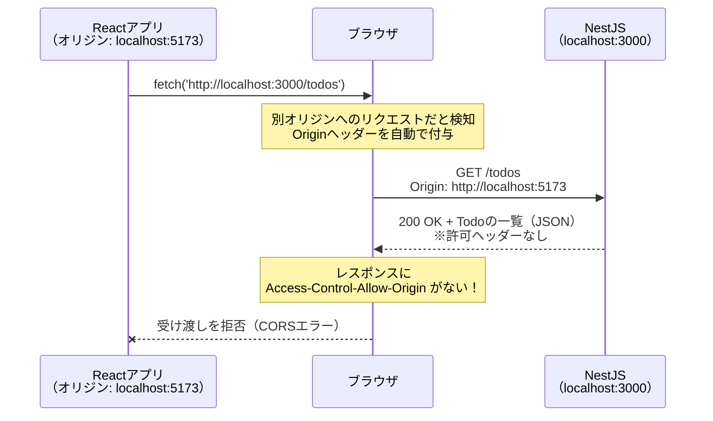
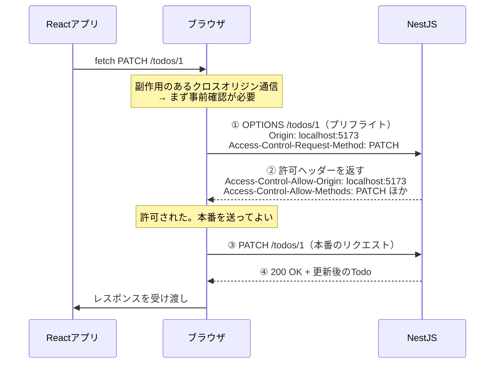
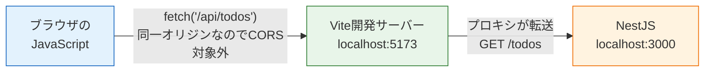
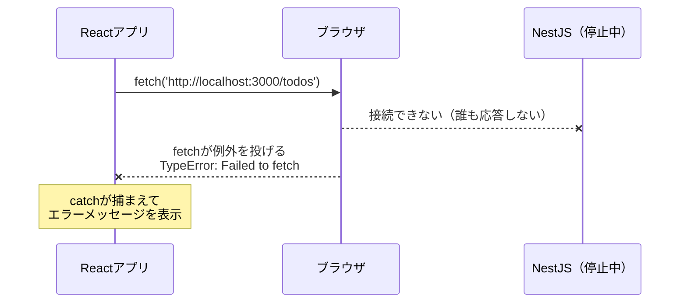

# つなぎ込み: CORSとエラーハンドリング

[前のページ](/fullstack-todo/nestjs/frontend/)の最後で、ブラウザのコンソールに次のエラーが出ました。

```
Access to fetch at 'http://localhost:3000/todos' from origin 'http://localhost:5173'
has been blocked by CORS policy: No 'Access-Control-Allow-Origin' header is
present on the requested resource.
```

curlでは動くのにブラウザでは動かない——この現象は、フロントとAPIを分けて開発するすべてのWebアプリで必ず遭遇します。このページでは、原因である**同一オリジンポリシー**を仕組みから理解し、**CORS（コルス）**という解決の仕組みを学びます。解決方法は「NestJS側で許可する（enableCors）」と「Viteのプロキシを使う」の2通りを比較し、最後にアプリ全体を通しで動作確認します。

## 学習目標

- オリジンとは何か、同一オリジンポリシーがなぜ存在するかを説明できる
- CORSエラーが「ブラウザによるブロック」であることを、通信の流れで説明できる
- NestJSの `enableCors` でCORSを許可できる
- Viteのプロキシ設定という別解を理解し、2つの方法を比較できる
- 3層を通したエラー（API停止・バリデーションエラー）の流れを確認できる

## オリジンとは何か

**オリジン（origin）**とは、URLのうち**スキーム（プロトコル）・ホスト・ポート番号**の3つの組のことです。

```
http://localhost:5173/todos
└─┬─┘   └───┬───┘└─┬─┘
スキーム    ホスト   ポート     ← この3つの組がオリジン
```

3つが**すべて一致**して初めて「同一オリジン」です。1つでも違えば「別オリジン（クロスオリジン）」になります。

| URLの組み合わせ | 同一オリジン？ | 理由 |
|---|---|---|
| `http://localhost:5173` と `http://localhost:5173/todos` | 同一 | パスはオリジンに含まれない |
| `http://localhost:5173` と `http://localhost:3000` | **別** | ポートが違う |
| `http://example.com` と `https://example.com` | **別** | スキームが違う |
| `https://example.com` と `https://api.example.com` | **別** | ホストが違う |

今回のアプリでは、画面は `http://localhost:5173`（Vite）から配信され、APIは `http://localhost:3000`（NestJS）にあります。ポートが違うので、フロントからAPIへの `fetch` は**クロスオリジンのリクエスト**です。

## 同一オリジンポリシー — なぜブラウザはブロックするのか

ブラウザには**同一オリジンポリシー（Same-Origin Policy）**という大原則があります。「あるオリジンから読み込まれたJavaScriptは、別オリジンのリソースを自由に読み取ってはならない」というルールです。

なぜこんな不便なルールがあるのでしょうか。**悪意のあるサイトからユーザーを守るため**です。もしこのルールがなかったら、次のような攻撃が可能になります。

1. あなたが銀行のサイト `https://bank.example` にログインしている（ブラウザにログイン情報のCookieが保存されている）
2. 別タブで悪意のあるサイト `https://evil.example` を開いてしまう
3. 悪意のサイトのJavaScriptが `fetch('https://bank.example/api/balance')` を実行する
4. ブラウザはCookieを自動で付けてリクエストを送るため、**あなたの残高情報が悪意のサイトのJavaScriptに読まれてしまう**

同一オリジンポリシーがあれば、手順4で「`evil.example` のスクリプトが `bank.example` のレスポンスを読むこと」をブラウザが拒否します。つまりこの仕組みは邪魔をしているのではなく、**あなたを守っている**のです。

ここで重要なのは、**ブロックしているのはブラウザである**という点です。curlで動いたのはこのためです。curlはブラウザではないので同一オリジンポリシーを持たず、「悪意のサイトに読まれる」という構図自体が存在しません。

## CORSエラーの正体を通信の流れで見る

では、前のページのエラーが起きたとき、実際には何が起きていたのでしょうか。シーケンス図で見てみましょう。



意外に思えるポイントが2つあります。

1. **リクエストはAPIに届いている** — ブラウザはリクエスト自体は送ります（その際、リクエスト元のオリジンを示す `Origin` ヘッダーを自動で付けます）。NestJSも正常に200を返しています
2. **ブロックされるのは「JavaScriptへの受け渡し」** — ブラウザはレスポンスを受け取った後、「このレスポンスを `localhost:5173` のJavaScriptに読ませてよいか」を確認します。その判断材料が、レスポンスの **`Access-Control-Allow-Origin`** ヘッダーです。今のNestJSはこのヘッダーを返していないため、ブラウザは「許可されていない」と判断し、JavaScriptへの受け渡しを拒否します

これがエラーメッセージの「No 'Access-Control-Allow-Origin' header is present」の意味です。

### CORS — 例外的に許可するための仕組み

**CORS（Cross-Origin Resource Sharing、オリジン間リソース共有）**は、同一オリジンポリシーの**例外を、サーバー側が宣言するための仕組み**です。サーバーがレスポンスに次のようなヘッダーを付けると、ブラウザは受け渡しを許可します。

```
Access-Control-Allow-Origin: http://localhost:5173
```

これは「`http://localhost:5173` のJavaScriptになら、このレスポンスを読ませてよい」というサーバーからの宣言です。許可するかどうかを決める権利は、データを持っている**サーバー側**にあるという設計です。

### プリフライトリクエスト

もう1つ知っておくべき仕組みがあります。GETのような単純なリクエストと違い、**PATCHやDELETE、`Content-Type: application/json` を持つPOST**のようなリクエストは、サーバーに副作用（データの変更）を与える可能性が高いため、ブラウザはより慎重に動きます。本番のリクエストを送る前に、**プリフライトリクエスト（preflight request、事前確認）**という確認の通信を自動で行うのです。



プリフライトは**OPTIONSメソッド**で送られ、「これからPATCHを送りたいが、許可されているか？」を確認します。サーバーが許可を返して初めて、本番のリクエストが送られます。この一連の流れはブラウザがすべて自動で行うため、私たちのコードで意識する必要はありませんが、開発者ツールのNetworkタブに見慣れないOPTIONSリクエストが並ぶ理由として知っておくと混乱しません。

## 解決方法1: NestJSのenableCors

仕組みが分かれば解決は簡単です。NestJSには、CORSの許可ヘッダー（プリフライトへの応答を含む）を自動で返す機能が組み込まれています。

**`backend/src/main.ts`**（`app.useGlobalPipes(...)` の後に追加）

```typescript
  app.enableCors({
    origin: 'http://localhost:5173',
  });
```

main.ts全体は次のようになります。

```typescript
import { ValidationPipe } from '@nestjs/common';
import { NestFactory } from '@nestjs/core';
import { AppModule } from './app.module';

async function bootstrap() {
  const app = await NestFactory.create(AppModule);
  app.useGlobalPipes(
    new ValidationPipe({
      whitelist: true,
      forbidNonWhitelisted: true,
    }),
  );
  app.enableCors({
    origin: 'http://localhost:5173',
  });
  await app.listen(3000);
}
bootstrap();
```

**コード解説**

- `app.enableCors(...)` — CORS関連のヘッダーの付与と、プリフライト（OPTIONS）への応答を有効化します
- `origin: 'http://localhost:5173'` — 許可するオリジンを**Viteの開発サーバーだけに限定**します。`enableCors()` と引数なしで呼ぶとすべてのオリジン（`*`）を許可できますが、「誰にレスポンスを読ませてよいか」は明示的に絞るのが安全側の習慣です

APIが再起動（watchモードなら自動）されたら、ブラウザで `http://localhost:5173/` を再読み込みしてください。今度はTodoの一覧（最初は[バックエンドの動作確認](/fullstack-todo/nestjs/backend/)で作ったデータ）が表示されるはずです。

## 解決方法2: Viteのプロキシ

もう1つの解決方法も知っておきましょう。発想を変えて、**そもそもクロスオリジンの通信をなくす**方法です。

Viteの開発サーバーには**プロキシ（proxy、代理転送）**機能があります。フロントは同一オリジンの `/api/...` にリクエストを送り、Vite開発サーバーがそれを裏でNestJSに転送する、という構成にできます。



ブラウザから見ると、通信相手は常に `localhost:5173`（同一オリジン）だけです。サーバー同士（ViteとNestJS）の通信はブラウザの外で行われるため、同一オリジンポリシーの対象になりません。設定は次のとおりです（**今回はこの方法を採用しないので、書き換えは不要です。読んで理解だけしてください**）。

**`frontend/vite.config.ts`**（プロキシを使う場合の例）

```typescript
import { defineConfig } from 'vite';
import react from '@vitejs/plugin-react';

export default defineConfig({
  plugins: [react()],
  server: {
    proxy: {
      '/api': {
        target: 'http://localhost:3000',
        changeOrigin: true,
        rewrite: (path) => path.replace(/^\/api/, ''),
      },
    },
  },
});
```

**コード解説**

- `proxy: { '/api': ... }` — `/api` で始まるリクエストをプロキシの対象にします
- `target: 'http://localhost:3000'` — 転送先（NestJS）です
- `rewrite: ...` — 転送時にパスの先頭の `/api` を取り除きます。`/api/todos` へのリクエストが `http://localhost:3000/todos` に届きます
- この場合、フロント側の `API_BASE_URL` は `'/api'` に変更することになります

### 2つの方法の比較

| 観点 | enableCors（サーバーで許可） | Viteプロキシ（クロスオリジンを回避） |
|---|---|---|
| 仕組み | APIが許可ヘッダーを返し、ブラウザが受け渡しを許可する | ブラウザは同一オリジンとしか通信せず、Viteが裏で転送する |
| 設定する場所 | バックエンド（main.ts） | フロントエンド（vite.config.ts） |
| CORSの学習 | CORSと正面から向き合う | CORSを回避する（仕組みの理解は別途必要） |
| 本番環境との関係 | フロントとAPIを別ドメインに置く構成なら、本番でもそのまま同じ考え方を使う | Viteの開発サーバーは本番には存在しないため、本番では別の仕組み（リバースプロキシ等）が必要 |

どちらも実務で広く使われている正当な方法です。本カリキュラムでは**enableCorsを採用**します。理由は2つあります。

1. 後の[SNS開発](/sns/)ではフロント（S3 + CloudFront）とAPI（ECS）を別ドメインに配置するため（→ [AWSデプロイ](/aws/)）、本番でもCORSの設定が必要になります。開発のうちから同じ仕組みで動かしておくほうが一貫しています
2. CORSはWeb開発者なら避けて通れない知識であり、プロキシで回避するより一度正面から設定して理解するほうが、後で必ず役に立ちます

## 通しの動作確認

それでは、アプリ全体を通しで確認します。3つすべてが起動していることを確認してください（→ [起動手順](/fullstack-todo/nestjs/setup/)）。

ブラウザで `http://localhost:5173/` を開き、次を順に試します。

1. **一覧** — [バックエンドの確認](/fullstack-todo/nestjs/backend/)で作ったTodoが表示される
2. **追加** — 入力欄に「CORSを理解する」と入れて追加ボタンを押すと、一覧の先頭に現れる
3. **完了切替** — チェックボックスを押すと打ち消し線が付く。**ページを再読み込みしても状態が保たれている**（DBに永続化されている証拠です）
4. **削除** — 削除ボタンで一覧から消え、再読み込みしても復活しない

さらに、本当にDBまで届いているかpsqlでも確認してみましょう（→ [psqlでの確認](/database/postgresql_setup/)）。

```bash
docker compose exec db psql -U postgres -d todoapp -c 'SELECT id, title, completed FROM "Todo";'
```

実行結果の例:

```
 id |      title       | completed
----+------------------+-----------
  1 | 牛乳を買う        | t
  3 | CORSを理解する    | f
(2 rows)
```

ブラウザの操作がSQLの世界まで届いています。**ブラウザ → React → fetch → NestJS → Prisma → PostgreSQL** という全行程が、初めて自分の手で1本につながりました。

## エラーの流れを確認する

最後に、異常系の動きも体験しておきます。フルスタック開発では「どの層で何が起きたか」を見極める力が重要です。

### APIが落ちているとき

`backend/` のターミナルで `Ctrl + C` を押してAPIを停止し、ブラウザを再読み込みしてください。



このとき `fetch` は**例外を投げます**。404のような「サーバーからのエラー応答」とは違い、そもそも通信が成立していないからです。画面には[前のページ](/fullstack-todo/nestjs/frontend/)で実装した `catch` → `setErrorMessage` の流れで、エラーメッセージが表示されるはずです。確認したらAPIを `pnpm run dev` で再起動してください。

このように同じ「画面にエラーが出る」でも、原因は3種類に分けられます。

| 症状 | 原因の層 | 代表例 |
|---|---|---|
| `Failed to fetch`（例外） | APIに到達できない | APIの起動忘れ、URLの間違い |
| CORSエラー（コンソール） | ブラウザがブロック | enableCorsの設定漏れ、オリジンの指定ミス |
| 400 / 404 / 500（`res.ok` がfalse） | APIが処理を拒否・失敗 | バリデーションエラー、存在しないID、API内のバグ（500ならAPIのログを見る） |

エラーが出たら、まず**コンソールとNetworkタブでこの3つのどれかを見極める**。これがフルスタック開発のデバッグの第一歩です。

## 理解度チェック

**Q1. `http://localhost:5173` と `http://localhost:3000` が「別オリジン」になる理由を、オリジンの定義から説明してください。**

<details markdown="1">
<summary>解答を見る</summary>

オリジンは「スキーム・ホスト・ポート番号」の3つの組で定義され、3つすべてが一致して初めて同一オリジンです。この2つはスキーム（http）とホスト（localhost）は同じですが、ポート番号（5173と3000）が異なるため、別オリジンになります。

</details>

**Q2. CORSエラーが起きたとき、リクエストはNestJSに届いています。では、ブラウザは何をブロックしているのですか。**

<details markdown="1">
<summary>解答を見る</summary>

**レスポンスをJavaScriptへ受け渡すこと**をブロックしています。

ブラウザはリクエストを送り、サーバーは正常にレスポンスを返しています。しかしレスポンスに `Access-Control-Allow-Origin` ヘッダーがないため、ブラウザは「このオリジンのJavaScriptに読ませる許可がない」と判断し、受け渡しを拒否します。エラーになるのは通信ではなく、最後の受け渡しの段階です（プリフライトが拒否された場合は本番のリクエスト自体が送られません）。

</details>

**Q3. curlで `http://localhost:3000/todos` を叩くとCORSエラーは起きません。なぜですか。**

<details markdown="1">
<summary>解答を見る</summary>

同一オリジンポリシーは**ブラウザが**実装している保護機構だからです。curlはブラウザではないため、このルールを持ちません。

同一オリジンポリシーは「悪意のあるサイトのJavaScriptが、ユーザーがログイン中の別サイトのデータを盗み読む」ことを防ぐ仕組みです。curlにはそもそも「別のサイトのスクリプトが実行されている」という構図がないため、保護の必要がありません。

</details>

**Q4. プリフライトリクエストとは何ですか。どんなときに送られますか。**

<details markdown="1">
<summary>解答を見る</summary>

副作用を持ちうるクロスオリジンのリクエスト（PATCH / DELETE、`Content-Type: application/json` のPOSTなど）の前に、ブラウザが自動で送る**事前確認のリクエスト**です。OPTIONSメソッドで「これからこのメソッドのリクエストを送りたいが許可されているか」を確認し、サーバーが許可ヘッダーを返した場合のみ本番のリクエストが送られます。

開発者ツールのNetworkタブでOPTIONSリクエストを見かけたら、これがプリフライトです。

</details>

**Q5. 本カリキュラムがViteのプロキシではなくenableCorsを採用した理由を説明してください。**

<details markdown="1">
<summary>解答を見る</summary>

主な理由は、後の[SNS開発](/sns/)でフロントエンドとAPIを別ドメイン（S3 + CloudFrontとECS）にデプロイする構成を取るため、**本番環境でもCORSの設定が必要になる**からです。開発時から同じ仕組みを使うほうが一貫性があります。

また、Viteの開発サーバー（とそのプロキシ）は本番には存在しないため、プロキシ方式は開発専用の解決策であり、CORS自体の理解は結局必要になります。

</details>

**Q6. 画面に「APIエラー: 500」と表示されました。次に確認すべき場所はどこですか。**

<details markdown="1">
<summary>解答を見る</summary>

**APIサーバー（NestJS）のターミナルに出ているログ（エラーメッセージとスタックトレース）**です。

500 Internal Server Errorは「サーバー内部で処理が失敗した」ことを意味するので、原因はAPI側のコードかその先（DB接続など）にあります。フロントのコードをいくら眺めても原因は分かりません。エラーの種類から「どの層を調べるべきか」を判断するのがデバッグの近道です。

</details>

## セルフレビュー

- [ ] オリジンの定義（スキーム・ホスト・ポート）を言える
- [ ] 同一オリジンポリシーが何を防いでいるのか、攻撃の例を挙げて説明できる
- [ ] CORSエラーの正体（ブラウザがレスポンスの受け渡しを拒否する）をシーケンスで説明できる
- [ ] `Access-Control-Allow-Origin` ヘッダーの役割を説明できる
- [ ] プリフライトリクエストがいつ・何のために送られるかを説明できる
- [ ] enableCorsとViteプロキシの違いと使い分けを説明できる
- [ ] エラーの症状から「フロント・ブラウザ・API・DBのどの層か」を切り分ける手順を説明できる

## 次のステップ

おめでとうございます。フロントエンド・API・データベースがすべてつながった、初めてのフルスタックアプリが完成しました。仕上げの前にコミットしておきましょう。

```bash
git add .
git commit -m "CORSを設定してフロントとAPIを接続"
```

次の[練習問題](/fullstack-todo/nestjs/practice/)では、このアプリに期限・絞り込み・編集などの機能を自力で追加して、3層を貫く変更の感覚を定着させます。

ここで学んだCORSの知識は、[SNS開発](/sns/)で本番ドメインを許可するときに再登場します。また「エラーの層を切り分ける」習慣は、この先のすべての開発で使い続けることになります。
