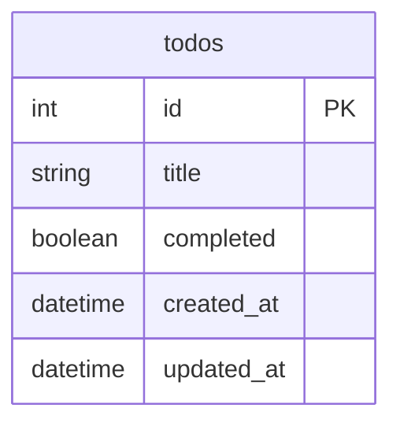

# 共通要件定義・仕様書

このページは、Todoアプリをどのバックエンドフレームワークで実装しても変えない**共通仕様**です。Reactフロントエンド、画面、API、データモデル、エラー形式、完成条件をここで固定し、各スタックのページでは「この仕様をそのフレームワークでどう作るか」だけに集中します。

解答コードは、[Todo開発ロードマップ（言語別）](/fullstack-todo/framework_roadmap/) から確認できます。Reactフロントエンドは共通リポジトリ、バックエンドはNestJS版とSpring Boot版を先に公開しています。

対象スタックは次の6つです。

- TypeScript / NestJS + Prisma
- Java / Spring Boot + JPA
- Python / FastAPI + SQLAlchemy
- PHP / Laravel + Eloquent
- Go / Gin + GORM
- Ruby / Rails + Active Record

> 実務では、小さいCRUDアプリでも先に仕様を固定します。フロント担当とバックエンド担当が同じ表を見れば、別々に作業しても最後につなぎやすくなります。

## 完成形

作るのは、1画面で操作できるTodo管理アプリです。

| 機能 | 画面でできること | API |
|---|---|---|
| 一覧表示 | 登録済みTodoを新しい順に表示する | `GET /todos` |
| 追加 | テキストを入力してTodoを作る | `POST /todos` |
| 完了切り替え | チェックボックスで完了/未完了を切り替える | `PATCH /todos/:id` |
| 削除 | 不要なTodoを削除する | `DELETE /todos/:id` |

このプロジェクトでは、認証とユーザー管理は入れません。主題は、フロントエンド、API、データベースの3層を自分でつなぐことです。ログインやユーザーごとのデータ分離は、次の[SNS開発](/sns/)で扱います。

## 画面仕様

フロントエンドは React + Vite + TypeScript で作ります。画面は1つです。

| 要素 | 役割 |
|---|---|
| タイトル | アプリ名を表示する |
| 入力欄 | 新しいTodoのタイトルを入力する |
| 追加ボタン | 入力値をAPIへ送ってTodoを作る |
| Todo一覧 | Todoのタイトル、完了状態、削除ボタンを表示する |
| エラー表示 | 入力エラーや通信エラーを表示する |

入力欄が空、または空白だけの場合は、フロント側で送信を止めます。API側でも同じバリデーションを行い、フロントのチェック漏れがあっても不正なTodoを保存しないようにします。

## API仕様

APIのレスポンスはJSONに統一します。URLは名詞の複数形 `/todos` を使い、操作はHTTPメソッドで表します。

| 操作 | メソッド | URL | リクエストボディ | 成功時 |
|---|---|---|---|---|
| 一覧取得 | `GET` | `/todos` | なし | `200 OK` |
| 1件取得 | `GET` | `/todos/:id` | なし | `200 OK` |
| 作成 | `POST` | `/todos` | `{ "title": "..." }` | `201 Created` |
| 更新 | `PATCH` | `/todos/:id` | `{ "title"?: "...", "completed"?: true }` | `200 OK` |
| 削除 | `DELETE` | `/todos/:id` | なし | `204 No Content` |

TodoのJSON形式は次にそろえます。

```json
{
  "id": 1,
  "title": "レポートを提出する",
  "completed": false,
  "createdAt": "2026-06-27T10:00:00.000Z",
  "updatedAt": "2026-06-27T10:00:00.000Z"
}
```

- `id` はDBで自動採番される主キーです。
- `title` はTodoの本文です。1文字以上、100文字以内にします。
- `completed` は完了状態です。作成時は `false` です。
- `createdAt` は作成日時、`updatedAt` は更新日時です。

React側では、APIレスポンスに合わせて型を定義します。

```typescript
type Todo = {
  id: number;
  title: string;
  completed: boolean;
  createdAt: string;
  updatedAt: string;
};
```

この型を書くと、画面側で `todo.name` のような存在しないプロパティを使ったときにTypeScriptが警告してくれます。

## エラー形式

エラー時もJSONで返します。

```json
{
  "message": "titleは1文字以上100文字以内で入力してください",
  "code": "VALIDATION_ERROR"
}
```

| 状況 | HTTPステータス | code |
|---|---:|---|
| 入力値が不正 | `400` | `VALIDATION_ERROR` |
| 指定IDのTodoがない | `404` | `NOT_FOUND` |
| 想定外のサーバーエラー | `500` | `INTERNAL_ERROR` |

フレームワークによって標準のエラー形式は違いますが、Reactから見る形式はこの表に寄せます。

## データモデル

必要なテーブルは1つだけです。



| カラム | 型の目安 | 制約 |
|---|---|---|
| `id` | integer | 主キー、自動採番 |
| `title` | string/varchar | 必須、1〜100文字 |
| `completed` | boolean | 必須、初期値 `false` |
| `created_at` | datetime/timestamp | 必須、作成時に設定 |
| `updated_at` | datetime/timestamp | 必須、更新時に更新 |

ORMの命名規則に合わせて、コード上では `createdAt` / `updatedAt` のようなcamelCaseにしても構いません。ただし、APIレスポンスは上のJSON形式にそろえます。

## 完成条件

- `docker compose up -d` でローカルDBを起動できる
- APIを起動し、`GET /todos` が空配列または保存済みTodoを返す
- React画面からTodoを追加できる
- 追加したTodoがDBに保存され、画面を再読み込みしても残る
- チェックボックスで完了状態を切り替えられる
- 削除後、画面とDBの両方からTodoが消える
- 入力エラーと存在しないIDへの更新/削除で、仕様どおりのエラーを返す

## よくあるミス

| ミス | 症状 | 確認する場所 |
|---|---|---|
| APIのポート番号を間違える | `fetch` が失敗する | Reactの `API_URL` |
| CORS設定がない | ブラウザのConsoleにCORSエラーが出る | APIのCORS設定 |
| DBコンテナが起動していない | API起動時にDB接続エラーが出る | `docker compose ps` |
| `completed` の初期値がない | 作成直後の表示が崩れる | MigrationまたはEntity |
| 204でJSONを返そうとする | 削除APIのレスポンス処理が不自然になる | Controller/Handler |

## ミニ演習

次の仕様を満たす `POST /todos` のリクエストとレスポンスを考えてください。

- 入力: `買い物に行く`
- 作成時の `completed` は `false`
- 成功時のステータスは `201 Created`

<details markdown="1">
<summary>解答例</summary>

リクエスト:

```http
POST /todos
Content-Type: application/json

{
  "title": "買い物に行く"
}
```

レスポンス:

```http
HTTP/1.1 201 Created
Content-Type: application/json

{
  "id": 1,
  "title": "買い物に行く",
  "completed": false,
  "createdAt": "2026-06-27T10:00:00.000Z",
  "updatedAt": "2026-06-27T10:00:00.000Z"
}
```

作成操作なので `201 Created` を返します。`completed` はクライアントから送らなくても、APIまたはDBの初期値で `false` にします。

</details>

## 次のステップ

どのバックエンドで実装するかを選ぶ場合は、[Todo開発ロードマップ（言語別）](/fullstack-todo/framework_roadmap/)へ進みます。TypeScriptでまず動くものを作る場合は、既存の[NestJS + Prisma版セットアップ](/fullstack-todo/setup/)から始めてください。
