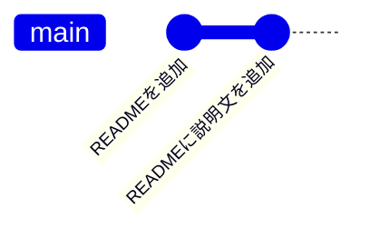

# 基本コマンド

前のページ「[Gitとは何か](/git/what_is_git/)」で、変更が「作業ツリー → ステージングエリア → リポジトリ」と流れて履歴になることを学びました。このページでは、その流れを実際にコマンドで操作します。リポジトリの作成から、変更の記録、履歴の確認、そして「記録しないファイル」の指定まで、Gitの日常操作を一通り身につけます。

すべてターミナルで手を動かしながら進めてください。ターミナル操作に不安があれば[ターミナル基本操作](/environment/terminal/)を復習してからどうぞ。

VS CodeにもGit操作用の画面がありますが、最初はコマンドでも操作できるようにしておくことが大切です。理由は、`git status` や `git diff` の出力を読めると、今どの状態にいるのかを正確に説明できるからです。また、CI/CDやサーバー上の作業では画面操作ではなくコマンドが前提になります。画面で確認できることを、コマンドでも説明できる状態を目指しましょう。

## 学習目標

- `git init` でリポジトリを作成できる
- `git status` で3つの場所の状態を確認しながら、`git add` と `git commit` で変更を記録できる
- `git log` と `git diff` で履歴と差分を確認できる
- `.gitignore` で管理対象外のファイルを指定でき、その必要性を説明できる

## このページで使うコマンドの全体像

最初に、このページで学ぶコマンドと3つの場所の関係を図で示します。一つひとつはこの後で説明するので、今は「どのコマンドがどこに作用するのか」の地図として眺めてください。


これに加えて、場所を問わず現在の状態を表示する `git status` と、リポジトリの履歴を表示する `git log` を使います。

## git init：リポジトリを作る

練習用のプロジェクトを作りましょう。ホームディレクトリの下に `git-practice` というフォルダを作り、移動します。

```bash
mkdir git-practice
cd git-practice
```

このフォルダをGitの管理下に置くには、`git init` を実行します。

```bash
git init
```

実行結果の例:

```
Initialized empty Git repository in /Users/taro/git-practice/.git/
```

**コード解説**

- `git init` … 現在のフォルダにリポジトリを新規作成（initialize、イニシャライズ＝初期化）します。
- 実行結果が示すとおり、フォルダ直下に `.git` という隠しフォルダが作られました。前のページで学んだとおり、ここにすべての履歴が保存されていきます。

`ls -a` で隠しファイルを含めて一覧表示すると、`.git` が確認できます。

```bash
ls -a
```

```
.    ..    .git
```

`git init` はプロジェクトの最初に一度だけ実行します。すでにリポジトリがあるフォルダで再度実行する必要はありません。

## git status：現在の状態を確認する

`git status` は、作業ツリーとステージングエリアの現在の状態を表示するコマンドです。**Gitの操作で迷ったら、まず `git status`** と覚えてください。今後の操作では、一手ごとにこのコマンドで状態を確認しながら進めます。

```bash
git status
```

実行結果の例:

```
On branch main

No commits yet

nothing to commit (create/copy files and use "git add" to track)
```

「ブランチ main にいる」「まだコミットがない」「記録するものは何もない」と表示されました。ブランチについては[次のページ](/git/branch_and_merge/)で学ぶので、今は気にしなくて構いません。

## git add と git commit：最初のコミットを作る

ファイルを作って、最初のコミットを記録してみましょう。VS Codeでもターミナルでも構いませんが、ここではターミナルで作成します。

```bash
echo "# Git練習プロジェクト" > README.md
```

`README.md`（リードミー）は、プロジェクトの説明を書く慣習的なファイルです。状態を確認します。

```bash
git status
```

実行結果の例:

```
On branch main

No commits yet

Untracked files:
  (use "git add <file>..." to include in what will be committed)
	README.md

nothing added to commit but untracked files present (use "git add" to track)
```

`README.md` が **Untracked files（未追跡ファイル）** として表示されました。「Gitがまだ一度も記録したことのないファイル」という意味です。これをステージングエリアに載せます。

```bash
git add README.md
```

`git add` は何も表示しませんが、`git status` で変化が確認できます。

```bash
git status
```

```
On branch main

No commits yet

Changes to be committed:
  (use "git rm --cached <file>..." to unstage)
	new file:   README.md
```

**Changes to be committed（コミットされる予定の変更）** に移りました。ステージングエリアに載った状態です。それでは、コミットして履歴に記録します。

```bash
git commit -m "READMEを追加"
```

実行結果の例:

```
[main (root-commit) a1b2c3d] READMEを追加
 1 file changed, 1 insertion(+)
 create mode 100644 README.md
```

**コード解説**

- `git commit` … ステージングエリアの内容をリポジトリに記録します。
- `-m "メッセージ"` … コミットメッセージを指定するオプションです。`-m` を付けずに実行するとメッセージ入力用のエディタが開きますが、最初のうちは `-m` で書く方法に慣れるのがおすすめです。
- 実行結果の `a1b2c3d` はコミットIDの先頭7桁です（実際の値は人によって異なります）。
- `root-commit` は「このリポジトリの最初のコミット」という意味です。

おめでとうございます。これが記念すべき最初のコミットです。

### 2つ目のコミット：変更を記録する

今度は既存ファイルの変更を記録してみます。`README.md` に1行追記してください。

**`README.md`**

```markdown
# Git練習プロジェクト

Gitの基本コマンドを練習するためのリポジトリです。
```

`git status` を見ると、今度は `modified:`（変更された）と表示されます。

```
On branch main
Changes not staged for commit:
  (use "git add <file>..." to update what will be committed)
  (use "git restore <file>..." to discard changes in working directory)
	modified:   README.md
```

「変更はあるが、まだステージングされていない」状態です。add → commit の流れは新規ファイルのときと同じです。

```bash
git add README.md
git commit -m "READMEに説明文を追加"
```

このように、Gitでの開発は **「編集 → add → commit」のサイクルの繰り返し**です。サイクルを2周した今、履歴は次のようになっています。



### 補足：まとめてaddする

ファイルが複数あるとき、1つずつ `git add` するのは大変です。次の書き方で、現在のフォルダ以下のすべての変更を一度にステージングできます。

```bash
git add .
```

`.` は「現在のフォルダ」を意味します（[ターミナル基本操作](/environment/terminal/)で学んだとおりです）。便利な反面、**意図しないファイルまで巻き込みやすい**ので、実行前後に `git status` で内容を確認する習慣をつけてください。

## git log：履歴を確認する

ここまでのコミットの履歴を見てみましょう。

```bash
git log
```

実行結果の例:

```
commit f4e5d6c7b8a9... (HEAD -> main)
Author: Taro Yamada <taro@example.com>
Date:   Fri Jun 12 10:30:00 2026 +0900

    READMEに説明文を追加

commit a1b2c3d4e5f6...
Author: Taro Yamada <taro@example.com>
Date:   Fri Jun 12 10:15:00 2026 +0900

    READMEを追加
```

新しいコミットが上に表示されます。前のページで学んだとおり、各コミットにはID・作者・日時・メッセージが記録されていることが確認できます。`HEAD -> main` は「今ここにいる」という印だと思ってください。

表示が長いときは、キーボードの `q` を押すと一覧表示を終了できます。また、1コミット1行で簡潔に見たいときは次のオプションが便利です。

```bash
git log --oneline
```

```
f4e5d6c (HEAD -> main) READMEに説明文を追加
a1b2c3d READMEを追加
```

## git diff：差分を確認する

**diff（ディフ）** は difference（差分）の略で、「何がどう変わったのか」を行単位で表示するコマンドです。コミットする前に「自分は何を変更したんだっけ」と確認するのに使います。

`README.md` の2行目を書き換えてみてください。

**`README.md`**

```markdown
# Git練習プロジェクト

Gitの基本コマンドを练习するためのリポジトリです。練習あるのみ。
```

```bash
git diff
```

実行結果の例:

```diff
diff --git a/README.md b/README.md
index 1234567..89abcde 100644
--- a/README.md
+++ b/README.md
@@ -1,3 +1,3 @@
 # Git練習プロジェクト

-Gitの基本コマンドを練習するためのリポジトリです。
+Gitの基本コマンドを练习するためのリポジトリです。練習あるのみ。
```

**コード解説**

- `-` で始まる行 … 削除された（変更前の）行です。
- `+` で始まる行 … 追加された（変更後の）行です。
- 行の書き換えは「古い行の削除 ＋ 新しい行の追加」として表示されます。

よく見ると、書き換えた行に「练习」という誤字（中国語の簡体字）が混ざっています。このように、**コミット前に `git diff` を見る習慣**があると、誤字や消し忘れのデバッグ用コードに気づけます。修正してからコミットしましょう。

**`README.md`**

```markdown
# Git練習プロジェクト

Gitの基本コマンドを練習するためのリポジトリです。練習あるのみ。
```

```bash
git add README.md
git commit -m "READMEの説明文を更新"
```

なお、`git add` した後の変更を最新コミットと比べたいときは、`git diff --staged` を使います。冒頭の図で示したとおり、`git diff` は「作業ツリー ↔ ステージングエリア」、`git diff --staged` は「ステージングエリア ↔ 最新コミット」の差分です。

## .gitignore：記録しないファイルを指定する

プロジェクトの中には、**Gitで管理すべきでないファイル**があります。代表例は次のとおりです。

- `node_modules/` … npmがインストールするパッケージの実体。[Node.jsのインストール](/environment/node/)のページで見たとおり巨大で、`package.json` があれば `npm install` でいつでも復元できるため、履歴に含める意味がありません。
- ビルドの成果物（`dist/` など） … 元のソースコードから再生成できるため。
- `.env` などの秘密情報 … APIキーやパスワードを履歴に残すと、リポジトリを共有した相手全員に漏れてしまいます。
- OSが自動生成するファイル（macOSの `.DS_Store` など）。

これらを無視させるのが **`.gitignore`（ギットイグノア）** ファイルです。リポジトリの直下に作ります。

**`.gitignore`**

```
node_modules/
dist/
.env
.DS_Store
```

**コード解説**

- 1行に1パターンを書きます。ここに書かれたファイル・フォルダは `git status` に表示されなくなり、`git add .` でも無視されます。
- `node_modules/` のように末尾に `/` を付けると「フォルダ」を意味します。
- `.env` や `.DS_Store` のようにファイル名をそのまま書くと、どの階層にあっても無視されます。

動作を確認してみましょう。わざと無視対象のファイルを作ってみます。

```bash
mkdir node_modules
echo "dummy" > node_modules/dummy.txt
echo "SECRET_KEY=abc123" > .env
git status
```

実行結果の例:

```
On branch main
Untracked files:
  (use "git add <file>..." to include in what will be committed)
	.gitignore

nothing added to commit but untracked files present (use "git add" to track)
```

`node_modules/` と `.env` は表示されず、`.gitignore` 自体だけが未追跡として表示されました。`.gitignore` はプロジェクトの設定としてチームで共有すべきものなので、コミットしておきます。

```bash
git add .gitignore
git commit -m ".gitignoreを追加"
```

1つ注意点があります。`.gitignore` が効くのは「まだ追跡されていないファイル」だけです。**一度コミットしてしまったファイルは、後から `.gitignore` に書いても追跡され続けます**。特に `.env` のような秘密情報は、最初のコミットの前に必ず `.gitignore` へ書く習慣をつけてください。

## 日常サイクルのまとめ

このページで学んだ操作を、実際の開発の1サイクルとして並べると次のようになります。

1. ファイルを編集する
2. `git status` で変更されたファイルを確認する
3. `git diff` で変更内容を確認する
4. `git add <ファイル>` でステージングする
5. `git commit -m "メッセージ"` で記録する
6. `git log --oneline` で履歴を確認する

最初は手数が多く感じますが、2〜3日も使えば呼吸のように自然になります。今後のカリキュラムのすべての作業でこのサイクルを回すので、焦らず体に馴染ませてください。

## 理解度チェック

**Q1. `git add` と `git commit` は、それぞれ変更をどこからどこへ移動させるコマンドですか。**

<details markdown="1">
<summary>解答を見る</summary>

- `git add` … **作業ツリー**の変更を**ステージングエリア**に載せます。
- `git commit` … **ステージングエリア**の内容を**リポジトリ**に履歴（コミット）として記録します。

「編集 → add → commit」で変更が左から右へ流れていく、と図でイメージできていれば完璧です。

</details>

**Q2. `git status` で `Untracked files` と表示されるファイルと、`modified` と表示されるファイルの違いは何ですか。**

<details markdown="1">
<summary>解答を見る</summary>

- **Untracked files（未追跡ファイル）** … Gitが一度もコミットしたことのない、新規のファイルです。
- **modified（変更された）** … 過去のコミットに含まれているファイルが、その後編集された状態です。

どちらの状態でも、コミットに含めるには `git add` でステージングする必要がある点は共通です。

</details>

**Q3. コミットする前に `git diff` を実行する習慣には、どんな利点がありますか。**

<details markdown="1">
<summary>解答を見る</summary>

自分が行った変更を行単位で確認できるため、誤字、消し忘れのデバッグ用コード、意図しない変更などに**コミットする前に**気づけます。一度コミットした内容は履歴に残るので、記録する前のチェックとして機能します。

また、`git diff` で変更を見直すことは「このコミットには何の変更を含めるべきか」を考えるきっかけにもなり、意味のある単位のコミットを作る助けになります。

</details>

**Q4. `node_modules/` を `.gitignore` に書くべき理由を2つ挙げてください。**

<details markdown="1">
<summary>解答を見る</summary>

1. **再生成できるから。** `package.json` に依存関係の情報が記録されているので、`npm install` を実行すればいつでも復元できます。復元できるものを履歴に含める意味がありません。
2. **巨大だから。** `node_modules/` には大量のファイルが含まれ、履歴に含めるとリポジトリの容量が膨れ上がり、あらゆる操作が遅くなります。

同様の理由で、ビルド成果物（`dist/` など）も管理対象外にします。一方 `.env` は「秘密情報の漏洩を防ぐ」というまた別の理由で無視させます。

</details>

**Q5. 一度コミットしてしまった `.env` を、後から `.gitignore` に追記しました。これで秘密情報は安全と言えますか。**

<details markdown="1">
<summary>解答を見る</summary>

安全とは言えません。理由は2つあります。

1. `.gitignore` は「まだ追跡されていないファイル」にしか効かないため、すでにコミット済みの `.env` は追跡され続けます。
2. たとえ追跡を外しても、**過去のコミットの中に秘密情報が残ったまま**です。Gitの履歴は過去にさかのぼって参照できるので、リポジトリを共有すれば過去の `.env` の中身も共有されてしまいます。

だからこそ「秘密情報は最初のコミットの前に `.gitignore` へ書く」が鉄則です。万一漏らしてしまった場合は、履歴の修正よりも先に**そのAPIキーやパスワード自体を無効化・再発行**するのが正しい対処です。

</details>

## セルフレビュー

- [ ] `git init` が何を作るのか（`.git` フォルダ＝リポジトリ）を説明できる
- [ ] 「編集 → status → diff → add → commit」の日常サイクルを、何も見ずに実行できる
- [ ] `git status` の表示から、ファイルが3つの場所のどの状態にあるか読み取れる
- [ ] `git log --oneline` で履歴を確認し、コミットIDとメッセージを読み取れる
- [ ] `git diff` の `+` / `-` の意味を説明できる
- [ ] `.gitignore` に書くべきファイルの代表例（node_modules、ビルド成果物、.env）とその理由を説明できる
- [ ] 「一度コミットしたファイルには `.gitignore` が効かない」ことを説明できる

## 次のステップ

ここまでで、1本道の履歴を積み重ねる操作が身につきました。次のページ「[ブランチとマージ](/git/branch_and_merge/)」では、履歴を**枝分かれ**させて並行作業を行い、後から合流させる方法を学びます。`git log` で見た `HEAD -> main` の正体もそこで明らかになります。

このページで作った `git-practice` リポジトリは次のページでも引き続き使うので、消さずに残しておいてください。また、「編集 → add → commit」のサイクルは、[Todoアプリ実践](/fullstack-todo/)以降のすべての開発、そして[CI/CD](/cicd/)で学ぶ自動テストの起点（コミットとpushがパイプラインの引き金になります）として使い続けます。

- 前のページ: [Gitとは何か](/git/what_is_git/)
- 次のページ: [ブランチとマージ](/git/branch_and_merge/)
