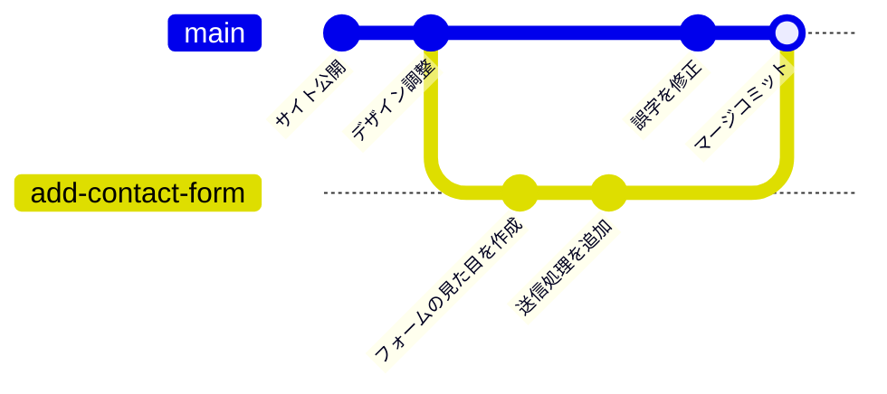
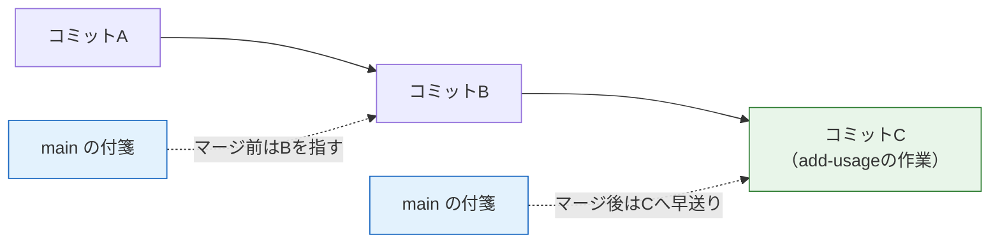
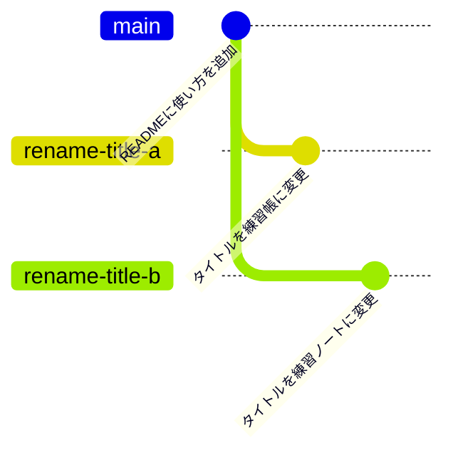

# ブランチとマージ

前のページ「[基本コマンド](/git/basic_commands/)」では、コミットを1本の鎖として積み重ねました。このページでは、その鎖を**枝分かれ**させる「ブランチ」と、枝分かれした作業を合流させる「マージ」を学びます。さらに、合流時に変更がぶつかったときの「コンフリクトの解消」も実際に体験します。

ブランチはGitの最重要機能です。次のページで学ぶGitHubのPull Requestも、ブランチがあって初めて成り立ちます。

このページでも、前のページで作った `git-practice` リポジトリを引き続き使います。

## 学習目標

- ブランチが何のためにあるのかを説明できる
- `git branch` / `git switch` でブランチを作成・切り替えできる
- `git merge` で2種類のマージ（fast-forwardとマージコミット）を実行できる
- コンフリクトが起きる条件を説明し、自力で解消できる

## ブランチとは

**ブランチ（branch、枝）** とは、**コミットの履歴を枝分かれさせて、並行した複数の作業の流れを持てるようにする仕組み**です。

なぜ枝分かれが必要なのでしょうか。たとえば、動いているWebサイトに「お問い合わせフォーム」を追加する作業を考えます。作業には数日かかり、その間は中途半端な状態のコミットが続きます。もし履歴が1本しかなければ、作業中にサイトの誤字を直したくなっても、「作りかけのフォーム」と「誤字修正」が同じ流れに混ざってしまいます。

ブランチを使うと、この問題をきれいに解決できます。

- `main` ブランチ … 常に「動く状態」を保つ本流
- `add-contact-form` ブランチ … フォーム開発専用の枝。途中の状態をいくらコミットしても本流に影響しない

枝での作業が完成したら、本流に**マージ（merge、合流）**して取り込みます。図にすると次のようになります。



`add-contact-form` ブランチで開発を進めている間も、`main` では誤字修正のコミットができています。そして最後に2つの流れがマージで合流しています。これがブランチを使った開発の基本形です。

### ブランチの正体は「付箋」

ブランチと聞くと「履歴のコピー」を想像しがちですが、実際は違います。ブランチの正体は、**特定のコミットを指す軽量なラベル（付箋のようなもの）**です。新しいコミットを作ると、今いるブランチの付箋が自動で新しいコミットに貼り替えられます。だからブランチの作成は一瞬で終わり、何百個作っても容量をほとんど消費しません。

そして、前のページの `git log` に表示されていた `HEAD`（ヘッド）は「**自分が今どのブランチにいるか**」を示す印です。`HEAD -> main` は「今 `main` ブランチにいる」という意味だったのです。

## ブランチを操作する

`git-practice` リポジトリで手を動かしましょう。まず現在のブランチを確認します。

```bash
git branch
```

実行結果の例:

```
* main
```

`git branch` は引数なしで実行するとブランチの一覧を表示します。`*` が現在いるブランチです。今は `main` だけが存在します。

### ブランチの作成と切り替え：git switch

「READMEに使い方の説明を追加する」作業用のブランチを作って移動します。

```bash
git switch -c add-usage
```

実行結果の例:

```
Switched to a new branch 'add-usage'
```

**コード解説**

- `git switch` … ブランチを切り替える（switch、スイッチ）コマンドです。
- `-c add-usage` … `-c`（create）を付けると、**ブランチを新規作成してそのまま切り替え**ます。既存のブランチに移動するだけなら `-c` なしで `git switch main` のように使います。
- なお、古い資料では `git checkout -b add-usage` という書き方を見かけます。同じことをする旧コマンドで、今でも動きますが、本カリキュラムでは役割が明確な `git switch` を使います。

`git branch` で確認すると、`*` が `add-usage` に移っています。

```
* add-usage
  main
```

### ブランチ上でコミットする

`README.md` の末尾に追記してください。

**`README.md`**（末尾に追加）

```markdown

## 使い方

このリポジトリはGitコマンドの練習場です。自由にコミットしてください。
```

コミットの手順は前のページと全く同じです。

```bash
git add README.md
git commit -m "READMEに使い方を追加"
```

ここで重要な実験をします。`main` に戻ってみてください。

```bash
git switch main
cat README.md
```

`README.md` から「使い方」の節が**消えています**。壊れたわけではありません。`main` ブランチはまだ古いコミットを指しているので、作業ツリーの中身もその時点の状態に切り替わったのです。`git switch add-usage` で戻れば、追記した内容が再び現れます。**ブランチを切り替えると、作業ツリーの中身ごと切り替わる**——これがブランチの動きを実感する一番のポイントです。

## git merge：ブランチを合流させる

`add-usage` での作業が完成したとして、`main` に取り込みましょう。マージは「**取り込む側**のブランチに移動してから、**取り込みたい**ブランチを指定する」という手順で行います。

```bash
git switch main
git merge add-usage
```

実行結果の例:

```
Updating b7c8d9e..9a8b7c6
Fast-forward
 README.md | 4 ++++
 1 file changed, 4 insertions(+)
```

`main` の `README.md` に「使い方」の節が取り込まれました。実行結果にある **Fast-forward（ファストフォワード、早送り）** はマージの方式の名前です。

### 2種類のマージ

マージには2つの方式があり、Gitが状況に応じて自動で使い分けます。

**(1) fast-forwardマージ** … 枝分かれした後、`main` 側に新しいコミットが1つもない場合。`main` の付箋を枝の先頭まで「早送り」するだけで合流が完了します。新しいコミットは作られません。今回はこのパターンでした。



**(2) マージコミット方式** … 枝分かれした後、**両方のブランチ**にコミットがある場合。2つの流れを統合した「マージコミット」という特別なコミットが新しく作られます。最初の図の `add-contact-form` の例がこのパターンです。

どちらの方式でも、マージが終わったら作業用ブランチは不要になります。削除しておきましょう。

```bash
git branch -d add-usage
```

実行結果の例:

```
Deleted branch add-usage (was 9a8b7c6).
```

`-d`（delete）はマージ済みのブランチだけを安全に削除します。ブランチは付箋にすぎないので、削除してもコミット自体は失われません。

## コンフリクト：変更の衝突と解消

マージで避けて通れないのが **コンフリクト（conflict、競合・衝突）** です。**2つのブランチが同じファイルの同じ箇所を別々に変更していた**場合、Gitはどちらを採用すべきか判断できず、人間に解消を求めてきます。

怖がる必要はありません。条件を整えて、わざとコンフリクトを起こして練習しましょう。

### わざとコンフリクトを起こす

現在の `README.md` の1行目はタイトル行です。これを2つのブランチで別々に書き換えます。

まず1つ目のブランチで、タイトルを変更してコミットします。

```bash
git switch -c rename-title-a
```

**`README.md`**（1行目を変更）

```markdown
# Gitコマンド練習帳
```

```bash
git add README.md
git commit -m "タイトルを練習帳に変更"
```

次に `main` に戻り、2つ目のブランチで**同じ1行目を別の内容に**変更します。

```bash
git switch main
git switch -c rename-title-b
```

**`README.md`**（1行目を変更）

```markdown
# Git練習ノート
```

```bash
git add README.md
git commit -m "タイトルを練習ノートに変更"
```

状況を図で整理します。同じ行に対する2つの異なる変更が、別々の枝に存在しています。



### コンフリクトを発生させる

`main` に両方をマージしてみます。1つ目は枝分かれ後の `main` に他の変更がないため、すんなり成功します。

```bash
git switch main
git merge rename-title-a
```

2つ目をマージしようとすると——

```bash
git merge rename-title-b
```

実行結果の例:

```
Auto-merging README.md
CONFLICT (content): Merge conflict in README.md
Automatic merge failed; fix conflicts and then commit the result.
```

**CONFLICT** と表示されました。「自動マージに失敗したので、衝突を解消してから結果をコミットしてください」と言われています。`git status` で状況を確認すると、`both modified: README.md`（両方で変更された）と表示されます。

### コンフリクトを解消する

`README.md` をVS Codeで開くと、衝突した箇所にGitが**コンフリクトマーカー**という印を書き込んでいます。

**`README.md`**（コンフリクト発生中の状態）

```
<<<<<<< HEAD
# Gitコマンド練習帳
=======
# Git練習ノート
>>>>>>> rename-title-b
```

**コード解説**

- `<<<<<<< HEAD` から `=======` まで … 現在のブランチ（`main`、つまり先にマージした「練習帳」）側の内容です。
- `=======` から `>>>>>>> rename-title-b` まで … マージしようとしているブランチ（「練習ノート」）側の内容です。

解消の手順は単純で、**マーカーを含む範囲を「最終的にあるべき内容」に手で書き換える**だけです。どちらか一方を採用しても、両方を組み合わせた新しい内容にしても構いません。ここでは両方を活かした名前にしてみます。

**`README.md`**（1行目をこの内容に書き換える）

```markdown
# Gitコマンド練習ノート
```

`<<<<<<<` `=======` `>>>>>>>` の3つのマーカー行を消し忘れないでください。マーカーが残ったままだと、それがファイルの内容としてコミットされてしまいます。

書き換えたら、解消の完了をGitに伝えるために add してコミットします。

```bash
git add README.md
git commit -m "タイトルの変更をマージ（両案を統合）"
```

実行結果の例:

```
[main 3c4d5e6] タイトルの変更をマージ（両案を統合）
```

これでコンフリクトの解消は完了です。`git log --oneline` で、2つの枝の歴史が1つに合流したことを確認できます。最後に作業ブランチを片付けておきましょう。

```bash
git branch -d rename-title-a
git branch -d rename-title-b
```

### コンフリクトと付き合うコツ

コンフリクトはミスでもエラーでもなく、並行作業をすれば自然に起こる日常的な出来事です。ただし、次の習慣で頻度と規模を小さくできます。

- **ブランチを長生きさせない。** 作業を小さく区切り、完成したら早めにマージします。枝分かれの期間が長いほど、衝突の可能性は高まります。
- **1つのブランチの目的を1つに絞る。** 無関係なファイルまで触ると、衝突の範囲が広がります。
- **解消後は動作確認をする。** マージ結果は「Gitが機械的につなげた状態」または「人間が手で編集した状態」です。コードの場合は必ず実行して確かめます。

## 理解度チェック

**Q1. ブランチを使わずに `main` 1本だけで開発した場合、どんな問題が起こりますか。**

<details markdown="1">
<summary>解答を見る</summary>

作りかけの機能のコミットと、それ以外の変更（緊急のバグ修正など）が同じ履歴に混ざってしまいます。その結果、「`main` は常に動く状態」を保てなくなり、作業の途中で別の作業に切り替えることも困難になります。

ブランチを使えば、本流（`main`）を動く状態に保ったまま、作業ごとに独立した流れで開発を進められます。

</details>

**Q2. `git switch -c fix-header` は何をするコマンドですか。`-c` がない場合との違いも説明してください。**

<details markdown="1">
<summary>解答を見る</summary>

`fix-header` という名前のブランチを**新規作成し、そのブランチに切り替える**コマンドです。`-c`（create）が新規作成を意味します。

`-c` を付けない `git switch fix-header` は、**既存の** `fix-header` ブランチへの切り替えです。ブランチが存在しない場合はエラーになります。

</details>

**Q3. fast-forwardマージとマージコミット方式は、それぞれどんな状況で使われますか。**

<details markdown="1">
<summary>解答を見る</summary>

- **fast-forwardマージ** … 枝分かれした後、取り込む側（例: `main`）に新しいコミットが1つもない場合。`main` の付箋（ブランチ）を枝の先頭コミットまで移動させるだけで合流が完了し、新しいコミットは作られません。
- **マージコミット方式** … 枝分かれした後、**両方のブランチ**にコミットがある場合。2つの流れを統合する「マージコミット」が新しく作られます。

どちらを使うかはGitが状況から自動で判断します。

</details>

**Q4. コンフリクトはどんな条件で発生しますか。また、発生したときの解消手順を順に説明してください。**

<details markdown="1">
<summary>解答を見る</summary>

**発生条件:** マージする2つのブランチが、**同じファイルの同じ箇所**を別々の内容に変更している場合です（片方だけが変更した箇所は、Gitが自動で取り込めるのでコンフリクトになりません）。

**解消手順:**

1. `git status` でコンフリクトしているファイル（`both modified`）を確認する
2. ファイルを開き、`<<<<<<<` `=======` `>>>>>>>` のマーカーで挟まれた両者の内容を確認する
3. マーカーごと削除し、最終的にあるべき内容に書き換える
4. `git add` で解消済みであることをGitに伝える
5. `git commit` でマージを完了させる

</details>

**Q5. マージが終わったブランチを `git branch -d` で削除しても、そのブランチで作ったコミットが消えないのはなぜですか。**

<details markdown="1">
<summary>解答を見る</summary>

ブランチの正体は「特定のコミットを指す軽量なラベル（付箋）」であり、コミット本体とは別物だからです。マージによってコミットは `main` の履歴から到達できる状態になっているので、付箋を剥がしても（ブランチを削除しても）コミット自体はリポジトリに残り続けます。

</details>

## セルフレビュー

- [ ] ブランチを使う目的（本流を動く状態に保ったまま並行作業する）を自分の言葉で説明できる
- [ ] ブランチの正体が「コミットを指す付箋」であることを説明できる
- [ ] `git switch -c` でのブランチ作成・切り替えを、何も見ずに実行できる
- [ ] ブランチを切り替えると作業ツリーの中身も切り替わることを、実際に確認した
- [ ] マージの手順（取り込む側に移動してから `git merge`）を実行できる
- [ ] fast-forwardとマージコミットの違いを図を描いて説明できる
- [ ] コンフリクトマーカーの読み方（HEAD側・相手側）を説明できる
- [ ] わざとコンフリクトを起こして、自力で解消できた

## 次のステップ

ここまでの操作は、すべて自分のPCの中だけで完結していました。次のページ「[GitHubとPull Request](/git/github_and_pr/)」では、リポジトリをインターネット上のGitHubに置き、他の人と共有する方法を学びます。そこで登場する**Pull Request**は、このページで学んだ「ブランチを作って作業し、`main` にマージする」流れを、**レビューを挟みながらGitHub上で行う**仕組みです。ブランチとマージの理解がそのまま土台になります。

また、「機能ごとにブランチを切って `main` にマージする」スタイルは、[CI/CD](/cicd/)のセクションで作る自動テストの前提となり、[SNS開発（最終プロジェクト）](/sns/)では実際の開発フローとして毎日使うことになります。

- 前のページ: [基本コマンド](/git/basic_commands/)
- 次のページ: [GitHubとPull Request](/git/github_and_pr/)
