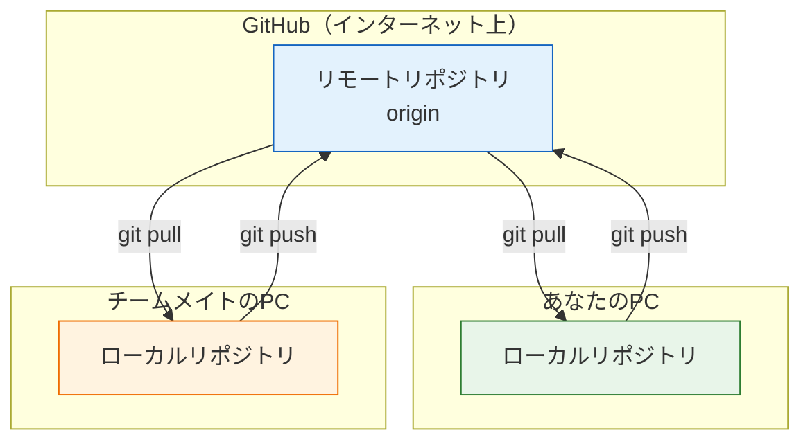
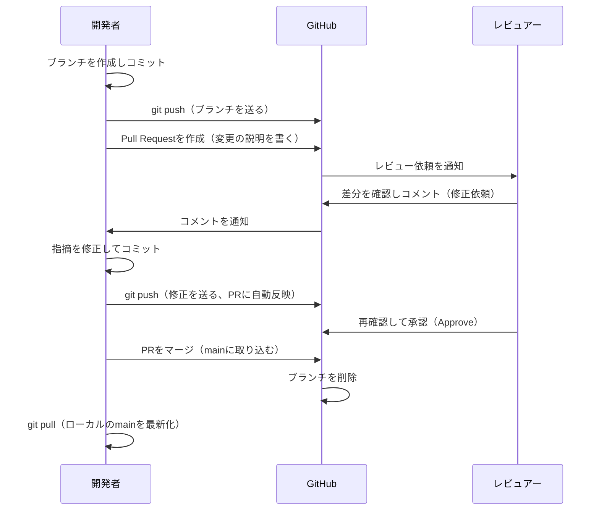

# GitHubとPull Request

ここまでの3ページで学んだGitの操作は、すべて自分のPCの中で完結していました。このページでは、リポジトリをインターネット上のサービス **GitHub** に置いて共有する方法と、チーム開発の中心となる仕組み **Pull Request（プルリクエスト）** を学びます。

PCが壊れても履歴が残る、他の人と一緒に開発できる、変更を取り込む前にレビューしてもらえる——ローカルだけのGitにこの3つの力を加えるのが、GitHubの役割です。

このページでも、[基本コマンド](/git/basic_commands/)から使っている `git-practice` リポジトリを引き続き使います。

## 学習目標

- リモートリポジトリとローカルリポジトリの関係を説明できる
- GitHub上にリポジトリを作成し、`git push` / `git pull` でローカルと同期できる
- Pull Requestとは何か、なぜ直接mainにpushせずPRを使うのかを説明できる
- ブランチ作成からPRのマージまでの一連の流れを実行できる

## リモートリポジトリとは

**リモートリポジトリ（remote repository）** とは、ネットワーク上に置かれた、共有用のリポジトリのことです。対して、自分のPCにあるリポジトリを **ローカルリポジトリ（local repository）** と呼びます。

[Gitとは何か](/git/what_is_git/)で触れたとおり、Gitは分散型で、各開発者がローカルに完全な履歴を持ちます。リモートリポジトリは、その履歴をやり取りするための「中央の集合場所」です。ローカルとリモートの間では、主に2つの操作を行います。

- **push（プッシュ）** … ローカルのコミットをリモートへ送る（アップロード）
- **pull（プル）** … リモートの新しいコミットをローカルへ取り込む（ダウンロード＋マージ）



各メンバーは自分のローカルでコミットを作り、pushでリモートへ送り、他のメンバーの変更をpullで受け取ります。リモートリポジトリが履歴の「公式な置き場所」として機能するわけです。

**GitHub**は、このリモートリポジトリのホスティング（置き場所の提供）に加えて、ブラウザで履歴を閲覧する機能、後述のPull Request、課題管理（Issues）などを提供するWebサービスです。世界中の開発者が使っており、有名なオープンソースソフトウェア（ReactやTypeScript自体も）の開発はGitHub上で行われています。

## GitHubのセットアップ

### アカウントの作成

[https://github.com/](https://github.com/) にアクセスし、「Sign up」からアカウントを作成してください。ユーザー名は公開され、今後ポートフォリオとしても使われるので、慎重に選びましょう。メールアドレスは、[Gitとは何か](/git/what_is_git/)で `git config` に設定したものと同じにしてください。コミットの作者とGitHubアカウントが正しく結びつきます。

### リポジトリの作成

GitHubにログインしたら、画面右上の「+」→「New repository」を選びます。設定項目は次のとおりです。

- **Repository name** … `git-practice`（ローカルと同じ名前にしておくと分かりやすい）
- **Public / Private** … Publicは全世界に公開、Privateは自分（と招待した人）だけが見られます。練習用なのでどちらでも構いませんが、迷ったらPrivateにしてください。
- **Initialize this repository with** … READMEなどの初期化オプションには**チェックを入れません**。手元にすでにリポジトリがあるためです。

「Create repository」を押すと、空のリモートリポジトリができます。

### 認証の準備

ローカルからGitHubへpushするには、「このpushはアカウントの持ち主本人によるものだ」と証明する認証が必要です。HTTPSでの接続では、初回のpush時に認証を求められます。GitHubはパスワードでの認証を廃止しているため、ブラウザ連携の認証ツール（Git Credential ManagerやGitHub CLI）を使うか、**Personal Access Token（パーソナルアクセストークン）** という専用の文字列を発行してパスワードの代わりに入力します。トークンはGitHubの Settings → Developer settings → Personal access tokens から発行できます。発行したトークンは秘密情報なので、`.env` と同じく誰にも見せないでください。

## push：ローカルの履歴をGitHubへ送る

ローカルの `git-practice` リポジトリに、リモートの場所を登録します。リポジトリ作成直後のGitHubの画面に表示されているURL（`https://github.com/ユーザー名/git-practice.git`）を使います。

```bash
cd ~/git-practice
git remote add origin https://github.com/your-name/git-practice.git
```

**コード解説**

- `git remote add` … リモートリポジトリの場所（URL）に名前を付けて登録するコマンドです。
- `origin`（オリジン） … 登録する名前です。慣習として、メインのリモートには `origin` という名前を付けます。以後「`origin` = GitHub上のあのリポジトリ」として扱えます。
- URLの `your-name` は自分のGitHubユーザー名に置き換えてください。

登録できたら、いよいよpushします。

```bash
git push -u origin main
```

実行結果の例:

```
Enumerating objects: 15, done.
Counting objects: 100% (15/15), done.
Writing objects: 100% (15/15), 1.45 KiB | 1.45 MiB/s, done.
To https://github.com/your-name/git-practice.git
 * [new branch]      main -> main
branch 'main' set up to track 'origin/main'.
```

**コード解説**

- `git push origin main` … 「`main` ブランチのコミットを `origin` へ送る」という意味です。
- `-u` … 「今後 `main` は `origin` の `main` と対応させる」という紐づけ（上流ブランチの設定）を保存するオプションです。一度 `-u` 付きでpushすれば、次回からは `git push` だけで済みます。

ブラウザでGitHubのリポジトリページを開いて（再読み込みして）みてください。`README.md` の内容と、これまでのコミット履歴がすべて表示されているはずです。あなたのコードがインターネット上にバックアップされた瞬間です。

## pull と clone：リモートから受け取る

逆方向の操作も覚えておきましょう。

- `git pull` … リモートにある新しいコミットをローカルに取り込みます。チーム開発では、他のメンバーのpushを受け取るために毎日使います。一人での開発でも、後述のPRをGitHub上でマージした後、その結果をローカルの `main` に反映するために使います。

```bash
git pull
```

- `git clone` … リモートリポジトリを**まるごとローカルに複製**します。別のPCで開発を始めるときや、他人のリポジトリを手元に持ってくるときに使います。`git init` から始める代わりに、既存のリモートから始めるための入口です。

```bash
git clone https://github.com/your-name/git-practice.git
```

実行すると、現在のフォルダの下に `git-practice` フォルダが作られ、全履歴とともに複製されます（今は実行しなくて構いません）。

## Pull Request：レビューを挟んで取り込む

ここからがこのページの本題です。

**Pull Request（プルリクエスト、略してPR）** とは、「このブランチの変更を `main` に取り込んでください（pullしてください）」という**依頼**をGitHub上で作成し、**コードレビューを経てからマージする**仕組みです。

[ブランチとマージ](/git/branch_and_merge/)では、自分のローカルで `git merge` を実行してブランチを取り込みました。チーム開発では、これをそのままやることはほとんどありません。なぜなら、

- **間違いに気づける人が自分しかいない。** マージ前に他の人の目（レビュー）を通すことで、バグや設計の問題を早期に発見できます。
- **変更の経緯が残らない。** PRには「なぜこの変更をするのか」の説明と議論が記録され、後から経緯を追えます。
- **mainを壊すリスクが高い。** 直接pushを禁止してPR経由に限定すれば、`main` には「レビュー済みの変更」しか入らなくなります。

実務では「`main` への直接pushは禁止、すべての変更はPR経由」というルールがごく一般的です。本カリキュラムでも、これ以降の開発はこのスタイルで進めます。

### PRの流れ（全体像）

開発者がPRを作ってからマージされるまでの登場人物のやり取りを、シーケンス図で示します。



ポイントは、push済みのブランチに追加のコミットをpushすると**PRの内容も自動で更新される**ことです。「修正依頼 → 修正をpush → 再レビュー」のループを、同じPRの上で何度でも回せます。

### 実際にPRを作ってみる

一人でも、この流れはそのまま練習できます（レビュアーも自分が兼ねます）。

**ステップ1: ブランチを作って変更をコミットする**

```bash
git switch -c add-license-info
```

**`README.md`**（末尾に追加）

```markdown

## ライセンス

このリポジトリは学習目的で作成されています。
```

```bash
git add README.md
git commit -m "READMEにライセンス情報を追加"
```

**ステップ2: ブランチをGitHubへpushする**

```bash
git push -u origin add-license-info
```

実行結果の例:

```
To https://github.com/your-name/git-practice.git
 * [new branch]      add-license-info -> add-license-info
remote:
remote: Create a pull request for 'add-license-info' on GitHub by visiting:
remote:      https://github.com/your-name/git-practice/pull/new/add-license-info
```

親切なことに、実行結果の中に「このブランチでPRを作るならこのURLへ」という案内が表示されます。

**ステップ3: GitHub上でPRを作成する**

表示されたURLをブラウザで開くか、GitHubのリポジトリページに表示される「Compare & pull request」ボタンを押します。PR作成画面では次を確認・入力します。

- **base: main ← compare: add-license-info** … 「`add-license-info` の変更を `main` に取り込む」という方向の指定です。
- **タイトル** … 変更の要約。例:「READMEにライセンス情報を追加」
- **説明欄** … なぜこの変更をするのか、何を変えたのかを書きます。レビュアーはまずここを読むので、コミットメッセージより丁寧に書くのが礼儀です。

「Create pull request」を押すとPRが作成されます。

**ステップ4: 差分を確認する（レビュー）**

PRページの「Files changed」タブを開くと、[基本コマンド](/git/basic_commands/)で学んだ `git diff` と同じ形式で、追加行が緑、削除行が赤で表示されます。チーム開発ではレビュアーがここを読み、行単位でコメントを付けます。今回は自分で差分を見直し、問題がないことを確認してください。

**ステップ5: マージする**

「Conversation」タブに戻り、緑色の「Merge pull request」→「Confirm merge」を押します。これでGitHub上の `main` に変更が取り込まれました。続けて表示される「Delete branch」ボタンで、役目を終えたブランチをリモートから削除しておきましょう。

**ステップ6: ローカルのmainを最新化する**

マージはGitHub上で行われたので、ローカルの `main` はまだ古いままです。取り込みます。

```bash
git switch main
git pull
```

実行結果の例:

```
Updating 3c4d5e6..7f8a9b0
Fast-forward
 README.md | 4 ++++
 1 file changed, 4 insertions(+)
```

ローカルの作業ブランチも削除して、一連の流れは完了です。

```bash
git branch -d add-license-info
```

### 開発の基本サイクル（今後ずっと使う形）

このページまでの内容を合わせると、今後のカリキュラム全体で使う開発サイクルが完成します。

1. `git switch main` → `git pull` で最新の状態から始める
2. `git switch -c 作業ブランチ名` で枝を切る
3. 編集 → `git add` → `git commit` を繰り返す
4. `git push -u origin 作業ブランチ名` で送る
5. GitHubでPRを作成し、レビューを経てマージする
6. ローカルで `git switch main` → `git pull` し、1に戻る

このサイクルが身についていれば、チーム開発の現場にそのまま入っていけます。

## 理解度チェック

**Q1. `git push` と `git pull` は、それぞれ何をどちらの方向に運ぶ操作ですか。**

<details markdown="1">
<summary>解答を見る</summary>

- `git push` … **ローカル**リポジトリのコミットを**リモート**リポジトリへ送ります（アップロード方向）。
- `git pull` … **リモート**リポジトリにある新しいコミットを**ローカル**リポジトリへ取り込みます（ダウンロード方向）。

ローカルが「自分の手元」、リモート（origin）が「GitHub上の共有場所」という位置関係を図で描けるようにしておきましょう。

</details>

**Q2. `git remote add origin <URL>` の `origin` とは何ですか。**

<details markdown="1">
<summary>解答を見る</summary>

リモートリポジトリのURLに付けた**名前（別名）**です。毎回長いURLを入力する代わりに、`git push origin main` のように名前で指定できるようになります。

`origin` という名前自体に特別な機能はなく、慣習としてメインのリモートにこの名前を付けます。

</details>

**Q3. ローカルで `git merge` すれば済むのに、チーム開発ではなぜPull Requestを使うのですか。理由を2つ挙げてください。**

<details markdown="1">
<summary>解答を見る</summary>

例として次の理由があります（2つ挙げられれば正解です）。

- **マージ前にレビューを挟める。** 他の人の目を通すことで、バグや設計の問題を `main` に入る前に発見できます。
- **変更の経緯が記録に残る。** PRの説明文や議論のコメントが残るため、後から「なぜこの変更が入ったのか」を追跡できます。
- **mainの品質を守れる。** 直接pushを禁止しPR経由に限定すれば、`main` にはレビュー済みの変更しか入りません。

</details>

**Q4. PRにレビューで修正依頼が来ました。修正をPRに反映するには何をすればよいですか。**

<details markdown="1">
<summary>解答を見る</summary>

PRの元になっているローカルの作業ブランチで修正をコミットし、**同じブランチを再度pushする**だけです。push済みブランチへの追加コミットは、開いているPRに自動で反映されます。PRを作り直す必要はありません。

</details>

**Q5. GitHub上でPRをマージした直後、ローカルの `main` で新しい作業を始める前にやるべきことは何ですか。その理由も説明してください。**

<details markdown="1">
<summary>解答を見る</summary>

`git switch main` してから `git pull` を実行し、ローカルの `main` を最新化することです。

PRのマージは**GitHub上（リモート）**で行われたため、ローカルの `main` はマージ前の古い状態のままです。古い `main` から次の作業ブランチを切ると、マージ済みの変更が含まれない状態で作業を始めることになり、後で不要なコンフリクトの原因になります。「作業を始める前に `main` を最新化する」を習慣にしてください。

</details>

## セルフレビュー

- [ ] ローカルリポジトリとリモートリポジトリの関係を図で描ける
- [ ] push / pull / clone の違いを自分の言葉で説明できる
- [ ] GitHubにリポジトリを作成し、ローカルのリポジトリをpushできた
- [ ] `git push -u origin main` の `-u` の意味を説明できる
- [ ] Pull Requestを使う理由（レビュー・記録・mainの保護）を説明できる
- [ ] ブランチ作成からPRのマージ、ローカルのmain最新化までの一連の流れを、何も見ずに実行できる
- [ ] PRの「Files changed」で差分を読み、何が変わるのかを説明できる

## 次のステップ

次のページ「[練習問題](/git/practice/)」で、このセクション全体の総仕上げをします。リポジトリの作成からPRのマージまでを、手順書なしで通して実行できるか確かめましょう。

また、このページで学んだ内容は今後のカリキュラムの大前提です。[CI/CD](/cicd/)のセクションでは「GitHubへのpushやPR作成をきっかけに、テストやデプロイが自動実行される」仕組み（GitHub Actions）を作ります。[SNS開発（最終プロジェクト）](/sns/)では、GitHub上のリポジトリを起点に、PRベースの開発フローで実際のアプリケーションを作り上げます。

- 前のページ: [ブランチとマージ](/git/branch_and_merge/)
- 次のページ: [練習問題](/git/practice/)
