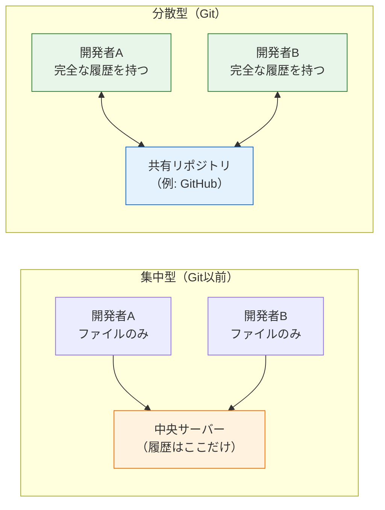
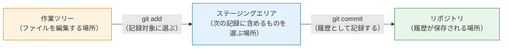
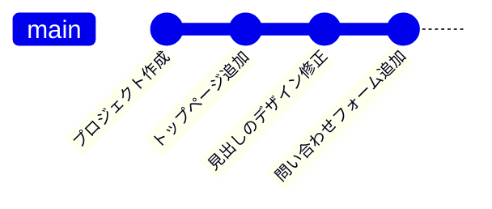

# Gitとは何か

このページでは、Gitを使い始める前に知っておくべき「バージョン管理とは何か」「Gitはどういう仕組みで動いているのか」を学びます。コマンドを覚える前に仕組みを理解しておくと、この後のページで出てくる操作の一つひとつが「何をしているのか」を納得しながら進められます。

## 学習目標

- バージョン管理システムが解決する問題を説明できる
- リポジトリ・コミット・作業ツリー・ステージングエリアという4つの用語を説明できる
- コミットが「履歴のつながり」として記録されることを図でイメージできる
- 自分のPCにGitがインストールされていることを確認し、初期設定を済ませる

## バージョン管理とは

バージョン管理（version control、バージョンコントロール）とは、**ファイルの変更履歴を記録し、過去の任意の時点に戻れるようにする仕組み**のことです。

バージョン管理を使わない場合、どうなるかを考えてみましょう。入門編の[最終問題](/final_project/)のようなプロジェクトを作っているとき、「動いている状態を残しておきたい」と思ったら、多くの人はフォルダごとコピーします。

```
my-project/
my-project_backup/
my-project_backup2/
my-project_最終版/
my-project_最終版_修正/
my-project_本当の最終版/
```

この方法には深刻な問題があります。

- **どれが何のバックアップか分からなくなる。** 「最終版_修正」と「本当の最終版」のどちらが新しいのか、1週間後には思い出せません。
- **何を変更したのか分からない。** フォルダを見比べても、どのファイルのどの行を変えたのかは分かりません。
- **容量を圧迫する。** 1行直すたびにプロジェクト全体をコピーするのは無駄です。
- **複数人で作業できない。** 2人が同時に別のコピーを編集したら、それを合体させる手段がありません。

バージョン管理システムは、これらの問題をすべて解決します。「いつ・誰が・何を・なぜ変更したのか」を記録として残し、必要なら過去の状態に戻したり、複数人の変更を合流させたりできます。

## Gitとは

**Git（ギット）** は、現在最も広く使われているバージョン管理システムです。2005年にLinuxの開発者リーナス・トーバルズによって作られ、今では個人開発から大企業まで、ソフトウェア開発の現場のほぼすべてで使われています。

Gitの大きな特徴は **分散型（distributed、ディストリビューテッド）** であることです。Git以前に主流だった「集中型」のバージョン管理システムでは、履歴は中央のサーバーだけが持ち、開発者は操作のたびにサーバーへ問い合わせる必要がありました。これに対してGitでは、変更履歴の完全なコピーを各開発者のPCがそれぞれ持ちます。



分散型には、次のような利点があります。

- **オフラインで作業できる。** 履歴の記録も参照も自分のPCの中で完結するため、インターネットに接続していなくても開発を進められます。
- **速い。** ほとんどの操作がネットワークを介さないため、一瞬で終わります。
- **履歴のバックアップが自然にできる。** 全員が完全な履歴を持っているので、どこか1台が壊れても歴史は失われません。

ネットワーク越しの共有は、後のページで学ぶ[GitHub](/git/github_and_pr/)のような「リモートリポジトリ」を通じて行います。

なお、GitとGitHubは別物です。

- **Git** … バージョン管理を行うツールそのもの。自分のPCで動く。
- **GitHub** … Gitのリポジトリをインターネット上に置いて共有できるWebサービス。

「Gitという道具」と「GitHubという置き場所」の関係です。このページと次の2ページではGitだけを使い、GitHubは[GitHubとPull Request](/git/github_and_pr/)のページで登場します。

## Gitの仕組み：3つの場所

Gitを理解する鍵は、Gitがファイルを**3つの場所**で管理していると知ることです。

| 場所 | 読み | 役割 |
|---|---|---|
| 作業ツリー | working tree（ワーキングツリー） | 実際にファイルを編集する場所。普段VS Codeで見ているフォルダそのもの |
| ステージングエリア | staging area（ステージングエリア） | 「次の記録に含めるもの」を選んで置いておく場所 |
| リポジトリ | repository（リポジトリ） | 変更履歴が記録として保存される場所 |

ファイルの変更は、この3つの場所を左から右へ移動しながら「歴史」として記録されていきます。



図の流れを言葉にすると、次のようになります。

1. **作業ツリー**でファイルを編集する（いつも通りVS Codeで書く）
2. `git add` コマンドで、記録したい変更を**ステージングエリア**に載せる
3. `git commit` コマンドで、ステージングエリアの内容を**リポジトリ**に履歴として記録する

「なぜわざわざステージングエリアを挟むのか」と疑問に思うかもしれません。これは、**変更の一部だけを選んで記録できるようにするため**です。たとえば「機能Aの修正」と「タイポの修正」を同時に作業してしまった場合でも、ステージングエリアを使えば2つを別々の記録に分けられます。記録が意味のある単位で分かれていると、後から履歴を読むのが格段に楽になります。

### リポジトリの正体は `.git` フォルダ

リポジトリといっても、特別なサーバーがあるわけではありません。Gitで管理を始めると、プロジェクトのフォルダ直下に `.git` という隠しフォルダが作られ、そこに全履歴が保存されます。逆に言えば、`.git` フォルダを削除すると履歴はすべて消えます。`.git` の中身を直接編集することはないので、「ここに歴史が入っている」とだけ覚えておいてください。

## コミット：履歴の1単位

リポジトリに記録される履歴の1単位を **コミット（commit）** と呼びます。コミットには次の情報が含まれます。

- その時点でのプロジェクト全体のスナップショット（ファイルの状態）
- 変更した人の名前とメールアドレス
- 日時
- **コミットメッセージ**（何のための変更かを説明する文章）
- 1つ前のコミットへの参照

最後の「1つ前のコミットへの参照」が重要です。各コミットは前のコミットとつながっているため、コミットの列は**鎖のようにつながった歴史**になります。Gitの履歴を図にすると、次のようになります。



左が古く、右が新しいコミットです。それぞれの丸が1つのコミット（＝その時点のプロジェクト全体の状態）を表します。この鎖があるおかげで、Gitは「3つ前の状態に戻す」「2つ目と3つ目の間で何が変わったかを表示する」といった操作ができるのです。

各コミットには **コミットID**（ハッシュとも呼ばれる、`a1b2c3d...` のような40桁の英数字）が自動で割り当てられ、これを使って特定のコミットを指し示せます。

### 良いコミットの単位

コミットは「区切りの良い、意味のあるまとまり」で作るのが原則です。

| 評価 | コミットメッセージの例 | 理由 |
|---|---|---|
| 良い | ヘッダーのナビゲーションを追加 | 何をしたのかが一目で分かる |
| 良い | ログインボタンの文言を修正 | 変更の対象と種類が明確 |
| 悪い | いろいろ修正 | 何を変えたのか追跡できない |
| 悪い | 作業途中 | 区切りの良い単位になっていない |

なぜなら、コミットは未来の自分やチームメイトが「履歴を読む」ためのものだからです。1つのコミットに無関係な変更を詰め込むと、後から「この変更はなぜ入ったのか」を追跡できなくなります。

## Gitのインストール確認と初期設定

ここからは手を動かします。[ターミナル](/environment/terminal/)を開いてください。

### インストールの確認

macOSでは、Gitは最初から入っているか、開発者ツールと一緒にインストールされます。次のコマンドで確認します。

```bash
git --version
```

実行結果の例:

```
git version 2.39.3 (Apple Git-146)
```

バージョン番号が表示されれば、Gitは使える状態です（番号は環境によって異なります。2系であれば問題ありません）。もし `command not found` と表示された場合、macOSでは `xcode-select --install` を実行して開発者ツールをインストールしてください。Windows（WSL/Ubuntu）の場合は `sudo apt update && sudo apt install git` でインストールできます。

### 初期設定：名前とメールアドレス

前述のとおり、コミットには「誰が変更したか」が記録されます。そのための名前とメールアドレスを、最初に一度だけ設定します。

```bash
git config --global user.name "Taro Yamada"
git config --global user.email "taro@example.com"
```

**コード解説**

- `git config` … Gitの設定を読み書きするコマンドです。
- `--global` … このPCのすべてのリポジトリに共通の設定にするオプションです。これを付けないと、今いるリポジトリだけの設定になります。
- `user.name` / `user.email` … コミットに記録される名前とメールアドレスです。自分のものに置き換えてください。GitHubに登録する（予定の）メールアドレスと揃えておくと、後でGitHub上の活動記録と正しく結びつきます。

設定できたか確認しましょう。

```bash
git config --global user.name
git config --global user.email
```

実行結果の例:

```
Taro Yamada
taro@example.com
```

### 初期設定：デフォルトブランチ名

もう1つだけ設定しておきます。詳しくは[ブランチとマージ](/git/branch_and_merge/)で学びますが、Gitの履歴の本流には名前が付いており、現在は `main` という名前が標準です。古いGitでは `master` が初期値のため、次の設定で `main` に統一しておきます。

```bash
git config --global init.defaultBranch main
```

これで準備は完了です。次のページから、実際にリポジトリを作ってコミットを積み重ねていきます。

## 理解度チェック

**Q1. フォルダをコピーしてバックアップする方法と比べて、バージョン管理システムの利点を2つ挙げてください。**

<details markdown="1">
<summary>解答を見る</summary>

例として次のような利点があります（2つ挙げられれば正解です）。

- 「いつ・誰が・何を・なぜ」変更したかが記録として残り、後から変更内容を確認できる
- 過去の任意の時点の状態にいつでも戻せる
- フォルダ全体を何度もコピーする必要がなく、容量を無駄にしない
- 複数人の変更を合流（マージ）させる仕組みがあり、チーム開発ができる

フォルダコピーでは「ファイルの状態」しか残らず、「変更の理由や経緯」が失われる点が本質的な違いです。

</details>

**Q2. 作業ツリー・ステージングエリア・リポジトリの3つの場所を、変更が記録されるまでの流れに沿って説明してください。**

<details markdown="1">
<summary>解答を見る</summary>

1. **作業ツリー**は実際にファイルを編集する場所です。VS Codeで開いているプロジェクトフォルダそのものを指します。
2. `git add` を実行すると、変更が**ステージングエリア**に載ります。ここは「次のコミットに含める変更」を選んで置いておく中間置き場です。
3. `git commit` を実行すると、ステージングエリアの内容が**リポジトリ**に履歴（コミット）として記録されます。

ステージングエリアがあることで、複数の変更の中から関連するものだけを選んで1つのコミットにまとめられます。

</details>

**Q3. GitとGitHubの違いを説明してください。**

<details markdown="1">
<summary>解答を見る</summary>

**Git**はバージョン管理を行うツールそのもので、自分のPC上で動作します。インターネット接続がなくても履歴の記録や参照ができます。

**GitHub**は、Gitのリポジトリをインターネット上に置いて共有するためのWebサービスです。複数人での開発や、コードの公開、後で学ぶPull Requestによるレビューなどの機能を提供します。

「Gitという道具」を使った成果物の「置き場所・共有場所」がGitHub、という関係です。

</details>

**Q4. Gitが「分散型」であることの利点を2つ挙げてください。**

<details markdown="1">
<summary>解答を見る</summary>

例として次の利点があります（2つ挙げられれば正解です）。

- 履歴の完全なコピーを自分のPCが持つため、**オフラインでも**コミットや履歴の参照ができる
- ほとんどの操作がネットワークを介さないため**速い**
- 全員が完全な履歴を持つため、1台のマシンが壊れても**歴史が失われない**

集中型では履歴を中央サーバーだけが持つため、これらはいずれも実現できませんでした。

</details>

**Q5. 「いろいろ修正」というコミットメッセージが望ましくない理由を説明してください。**

<details markdown="1">
<summary>解答を見る</summary>

コミットの履歴は、未来の自分やチームメイトが「いつ・何を・なぜ変更したのか」を追跡するために読むものです。「いろいろ修正」では何を変更したのか分からず、履歴をさかのぼって原因を調査したいとき（たとえば「どのコミットでバグが入ったのか」を探すとき）に役に立ちません。

「ヘッダーのナビゲーションを追加」のように、**1つの意味のあるまとまり**を**内容が分かる言葉**で記録するのが原則です。

</details>

## セルフレビュー

- [ ] バージョン管理が解決する問題を、フォルダコピー方式の欠点と対比して自分の言葉で説明できる
- [ ] 作業ツリー・ステージングエリア・リポジトリの3つの場所と、その間を移動させるコマンド名（add / commit）を言える
- [ ] ステージングエリアが存在する理由を説明できる
- [ ] コミットに記録される情報（スナップショット、作者、日時、メッセージ、前のコミットへの参照）を挙げられる
- [ ] GitとGitHubの違いを説明できる
- [ ] 自分のPCで `git --version` を実行し、バージョンが表示されることを確認した
- [ ] `user.name` / `user.email` / `init.defaultBranch` の初期設定を済ませた

## 次のステップ

次のページ「[基本コマンド](/git/basic_commands/)」では、このページで学んだ3つの場所を実際にコマンドで操作し、最初のコミットを作ります。ここで理解した「作業ツリー → ステージングエリア → リポジトリ」の流れが、そのまま `git add` → `git commit` という操作になります。

このページの内容は、セクションの最後まで（そして[CI/CD](/cicd//)や[SNS開発](/sns//)まで）ずっと使い続ける土台です。3つの場所の図が頭に浮かぶようになってから先へ進んでください。

- 前のページ: [Git/GitHub基礎（セクション概要）](/git//)
- 次のページ: [基本コマンド](/git/basic_commands/)
