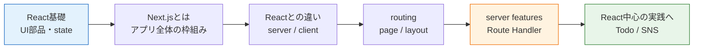

# Next.js入門

Next.jsは、Reactを土台にして**ページ構成、サーバー側の処理、データ取得、デプロイしやすい設計**までまとめて扱うためのフレームワークです。

Reactを学ぶと、コンポーネント、props、state、hooksを使って画面を作れるようになります。ただし実務のWebアプリでは、URLごとのページ分割、SEO、初回表示速度、サーバー側のデータ取得、認証、APIの入口も必要になります。Next.jsは、その不足しやすい部分をReactの上に足します。

> このカリキュラムでは、TodoアプリとSNSアプリの実装解説はReactを基準に進めます。Next.jsは「Reactをアプリ全体に広げると何が変わるか」を理解するために学びます。

## フレームワークとは

フレームワークは、アプリを作るための「決まった作り方」と「便利な機能」をまとめたものです。

ライブラリであるReactはUI部品を作る力が中心です。Next.jsは、Reactで作ったUIを「URLを持つページ」「サーバーでデータを準備する画面」「APIを持つWebアプリ」に広げるための枠組みです。

## 学習ページ

| ページ | 内容 |
| --- | --- |
| [Next.jsとは何か](/nextjs/what_is_nextjs/) | Next.jsの役割、Reactだけでは足りない場面、現場での使われ方 |
| [Reactとの違い](/nextjs/react_difference/) | ライブラリとフレームワークの違い、Server Components、Client Components |
| [ルーティングとレンダリング](/nextjs/routing_and_rendering/) | App Router、layout、page、SSR/SSGの考え方 |
| [サーバー機能とAPI](/nextjs/server_features/) | Route Handler、サーバー側データ取得、バックエンドとの分担 |
| [このカリキュラムでの扱い](/nextjs/curriculum_scope/) | Todo/SNSをReact中心で扱う理由、Next.jsをどこまで学ぶか |

## 最初に押さえること

Next.jsを学ぶときは、最初から「全部バックエンドもNext.jsで作る」と考えない方が安全です。まずは次の順番で理解します。

1. Reactのコンポーネントがそのまま使える
2. `app` ディレクトリのファイル構成がURLになる
3. サーバーで動くコンポーネントとブラウザで動くコンポーネントが分かれる
4. 軽いAPIはRoute Handlerで書ける
5. 大きな業務ロジックはNestJSやSpring Bootなど別APIに分けることも多い

## 参考リンク

- [Next.js Docs](https://nextjs.org/docs) - Next.js公式ドキュメントです。
- [Next.js Learn](https://nextjs.org/learn) - 公式の学習教材です。
- [Next.js: Server and Client Components](https://nextjs.org/docs/app/getting-started/server-and-client-components) - サーバー側とブラウザ側の役割分担を確認できます。
- [Next.js: Route Handlers](https://nextjs.org/docs/app/getting-started/route-handlers) - Next.js内でAPIの入口を作る方法を確認できます。
