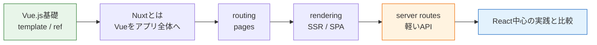

# Nuxt入門

Nuxtは、Vue.jsを土台にして**ページ構成、ルーティング、SSR、データ取得、サーバーAPI**まで扱いやすくするフレームワークです。

Vue.jsだけでも画面は作れます。しかし実務のWebアプリでは、URLごとのページ分割、SEO、初回表示、サーバー側のデータ取得、API、デプロイ構成も必要になります。Nuxtは、Vueで作ったUIをアプリ全体に広げるための枠組みです。

> このカリキュラムでは、TodoアプリとSNSアプリの実装解説はReactを基準に進めます。Nuxtは「VueでNext.jsのような構成を作ると何が変わるか」を理解するために学びます。

## フレームワークとは

フレームワークは、アプリ全体の作り方を用意してくれる道具です。

Nuxtは、Vueのコンポーネントをページ、レイアウト、データ取得、サーバーAPIと組み合わせるためのルールを持っています。Reactに対するNext.jsのように、Vueに対するNuxtという関係で理解すると分かりやすいです。

## 学習ページ

| ページ | 内容 |
| --- | --- |
| [Nuxtとは何か](/nuxt/what_is_nuxt/) | Nuxtの役割、Vueだけでは足りない場面、現場での使われ方 |
| [Vue・React・Next.jsとの違い](/nuxt/framework_differences/) | Vueとの関係、Next.jsとの似ている点、Reactとの違い |
| [ルーティングとレンダリング](/nuxt/routing_rendering_data/) | pages、layout、SSR、データ取得の流れ |
| [サーバー機能とAPI](/nuxt/server_features/) | server routes、Nitro、バックエンドとの分担 |
| [このカリキュラムでの扱い](/nuxt/curriculum_scope/) | React中心で実践する理由、Nuxtをどこまで学ぶか |

## 参考リンク

- [Nuxt Docs](https://nuxt.com/docs) - Nuxt公式ドキュメントです。
- [Nuxt: Introduction](https://nuxt.com/docs/getting-started/introduction) - Nuxtの全体像と始め方を確認できます。
- [Nuxt: Routing](https://nuxt.com/docs/getting-started/routing) - ファイルベースルーティングを確認できます。
- [Nuxt: Data Fetching](https://nuxt.com/docs/getting-started/data-fetching) - Nuxtのデータ取得の基本を確認できます。
- [Vue.js 日本語ドキュメント](https://ja.vuejs.org/guide/introduction.html) - Nuxtの前提になるVueの公式日本語ガイドです。
