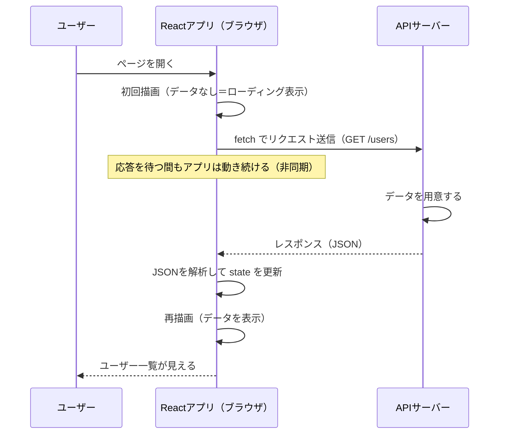
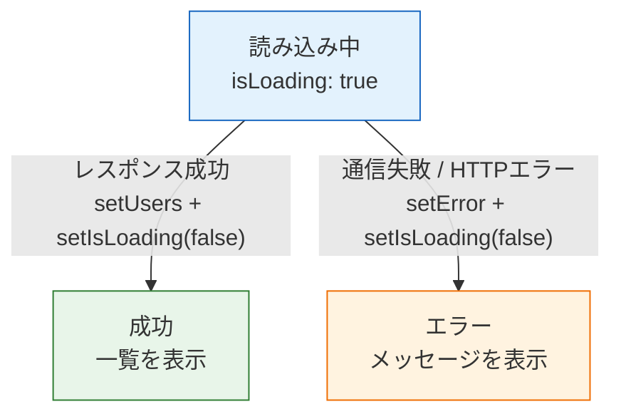
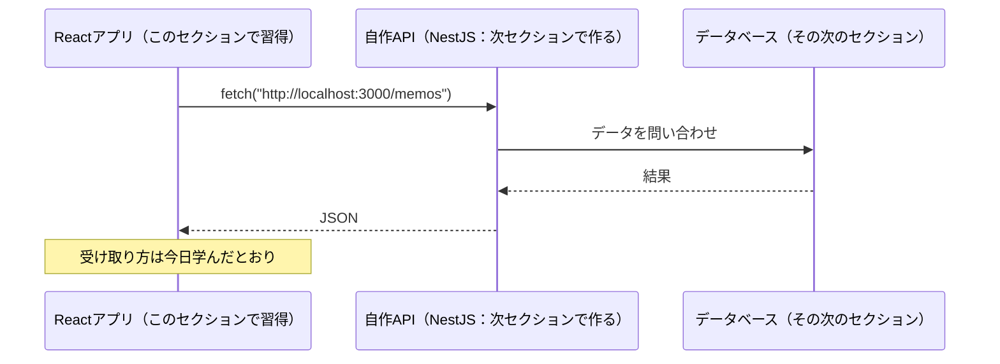

# fetchでAPI通信

ここまでのアプリは、データがすべてコードの中（stateの初期値）にありました。しかし実際のアプリでは、データは**サーバー**にあります。SNSのタイムラインも、ECサイトの商品一覧も、サーバーから取得したデータを画面に表示しています。

このページでは、ブラウザ標準の通信機能 **fetch（フェッチ）** を使ってサーバーからデータを取得し、Reactで表示する方法を学びます。通信には「待ち時間」と「失敗」が必ず付きまとうため、**ローディング表示**と**エラー処理**もセットで身につけます。

なお、このページでは練習用の公開APIを使いますが、[バックエンド基礎（NestJS）](/backend//)では**自分でAPIを作り**、ここで学ぶ方法でそのAPIに接続します。「使う側」を先に経験しておくことで、「作る側」の理解も深まります。

## 学習目標

- APIとJSONが何かを説明できる
- fetchとasync/awaitを使ってデータを取得できる
- useEffectの依存配列 `[]` でマウント時のデータ取得を実装できる
- ローディング・エラー・成功の3状態をstateで管理し、出し分けできる
- フロントエンドとサーバーの通信の流れをシーケンス図で説明できる

## APIとJSON

**API（エーピーアイ、Application Programming Interface）**とは、プログラム同士がやり取りするための窓口です。Webの文脈では、「**特定のURLにリクエストを送ると、データを返してくれるサーバーの窓口**」を指します（Web APIとも呼びます）。

たとえば、練習用の公開API「JSONPlaceholder」のURLにブラウザでアクセスしてみてください。

```
https://jsonplaceholder.typicode.com/users/1
```

次のようなテキストが表示されます。

```json
{
  "id": 1,
  "name": "Leanne Graham",
  "username": "Bret",
  "email": "Sincere@april.biz",
  "address": {
    "street": "Kulas Light",
    "suite": "Apt. 556",
    "city": "Gwenborough",
    "zipcode": "92998-3874",
    "geo": {
      "lat": "-37.3159",
      "lng": "81.1496"
    }
  },
  "phone": "1-770-736-8031 x56442",
  "website": "hildegard.org",
  "company": {
    "name": "Romaguera-Crona",
    "catchPhrase": "Multi-layered client-server neural-net",
    "bs": "harness real-time e-markets"
  }
}
```

この形式を**JSON（ジェイソン、JavaScript Object Notation）**と呼びます。名前のとおりJavaScriptのオブジェクトによく似た、データ交換用のテキスト形式です。[Reactとは何か](/react/what_is_react/)で「SPAはサーバーとデータだけをやり取りする」と学びましたが、その「データ」の標準形式がJSONです。

- HTMLを返すのが従来のWebサーバー、**JSONを返すのがAPIサーバー**
- ブラウザ（React）はJSONを受け取り、それをstateに入れて画面を描画する

という役割分担になります。

## fetchの基本

**fetch**は、JavaScriptからHTTPリクエストを送るためのブラウザ標準の関数です。通信は時間のかかる処理なので、**非同期処理**（処理の完了をその場で待たず、結果が届いたら続きを行う仕組み）として扱われます。まず書き方を見てみましょう。

```typescript
const response = await fetch("https://jsonplaceholder.typicode.com/users/1");
const user = await response.json();
console.log(user.name);  // "Leanne Graham"
```

**コード解説**

- `fetch(URL)` — 指定したURLにリクエストを送ります。結果がすぐには返らないため、**Promise（プロミス：未来に値が届く約束）**という形で返ってきます
- `await` — 「Promiseの結果が届くまで待つ」キーワードです。`await` を使う関数には `async` を付ける必要があります（後述のコードで確認します）
- `response.json()` — レスポンスの本文（JSONテキスト）を解析してJavaScriptのオブジェクトに変換します。この変換も非同期なので `await` が必要です
- 2回の `await` を経て、ようやく `user` という普通のオブジェクトとして扱えるようになります

### 通信の流れをシーケンス図で見る

fetchによる通信で「誰が・いつ・何をしているか」を図にすると次のようになります。



重要なポイントが2つあります。

1. **通信には時間がかかる**。リクエストを送ってからレスポンスが届くまでの間、画面には「まだデータがない状態」が存在します。この間に何を表示するかが**ローディング表示**です
2. **データが届いたらstateを更新する**。すると[propsとstate](/react/props_and_state/)で学んだ仕組みにより、画面が自動で再描画されます。通信とReactをつなぐ接点は「set関数を呼ぶこと」だけです

## ReactでAPIからデータを取得する

それでは、「ユーザー一覧をAPIから取得して表示する」コンポーネントを作ります。まずは最小構成、その後ローディングとエラーを加えて完成させます。

### ステップ1：useEffectで取得してstateに入れる

「画面を開いたら1回だけデータを取得する」——これは[フック（useEffect）](/react/hooks/)で学んだ、**依存配列 `[]` のuseEffect**の出番です。

**`src/components/UserList.tsx`**（新規作成または書き換え）

```tsx
import { useState, useEffect } from "react";

type User = {
  id: number;
  name: string;
  email: string;
};

function UserList() {
  const [users, setUsers] = useState<User[]>([]);

  useEffect(() => {
    const fetchUsers = async () => {
      const response = await fetch(
        "https://jsonplaceholder.typicode.com/users"
      );
      const data: User[] = await response.json();
      setUsers(data);
    };

    fetchUsers();
  }, []);

  return (
    <div>
      <h2>ユーザー一覧</h2>
      <ul>
        {users.map((user) => (
          <li key={user.id}>
            {user.name}（{user.email}）
          </li>
        ))}
      </ul>
    </div>
  );
}

export default UserList;
```

**コード解説**

- `type User = { ... }` — APIが返すJSONの形を型として定義します。JSONPlaceholderの `/users` は多くの項目を返しますが、**使う項目だけ**型に書けば十分です
- `useState<User[]>([])` — 取得結果を入れるstateです。データが届く前は空配列にしておくことで、`users.map(...)` が初回描画でもエラーになりません
- `useEffect(..., [])` — 依存配列が空なので、**マウント時に1回だけ**実行されます。「画面を開いたら一覧を取得」の定番パターンです
- `const fetchUsers = async () => { ... }; fetchUsers();` — useEffectの中に非同期関数を定義して、すぐ呼び出しています。`useEffect(async () => ...)` のようにuseEffect自体にasyncを付けることはできない（クリーンアップ関数の仕組みと衝突するため）ので、この形が定石です
- `data: User[]` — `response.json()` の戻り値に型を付けています。注意点として、これは「この形のはず」という**開発者の宣言**であり、サーバーが本当にその形を返すかは実行するまでわかりません。型の保証の限界については[バックエンド基礎（NestJS）](/backend//)で改めて扱います
- `setUsers(data)` — stateを更新すれば、あとはReactが一覧を描画してくれます

ブラウザで確認すると、一瞬の間をおいて10人のユーザーが表示されるはずです。

### ステップ2：ローディングとエラーを扱う

ステップ1には2つの問題があります。

1. データが届くまでの間、見出しだけの**空の画面**が表示される（ユーザーは壊れていると感じます）
2. 通信が失敗したとき（電波が悪い、サーバーが落ちている等）、**何も起きずに空のまま**になる

通信を伴う画面には、**「読み込み中」「エラー」「成功」の3つの状態**が必ず存在します。それぞれをstateで管理し、出し分けます。

**`src/components/UserList.tsx`**（完成版）

```tsx
import { useState, useEffect } from "react";

type User = {
  id: number;
  name: string;
  email: string;
};

function UserList() {
  const [users, setUsers] = useState<User[]>([]);
  const [isLoading, setIsLoading] = useState<boolean>(true);
  const [error, setError] = useState<string | null>(null);

  useEffect(() => {
    const fetchUsers = async () => {
      try {
        const response = await fetch(
          "https://jsonplaceholder.typicode.com/users"
        );
        if (!response.ok) {
          throw new Error(`HTTPエラー: ${response.status}`);
        }
        const data: User[] = await response.json();
        setUsers(data);
      } catch (e) {
        setError("ユーザーの取得に失敗しました");
      } finally {
        setIsLoading(false);
      }
    };

    fetchUsers();
  }, []);

  if (isLoading) {
    return <p>読み込み中...</p>;
  }

  if (error !== null) {
    return <p>{error}</p>;
  }

  return (
    <div>
      <h2>ユーザー一覧</h2>
      <ul>
        {users.map((user) => (
          <li key={user.id}>
            {user.name}（{user.email}）
          </li>
        ))}
      </ul>
    </div>
  );
}

export default UserList;
```

**コード解説**

- state設計 — 「データ（`users`）」「読み込み中か（`isLoading`、初期値は `true`）」「エラーメッセージ（`error`、なければ `null`）」の3つで、通信の全状態を表現します。`string | null` は[ユニオン型](/typescript/basic_types/)の実践です
- `try { ... } catch (e) { ... } finally { ... }` — 例外処理の構文です。`try` の中でエラーが投げられると `catch` に飛び、`finally` は**成功でも失敗でも最後に必ず**実行されます
- `if (!response.ok)` — 重要な落とし穴です。fetchは、サーバーが「404 Not Found」や「500 Internal Server Error」を返しても**例外を投げません**（通信自体は成立しているため）。`response.ok` は「ステータスコードが成功（200番台）か」を表すので、失敗なら自分で `throw` してcatchに合流させます
- `catch (e)` — ネットワーク断などfetch自体の失敗と、上で投げたHTTPエラーの両方がここに来ます。ユーザー向けのメッセージをstateにセットします
- `finally { setIsLoading(false); }` — 成功・失敗のどちらでも「読み込み中」は終わるので、finallyに置くのが簡潔です
- 早期リターン — [フォームとリスト](/react/forms_and_lists/)で学んだパターンです。「読み込み中なら」「エラーなら」を先に返し、本体のJSXは成功時だけに集中させます

3状態の遷移を図で整理します。



エラー時の動作も確認しておきましょう。fetchのURLをわざと存在しないもの（例：`.../userszzz`）に変えると「ユーザーの取得に失敗しました」が表示されるはずです。**エラー処理は、エラーを起こして動作確認するまでが実装**です。確認したらURLを元に戻してください。

### ボタン操作で取得する場合

マウント時ではなく「ボタンを押したら取得」する場合は、useEffectではなく**イベントハンドラの中でfetch**します。

```tsx
const handleReload = async () => {
  setIsLoading(true);
  setError(null);
  try {
    const response = await fetch("https://jsonplaceholder.typicode.com/users");
    if (!response.ok) {
      throw new Error(`HTTPエラー: ${response.status}`);
    }
    const data: User[] = await response.json();
    setUsers(data);
  } catch (e) {
    setError("ユーザーの取得に失敗しました");
  } finally {
    setIsLoading(false);
  }
};
```

これを `<button onClick={handleReload}>再読み込み</button>` から呼びます。useEffectは「描画に連動して自動で実行したい」場合の置き場所であり、ユーザー操作が起点なら普通の関数で構いません。

## POST：サーバーにデータを送る

ここまでは取得（GET）でしたが、fetchはデータの送信もできます。投稿フォームからサーバーに新規データを送る例です。

```tsx
const createPost = async (title: string, body: string) => {
  const response = await fetch("https://jsonplaceholder.typicode.com/posts", {
    method: "POST",
    headers: {
      "Content-Type": "application/json",
    },
    body: JSON.stringify({ title, body, userId: 1 }),
  });
  const created = await response.json();
  console.log(created);  // サーバーが採番したidを含むオブジェクト
};
```

**コード解説**

- fetchの第2引数 — オプションのオブジェクトで、リクエストの詳細を指定します
- `method: "POST"` — HTTPメソッドの指定です。省略時はGET（取得）で、POSTは「新規作成」を意味します。メソッドの使い分けは[バックエンド基礎のHTTPとREST](/backend/http_and_rest/)で体系的に学びます
- `headers` の `Content-Type` — 「本文はJSON形式です」とサーバーに伝えるラベルです
- `body: JSON.stringify(...)` — 送信本文です。JavaScriptオブジェクトをそのまま送ることはできないため、`JSON.stringify` で**JSONテキストに変換**します（`response.json()` のちょうど逆方向の変換です）
- JSONPlaceholderは練習用APIなので、POSTしても実際にはデータは保存されません（保存されたかのようなレスポンスだけ返ります）。本当に保存されるAPIは、次のバックエンド章で自分で作ります

## 予告：次は「API を作る側」へ

このページでは出来合いのAPIに接続しましたが、カリキュラムの次のセクション[バックエンド基礎（NestJS）](/backend//)では、**APIサーバーそのものを自作**します。そこで作る「メモAPI」に対して、今日書いたのと同じfetchのコードで接続することになります。



「fetchでJSONを受け取り、stateに入れ、描画する」という今日の型は、相手が公開APIでも自作APIでも変わりません。フロントエンドの学習はここでいったん区切り、通信の向こう側を作りに行きます。

## 理解度チェック

**Q1. Web APIとJSONについて、「APIサーバーは従来のWebサーバーと何を返すものが違うか」という観点で説明してください。**

<details markdown="1">
<summary>解答を見る</summary>

従来のWebサーバーは、ブラウザに表示する**HTML（画面そのもの）**を返します。一方APIサーバーは、**JSON（データだけ）**を返します。画面の構築はブラウザ側のReactが担当し、サーバーは「リクエストされたURLに応じたデータを返す窓口（API）」に徹する、という役割分担がSPAの基本構造です。JSONはJavaScriptのオブジェクトに似たテキスト形式で、`response.json()` でオブジェクトに変換して使います。

</details>

**Q2. データ取得のfetchを、依存配列 `[]` のuseEffectの中に書くのはなぜですか。コンポーネント関数の本体に直接書いた場合の問題も含めて説明してください。**

<details markdown="1">
<summary>解答を見る</summary>

通信は「描画」ではなく**副作用**だからです。コンポーネント関数の本体に直接書くと、stateが変わるたびに関数が再実行されるため、**再描画のたびにfetchが飛んでしまいます**。しかもfetchの結果でstateを更新すると再描画が起き、再びfetch——という無限ループになります。

依存配列 `[]` のuseEffectに置けば、「**マウント時に1回だけ**取得する」という意図どおりのタイミングに制御できます。

</details>

**Q3. 通信を伴う画面で管理すべき「3つの状態」とは何ですか。それぞれどんなstateで表現しましたか。**

<details markdown="1">
<summary>解答を見る</summary>

**読み込み中・エラー・成功**の3状態です。

- 読み込み中：`isLoading: boolean`（初期値 `true`、finallyで `false` に）
- エラー：`error: string | null`（エラーメッセージ。なければ `null`）
- 成功（データ）：`users: User[]`（取得したデータ本体）

描画側では早期リターンで `isLoading` → `error` → 本体の順に出し分けます。通信には必ず待ち時間と失敗の可能性があるため、この3状態の管理は省略できません。

</details>

**Q4. `if (!response.ok) { throw new Error(...) }` というチェックはなぜ必要ですか。「fetchはどんなときに例外を投げるか」を踏まえて説明してください。**

<details markdown="1">
<summary>解答を見る</summary>

fetchが例外を投げるのは、**通信自体が成立しなかったとき**（ネットワーク断、DNS解決失敗など）だけです。サーバーが404や500といった**エラーのステータスコードを返しても、通信としては成功**しているため例外にはならず、そのままでは `catch` に入りません。

`response.ok`（ステータスコードが200番台なら `true`）を確認し、失敗なら自分で `throw` することで、HTTPレベルのエラーもネットワークエラーと同じ `catch` で処理できるようになります。

</details>

**Q5. POSTリクエストで `JSON.stringify` が必要なのはなぜですか。`response.json()` との関係にも触れてください。**

<details markdown="1">
<summary>解答を見る</summary>

HTTPの本文として送れるのはテキスト（やバイナリ）であり、JavaScriptのオブジェクトをそのまま送ることはできないためです。`JSON.stringify` はオブジェクトを**JSONテキストに変換（直列化）**します。

`response.json()` はその逆で、受信したJSONテキストを**オブジェクトに変換（解析）**します。「送るときは stringify、受け取るときは json()」と、向きの対になっています。

</details>

## セルフレビュー

- [ ] API・JSON・fetchの3つの用語を自分の言葉で説明できる
- [ ] async/awaitを使ったfetchの基本形を写経せずに書ける
- [ ] useEffect + 3つのstate（データ・isLoading・error）のデータ取得パターンを自力で実装できる
- [ ] `response.ok` のチェックが必要な理由を説明できる
- [ ] URLをわざと間違えて、エラー表示が機能することを確認した
- [ ] fetchによる通信の流れをシーケンス図で描ける
- [ ] GETとPOSTでfetchの書き方がどう変わるかを説明できる

## 次のステップ

サーバーからデータを取得し、ローディングとエラーを適切に扱って表示する——フロントエンドエンジニアの日常業務の核心を習得しました。次のページ[練習問題](/react/practice/)で、このセクション全体の総仕上げとして、入門編のTodoアプリをReactで作り直します。

その後は[バックエンド基礎（NestJS）](/backend//)に進み、今日「使う側」として接続したAPIを「作る側」として実装します。さらに先の[SNS開発](/sns//)では、自作のReact画面と自作のAPIをfetchでつなぎ、投稿・いいね・フォローが動く本物のアプリに仕上げていきます。
