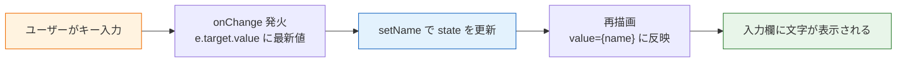

# フォームとリスト

ここまでで、コンポーネント・props・state・useEffectというReactの基礎部品が揃いました。このページでは、それらを使って実用アプリに必須の3つのUIパターンを身につけます。

1. **フォーム入力**：テキストボックスの値をstateで管理する（制御コンポーネント）
2. **リスト表示**：配列のデータを `map` で一覧表示し、`key` を正しく付ける
3. **条件付きレンダリング**：状況に応じて表示を出し分ける

入門編のTodoアプリで「入力欄から値を取り、一覧を描画し直す」処理を素のDOM操作で書いた経験が、ここでReact流に置き換わります。ページの最後には、3つを組み合わせたミニアプリを作ります。

## 学習目標

- 制御コンポーネントの仕組みを理解し、入力フォームをstateで管理できる
- 配列データを `map` でリスト表示し、適切な `key` を付けられる
- `key` に配列のインデックスを使うべきでない理由を説明できる
- 三項演算子と `&&` を使って表示を出し分けられる

## フォーム入力：制御コンポーネント

### 入門編のやり方を思い出す

入門編のTodoアプリでは、入力欄の値が必要になった時点でDOMから読み取っていました。

```typescript
const taskInput = document.getElementById("taskInput") as HTMLInputElement;
const text = taskInput.value.trim();  // 必要なときにDOMから取得
taskInput.value = "";                 // 追加後にDOMを直接書き換えてクリア
```

この方式では、「いまの入力値」という**データがDOMの中にあり**、TypeScript側はそれを覗きに行く立場でした。

### React流：値はstateに置き、inputは表示係にする

Reactでは逆転させます。**「いまの入力値」はstateとして自分が持ち、input要素はその値を表示するだけ**にします。この方式を**制御コンポーネント（controlled component）**と呼びます。input（部品）の値をReact側が制御している、という意味です。

**`src/components/NameForm.tsx`**（新規作成）

```tsx
import { useState } from "react";

function NameForm() {
  const [name, setName] = useState<string>("");

  return (
    <div>
      <input
        type="text"
        value={name}
        onChange={(e) => setName(e.target.value)}
        placeholder="名前を入力"
      />
      <p>こんにちは、{name === "" ? "名無し" : name}さん</p>
    </div>
  );
}

export default NameForm;
```

**コード解説**

- `value={name}` — inputの表示内容を**stateと一致させます**。inputは「stateを映すだけの存在」になります
- `onChange={(e) => setName(e.target.value)}` — 1文字入力されるたびに発生するイベントです。`e` はイベントオブジェクトで、`e.target.value` が「入力後の最新の値」です。それをそのままstateに反映します
- つまり「キー入力 → onChangeでstate更新 → 再描画でvalueに反映」というループが、1文字ごとに回っています
- `{name === "" ? ... : ...}` — 入力値がリアルタイムで下の段落に反映されます。データ（state）を変えれば使う場所すべてが追従する、というReactの利点がここでも効いています

この1文字ごとの循環を図にすると、次のようになります。



入力欄の表示すら「state → 画面」という単方向の流れに乗っている、と理解してください。だからこそ、`value` だけ書いて `onChange` を書かないと、「stateが変わらないので何を打っても表示が変わらない」入力欄になってしまいます。**`value` と `onChange` は必ずセット**と覚えてください。

### フォーム送信とpreventDefault

複数の入力をまとめて送る場合は `<form>` を使います。ここで入門編でも登場した `preventDefault` が再び必要になります。

```tsx
import { useState } from "react";

function CommentForm() {
  const [comment, setComment] = useState<string>("");

  const handleSubmit = (e: React.FormEvent) => {
    e.preventDefault();
    console.log(`送信された値: ${comment}`);
    setComment("");
  };

  return (
    <form onSubmit={handleSubmit}>
      <input
        type="text"
        value={comment}
        onChange={(e) => setComment(e.target.value)}
      />
      <button type="submit">送信</button>
    </form>
  );
}

export default CommentForm;
```

**コード解説**

- `onSubmit={handleSubmit}` — フォームの送信（ボタンクリックやEnterキー）で呼ばれます
- `e.preventDefault()` — ブラウザ標準のフォーム送信は「サーバーにデータを送ってページ全体を再読み込みする」動作です。SPAではページの再読み込みは不要（むしろstateが消えて困る）なので、この標準動作を止めます
- `e: React.FormEvent` — Reactが用意しているフォームイベントの型です
- `setComment("")` — 送信後に**stateを空にすれば、inputの表示も自動で空になります**。入門編のように `input.value = ""` とDOMを直接触る必要はありません

## リスト表示とkey

### mapで配列をJSXに変換する

[JSXとコンポーネント](/react/jsx_and_components/)で学んだとおり、JSXの `{ }` には式しか書けないため、`for` 文は使えません。代わりに、配列の `map` メソッドで「データの配列」を「JSX要素の配列」に変換します。

**`src/components/UserList.tsx`**（新規作成）

```tsx
type User = {
  id: number;
  name: string;
  age: number;
};

const users: User[] = [
  { id: 1, name: "山田太郎", age: 25 },
  { id: 2, name: "佐藤花子", age: 30 },
  { id: 3, name: "鈴木次郎", age: 28 },
];

function UserList() {
  return (
    <ul>
      {users.map((user) => (
        <li key={user.id}>
          {user.name}（{user.age}歳）
        </li>
      ))}
    </ul>
  );
}

export default UserList;
```

**コード解説**

- `type User = { ... }` — 一覧の1件分のデータ構造を型として定義します。[オブジェクトの型](/typescript/basic_types/)の復習です
- `users.map((user) => (...))` — 各 `user` を `<li>` 要素に変換しています。`map` の結果は「JSX要素の配列」で、JSXは配列をそのまま並べて描画してくれます
- `key={user.id}` — 各要素に付ける**識別子**です。次で詳しく説明します

入門編では `forEach` の中で `createElement` と `appendChild` を繰り返しましたが、Reactでは「配列をmapで変換した結果が一覧になる」と**宣言する**だけです。

### keyはなぜ必要か

`key` を省略すると、ブラウザのコンソールに次の警告が出ます。

```
Warning: Each child in a list should have a unique "key" prop.
```

`key` は、[仮想DOM](/react/what_is_react/)の差分検出でReactが「**どの要素がどれと同じか**」を見分けるための名札です。

たとえば一覧の**先頭**に1件追加された場面を考えます。`key` がないと、Reactは位置でしか比較できないため、「1番目も2番目も3番目も内容が変わった」と誤解し、全行を作り直してしまいます。`key` があれば、「id:1〜3はそのまま、id:4が新顔だ」と見抜き、**1行追加するだけ**で済みます。

`key` には、**そのデータを一意に特定できる、変わらない値**を使います。データベースのIDや、Todoアプリで自分が振った `task.id` が適切です。

### keyにインデックスを使ってはいけない

`map` の第2引数（インデックス）を `key` にするのは、動いているように見えて危険です。

```tsx
// 避けるべき書き方
{users.map((user, index) => (
  <li key={index}>{user.name}</li>
))}
```

なぜ危険か。インデックスは「**何番目か**」であって「**誰か**」ではないからです。先頭に1件追加されると、既存の全要素のインデックスが1つずつずれます。Reactは `key` が同じ要素を「同一人物」として扱うため、「key=0は前も今もいる」と誤認し、**中身だけ差し替える**処理をします。各行が入力欄やチェック状態などのstateを持っていた場合、**前の行の状態が別のデータの行に引き継がれる**というバグになります。

並び替え・挿入・削除が起きうる一覧では、必ずデータ固有のIDを `key` にしてください。

## 条件付きレンダリング

「ログイン中ならユーザー名、未ログインならログインボタンを表示」のような出し分けには、JSXに埋め込める**式**を使います。代表的な書き方は2つです。

### 三項演算子：AかBかの2択

```tsx
type GreetingProps = {
  isLoggedIn: boolean;
  userName: string;
};

function Greeting({ isLoggedIn, userName }: GreetingProps) {
  return (
    <header>
      {isLoggedIn ? (
        <p>ようこそ、{userName}さん</p>
      ) : (
        <button>ログイン</button>
      )}
    </header>
  );
}

export default Greeting;
```

**コード解説**

- `条件 ? Aの場合のJSX : Bの場合のJSX` — 三項演算子は「値を返す式」なのでJSXに埋め込めます。`if` 文の代わりとして使う、もっとも基本的な出し分けです

### &&演算子：表示するか、しないか

「条件を満たすときだけ表示し、満たさないときは何も出さない」場合は `&&` が簡潔です。

```tsx
type NoticeProps = {
  unreadCount: number;
};

function Notice({ unreadCount }: NoticeProps) {
  return (
    <div>
      <h2>通知</h2>
      {unreadCount > 0 && <p>未読が{unreadCount}件あります</p>}
    </div>
  );
}

export default Notice;
```

**コード解説**

- `条件 && JSX` — JavaScriptの `&&` は「左がtrueなら右の値を返し、falseなら左の値を返す」演算子です。条件がtrueのときだけJSXが描画され、falseのときは何も表示されません（Reactは `false` を描画しないため）
- 注意点：左辺には**boolean**を置いてください。`{unreadCount && <p>...</p>}` のように数値を直接置くと、`unreadCount` が `0` のとき「何も表示されない」ではなく**`0` という文字が表示**されてしまいます。`unreadCount > 0 &&` のように比較式にするのが安全です

### 早期リターン：表示の前提が崩れているとき

「データがまだない」「エラーが起きた」など、本体を表示できない状況では、コンポーネントの先頭で別のJSXをreturnしてしまう方法も使えます。

```tsx
function UserPanel({ user }: { user: User | null }) {
  if (user === null) {
    return <p>読み込み中...</p>;
  }

  return (
    <div>
      <h2>{user.name}</h2>
      <p>{user.age}歳</p>
    </div>
  );
}
```

**コード解説**

- JSXの中には `if` を書けませんが、**JSXの外（関数の本体）では普通に使えます**。前提が崩れている場合に先にreturnすることで、本体のJSXを条件分岐だらけにせずに済みます
- `user: User | null` — 「データがまだない」状態をユニオン型で表現しています。早期リターンの後では、TypeScriptが「`user` は `null` ではない」と判断してくれるため、`user.name` に安全にアクセスできます

このパターンは、[次のページ](/react/api_fetch/)のローディング・エラー表示でそのまま主役になります。

## 総合演習：買い物メモアプリ

3つのパターンを組み合わせて、「入力して追加し、一覧表示し、空のときはメッセージを出す」ミニアプリを作ります。

**`src/components/ShoppingMemo.tsx`**（新規作成）

```tsx
import { useState } from "react";

type Item = {
  id: number;
  name: string;
};

function ShoppingMemo() {
  const [items, setItems] = useState<Item[]>([]);
  const [input, setInput] = useState<string>("");
  const [nextId, setNextId] = useState<number>(1);

  const handleSubmit = (e: React.FormEvent) => {
    e.preventDefault();
    if (input.trim() === "") {
      return;
    }
    setItems([...items, { id: nextId, name: input.trim() }]);
    setNextId(nextId + 1);
    setInput("");
  };

  const handleDelete = (id: number) => {
    setItems(items.filter((item) => item.id !== id));
  };

  return (
    <div>
      <h2>買い物メモ</h2>
      <form onSubmit={handleSubmit}>
        <input
          type="text"
          value={input}
          onChange={(e) => setInput(e.target.value)}
          placeholder="買うものを入力"
        />
        <button type="submit">追加</button>
      </form>

      {items.length === 0 ? (
        <p>メモはまだありません</p>
      ) : (
        <ul>
          {items.map((item) => (
            <li key={item.id}>
              {item.name}
              <button onClick={() => handleDelete(item.id)}>削除</button>
            </li>
          ))}
        </ul>
      )}
    </div>
  );
}

export default ShoppingMemo;
```

**コード解説**

- state設計 — 「メモ一覧（`items`）」「入力中の文字（`input`）」「次に振るID（`nextId`）」の3つです。**画面で変わるものをすべてstateとして洗い出す**のがReactの設計の出発点です
- `handleSubmit` — 空入力ガード（`trim()` して空なら何もしない）の後、**スプレッド構文で新しい配列を作って**追加します。[propsとstate](/react/props_and_state/)で学んだ「配列のstateは新しく作って渡す」の実践です
- `handleDelete` — `filter` で「削除対象以外」からなる新しい配列を作ります。入門編Todoアプリの `tasks.filter(...)` と同じ発想ですが、再描画の呼び出しが不要です
- 一覧部分 — `items.length === 0` の三項演算子で空メッセージと一覧を出し分け、`map` + `key={item.id}` で一覧を描画しています。このページの3パターンが1つの画面に揃いました

`App.tsx` から `<ShoppingMemo />` を表示し、追加・削除・空表示が動くことを確認してください。これが動けば、入門編Todoアプリの主要機能をReactで再現する準備は完了です。

## 理解度チェック

**Q1. 制御コンポーネントとは何ですか。「値の置き場所」が入門編のDOM操作とどう違うかに触れて説明してください。**

<details markdown="1">
<summary>解答を見る</summary>

制御コンポーネントとは、input等のフォーム部品の値を**Reactのstateで管理**し、`value={state}` と `onChange` で部品とstateを同期させる方式です。

入門編では「いまの入力値」は**DOM（input要素）の中**にあり、必要なときに `input.value` で読み取っていました。制御コンポーネントでは値の置き場所が**state**に移り、inputは「stateを表示し、変更をonChangeで報告する係」になります。値がstateにあるため、検証・整形・他の表示への反映がTypeScriptのコードだけで完結します。

</details>

**Q2. `value={text}` だけ書いて `onChange` を書き忘れると、入力欄はどうなりますか。理由も説明してください。**

<details markdown="1">
<summary>解答を見る</summary>

**何を打っても表示が変わらない（入力できないように見える）入力欄**になります。

inputの表示は `value`、つまりstateの値に固定されています。キーを打ってもstateを更新する手段（onChange）がないため、再描画されてもvalueは元のまま、表示も変わりません。制御コンポーネントでは `value` と `onChange` を必ずセットで書きます。

</details>

**Q3. リストの `key` は何のためにあり、どんな値を指定すべきですか。**

<details markdown="1">
<summary>解答を見る</summary>

`key` は、仮想DOMの差分検出でReactが「前回のどの要素と今回のどの要素が同一か」を見分けるための識別子です。これにより、一覧に挿入・削除・並び替えがあっても、変わっていない要素を再利用して最小限の更新で済ませられます。

指定すべきは、**そのデータを一意に特定できる、変わらない値**です。典型的にはデータのID（データベースの主キーや、自分で振った連番ID）です。

</details>

**Q4. `key={index}`（配列のインデックス）が引き起こすバグの具体例を説明してください。**

<details markdown="1">
<summary>解答を見る</summary>

インデックスは「何番目か」しか表さないため、**先頭への挿入や削除・並び替えで全要素のkeyがずれます**。Reactはkeyが同じ要素を「同一」とみなして中身だけ差し替えるため、各行がstate（チェック状態、入力途中の文字など）を持っていると、**前の行の状態が別のデータの行に引き継がれる**バグが起きます。例えば、1行目のチェックボックスをONにした後で先頭に新しい行が挿入されると、ONの状態が新しい行（key=0）に乗り移ってしまいます。

</details>

**Q5. 「未読件数 `unreadCount` が1以上のときだけバッジを表示したい」とき、`{unreadCount && <span>...</span>}` と書くと問題が起きます。何が起き、どう直しますか。**

<details markdown="1">
<summary>解答を見る</summary>

`unreadCount` が `0` のとき、`&&` は左辺の値 `0` を返します。Reactは `false` は描画しませんが、**数値の `0` は「0」という文字として描画**してしまうため、画面に余計な「0」が表示されます。

左辺を比較式にしてbooleanにします：`{unreadCount > 0 && <span>...</span>}`

</details>

## セルフレビュー

- [ ] `value` と `onChange` をセットにした制御コンポーネントを写経せずに書ける
- [ ] `e.preventDefault()` が必要な理由をSPAの仕組みから説明できる
- [ ] 配列データを `map` と `key` で一覧表示できる
- [ ] keyにインデックスを使ってはいけない理由を、具体的なバグの例で説明できる
- [ ] 三項演算子・`&&`・早期リターンの3つの出し分けを使い分けられる
- [ ] 買い物メモアプリを、見本を見ずに自力で再現できる

## 次のステップ

フォーム・リスト・条件付きレンダリングが揃い、ユーザーの操作で完結するアプリは一通り作れるようになりました。次のページ[fetchでAPI通信](/react/api_fetch/)では、いよいよ**サーバーからデータを取得して表示する**方法を学びます。[フック（useEffect）](/react/hooks/)の依存配列と、このページの早期リターン（ローディング・エラー表示）が、そのまま通信処理の道具になります。

また、このページの買い物メモは、[練習問題](/react/practice/)で取り組む「入門編Todoアプリの React化」の土台です。[SNS開発](/sns/)でも、投稿フォーム・タイムライン一覧・ログイン状態による出し分けとして、この3パターンを毎日のように使うことになります。
