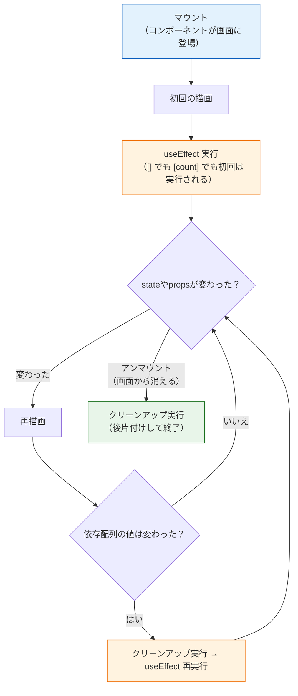

# フック（useEffect）

前のページで学んだ `useState` のように、「use」で始まるReactの機能を**フック（hook）**と呼びます。このページでは、useStateと並んで重要な**useEffect（ユーズエフェクト）**を学びます。

useEffectは、「描画とは直接関係ない仕事」——タイマーの開始、ブラウザのタイトル変更、そして後で学ぶサーバーとの通信——を、**適切なタイミングで実行する**ための仕組みです。動きを正しく理解しないとバグの温床になる部分なので、図と実験で丁寧に確認していきます。

## 学習目標

- 「副作用」とは何か、なぜ描画処理と分けるのかを説明できる
- useEffectと依存配列の3パターン（なし・空・値あり）の動作の違いを説明できる
- クリーンアップ関数の役割と実行タイミングを説明できる
- カスタムフックが「フックを使うロジックの部品化」であることを理解している

## 副作用とは何か

コンポーネントは「propsとstateを受け取り、JSXを返す関数」でした。この**計算して返す**のが本来の仕事（描画）です。

一方、アプリには描画以外の仕事もあります。

- 1秒ごとに時刻を更新するタイマーを動かす
- `document.title`（ブラウザのタブに出るタイトル）を書き換える
- サーバーと通信してデータを取得する（[次のページ](/react/api_fetch/)）

これらを**副作用（ふくさよう、side effect）**と呼びます。「JSXを返す」という主作用以外の、外の世界に影響を与える処理、という意味です。

### なぜ関数の中に直接書いてはいけないのか

「コンポーネントは関数なのだから、その中に書けばいいのでは」と思うかもしれません。しかし、前のページで確認したとおり、**コンポーネント関数はstateが変わるたびに再実行されます**。

```tsx
function Clock() {
  const [time, setTime] = useState<string>("");

  // してはいけない例：描画のたびにタイマーが増殖する
  setInterval(() => {
    setTime(new Date().toLocaleTimeString());
  }, 1000);

  return <p>{time}</p>;
}
```

この例では、描画→ `setInterval` 登録→1秒後に `setTime` →再描画→**さらに** `setInterval` 登録→…と、タイマーが無限に増えていきます。副作用は「**描画が終わった後に、必要なときだけ**」実行されるべきなのです。その置き場所がuseEffectです。

## useEffectの基本形

useEffectの構文は次のとおりです。

```tsx
useEffect(() => {
  // 副作用の処理（描画が終わった後に実行される）

  return () => {
    // クリーンアップ処理（後片付け。省略可）
  };
}, [依存配列]);
```

- **第1引数**：副作用を行う関数
- **第2引数**：**依存配列（いぞんはいれつ、dependency array）**。「この配列の中の値が変わったときだけ、副作用を再実行する」という指定

まず、もっとも基本的な例を動かしてみましょう。

**`src/components/TitleUpdater.tsx`**（新規作成）

```tsx
import { useState, useEffect } from "react";

function TitleUpdater() {
  const [count, setCount] = useState<number>(0);

  useEffect(() => {
    document.title = `カウント: ${count}`;
  }, [count]);

  return (
    <div>
      <p>カウント：{count}</p>
      <button onClick={() => setCount(count + 1)}>+1</button>
    </div>
  );
}

export default TitleUpdater;
```

**`src/App.tsx`** で `<TitleUpdater />` を表示して動かしてください。

**コード解説**

- `useEffect(() => { ... }, [count])` — 「`count` が変わったときに、この処理を実行する」という宣言です
- `document.title = ...` — 入門編で学んだDOM操作です。JSXの管轄外（ブラウザのタブ）を書き換えるので、副作用としてuseEffectに置きます
- ボタンを押すたびに、ブラウザのタブのタイトルが「カウント: 1」「カウント: 2」と変わることを確認してください

## 依存配列の3パターン

useEffectの動作は、依存配列の書き方で3通りに変わります。ここがこのページの核心です。

```tsx
// パターン1：依存配列なし —— 毎回の描画後に実行
useEffect(() => { ... });

// パターン2：空の配列 —— 最初の描画後に1回だけ実行
useEffect(() => { ... }, []);

// パターン3：値を入れる —— 最初の描画後 + その値が変わった描画後に実行
useEffect(() => { ... }, [count]);
```

| パターン | 実行タイミング | 主な用途 |
|---|---|---|
| 配列なし | すべての描画後 | ほぼ使わない（書き忘れに注意） |
| `[]`（空） | 最初の描画後に1回 | 初期データの取得、タイマー開始 |
| `[count]` | 初回 + `count` 変更時 | 特定の値に連動した処理 |

コンポーネントの一生（マウントから消滅まで）と、useEffectが動くタイミングを図で整理します。**マウント（mount）**とはコンポーネントが画面に最初に描画されること、**アンマウント（unmount）**とは画面から取り除かれることです。



ポイントを言葉でまとめます。

1. useEffectは**必ず描画の後**に実行される（描画を邪魔しない）
2. 2回目以降は、**依存配列の値が変わったときだけ**再実行される
3. 再実行の前と、アンマウント時には**クリーンアップ**（後述）が実行される

### 実験：実行タイミングを目で確かめる

`console.log` を仕込んで、上の図のとおりに動くか実験しましょう。

**`src/components/EffectLab.tsx`**（新規作成）

```tsx
import { useState, useEffect } from "react";

function EffectLab() {
  const [count, setCount] = useState<number>(0);
  const [text, setText] = useState<string>("");

  useEffect(() => {
    console.log("A: 毎回の描画後に実行");
  });

  useEffect(() => {
    console.log("B: 最初の1回だけ実行");
  }, []);

  useEffect(() => {
    console.log(`C: countが変わった（${count}）`);
  }, [count]);

  return (
    <div>
      <button onClick={() => setCount(count + 1)}>count: {count}</button>
      <input value={text} onChange={(e) => setText(e.target.value)} />
    </div>
  );
}

export default EffectLab;
```

ブラウザの開発者ツール（Console）を開いて操作してみてください。

- 画面を開いた直後：A・B・Cすべてが出力される（初回は全部実行）
- ボタンを押す：AとCが出力される（`count` が変わったため。Bは出ない）
- 入力欄に文字を打つ：Aだけが出力される（`text` の変化はCの依存配列に含まれないため）

なお、開発中は `React.StrictMode` の働きで初回のuseEffectが**2回ずつ**実行されます。これは「クリーンアップが正しく書けているか」をReactがチェックしてくれる開発時限定の動作で、不具合ではありません。本番ビルドでは1回になります。

### 依存配列の正直な書き方

依存配列には、**useEffectの中で使っている、変わりうる値（stateやprops）をすべて入れる**のが原則です。使っているのに入れ忘れると、「古い値を見続ける」バグになります。エディタ（ESLint）が `React Hook useEffect has a missing dependency` と警告してくれた場合は、原則どおり依存配列に追加してください。

## クリーンアップ：副作用の後片付け

useEffectの第1引数の関数から**関数をreturnすると、それが後片付け（クリーンアップ）として登録**されます。冒頭で失敗例として挙げた時計を、正しく作ってみましょう。

**`src/components/Clock.tsx`**（新規作成）

```tsx
import { useState, useEffect } from "react";

function Clock() {
  const [time, setTime] = useState<string>(
    new Date().toLocaleTimeString()
  );

  useEffect(() => {
    const timerId = setInterval(() => {
      setTime(new Date().toLocaleTimeString());
    }, 1000);

    return () => {
      clearInterval(timerId);
    };
  }, []);

  return <p>現在時刻：{time}</p>;
}

export default Clock;
```

**コード解説**

- 依存配列が `[]` なので、タイマーの登録は**マウント時に1回だけ**行われます。描画のたびに増殖する問題が解決されました
- `setInterval` は「1秒ごとに関数を実行する」ブラウザの機能で、停止用のIDを返します
- `return () => { clearInterval(timerId); }` — クリーンアップ関数です。コンポーネントが**アンマウントされるときにタイマーを停止**します
- クリーンアップを書かないと、コンポーネントが画面から消えた後もタイマーが動き続け、存在しないコンポーネントの `setTime` を呼ぼうとしてメモリの無駄（メモリリーク）が発生します

「**借りたものは返す**」と覚えてください。タイマーを登録したら解除する、イベントリスナーを追加したら削除する——useEffectで何かを「開始」したら、クリーンアップで「終了」するのが原則です。

### クリーンアップの実行タイミング

クリーンアップは2つのタイミングで実行されます（前掲の図も参照）。

1. **アンマウント時**（コンポーネントが画面から消えるとき）
2. **依存配列の値が変わって、useEffectが再実行される直前**（古い副作用を片付けてから、新しい副作用を始める）

2つ目は見落としがちですが、「`userId` が変わったら、前のユーザー用の処理を止めてから、新しいユーザー用の処理を始める」といった場面で重要になります。

## カスタムフックの入口

useStateとuseEffectを組み合わせたロジックは、しばしば複数のコンポーネントで重複します。たとえば「現在時刻を1秒ごとに更新する」処理を時計コンポーネントとヘッダーの両方で使いたい、という場合です。

そんなとき、**フックを使うロジックを関数として切り出した**ものを**カスタムフック（custom hook）**と呼びます。先ほどの時計のロジックを切り出してみましょう。

**`src/hooks/useCurrentTime.ts`**（新規作成。`src/hooks/` ディレクトリも作成）

```tsx
import { useState, useEffect } from "react";

export function useCurrentTime(): string {
  const [time, setTime] = useState<string>(
    new Date().toLocaleTimeString()
  );

  useEffect(() => {
    const timerId = setInterval(() => {
      setTime(new Date().toLocaleTimeString());
    }, 1000);

    return () => {
      clearInterval(timerId);
    };
  }, []);

  return time;
}
```

**`src/components/Clock.tsx`**（書き換え）

```tsx
import { useCurrentTime } from "../hooks/useCurrentTime";

function Clock() {
  const time = useCurrentTime();
  return <p>現在時刻：{time}</p>;
}

export default Clock;
```

**コード解説**

- `useCurrentTime` — 中身は先ほどのロジックの移動です。**名前を `use` で始める**のがカスタムフックの約束で、これによりReactとESLintがフックとして扱ってくれます
- JSXを返さないので拡張子は `.ts` で構いません。「見た目（コンポーネント）」と「ロジック（フック）」が分離されました
- 使う側は `const time = useCurrentTime();` の1行だけになり、同じロジックをどのコンポーネントからでも再利用できます

カスタムフックは「コンポーネント＝見た目の部品化」に対する「**ロジックの部品化**」です。今は仕組みの理解だけで十分ですが、[fetchでAPI通信](/react/api_fetch/)を学んだ後、「データ取得ロジックをカスタムフックにまとめる」のが定番の設計になります。

## フックの2つのルール

最後に、すべてのフック（useState・useEffect・カスタムフック）に共通するルールを押さえます。

1. **コンポーネント（またはカスタムフック）のトップレベルでだけ呼ぶ**。`if` 文やループの中で呼んではいけません
2. **Reactの関数の中でだけ呼ぶ**。普通の関数やイベントハンドラの中では呼べません

```tsx
// 間違い：条件分岐の中でフックを呼んでいる
if (isLoggedIn) {
  const [name, setName] = useState<string>("");
}

// 正しい：フックは必ずトップレベルで呼ぶ
const [name, setName] = useState<string>("");
```

理由は、Reactがフックを**呼ばれた順番**で管理しているためです。描画のたびに呼ばれる回数や順番が変わると、どのstateがどれなのか対応が崩れてしまいます。違反するとエディタと実行時の両方でエラーが出るので、「フックは関数の先頭にまとめて書く」と習慣づけてしまうのが安全です。

## 理解度チェック

**Q1. 「副作用」とは何ですか。例を2つ挙げ、なぜコンポーネント関数の本体に直接書いてはいけないのかを説明してください。**

<details markdown="1">
<summary>解答を見る</summary>

副作用とは、コンポーネントの本来の仕事である「JSXを返す（描画する）」以外の、外の世界に影響を与える処理です。例：タイマーの開始（`setInterval`）、`document.title` の変更、サーバーとの通信（fetch）など。

コンポーネント関数はstateやpropsが変わるたびに再実行されるため、本体に直接書くと**描画のたびに副作用が繰り返し実行**されてしまいます（タイマーの増殖など）。useEffectに置くことで、「描画後に」「依存配列の値が変わったときだけ」という適切なタイミングに制御できます。

</details>

**Q2. 依存配列が「なし」「`[]`」「`[count]`」の3パターンについて、それぞれuseEffectがいつ実行されるか答えてください。**

<details markdown="1">
<summary>解答を見る</summary>

- **なし**：初回を含む、**すべての描画後**に毎回実行される
- **`[]`（空配列）**：**最初の描画後に1回だけ**実行される（開発中はStrictModeにより2回実行されるが、本番では1回）
- **`[count]`**：最初の描画後と、**`count` の値が変わった描画後**に実行される

</details>

**Q3. 次のコードにはバグがあります。何が起き、どう直すべきですか。**

```tsx
useEffect(() => {
  const timerId = setInterval(() => {
    console.log("tick");
  }, 1000);
}, []);
```

<details markdown="1">
<summary>解答を見る</summary>

クリーンアップ関数がないため、このコンポーネントがアンマウント（画面から削除）された後も**タイマーが動き続けます**。メモリリークや、消えたコンポーネントへの不要な処理の原因になります。

クリーンアップ関数を返して、タイマーを解除します。

```tsx
useEffect(() => {
  const timerId = setInterval(() => {
    console.log("tick");
  }, 1000);

  return () => clearInterval(timerId);
}, []);
```

</details>

**Q4. クリーンアップ関数が実行される2つのタイミングを答えてください。**

<details markdown="1">
<summary>解答を見る</summary>

1. **コンポーネントがアンマウントされるとき**（画面から取り除かれるとき）
2. **依存配列の値が変わってuseEffectが再実行される直前**（古い副作用を片付けてから新しい副作用を開始するため）

</details>

**Q5. カスタムフックとは何ですか。コンポーネントとの役割の違いに触れて説明してください。**

<details markdown="1">
<summary>解答を見る</summary>

カスタムフックは、useStateやuseEffectなどのフックを使う**ロジックを、`use` で始まる名前の関数として切り出して再利用可能にしたもの**です。

コンポーネントが「JSXを返す＝**見た目**の部品化」であるのに対し、カスタムフックは「stateと副作用の管理＝**ロジック**の部品化」を担います。JSXは返さず、値（stateなど）を返します。同じデータ管理ロジックを複数のコンポーネントで共有したいときに使います。

</details>

**Q6. フックを `if` 文の中で呼んではいけないのはなぜですか。**

<details markdown="1">
<summary>解答を見る</summary>

Reactは、コンポーネント内でフックが**呼ばれた順番**によって、それぞれのフックと内部のstateを対応づけています。`if` 文の中で呼ぶと、描画のたびに呼ばれる回数や順番が変わる可能性があり、「1番目のuseStateはこの値」という対応が崩れて、別のstateを取り違える深刻なバグになります。そのため「フックは必ずトップレベルで、毎回同じ順番で呼ばれる」ことがルールとして強制されています。

</details>

## セルフレビュー

- [ ] 「副作用」を自分の言葉で定義し、例を3つ挙げられる
- [ ] 依存配列の3パターンの実行タイミングを、図を描いて説明できる
- [ ] `console.log` を使った実験で、useEffectの実行タイミングを自分で確認した
- [ ] setIntervalを使う時計コンポーネントを、クリーンアップ込みで写経せずに書ける
- [ ] クリーンアップが実行される2つのタイミングを説明できる
- [ ] カスタムフックの命名規則（useで始める）と目的を説明できる
- [ ] フックの2つのルールを説明できる

## 次のステップ

useEffectにより、「描画後の適切なタイミングで副作用を実行する」手段を手に入れました。次のページ[フォームとリスト](/react/forms_and_lists/)では、いったんユーザー操作に戻り、フォーム入力・一覧表示・条件付きレンダリングという、実用アプリに必須のUIパターンを学びます。

そしてuseEffectの最大の使いどころは、その次の[fetchでAPI通信](/react/api_fetch/)です。「マウント時に1回だけサーバーからデータを取得する」処理は、まさに依存配列 `[]` のuseEffectの出番です。ここで学んだタイミングの理解が、そのまま通信処理の理解につながります。
