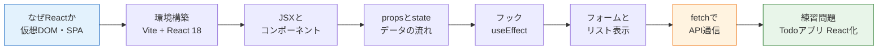

# React基礎

このセクションでは、フロントエンド開発の中心的なライブラリである**React（リアクト）**を学びます。

入門編の[最終問題](/final_project/)では、`document.getElementById` や `createElement` を使って、自分の手でHTMLの要素を作り、画面を組み立てました。あの方法でもアプリは作れますが、画面が複雑になるほど「どの関数がどの要素を書き換えるのか」を追いかけるのが難しくなっていきます。

Reactは、この問題を「**画面はデータから自動的に作られるもの**」という考え方で解決します。私たちはデータ（状態）の管理に集中し、画面の更新はReactに任せる——この役割分担を身につけることが、このセクションのゴールです。

## このセクションで学ぶこと

| ページ | 内容 |
|---|---|
| [Reactとは何か](/react/what_is_react/) | 素のDOM操作との比較、SPA、仮想DOMの仕組み |
| [開発環境の構築](/react/setup/) | Vite 5でReact + TypeScriptプロジェクトを作成する |
| [JSXとコンポーネント](/react/jsx_and_components/) | ReactのUI記述言語JSXと、部品化の考え方 |
| [propsとstate](/react/props_and_state/) | コンポーネント間のデータの受け渡しと、画面の状態管理 |
| [フック（useEffect）](/react/hooks/) | レンダリングの外側で起きる処理を扱う仕組み |
| [フォームとリスト](/react/forms_and_lists/) | 入力フォーム、一覧表示とkey、条件付きレンダリング |
| [fetchでAPI通信](/react/api_fetch/) | サーバーからデータを取得し、ローディングとエラーを扱う |
| [練習問題](/react/practice/) | 入門編のTodoアプリをReactで作り直す |

## 前提知識

このセクションは、以下を修了していることを前提としています。

- [フロントエンド基礎](/frontend//)：HTML/CSS、JavaScriptの基本、[DOM操作](/frontend/javascript_basics/)
- [TypeScript基礎](/typescript//)：[基本型](/typescript/basic_types/)、[関数の型](/typescript/functions/)
- [入門編最終問題](/final_project/)：素のDOM操作によるアプリ開発の経験

Reactのコードは、すべて**TypeScript**で書きます。ファイルの拡張子は `.tsx` という見慣れないものになりますが、中身はこれまで学んだTypeScriptそのものです。型の知識がそのまま武器になりますので、不安があれば[TypeScript基礎](/typescript//)を復習してから進んでください。

## 使用するバージョン

このセクションでは、以下のバージョンを使用します。

| ツール | バージョン |
|---|---|
| Node.js | 20系 |
| React | 18系 |
| Vite | 5系 |
| TypeScript | 5系 |

## このセクションの位置づけ

Reactは、この後のカリキュラム全体で使い続ける技術です。

- [バックエンド基礎（NestJS）](/backend//)で自作するAPIに、Reactの画面から接続します
- [AIチャット開発（RAG）](/ai-chat//)では、Reactでチャット画面を作ります
- 最終プロジェクトの[SNS開発](/sns//)では、すべての画面をReactで構築します

つまり、ここで学ぶ内容は「半年後に自分でSNSを作る」ための土台です。一つひとつのページを、手を動かしながら確実に進めていきましょう。

最初のページ、[Reactとは何か](/react/what_is_react/)から始めてください。
