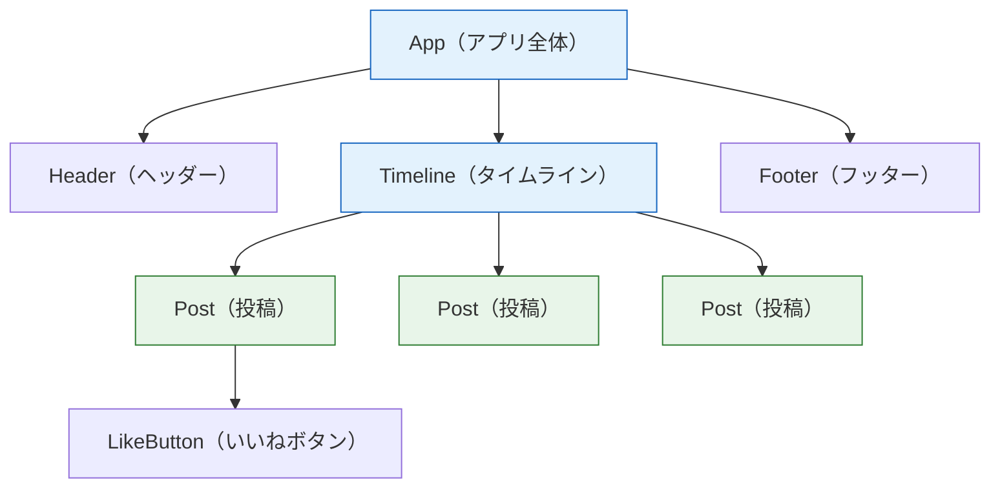

# JSXとコンポーネント

前のページで作成したプロジェクトの `App.tsx` には、TypeScriptのファイルなのにHTMLのようなタグが書かれていました。この記法を**JSX（ジェイエスエックス）**と呼びます。このページでは、JSXの文法ルールを学んだうえで、Reactの最重要概念である**コンポーネント**——画面を再利用可能な部品に分ける考え方——を身につけます。

このページから、実際に手を動かす量が増えます。[開発環境の構築](/react/setup/)で作った `my-react-app` で開発サーバー（`pnpm run dev`）を起動した状態で読み進めてください。

## 学習目標

- JSXの基本ルール（単一ルート要素、className、式の埋め込み）を理解して書ける
- 関数コンポーネントを定義し、別のファイルから読み込んで使える
- 「画面を部品に分ける」というコンポーネント指向の考え方を説明できる
- JSXが最終的にJavaScriptへ変換されることを理解している

## JSXとは何か

JSXは、**JavaScript（TypeScript）のコードの中に、HTMLに似た記法でUIの構造を書ける**ようにする拡張記法です。TypeScriptでJSXを使うファイルには、拡張子 `.tsx` を使います。

まず最小の例を見てみましょう。`src/App.tsx` を次の内容にまるごと書き換えてください。

**`src/App.tsx`**

```tsx
function App() {
  return <h1>こんにちは、React</h1>;
}

export default App;
```

**コード解説**

- `function App() { ... }` — ただのTypeScriptの関数です。特別な構文ではありません
- `return <h1>...</h1>;` — 関数の戻り値として、JSXで書いた画面の構造を返しています
- `export default App;` — `main.tsx` がこの関数を `import` して描画します（[開発環境の構築](/react/setup/)で確認した流れです）

保存するとブラウザに「こんにちは、React」と表示されます。なお、テンプレートのスタイルが残っていると見た目が崩れることがあるので、`src/index.css` と `src/App.css` の中身はすべて削除しておきましょう（ファイル自体は残して構いません）。

### JSXは「HTMLに見えるJavaScript」

重要なのは、JSXは**HTMLではない**ということです。ビルド時にViteがJSXをJavaScriptの関数呼び出しに変換します。

```tsx
// 私たちが書くJSX
const element = <h1 className="title">こんにちは</h1>;

// 変換後のイメージ（実際にこう書く必要はありません）
const element = _jsx("h1", { className: "title", children: "こんにちは" });
```

「JSXはJavaScriptの値（オブジェクト）になる」——この事実から、JSX特有のルールがいくつか生まれます。順に見ていきましょう。

## JSXの基本ルール

### ルール1：返す要素は1つのルートにまとめる

関数の戻り値は1つの値でなければならないので、JSXも**1つのルート要素**で囲む必要があります。

```tsx
// エラーになる：2つの要素を並べて返している
function App() {
  return (
    <h1>タイトル</h1>
    <p>本文</p>
  );
}
```

```tsx
// 正しい：1つのdivで囲む
function App() {
  return (
    <div>
      <h1>タイトル</h1>
      <p>本文</p>
    </div>
  );
}
```

囲むためだけの `div` を増やしたくない場合は、**フラグメント**という空のタグ `<>...</>` が使えます。

```tsx
// 正しい：フラグメントで囲む（余計なdivがDOMに増えない）
function App() {
  return (
    <>
      <h1>タイトル</h1>
      <p>本文</p>
    </>
  );
}
```

### ルール2：タグは必ず閉じる

HTMLでは `<br>` や `` のように閉じタグを省略できる要素がありますが、JSXでは**すべてのタグを閉じる**必要があります。中身のない要素は `/>` で閉じます（自己終了タグ）。

```tsx
// エラーになる

<br>

// 正しい

<br />
```

### ルール3：class ではなく className

JSXはJavaScriptに変換されるため、JavaScriptの**予約語**（言語が特別な意味で使っている単語）と衝突する属性名は使えません。代表が `class` です。

```tsx
// エラーになる：classはJavaScriptの予約語
<h1 class="title">タイトル</h1>

// 正しい：classNameを使う
<h1 className="title">タイトル</h1>
```

同様に、`<label>` の `for` 属性は `htmlFor` と書きます。また、`onclick` のようなイベント属性は `onClick` のように**キャメルケース**（単語の区切りを大文字にする記法）になります。

| HTML | JSX |
|---|---|
| `class="..."` | `className="..."` |
| `for="..."` | `htmlFor="..."` |
| `onclick="..."` | `onClick={...}` |
| `style="color: red"` | `style={{ color: "red" }}` |

### ルール4：{ } でTypeScriptの式を埋め込める

JSX最大の強みがこれです。`{ }` の中には、TypeScriptの**式**（値になるもの）を何でも書けます。

```tsx
function App() {
  const name: string = "太郎";
  const price: number = 1980;

  return (
    <div>
      <h1>こんにちは、{name}さん</h1>
      <p>価格は{price}円（税込{price * 1.1}円）です</p>
      <p>大文字にすると {name.toUpperCase()}</p>
    </div>
  );
}

export default App;
```

**コード解説**

- `{name}` — 変数の値がそのまま表示されます。テンプレート文字列の `${name}` に似ていますが、JSX内では `$` は不要です
- `{price * 1.1}` — 計算式も書けます。「値になるもの」なら何でも入ります
- `{name.toUpperCase()}` — 関数（メソッド）の呼び出し結果も埋め込めます

一方、`if` 文や `for` 文は「式」ではなく「文」なので、`{ }` の中には書けません。条件によって表示を変える方法は[フォームとリスト](/react/forms_and_lists/)で学びます。

属性にも `{ }` が使えます。

```tsx
const imageUrl: string = "/logo.png";
const element = ;
```

文字列を固定で渡すときは `src="/logo.png"` のように引用符、変数や式を渡すときは `src={imageUrl}` のように波括弧、と使い分けます。

## コンポーネント：画面を部品に分ける

ここまでに書いた `App` のような、「**JSXを返す関数**」を**コンポーネント（component：部品）**と呼びます。正確には**関数コンポーネント**といいます。

Reactアプリは、コンポーネントの組み合わせで作ります。たとえばSNSの画面は、次のような部品の階層に分解できます。



部品に分けると、次の利点があります。

- **再利用できる**：`Post` コンポーネントを1回作れば、投稿が100件あっても同じ部品を100回使うだけです
- **見通しが良くなる**：1つの巨大なファイルではなく、「投稿のことは `Post.tsx` を見ればよい」と整理されます
- **分担しやすい**：チーム開発で「あなたはヘッダー、私はタイムライン」と作業を分けられます

入門編のTodoアプリでは、すべての処理が1つのファイルに書かれていました。アプリが小さいうちは問題ありませんが、SNS規模になると部品化は必須です。

### コンポーネントを作る

実際に部品を作ってみましょう。コンポーネントには2つの約束があります。

1. **関数名は大文字で始める**（例：`Header`）。小文字だとReactはHTMLタグ（`<header>` など）と区別できません
2. **JSXを返す**

まず、同じファイル内に作る例です。

**`src/App.tsx`**

```tsx
function Header() {
  return (
    <header>
      <h1>マイアプリ</h1>
    </header>
  );
}

function App() {
  return (
    <div>
      <Header />
      <p>ここが本文です</p>
    </div>
  );
}

export default App;
```

**コード解説**

- `function Header() { ... }` — `Header` という名前のコンポーネントを定義しています。`App` と同じ「JSXを返す関数」です
- `<Header />` — 定義したコンポーネントは、**自作のタグ**としてJSX内で使えます。自己終了タグ（`/>`）で書くのが基本です
- Reactは `<Header />` を見つけると `Header` 関数を呼び出し、その戻り値のJSXをその場所に展開します

### コンポーネントをファイルに分ける

実際の開発では、コンポーネントごとにファイルを分けます。`src/components/` というディレクトリを作り、その中に置くのが一般的な整理方法です。

**`src/components/Header.tsx`**（新規作成）

```tsx
function Header() {
  return (
    <header>
      <h1>マイアプリ</h1>
      <p>Reactで作る最初のアプリ</p>
    </header>
  );
}

export default Header;
```

**`src/App.tsx`**（書き換え）

```tsx
import Header from "./components/Header";

function App() {
  return (
    <div>
      <Header />
      <p>ここが本文です</p>
    </div>
  );
}

export default App;
```

**コード解説**

- `export default Header;` — `Header` 関数をこのファイルの「代表」として公開します
- `import Header from "./components/Header";` — 相対パスでファイルを指定して読み込みます。拡張子 `.tsx` は省略できます
- これは `main.tsx` が `App` を読み込んでいたのと同じ仕組みです。**アプリ全体が「import でつながったコンポーネントの木」**になっていることがわかります

### 練習：3つの部品でページを組み立てる

理解を確かめるために、`Header`・`Profile`・`Footer` の3部品でページを組み立ててみましょう。

**`src/components/Profile.tsx`**（新規作成）

```tsx
function Profile() {
  const name: string = "山田太郎";
  const age: number = 25;
  const hobbies: string = "読書、プログラミング";

  return (
    <section>
      <h2>プロフィール</h2>
      <p>名前：{name}</p>
      <p>年齢：{age}歳</p>
      <p>趣味：{hobbies}</p>
    </section>
  );
}

export default Profile;
```

**`src/components/Footer.tsx`**（新規作成）

```tsx
function Footer() {
  const year: number = new Date().getFullYear();

  return (
    <footer>
      <p>© {year} マイアプリ</p>
    </footer>
  );
}

export default Footer;
```

**`src/App.tsx`**（書き換え）

```tsx
import Header from "./components/Header";
import Profile from "./components/Profile";
import Footer from "./components/Footer";

function App() {
  return (
    <div>
      <Header />
      <Profile />
      <Footer />
    </div>
  );
}

export default App;
```

**コード解説**

- `Profile` — 変数の値を `{ }` で埋め込んでいます。今は値を直接書いていますが、次のページで「外から値を渡す」方法（props）に進化させます
- `Footer` の `{year}` — `new Date().getFullYear()` で現在の年を取得しています。JSXに式を埋め込めるので、「常に今年の年号が出るフッター」が1行で書けます
- `App` — 3つの部品を並べるだけの、シンプルな「組み立て役」になりました

保存してブラウザを確認してください。3つの部品が縦に並んだページが表示されれば成功です。`App.tsx` を読むだけでページの全体構成がわかる——これがコンポーネント指向の見通しの良さです。

## コメントの書き方

JSXの中でコメントを書くには、`{ }` の中にJavaScriptのコメントを入れます。

```tsx
function App() {
  return (
    <div>
      {/* これがJSX内のコメントです */}
      <h1>タイトル</h1>
    </div>
  );
}
```

HTMLのコメント `<!-- -->` はJSXでは使えないので注意してください。

## 理解度チェック

**Q1. 次のコンポーネントはエラーになります。理由と修正方法を2つ答えてください。**

```tsx
function App() {
  return (
    <h1 class="title">タイトル</h1>
    <p>本文</p>
  );
}
```

<details markdown="1">
<summary>解答を見る</summary>

エラーの理由は2つあります。

1. **ルート要素が2つある**：JSXは1つのルート要素で囲む必要があります。`<div>` またはフラグメント `<>...</>` で全体を囲みます
2. **`class` 属性を使っている**：`class` はJavaScriptの予約語のため、JSXでは `className` と書きます

修正例：

```tsx
function App() {
  return (
    <>
      <h1 className="title">タイトル</h1>
      <p>本文</p>
    </>
  );
}
```

</details>

**Q2. JSXの `{ }` の中に書けるのは「式」だけで、「文」は書けません。次のうち `{ }` に書けるものをすべて選んでください。**

1. `name.toUpperCase()`
2. `if (age >= 18) { ... }`
3. `price * 1.1`
4. `for (let i = 0; i < 5; i++) { ... }`

<details markdown="1">
<summary>解答を見る</summary>

書けるのは **1 と 3** です。

- 1の関数呼び出しと3の計算式は、評価すると「値」になる**式**なので埋め込めます
- 2の `if` 文と4の `for` 文は、値にならない**文**なので埋め込めません

条件分岐や繰り返しをJSXで表現する方法（三項演算子、`&&`、`map`）は[フォームとリスト](/react/forms_and_lists/)で学びます。

</details>

**Q3. コンポーネントの関数名を小文字（例：`header`）で始めてはいけないのはなぜですか。**

<details markdown="1">
<summary>解答を見る</summary>

JSXでは、**小文字で始まるタグはHTMLの組み込み要素**（`<header>`、`<div>` など）、**大文字で始まるタグは自作のコンポーネント**として解釈されるルールだからです。`function header()` と定義して `<header />` と書いても、ReactはHTMLの `<header>` 要素を作るだけで、自作の関数は呼び出されません。

</details>

**Q4. 画面をコンポーネントに分割することの利点を3つ挙げてください。**

<details markdown="1">
<summary>解答を見る</summary>

1. **再利用できる**：同じ見た目・機能の部品を、1度定義すれば何度でも使えます（例：SNSの投稿100件に同じ `Post` を使う）
2. **見通しが良くなる**：機能ごとにファイルが分かれるため、「どこを直せばよいか」がすぐにわかります
3. **分担しやすい**：部品単位で作業を分けられるため、チーム開発がしやすくなります

</details>

**Q5. `import Header from "./components/Header";` という行が成立するためには、`Header.tsx` の側に何が書かれている必要がありますか。**

<details markdown="1">
<summary>解答を見る</summary>

`export default Header;` が必要です。`export default` はそのファイルの「代表」として値（ここでは `Header` 関数）を公開する構文で、`import 名前 from "パス"` はその代表を受け取る構文です。`export default` がないファイルを `import Header from ...` の形で読み込むことはできません。

</details>

## セルフレビュー

- [ ] JSXの4つの基本ルール（単一ルート、閉じタグ、className、式の埋め込み）を写経せずに守って書ける
- [ ] JSXがHTMLではなく、JavaScriptに変換される記法であることを説明できる
- [ ] フラグメント `<>...</>` を使う理由と場面を説明できる
- [ ] 関数コンポーネントを新しいファイルに定義し、`export default` / `import` でつないで使える
- [ ] 「画面をコンポーネントの木として捉える」考え方を、図を描いて説明できる
- [ ] `{ }` に書けるもの（式）と書けないもの（文）を区別できる

## 次のステップ

JSXで画面を書き、コンポーネントとして部品化できるようになりました。しかし、今の `Profile` コンポーネントは名前や年齢が中に固定されており、「別の人のプロフィール」を表示するには使い回せません。

次のページ[propsとstate](/react/props_and_state/)では、コンポーネントに**外から値を渡す仕組み（props）**と、**コンポーネント自身が値を持って画面を更新する仕組み（state）**を学びます。[Reactとは何か](/react/what_is_react/)で予告した「データが変わると画面が変わる」体験は、次のページで実現します。ここで作った `components/` ディレクトリの構成は、[SNS開発](/sns/)まで一貫して使う整理方法です。
