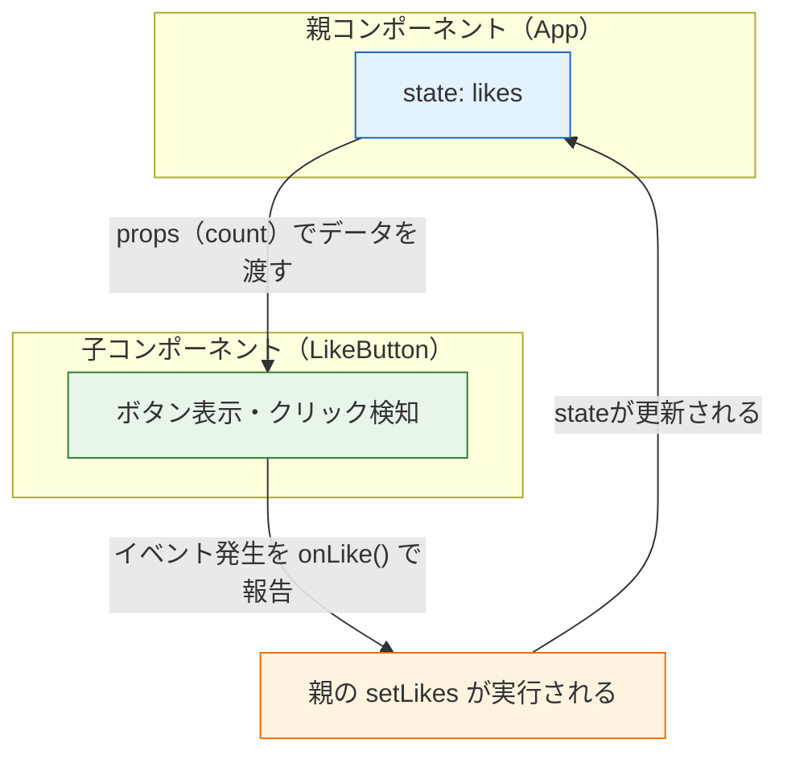

# propsとstate

前のページで作った `Profile` コンポーネントには、名前や年齢が直接書き込まれていました。これでは「山田太郎専用の部品」であり、再利用できません。このページでは、コンポーネントを本当の意味で「部品」にするための2つの仕組みを学びます。

- **props（プロップス）**：親コンポーネントから子コンポーネントへ値を渡す仕組み
- **state（ステート）**：コンポーネント自身が値を保持し、その変化で画面を更新する仕組み

[Reactとは何か](/react/what_is_react/)で学んだ「データが変わると画面が自動で変わる」を、ここでついに体験します。Reactの心臓部にあたるページです。

## 学習目標

- propsを使って親から子へ値を渡し、型を付けて受け取れる
- useStateを使って画面の状態を管理し、ボタン操作で画面を更新できる
- 「stateを直接書き換えてはいけない」理由を説明できる
- 単方向データフローの考え方を図を使って説明できる

## props：親から子へ値を渡す

**props**（プロップス、properties：属性の略）は、コンポーネントを使う側（親）が、コンポーネント（子）に値を渡す仕組みです。HTMLの属性とよく似た書き方をします。

前のページの `Profile` を、propsを受け取る形に書き換えてみましょう。

**`src/components/Profile.tsx`**

```tsx
type ProfileProps = {
  name: string;
  age: number;
};

function Profile(props: ProfileProps) {
  return (
    <section>
      <h2>プロフィール</h2>
      <p>名前：{props.name}</p>
      <p>年齢：{props.age}歳</p>
    </section>
  );
}

export default Profile;
```

**`src/App.tsx`**

```tsx
import Profile from "./components/Profile";

function App() {
  return (
    <div>
      <Profile name="山田太郎" age={25} />
      <Profile name="佐藤花子" age={30} />
    </div>
  );
}

export default App;
```

**コード解説**

- `type ProfileProps = { ... }` — propsの型を[型エイリアス](/typescript/basic_types/)で定義しています。「この部品には `name`（文字列）と `age`（数値）を渡す決まり」という**部品の仕様書**になります
- `function Profile(props: ProfileProps)` — propsは関数の**引数**として渡ってきます。コンポーネントは関数なので、[関数の型](/typescript/functions/)で学んだ引数の型注釈がそのまま使えます
- `{props.name}` — 受け取った値をJSXに埋め込みます
- `<Profile name="山田太郎" age={25} />` — 親側では属性の形で値を渡します。文字列は `"..."`、数値などの式は `{...}` で渡します
- 同じ `Profile` を2回使い、**異なる値を渡して異なる表示**を得ています。これが「再利用できる部品」です

ブラウザには、山田太郎さんと佐藤花子さんの2つのプロフィールが表示されます。

### TypeScriptが部品の使い方ミスを防ぐ

propsに型を付ける価値を確認しましょう。`App.tsx` でわざと間違えてみます。

```tsx
<Profile name="山田太郎" />            // エラー！ ageが渡されていない
<Profile name="山田太郎" age="25" />   // エラー！ ageはnumber型のはず
```

保存した瞬間、エディタが赤線でエラーを教えてくれます。素のJavaScriptなら実行するまで気づけない「渡し忘れ」「型違い」を、書いた時点で検出できる——これがReactをTypeScriptで書く大きな理由です。

### 分割代入で受け取る書き方

実務では、propsを**分割代入**（オブジェクトから値を取り出して変数にする構文）で受け取る書き方が主流です。

```tsx
function Profile({ name, age }: ProfileProps) {
  return (
    <section>
      <h2>プロフィール</h2>
      <p>名前：{name}</p>
      <p>年齢：{age}歳</p>
    </section>
  );
}
```

**コード解説**

- `{ name, age }` — 引数の位置でpropsオブジェクトを分解し、`name` と `age` という変数として直接受け取っています
- 本文で `props.` を毎回書かなくてよくなり、すっきりします。このカリキュラムでも以降はこの書き方を使います

### propsは読み取り専用

1つ、絶対のルールがあります。**子コンポーネントは受け取ったpropsを変更してはいけません。**

```tsx
function Profile({ name, age }: ProfileProps) {
  age = age + 1;  // してはいけない（そもそも値を変えても画面は変わらない）
  ...
}
```

propsは「親からの預かりもの」です。値を変えたい場合は、後述するstateを使うか、親側のデータを変えてもらいます。この「データは親から子へ一方向に流れ、子は勝手に変えない」という規律が、後で説明する**単方向データフロー**の土台になります。

## state：コンポーネントが持つ「変わる値」

propsは便利ですが、渡された値を表示するだけでは、アプリは「動き」ません。ボタンを押したら数が増える、入力したら一覧が増える——そうした**時間とともに変わる値**を扱うのが**state（ステート：状態）**です。

カウンターを作りながら学びましょう。

**`src/components/Counter.tsx`**（新規作成）

```tsx
import { useState } from "react";

function Counter() {
  const [count, setCount] = useState<number>(0);

  return (
    <div>
      <p>現在のカウント：{count}</p>
      <button onClick={() => setCount(count + 1)}>+1</button>
      <button onClick={() => setCount(0)}>リセット</button>
    </div>
  );
}

export default Counter;
```

**`src/App.tsx`**

```tsx
import Counter from "./components/Counter";

function App() {
  return (
    <div>
      <h1>カウンターアプリ</h1>
      <Counter />
    </div>
  );
}

export default App;
```

**コード解説**

- `import { useState } from "react";` — Reactが提供する `useState` 関数を読み込みます。`useState` のように「use」で始まるReactの機能を**フック（hook）**と呼びます（詳しくは[次のページ](/react/hooks/)で）
- `const [count, setCount] = useState<number>(0);` — このページの最重要行です。分解すると：
  - `useState<number>(0)` — 「number型のstateを、初期値0で作る」という宣言です
  - 戻り値は「現在の値」と「値を更新する関数」のペア（配列）で、それを分割代入で `count` と `setCount` に受け取ります
  - 命名は「`値` と `set値`」のペアにするのが慣習です
- `onClick={() => setCount(count + 1)}` — ボタンがクリックされたら `setCount` を呼び、「新しい値は `count + 1` です」とReactに伝えます
- `setCount` が呼ばれると、Reactは `Counter` 関数を**もう一度実行**し、新しい `count` でJSXを作り直し、[仮想DOM](/react/what_is_react/)の差分だけを画面に反映します

ブラウザで「+1」を押すたびに数字が増えれば成功です。**`renderTasks()` のような再描画関数をどこにも書いていない**ことを確認してください。入門編で手作業だった「データを変えたら画面を更新する」が、自動化されています。

### onClickに渡しているものに注意

初学者がつまずきやすいポイントです。`onClick` には「クリックされたときに呼ぶ**関数**」を渡します。

```tsx
// 正しい：アロー関数を渡す（クリック時に実行される）
<button onClick={() => setCount(count + 1)}>+1</button>

// 間違い：関数の実行結果を渡してしまっている
<button onClick={setCount(count + 1)}>+1</button>
```

間違いの例では、描画の時点で `setCount(count + 1)` が**即座に実行**されてしまい、「描画→state更新→再描画→state更新→…」の無限ループでエラーになります。「`onClick={}` の中身は、あとで呼ばれる関数」と覚えてください。

### stateを直接書き換えてはいけない

もう1つの最重要ルールです。**stateの値は必ずset関数で更新します。**

```tsx
// 間違い：直接書き換えても画面は更新されない
count = count + 1;

// 正しい
setCount(count + 1);
```

なぜでしょうか。Reactが画面を更新するきっかけは「**set関数が呼ばれたこと**」だからです。変数を直接書き換えても、Reactはそれを知るすべがなく、再描画は起きません（そもそも `const` で宣言しているため代入はTypeScriptエラーになります）。

「データの変更は必ずset関数を通す。だからReactは変更を検知できる」——この仕組みを理解しておくと、この先のあらゆる挙動が腑に落ちます。

### 配列やオブジェクトのstateは「新しく作って」渡す

stateが配列やオブジェクトの場合、**既存の値を変更するのではなく、新しい配列・オブジェクトを作って**set関数に渡します。

```tsx
const [items, setItems] = useState<string[]>([]);

// 間違い：既存の配列を直接変更している
items.push("新しい項目");
setItems(items);

// 正しい：スプレッド構文で新しい配列を作る
setItems([...items, "新しい項目"]);
```

**コード解説**

- `[...items, "新しい項目"]` — **スプレッド構文** `...` は、配列の中身を展開する記法です。「既存の全要素 + 新要素」からなる**新しい配列**を作っています
- 間違いの例では、`push` 後も配列は**同じオブジェクト**のままです。Reactは「前の値と新しい値が同じものかどうか」で変更を判定するため、同じ配列を渡されると「変わっていない」と判断し、画面を更新しないことがあります

削除は `filter`、変更は `map` を使って新しい配列を作るのが定石です。この書き方は[フォームとリスト](/react/forms_and_lists/)と[練習問題](/react/practice/)のTodoアプリで繰り返し使います。

## propsとstateを組み合わせる：単方向データフロー

実際のアプリでは、propsとstateを組み合わせて使います。「stateを持つ親が、その値をpropsで子に配る」のが基本パターンです。

「いいねボタン」を例に作ってみましょう。

**`src/components/LikeButton.tsx`**（新規作成）

```tsx
type LikeButtonProps = {
  count: number;
  onLike: () => void;
};

function LikeButton({ count, onLike }: LikeButtonProps) {
  return <button onClick={onLike}>いいね {count}</button>;
}

export default LikeButton;
```

**`src/App.tsx`**

```tsx
import { useState } from "react";
import LikeButton from "./components/LikeButton";

function App() {
  const [likes, setLikes] = useState<number>(0);

  return (
    <div>
      <h1>合計いいね数：{likes}</h1>
      <LikeButton count={likes} onLike={() => setLikes(likes + 1)} />
    </div>
  );
}

export default App;
```

**コード解説**

- stateの `likes` は**親（App）が持ちます**。見出しとボタンの両方で使う値だからです
- `onLike: () => void` — propsには**関数も渡せます**。「引数なし・戻り値なしの関数」という型です（[関数の型](/typescript/functions/)の復習です）
- 子の `LikeButton` は、クリックされたら受け取った `onLike` を呼ぶだけです。**子は親のstateを直接変更できず、「押されました」と関数経由で報告する**だけ——この役割分担が重要です
- 親は報告（`onLike` の呼び出し）を受けて、自分のstateを `setLikes` で更新します。すると新しい `likes` がpropsとして再び子に流れ、画面が更新されます

この「**データは下（親→子）へ、出来事の報告は関数を通じて上（子→親）へ**」という流れを、**単方向データフロー（unidirectional data flow）**と呼びます。



データの流れが一方向に固定されていると、「この表示がおかしいのは、親のstateがおかしいから」と**原因を遡る経路が1本**になり、バグの調査が格段に楽になります。素のDOM操作で「どこからでも画面を書き換えられる」状態と比べたとき、この規律こそがReactの保守性の源です。

### stateはどのコンポーネントに置くべきか

「stateを親と子のどちらに置くか」は設計の頻出問題です。原則はこうです。

> **その値を使う（表示する・更新する）すべてのコンポーネントの、共通の親に置く。**

先ほどの例で `likes` を `LikeButton` の中に置いてしまうと、親の見出し（合計いいね数）がその値を知るすべがなくなります。複数の部品で共有する値は親へ——これを**stateのリフトアップ（持ち上げ）**と呼びます。逆に、その部品の中だけで完結する値（例：メニューの開閉）は、その部品自身に置いて構いません。

## 理解度チェック

**Q1. propsとstateの違いを、「誰が値を決めるか」「値は変わるか」の観点で説明してください。**

<details markdown="1">
<summary>解答を見る</summary>

- **props**：値を決めるのは**親コンポーネント**です。子から見ると読み取り専用の「預かりもの」で、子が自分で変更することはできません。
- **state**：値を持ち、更新するのは**そのコンポーネント自身**です。set関数で更新でき、更新されるとそのコンポーネントが再描画されます。

「外から与えられる設定がprops、自分で管理する変化する値がstate」と整理できます。

</details>

**Q2. `const [count, setCount] = useState<number>(0);` という1行について、`count`、`setCount`、`0`、`<number>` のそれぞれが何を意味するか説明してください。**

<details markdown="1">
<summary>解答を見る</summary>

- `count` — stateの**現在の値**が入る変数
- `setCount` — stateを**更新するための関数**。これを呼ぶとReactが再描画する
- `0` — stateの**初期値**（最初の描画で使われる値）
- `<number>` — このstateが**number型**であることの指定。`setCount("abc")` のような誤った更新を型エラーで防げる

`useState` は「現在の値」と「更新関数」のペアを配列で返すため、分割代入で2つの変数に受け取っています。

</details>

**Q3. 次のコードはボタンを押しても画面が更新されません。理由と修正方法を説明してください。**

```tsx
const [items, setItems] = useState<string[]>(["a", "b"]);

function addItem() {
  items.push("c");
  setItems(items);
}
```

<details markdown="1">
<summary>解答を見る</summary>

`push` は**既存の配列そのものを変更する**ため、`setItems(items)` に渡しているのは前回と**同じ配列オブジェクト**です。Reactは「渡された値が前と同じもの」だと変更なしと判断し、再描画しないことがあります。

スプレッド構文で**新しい配列**を作って渡すのが正しい書き方です。

```tsx
function addItem() {
  setItems([...items, "c"]);
}
```

</details>

**Q4. `<button onClick={handleClick()}>` と `<button onClick={handleClick}>` の違いを説明してください。どちらが正しい書き方ですか。**

<details markdown="1">
<summary>解答を見る</summary>

正しいのは `onClick={handleClick}` です。

- `onClick={handleClick}` — 関数**そのもの**を渡しています。Reactはクリックされた時点でこの関数を呼び出します
- `onClick={handleClick()}` — 描画の時点で関数を**実行**し、その**戻り値**を渡してしまっています。クリックを待たずに実行されるうえ、関数内でset関数を呼んでいると再描画の無限ループになります

引数を渡したい場合は `onClick={() => handleClick(id)}` のようにアロー関数で包みます。

</details>

**Q5. 単方向データフローにおいて、子コンポーネントが「親のstateを変えたい」とき、どうしますか。また、なぜ子が直接変更できない設計になっているのですか。**

<details markdown="1">
<summary>解答を見る</summary>

親がstateの更新関数を呼ぶ関数（例：`onLike={() => setLikes(likes + 1)}`）を**propsとして子に渡し**、子はイベント発生時にその関数を呼んで「報告」します。実際の更新は常に親が行います。

直接変更を許さないのは、**データの変更経路を1本に保つため**です。どのコンポーネントからでもstateを書き換えられると、表示がおかしいときに原因箇所を特定できなくなります。「変更は必ず持ち主（親）を経由する」という規律によって、データの流れが追跡可能になり、アプリが大きくなっても保守できます。

</details>

## セルフレビュー

- [ ] props用の型を `type` で定義し、型付きでpropsを受け取るコンポーネントを写経せずに書ける
- [ ] 分割代入でpropsを受け取る書き方ができる
- [ ] `useState` でカウンターを自力で作れる
- [ ] stateを直接書き換えてはいけない理由を、Reactの再描画の仕組みから説明できる
- [ ] 配列のstateをスプレッド構文・filter・mapで更新できる
- [ ] 関数をpropsとして子に渡し、子から親へイベントを報告するパターンを実装できる
- [ ] 単方向データフローの図を自分で描いて説明できる

## 次のステップ

propsとstateにより、「データが変わると画面が変わる」Reactの中核を習得しました。しかし、アプリにはもう1種類の処理が必要です。タイマーを動かす、サーバーからデータを取ってくる——そうした「描画以外の仕事」をいつ・どう実行するかを扱うのが、次のページ[フック（useEffect）](/react/hooks/)です。

ここで学んだ単方向データフローとstateのリフトアップは、[フォームとリスト](/react/forms_and_lists/)のTodoアプリ、そして[SNS開発](/sns/)のタイムライン実装（投稿一覧のstateを親が持ち、各投稿コンポーネントにpropsで配る）でそのまま使う、最後まで通用する設計原則です。
