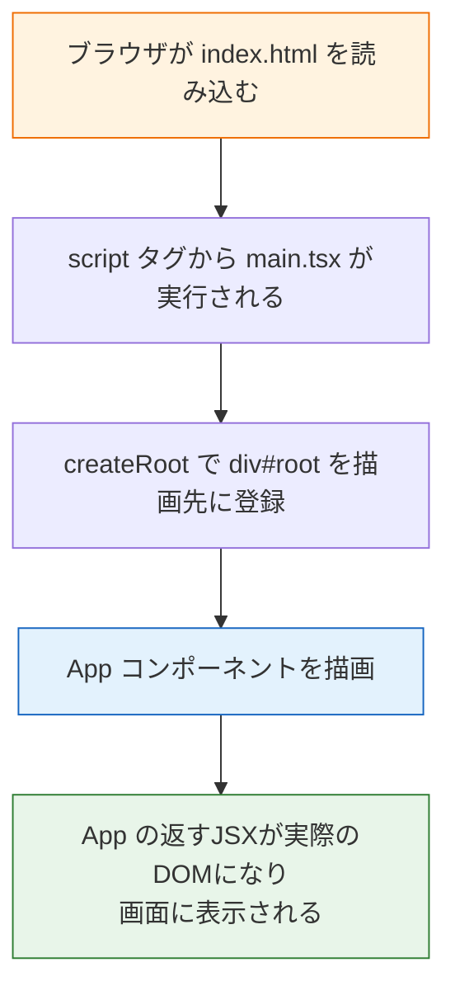

# 開発環境の構築

前のページで、Reactが「データから画面を自動的に作る」ライブラリであることを学びました。このページでは、まずパッケージマネージャの**pnpm（ピーエヌピーエム）**を導入し、続いて**Vite（ヴィート）**というビルドツールを使ってReact + TypeScriptのプロジェクトを作成し、ブラウザで動かすところまでを行います。

あわせて、生成されたファイル一式が「それぞれ何のためにあるのか」を1つずつ確認します。中身を理解しないままファイルが増えていくと後で必ず混乱するので、最初に全体像を押さえておきましょう。

## 学習目標

- Corepackを使ってpnpmを導入し、npmとの違いを説明できる
- Viteを使ってReact + TypeScriptプロジェクトを作成できる
- 開発サーバーを起動し、コードの変更が即座にブラウザへ反映されることを確認できる
- 生成された各ファイル・ディレクトリの役割を説明できる
- `index.html` → `main.tsx` → `App.tsx` という起動の流れを説明できる

## Viteとは何か

**Vite**は、フロントエンド開発のための**ビルドツール**です。主に2つの仕事をします。

1. **開発サーバー**：開発中、ローカルでアプリを動かすサーバーを提供します。コードを保存すると、ブラウザを手動で更新しなくても即座に画面へ反映されます（この機能をHMR：Hot Module Replacement と呼びます）
2. **ビルド**：完成したアプリを、本番公開用に最適化されたファイル一式（HTML/CSS/JavaScript）に変換します

「TypeScriptはそのままではブラウザで動かないので、JavaScriptに変換する必要がある」という話を[コンパイル](/typescript/compile/)で学びました。Viteはこの変換も自動で行ってくれるため、私たちは `tsc` を手で実行することなく、`.tsx` ファイルを保存するだけで結果を確認できます。

なぜViteを使うのか。それは**開発サーバーの起動と更新が非常に速い**からです。プロジェクトが大きくなっても、保存から画面反映までの待ち時間がほとんどありません。短い間隔で「書く→確認する」を繰り返せることは、学習効率にも開発効率にも直結します。

## 事前確認：Node.jsのバージョン

Viteの実行にはNode.jsが必要です。[Node.jsの導入](/environment/node/)でインストール済みのはずなので、バージョンを確認しましょう。

```bash
node -v
```

実行結果の例：

```
v20.11.0
```

`v20.x.x`（20系）であれば問題ありません。表示されない場合やバージョンが古い場合は、[Node.jsの導入](/environment/node/)に戻ってセットアップし直してください。

## pnpmの導入

プロジェクトを作る前に、**pnpm（ピーエヌピーエム）**というツールを導入します。pnpmは、入門編の[Node.jsのインストール](/environment/node/)で触れた**npm**と同じ役割を持つ**パッケージマネージャ**（パッケージのインストールやスクリプトの実行を行うツール）です。使い方はnpmとほとんど同じですが、一度ダウンロードしたパッケージをディスク上の1箇所にまとめて保存し、各プロジェクトからはそれを参照する仕組みになっているため、**ディスクの使用量が少なく、インストールも速い**という利点があります。

導入には、Node.js 20に同梱されている**Corepack（コアパック）**を使います。Corepackは、npm以外のパッケージマネージャをNode.js本体とあわせて管理するための仕組みで、別途インストーラを用意しなくても、コマンド1つでpnpmを有効化できます。

```bash
corepack enable pnpm
```

続いて、pnpmが使えるようになったことを確認します。

```bash
pnpm -v
```

実行結果の例：

```
9.12.0
```

このようにバージョン番号が表示されれば準備完了です（バージョン番号は環境により異なります）。**本カリキュラムでは、これ以降パッケージマネージャはすべてpnpmを使います**（npm/yarnは使いません）。

npmコマンドとの対応は次のとおりです。npmを前提に書かれた記事やドキュメントを読むときは、この表で読み替えてください。

| npm | pnpm | 用途 |
|---|---|---|
| `npm install` | `pnpm install` | `package.json` の依存パッケージを一括インストールする |
| `npm install <pkg>` | `pnpm add <pkg>` | パッケージを追加する（開発用は `pnpm add -D <pkg>`） |
| `npm run <script>` | `pnpm run <script>` | `package.json` のスクリプトを実行する |
| `npx <pkg>` | `pnpm dlx <pkg>`（未インストールのものを一時実行）<br>`pnpm exec <cmd>`（インストール済みコマンドを実行） | パッケージのコマンドを実行する |

## プロジェクトの作成

作業用のディレクトリ（どこでも構いません）に移動して、次のコマンドを実行します。

```bash
pnpm create vite@5 my-react-app --template react-ts
```

**コマンド解説**

- `pnpm create vite@5` — Viteのプロジェクト作成ツール（create-vite）のバージョン5系を実行します。これによりVite 5のプロジェクトが作られます
- `my-react-app` — 作成するプロジェクト（ディレクトリ）の名前です
- `--template react-ts` — 「React + TypeScript」のテンプレートを指定しています。`react`（TypeScriptなし）など他のテンプレートもありますが、本カリキュラムでは必ず `react-ts` を使います。なお、npmでは `--template` の前に `--` という区切りが必要ですが、pnpmではそのまま渡せます

実行結果の例：

```
Scaffolding project in /Users/yourname/dev/my-react-app...

Done. Now run:

  cd my-react-app
  pnpm install
  pnpm run dev
```

表示されたとおり、3つのコマンドを順に実行します。

```bash
cd my-react-app
pnpm install
pnpm run dev
```

**コマンド解説**

- `cd my-react-app` — 作成されたプロジェクトのディレクトリに移動します
- `pnpm install` — `package.json` に書かれた依存パッケージ（React本体など）を `node_modules/` にダウンロードします。初回は1〜2分かかることがあります
- `pnpm run dev` — Viteの開発サーバーを起動します

`pnpm install` の実行結果の例：

```
Packages: +180
++++++++++++++++++++++++++++++++++++++++
Progress: resolved 180, reused 0, downloaded 180, added 180, done

dependencies:
+ react 18.3.1
+ react-dom 18.3.1

devDependencies:
+ @vitejs/plugin-react 4.3.1
+ typescript 5.5.3
+ vite 5.4.8
...

Done in 8.2s
```

`pnpm run dev` の実行結果の例：

```
  VITE v5.4.8  ready in 312 ms

  ➜  Local:   http://localhost:5173/
  ➜  Network: use --host to expose
  ➜  press h + enter to show help
```

ブラウザで `http://localhost:5173/` を開いてください。ViteとReactのロゴ、カウントボタンのある初期画面が表示されれば成功です。

開発サーバーは起動したままにしておきます。停止したいときはターミナルで `Ctrl + C` を押します。

### 変更が即時反映されることを確認する

開発サーバーを起動したまま、エディタで `src/App.tsx` を開き、`<h1>Vite + React</h1>` の部分を次のように書き換えて保存してみてください。

```tsx
<h1>こんにちは、React</h1>
```

ブラウザを手動で更新していないのに、画面の見出しが変わったはずです。これがViteのHMRです。以降の学習では、「コードを書く→保存する→ブラウザで確認する」のサイクルをこの環境で回していきます。

## ディレクトリ構成を理解する

生成されたプロジェクトの中身を見てみましょう。

```
my-react-app/
├── node_modules/        # インストールされたパッケージ（編集しない）
├── public/              # そのまま配信される静的ファイル置き場
│   └── vite.svg
├── src/                 # ★ アプリのソースコード（ここを編集する）
│   ├── assets/          # 画像などの素材
│   │   └── react.svg
│   ├── App.css          # Appコンポーネント用のCSS
│   ├── App.tsx          # ★ アプリ本体のコンポーネント
│   ├── index.css        # アプリ全体に効くCSS
│   ├── main.tsx         # ★ アプリの起動地点（エントリーポイント）
│   └── vite-env.d.ts    # Vite用の型定義（編集しない）
├── .gitignore           # Gitで無視するファイルの一覧
├── eslint.config.js     # ESLintの設定（コード品質チェック。後の章で学ぶ）
├── index.html           # ★ ブラウザが最初に読み込むHTML
├── package.json         # プロジェクト情報と依存パッケージの一覧
├── pnpm-lock.yaml       # 依存パッケージの正確なバージョン記録（pnpmが生成）
├── tsconfig.json        # TypeScriptの設定
├── tsconfig.app.json    # アプリ用のTypeScript設定
├── tsconfig.node.json   # Vite設定ファイル用のTypeScript設定
└── vite.config.ts       # Viteの設定
```

★印の4ファイルが特に重要です。順に中身を見ていきます。

### index.html — ブラウザが最初に読むファイル

**`index.html`**

```html
<!doctype html>
<html lang="en">
  <head>
    <meta charset="UTF-8" />
    <link rel="icon" type="image/svg+xml" href="/vite.svg" />
    <meta name="viewport" content="width=device-width, initial-scale=1.0" />
    <title>Vite + React</title>
  </head>
  <body>
    <div id="root"></div>
    <script type="module" src="/src/main.tsx"></script>
  </body>
</html>
```

**コード解説**

- `<div id="root"></div>` — **アプリ全体の入れ物**です。中身は空ですが、ここにReactが画面を描画します。前のページで学んだSPAの「1枚のHTML」が、まさにこのファイルです
- `<script type="module" src="/src/main.tsx">` — エントリーポイントである `main.tsx` を読み込みます。`.tsx` を直接指定していますが、Viteが裏でJavaScriptに変換して届けてくれます

入門編では `<body>` の中にHTMLをたくさん書きましたが、Reactでは**HTMLはこの空の `div` ひとつだけ**で、画面のすべてはTypeScript側で作ります。

### src/main.tsx — アプリの起動地点

**`src/main.tsx`**

```tsx
import { StrictMode } from 'react'
import { createRoot } from 'react-dom/client'
import './index.css'
import App from './App.tsx'

createRoot(document.getElementById('root')!).render(
  <StrictMode>
    <App />
  </StrictMode>,
)
```

**コード解説**

- `import { createRoot } from 'react-dom/client'` — ReactをブラウザのDOMに結びつけるための関数を読み込みます
- `document.getElementById('root')!` — `index.html` の `<div id="root">` を取得します。**ここで入門編で学んだDOM操作が登場します**。Reactアプリで `getElementById` を書くのは、実質この1箇所だけです
- 末尾の `!` — TypeScriptの**非nullアサーション**です。`getElementById` の戻り値の型は `HTMLElement | null`（[ユニオン型](/typescript/basic_types/)）ですが、「`root` は必ず存在するので `null` ではない」と開発者がTypeScriptに伝えています
- `createRoot(...).render(...)` — 取得した要素を「Reactの描画先（ルート）」として登録し、`<App />` を描画します
- `<StrictMode>` — 開発時に問題のある書き方を警告してくれる安全装置です。本番の動作には影響しません

つまり `main.tsx` の役割は、「**`App` というコンポーネントを `#root` に描画せよ**」という橋渡しの一文です。

### src/App.tsx — アプリ本体

**`src/App.tsx`**（テンプレート生成直後のもの。バージョンにより細部が異なる場合があります）

```tsx
import { useState } from 'react'
import reactLogo from './assets/react.svg'
import viteLogo from '/vite.svg'
import './App.css'

function App() {
  const [count, setCount] = useState(0)

  return (
    <>
      <div>
        <a href="https://vitejs.dev" target="_blank">
          
        </a>
        <a href="https://react.dev" target="_blank">
          
        </a>
      </div>
      <h1>Vite + React</h1>
      <div className="card">
        <button onClick={() => setCount((count) => count + 1)}>
          count is {count}
        </button>
        <p>
          Edit <code>src/App.tsx</code> and save to test HMR
        </p>
      </div>
      <p className="read-the-docs">
        Click on the Vite and React logos to learn more
      </p>
    </>
  )
}

export default App
```

**コード解説**

- `function App() { ... }` — `App` は**関数コンポーネント**です。「関数が画面の構造を返す」というReactの基本形で、詳細は[JSXとコンポーネント](/react/jsx_and_components/)で学びます
- `return (...)` — HTMLに似た記法（JSX）で画面の構造を返しています
- `useState(0)` — 画面の状態（ここではカウント）を管理する仕組みです。[propsとstate](/react/props_and_state/)で学びます
- `export default App` — この関数を他のファイル（`main.tsx`）から `import` できるように公開しています

今はまだ読めない部分が多くて構いません。「**`App` 関数の返すものが、画面に表示される**」ことだけ確認してください。

### 起動の流れを図で整理する

ブラウザでアプリが表示されるまでの流れをまとめます。



この流れは、これからどんなに大きなアプリを作っても変わりません。SNSアプリの何十もの画面も、最終的にはすべて `App` から始まるコンポーネントの集まりとして `#root` に描画されます。

### その他のファイル

- **`package.json`** — プロジェクト名、依存パッケージ、`pnpm run dev` などのスクリプト定義が書かれています。`dependencies` に `react` と `react-dom`（いずれも18系）があることを確認してください
- **`vite.config.ts`** — Viteの設定ファイルです。`plugins: [react()]` という記述が、ViteにReact（JSX）を扱わせるための設定です。当面は編集しません
- **`tsconfig.json` / `tsconfig.app.json`** — [コンパイル](/typescript/compile/)で学んだTypeScript設定です。テンプレートが適切に設定済みなので、そのまま使います
- **`node_modules/`** — インストールされたパッケージの実体です。**編集しない・Gitにコミットしない**（`.gitignore` に最初から登録されています）。[Git/GitHub基礎](/git/)で学んだとおり、`package.json` があれば `pnpm install` でいつでも復元できます

## package.jsonのscriptsを確認する

`package.json` の `scripts` には、よく使うコマンドが登録されています。

```json
"scripts": {
  "dev": "vite",
  "build": "tsc -b && vite build",
  "lint": "eslint .",
  "preview": "vite preview"
}
```

| コマンド | 役割 |
|---|---|
| `pnpm run dev` | 開発サーバーを起動する（学習中はこれを常用） |
| `pnpm run build` | 型チェック（`tsc`）をしてから本番用ファイルを `dist/` に生成する |
| `pnpm run preview` | `build` の成果物をローカルで確認する |
| `pnpm run lint` | コードの問題を検査する（[コード品質と開発ツール](/tooling/)で学びます） |

試しに `pnpm run build` を実行すると、`dist/` ディレクトリにHTML・CSS・JavaScriptが生成されます。この `dist/` が「本番サーバーに置くファイル一式」であり、後の[AWSデプロイ](/aws/)では、これをS3にアップロードして世界に公開します。

## プロジェクトをGitで管理する

[Git/GitHub基礎](/git/)で学んだとおり、プロジェクトは最初からGitで管理しましょう。

```bash
git init
git add .
git commit -m "ViteでReactプロジェクトを作成"
```

実行結果の例：

```
[main (root-commit) a1b2c3d] ViteでReactプロジェクトを作成
 17 files changed, 2034 insertions(+)
```

`.gitignore` に `node_modules` と `dist` が最初から書かれているため、巨大なディレクトリがコミットされる心配はありません。以降のページでも、区切りごとにコミットする習慣をつけてください。

## 理解度チェック

**Q1. Viteが開発において果たす2つの主な役割は何ですか。**

<details markdown="1">
<summary>解答を見る</summary>

1. **開発サーバー**：ローカルでアプリを動かし、コードを保存すると即座にブラウザへ反映する（HMR）。TypeScript（.tsx）からJavaScriptへの変換も裏で自動的に行う。
2. **ビルド**：本番公開用に最適化されたHTML/CSS/JavaScript一式（`dist/`）を生成する。

</details>

**Q2. `index.html` の `<body>` には `<div id="root"></div>` しかありません。画面に表示される内容はどこから来るのですか。起動の流れに沿って説明してください。**

<details markdown="1">
<summary>解答を見る</summary>

ブラウザが `index.html` を読み込むと、`<script>` タグで指定された `src/main.tsx` が実行されます。`main.tsx` は `document.getElementById('root')` で空の `div` を取得し、`createRoot(...).render(<App />)` によって、`App` コンポーネントが返す画面構造をその `div` の中に描画します。つまり、画面の中身はすべて `App.tsx` から始まるTypeScriptコードが生成しています。

</details>

**Q3. `main.tsx` の `document.getElementById('root')!` にある `!` は何のためにありますか。TypeScriptの型の知識を使って説明してください。**

<details markdown="1">
<summary>解答を見る</summary>

`getElementById` の戻り値の型は `HTMLElement | null` というユニオン型です（要素が見つからない場合は `null` が返るため）。`!`（非nullアサーション）は、「この値は絶対に `null` ではない」と開発者がTypeScriptに伝える記法です。`index.html` に `id="root"` の要素が必ず存在することを開発者が知っているので、ここでは `!` を付けて型エラーを回避しています。

</details>

**Q4. `node_modules/` をGitにコミットしないのはなぜですか。また、コミットしなくても困らないのはなぜですか。**

<details markdown="1">
<summary>解答を見る</summary>

`node_modules/` はインストールされたパッケージの実体で、ファイル数が膨大なうえ、自分で書いたコードではないためです。`package.json`（依存パッケージの一覧）と `pnpm-lock.yaml`（正確なバージョンの記録）がコミットされていれば、誰でも `pnpm install` を実行するだけで同じ `node_modules/` を復元できるので、コミットする必要がありません。

</details>

**Q5. `pnpm run dev` と `pnpm run build` の違いを説明してください。**

<details markdown="1">
<summary>解答を見る</summary>

- `pnpm run dev` は**開発用**で、ローカルに開発サーバーを起動します。保存のたびに即時反映され、開発中はこれを使い続けます。ファイルは生成されません。
- `pnpm run build` は**本番用**で、型チェック（`tsc`）を行ったうえで、最適化されたHTML/CSS/JavaScriptを `dist/` に生成します。この成果物を本番サーバー（後の章ではAWSのS3）に配置することで、アプリを公開できます。

</details>

## セルフレビュー

- [ ] `corepack enable pnpm` でpnpmを導入し、npmコマンドとの対応（`install` / `add` / `run` / `dlx`）を説明できる
- [ ] `pnpm create vite@5` でReact + TypeScriptプロジェクトを、手順を見ずに作成できる
- [ ] 開発サーバーを起動・停止でき、HMRによる即時反映を確認した
- [ ] `index.html` → `main.tsx` → `App.tsx` の起動の流れを図に描いて説明できる
- [ ] `src/`、`public/`、`node_modules/`、`dist/` の役割の違いを説明できる
- [ ] `package.json` の `scripts` にある4つのコマンドの用途を説明できる
- [ ] 作成したプロジェクトをGitで管理し、最初のコミットをした

## 次のステップ

開発環境が整い、Reactアプリが手元で動くようになりました。次のページ[JSXとコンポーネント](/react/jsx_and_components/)では、`App.tsx` の中に書かれていたHTMLのような記法——**JSX**——のルールを学び、自分の手で画面の部品（コンポーネント）を作ります。

ここで作ったプロジェクトは、このセクションを通して使い続けます。また、`pnpm run build` が生成する `dist/` は、[CI/CD](/cicd/)と[AWSデプロイ](/aws/)で「ビルドして公開する」流れを学ぶときに再登場します。
