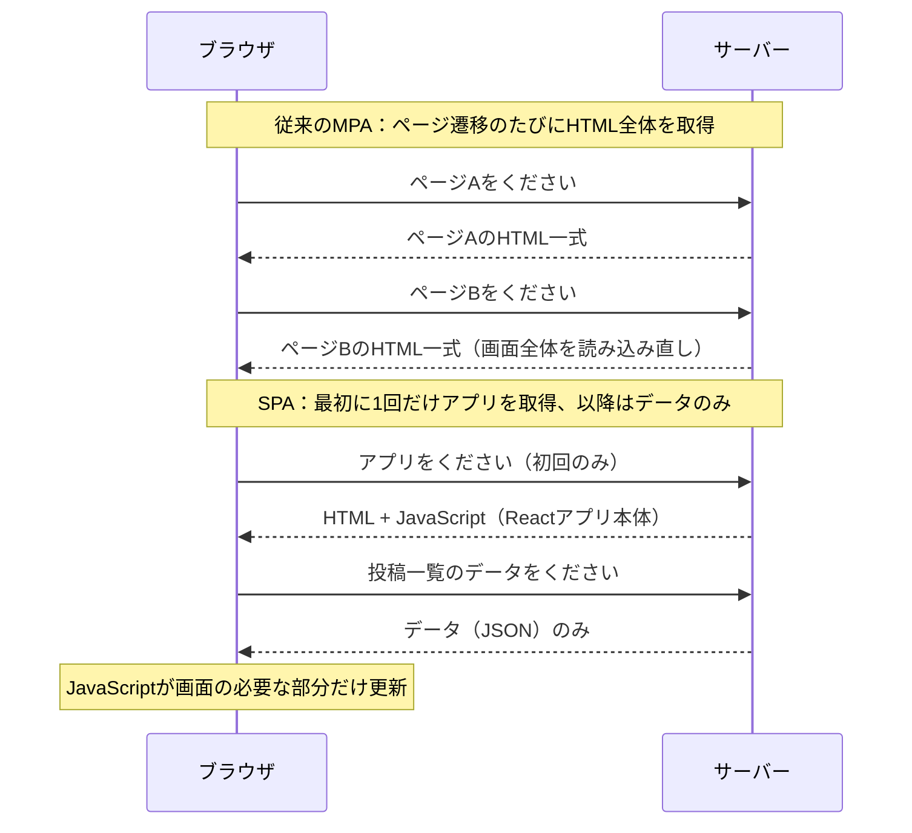
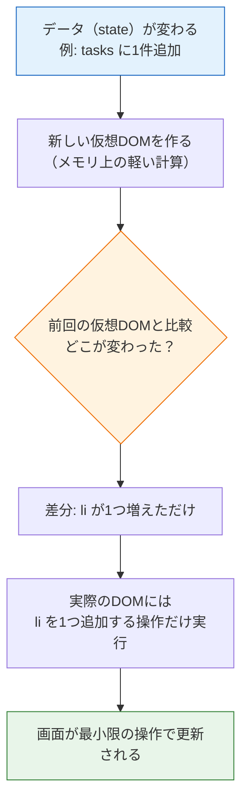

# Reactとは何か

このページでは、Reactを学ぶ前に「そもそもReactは何を解決する道具なのか」を理解します。入門編の[最終問題](/final_project/)で書いた素のDOM操作のコードと比較しながら、Reactの考え方・SPA（シングルページアプリケーション）・仮想DOMという3つのキーワードを押さえていきます。

コードを書き始めるのは次のページからです。このページでは、まず頭の中に地図を作りましょう。

## 学習目標

- 素のDOM操作で画面を作るときの問題点を、自分の経験と結びつけて説明できる
- Reactの「宣言的UI」という考え方を、命令的なコードとの対比で説明できる
- SPA（シングルページアプリケーション）とは何かを説明できる
- 仮想DOMがどのように画面更新を効率化するかを、図を使って説明できる

## 振り返り：素のDOM操作で画面を作る

入門編の最終問題で作ったTodoアプリのコードを思い出してください。タスクの一覧を画面に表示するために、次のようなコードを書きました。

**入門編Todoアプリの `renderTasks` 関数（抜粋）**

```typescript
function renderTasks(): void {
  taskList.innerHTML = "";

  tasks.forEach((task) => {
    const li = document.createElement("li");
    li.className = task.completed ? "completed" : "";

    const span = document.createElement("span");
    span.textContent = task.text;
    span.addEventListener("click", () => toggleTask(task.id));

    const deleteBtn = document.createElement("button");
    deleteBtn.textContent = "削除";
    deleteBtn.className = "delete-btn";
    deleteBtn.addEventListener("click", () => deleteTask(task.id));

    li.appendChild(span);
    li.appendChild(deleteBtn);
    taskList.appendChild(li);
  });
}
```

**コード解説**

- `taskList.innerHTML = ""` — 一覧をいったん空にします。空にしないと、再描画のたびにタスクが二重に表示されてしまいます
- `document.createElement("li")` — `<li>` 要素を1つずつJavaScriptで作ります
- `addEventListener(...)` — 作った要素にクリックイベントを毎回登録し直します
- `appendChild(...)` — 組み立てた要素をDOMツリーに追加します

このコードは正しく動きます。しかし、**データを1件変更しただけでも、一覧全体を作り直している**ことに注目してください。さらに、タスクを追加・削除・完了切り替えするたびに、必ず `renderTasks()` を自分で呼び出す必要がありました。呼び忘れると、データは変わったのに画面は古いまま、という不具合になります。

### 画面が複雑になると何が起きるか

Todoアプリ程度なら、この方式でも管理できます。では、このカリキュラムの最終目標であるSNSアプリを想像してみてください。

- タイムラインには投稿が並び、各投稿に「いいね」ボタンとカウントがある
- 画面上部には未読通知の件数バッジがある
- いいねを押したら、投稿のカウントと、自分のプロフィールページの「いいねした投稿一覧」の両方を更新したい

素のDOM操作でこれを作ると、「いいねボタンが押されたら、**あの場所とこの場所とその場所**のDOMを書き換える」というコードをすべて手で書くことになります。書き換え忘れ・二重登録・更新順序のバグが、画面の複雑さに比例して増えていきます。

問題の本質はこうまとめられます。

> **データ（状態）と画面（DOM）を一致させ続ける作業を、人間が手作業でやっている。**

## Reactの考え方：宣言的UI

React（リアクト）は、Meta社（旧Facebook）が開発した、**UI（ユーザーインターフェース）を構築するためのJavaScriptライブラリ**です。Reactの中心にあるのは、次の考え方です。

> **画面がどうあるべきかをデータから「宣言」しておけば、データが変わったとき、画面はReactが自動的に更新する。**

この考え方を**宣言的UI（せんげんてきユーアイ、declarative UI）**と呼びます。対して、入門編で書いた「要素を作れ、クラスを付けろ、追加しろ」と手順を一つずつ命令するスタイルを**命令的（めいれいてき、imperative）**と呼びます。

先ほどのタスク一覧は、Reactでは次のように書けます（書き方の詳細は[JSXとコンポーネント](/react/jsx_and_components/)で学ぶので、今は雰囲気だけつかんでください）。

```tsx
<ul>
  {tasks.map((task) => (
    <li key={task.id} className={task.completed ? "completed" : ""}>
      <span onClick={() => toggleTask(task.id)}>{task.text}</span>
      <button onClick={() => deleteTask(task.id)}>削除</button>
    </li>
  ))}
</ul>
```

**コード解説**

- HTMLによく似た記法で「タスク一覧はこういう構造であるべき」と書いています（この記法をJSXと呼びます）
- `tasks.map(...)` — 配列 `tasks` の各要素を `<li>` に変換しています。`createElement` や `appendChild` は登場しません
- `onClick={...}` — イベントの登録も構造の一部として宣言します。`addEventListener` の呼び忘れや二重登録は起きません

そして最大の違いはここです。**Reactでは `renderTasks()` のような再描画関数を自分で呼びません。** `tasks` というデータが変わると、Reactがこの宣言を読み直して、画面を自動的に更新します。

| | 命令的（素のDOM操作） | 宣言的（React） |
|---|---|---|
| 画面の作り方 | 要素の生成・追加を手順として書く | あるべき構造をデータから宣言する |
| 画面の更新 | 自分で再描画関数を呼ぶ | データが変われば自動で更新される |
| イベント登録 | `addEventListener` を都度呼ぶ | 構造の中に `onClick` として書く |
| 規模が大きくなると | 更新箇所の管理が破綻しやすい | データ管理に集中できる |

### もう1つの例：カウンターで比べる

違いをもう少し小さな例でも確認しておきましょう。「ボタンを押すと数字が増えるカウンター」を、2つの方法で書き比べます。

**素のDOM操作版**

```typescript
let count = 0;

const countDisplay = document.getElementById("count") as HTMLSpanElement;
const button = document.getElementById("increment") as HTMLButtonElement;

button.addEventListener("click", () => {
  count = count + 1;
  countDisplay.textContent = String(count); // 画面の更新を自分で書く
});
```

**コード解説**

- `count = count + 1` — データの更新です
- `countDisplay.textContent = String(count)` — **画面の更新です。データを変えただけでは画面は変わらない**ので、この行を必ず自分で書きます
- もし将来「ヘッダーにもカウントを表示したい」となったら、ヘッダーを書き換える行も**このイベントハンドラに追記**しなければなりません。データを使う場所が増えるほど、更新コードが増えていきます

**React版**（書き方の詳細は[propsとstate](/react/props_and_state/)で学びます）

```tsx
function Counter() {
  const [count, setCount] = useState(0);

  return (
    <div>
      <span>{count}</span>
      <button onClick={() => setCount(count + 1)}>+1</button>
    </div>
  );
}
```

**コード解説**

- `setCount(count + 1)` — データの更新です。**ここで終わりです**
- `<span>{count}</span>` — 「画面には常に最新の `count` が表示されるべき」という宣言です。更新のコードはどこにもありません
- 将来カウントを表示する場所が10箇所に増えても、書くのは `{count}` を10箇所に置くことだけです。更新処理の追記は一切不要です

データを使う場所が増えたときのコストの差——これが、小さな例でも見えてくるReactの本質的な利点です。

## SPAとは何か

Reactとセットでよく出てくる言葉に**SPA（エスピーエー、Single Page Application：シングルページアプリケーション）**があります。

従来のWebサイトでは、リンクをクリックするたびにブラウザがサーバーから**新しいHTMLページ全体**を受け取り、画面を丸ごと読み込み直していました。これを**MPA（マルチページアプリケーション）**と呼びます。

一方SPAでは、最初に1枚のHTMLとJavaScriptを読み込んだら、それ以降の画面の切り替えや更新は**JavaScriptがブラウザ内で行います**。サーバーとは、HTMLではなく**データだけ**をやり取りします（この通信を[fetchでAPI通信](/react/api_fetch/)で学びます）。



SPAの利点は、画面全体を読み込み直さないため**操作がなめらか**なことです。X（旧Twitter）やGmailを使うとき、ページ全体が白くなって読み込み直される感覚がないのは、これらがSPAとして作られているからです。

ただしSPAでは、「データが届いたら画面のこの部分を書き換える」という処理がブラウザ内で大量に発生します。だからこそ、画面更新を自動化してくれるReactのようなライブラリが必要になるのです。

## 仮想DOMの仕組み

「データが変わったら画面を自動更新する」と聞くと、こんな疑問が浮かぶかもしれません。

> データが変わるたびに画面全体を作り直していたら、遅くならないのか？

実際、DOMの操作（要素の生成や差し替え）はブラウザの処理の中でも**コストが高い**部類です。入門編のTodoアプリが `innerHTML = ""` で全消し・全再構築していたのは、小規模だから許された方法でした。

Reactはこの問題を**仮想DOM（かそうディーオーエム、Virtual DOM）**という仕組みで解決しています。

仮想DOMとは、**実際のDOMのコピーをJavaScriptのオブジェクトとしてメモリ上に持っておく**仕組みです。データが変わったとき、Reactは次の手順で画面を更新します。

1. 新しいデータから、新しい仮想DOM（あるべき画面の設計図）を作る
2. 変更前の仮想DOMと比較（差分検出）する
3. **差分があった部分だけ**を、実際のDOMに反映する



ポイントは、仮想DOMの作成と比較は**ただのJavaScriptオブジェクトの操作なので高速**だということです。コストの高い実際のDOM操作は、差分の分だけ最小限に抑えられます。

入門編のTodoアプリと比べてみましょう。

| | 入門編（innerHTML方式） | React（仮想DOM） |
|---|---|---|
| タスク1件追加時 | 一覧を全消しして全件作り直す | 増えた `<li>` 1つだけ追加する |
| 更新箇所の特定 | 人間がコードで指定する | Reactが差分検出で自動判定する |

なお、仮想DOMは「Reactを速くする魔法」というより、「**人間が更新箇所を考えなくても、十分速く自動更新できる仕組み**」と捉えるのが正確です。私たちが得る最大の恩恵は速度そのものではなく、「データだけ考えればよい」という開発のしやすさです。

## Reactを学ぶ理由

UIライブラリ・フレームワークには、ReactのほかにVue.jsやAngular、Svelteなどがあります。その中でこのカリキュラムがReactを採用する理由は次のとおりです。

- **業界での採用実績が最も多い**：求人数・利用企業数ともに最大級で、学んだ知識を活かせる場面が多い
- **TypeScriptとの相性が良い**：[TypeScript基礎](/typescript//)で学んだ型がそのままpropsやstateの型として活きます
- **エコシステムが豊富**：ルーティング、状態管理、テストなど周辺ツールが充実している
- **このカリキュラムの最終目標に直結する**：[SNS開発](/sns//)の画面はすべてReactで作ります

また、Reactは「フレームワーク」ではなく「ライブラリ」と呼ばれることが多い点も覚えておきましょう。ReactはUIの構築だけを担当し、それ以外（通信やルーティングなど）は他のツールや自分のコードと組み合わせて使います。

## 理解度チェック

**Q1. 入門編のTodoアプリ（素のDOM操作）では、タスクを追加した後に必ず `renderTasks()` を呼ぶ必要がありました。Reactではこの呼び出しが不要になります。なぜですか。**

<details markdown="1">
<summary>解答を見る</summary>

Reactは宣言的UIの考え方を採用しており、「データからどんな画面を作るべきか」をあらかじめ宣言しておく方式だからです。データ（state）が変わると、Reactがその宣言をもとに新しい仮想DOMを作り、前回との差分を検出して、実際のDOMを自動的に更新します。人間が「いつ・どこを再描画するか」を指示する必要がないため、再描画関数の呼び忘れによるバグも起きません。

</details>

**Q2. 「命令的」なUIの書き方と「宣言的」なUIの書き方の違いを、それぞれ1文で説明してください。**

<details markdown="1">
<summary>解答を見る</summary>

- 命令的：「要素を作る→クラスを付ける→イベントを登録する→追加する」のように、**画面を組み立てる手順を一つずつ命令として書く**スタイル（例：`document.createElement` と `appendChild` の連続）。
- 宣言的：手順ではなく、**「データがこうなら画面はこうあるべき」という最終形を記述する**スタイル。更新の手順はライブラリ（React）が引き受けます。

</details>

**Q3. SPAと従来のMPAの最大の違いは何ですか。また、SPAでReactのようなライブラリが特に必要とされるのはなぜですか。**

<details markdown="1">
<summary>解答を見る</summary>

MPAはページ遷移のたびにサーバーからHTML全体を受け取って画面を読み込み直しますが、SPAは最初に1回だけアプリ（HTML + JavaScript）を読み込み、以降はサーバーとデータ（JSON）だけをやり取りして、画面の更新はブラウザ内のJavaScriptが行います。

SPAでは「受け取ったデータに応じて画面のあちこちを書き換える」処理が大量に発生するため、手作業のDOM操作では管理が破綻しやすくなります。データと画面の同期を自動化してくれるReactのようなライブラリが、SPAの規模に耐える開発を可能にします。

</details>

**Q4. 仮想DOMを使った画面更新の3つのステップを順に説明してください。**

<details markdown="1">
<summary>解答を見る</summary>

1. データ（state）の変更を受けて、**新しい仮想DOM**（あるべき画面構造を表すJavaScriptオブジェクト）をメモリ上に作る
2. **変更前の仮想DOMと比較**して、どこが変わったか（差分）を検出する
3. **差分があった部分だけ**を実際のDOMに反映する

実際のDOM操作はコストが高いため、軽いオブジェクト比較で差分を絞り込み、高コストな操作を最小限にする、という役割分担になっています。

</details>

**Q5. 「仮想DOMがあるからReactは常に素のDOM操作より速い」という説明は正確ではありません。仮想DOMの本当の価値はどこにありますか。**

<details markdown="1">
<summary>解答を見る</summary>

熟練者が最適な更新箇所だけを手書きしたDOM操作には、仮想DOMの比較コストの分、Reactが及ばない場合もあります。仮想DOMの本当の価値は、**人間が「どこを・いつ更新するか」を一切考えなくても、自動的に十分高速な更新が行われること**です。つまり速度そのものより、「開発者はデータの管理だけに集中できる」という開発体験・保守性の向上が最大の恩恵です。

</details>

## セルフレビュー

- [ ] 入門編のTodoアプリで `renderTasks()` を毎回呼んでいた理由と、その方式の問題点を自分の言葉で説明できる
- [ ] 「宣言的UI」と「命令的UI」の違いを、コード例を挙げて説明できる
- [ ] SPAとMPAの通信の違いを、シーケンス図を描いて説明できる
- [ ] 仮想DOMによる画面更新の流れ（生成→比較→差分反映）を図にできる
- [ ] 「Reactを使うと何がうれしいのか」を、Reactを知らない人に説明できる

## 次のステップ

Reactが解決する問題と、その解決方法（宣言的UI・仮想DOM）を理解しました。次のページ[開発環境の構築](/react/setup/)では、Vite（ヴィート）というツールを使って、実際にReact + TypeScriptのプロジェクトを作成し、ブラウザで動かします。

ここで学んだ「宣言的UI」は[JSXとコンポーネント](/react/jsx_and_components/)で、「データが変わると画面が変わる」仕組みは[propsとstate](/react/props_and_state/)で、それぞれ実際のコードとして体験します。また、SPAの「サーバーとデータだけをやり取りする」部分は[fetchでAPI通信](/react/api_fetch/)と、その先の[バックエンド基礎（NestJS）](/backend//)につながっていきます。
