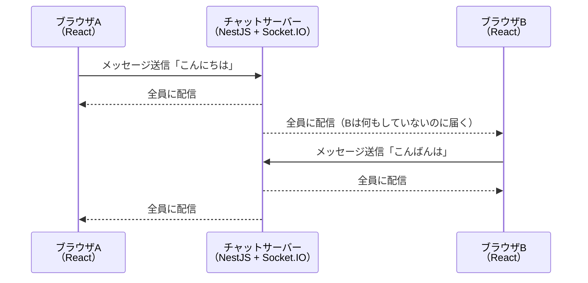

# リアルタイム通信

このセクションでは、サーバーで起きた出来事を「すぐに」クライアントへ届けるための技術、リアルタイム通信を学びます。

これまで学んできたHTTP通信は、[HTTPとREST](/backend/http_and_rest/)で見たとおり「クライアントがリクエストを送り、サーバーがレスポンスを返す」という一方通行の往復が基本でした。この仕組みは多くの場面で十分に機能しますが、チャットや通知のように「サーバー側で何かが起きた瞬間にクライアントへ知らせたい」場面では限界があります。サーバーは、クライアントから聞かれない限り、自分から話しかけることができないからです。

このセクションでは、その限界をどう乗り越えるかを段階的に学び、最終的にNestJSとSocket.IO（ソケットアイオー）でリアルタイムなミニチャットアプリを作ります。

## このセクションで作れるようになるもの

セクションの最後には、複数のブラウザ間でメッセージが即座に届くチャットアプリが手元で動きます。

注目してほしいのは、ブラウザBが何のリクエストも送っていないのに、ブラウザAのメッセージが届いている点です。これがリアルタイム通信の本質であり、これまでのHTTP通信との最大の違いです。

## このセクションの構成

| ページ | 内容 |
|---|---|
| [リアルタイム通信とは](/realtime/what_is_realtime/) | ポーリング・ロングポーリング・SSE・WebSocketの4つの方式をシーケンス図で比較し、それぞれの長所と短所を理解します |
| [WebSocketの基礎](/realtime/websocket_basics/) | WebSocketの仕組み（ハンドシェイク）を学び、ブラウザの素のWebSocket APIで最小のエコーアプリを動かします |
| [NestJSのGatewayでチャットを作る](/realtime/nestjs_gateway/) | NestJSのGateway機能とSocket.IOで、room機能つきのミニチャットを作ります |

## 前提知識

このセクションを始める前に、以下を修了していることを前提とします。

- [バックエンド基礎（NestJS）](/backend/) — 特に[HTTPとREST](/backend/http_and_rest/)で学んだリクエスト/レスポンスモデル
- [React基礎](/react/) — 特に[fetchでAPI通信](/react/api_fetch/)で学んだフロントエンドからの通信と、useState / useEffectの使い方
- [環境構築](/environment/) — Node.js 20とpnpmが使えること（pnpmの導入は[実践: フルスタックTodoアプリ](/fullstack-todo/nestjs/setup/)を参照）

## この知識はどこで使うか

ここで学ぶリアルタイム通信は、最終プロジェクトの[SNS開発](/sns/)で、ユーザー同士が1対1で会話できる[DMチャット機能](/sns/nestjs/chat/)を実装するときに直接使います。SNSのDMは「特定の2人だけに届くチャット」なので、このセクションの最後に学ぶroom（ルーム）の考え方がそのまま活きてきます。

それでは、まず「なぜ普通のHTTPではリアルタイム通信が難しいのか」から見ていきましょう。
