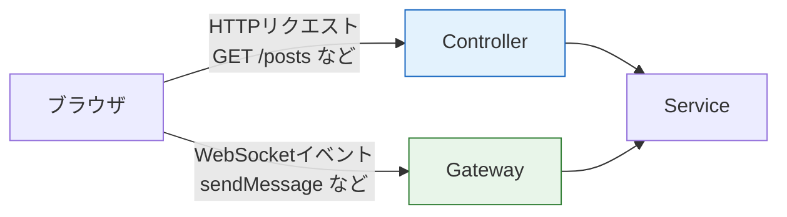
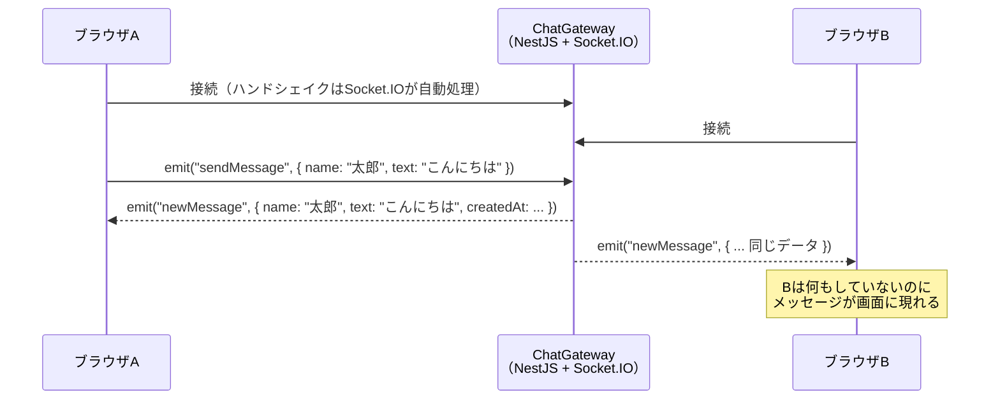
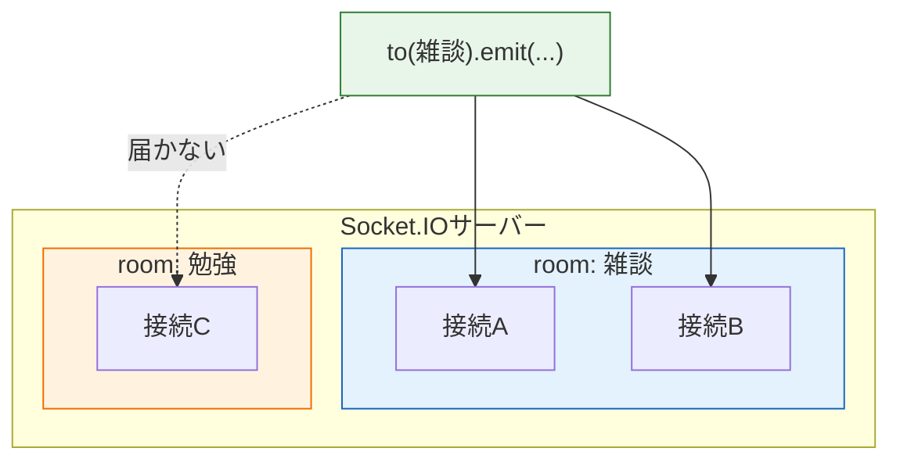

# NestJSのGatewayでチャットを作る

前のページ[WebSocketの基礎](/realtime/websocket_basics/)では、素のWebSocketでエコーアプリを作り、同時に「自動再接続がない」「メッセージの種類を区別できない」「グループ配信の仕組みがない」という足りない点も確認しました。このページでは、それらをまとめて解決してくれるライブラリ**Socket.IO**（ソケットアイオー）と、NestJSのWebSocket対応機能である**Gateway**（ゲートウェイ）を使って、複数人で会話できるミニチャットを作ります。

まずは「全員に届くチャット」を作って基本の流れをつかみ、その後**room**（ルーム）機能を加えて「特定のグループだけに届くチャット」へ発展させます。フロントエンドはReactで、Socket.IOのクライアントライブラリを使って接続します。

## 学習目標

- Socket.IOが素のWebSocketに何を上乗せしてくれるのか説明できる
- NestJSのGatewayがControllerとどう対応するのか説明できる
- `@SubscribeMessage`でイベントを受信し、`server.emit`で全員に配信できる
- roomを使って「特定のグループだけ」にメッセージを配信できる
- ReactからSocket.IOクライアントで接続し、イベントを送受信できる

## Socket.IOとは

Socket.IOは、WebSocketの上に「チャットのようなアプリで必ず必要になる機能」を上乗せしたライブラリです。前のページの最後に挙げた「足りないもの」と対応させると、その価値がよくわかります。

| 素のWebSocketに足りないもの | Socket.IOの解決策 |
|---|---|
| 切断されても自動で再接続されない | **自動再接続**が標準装備。再試行の間隔も自動調整される |
| メッセージに「種類」の概念がない | **イベント名**つきでメッセージを送受信できる（`socket.emit('sendMessage', データ)`） |
| グループ配信の仕組みがない | **room**機能で「このルームにいる人だけに送る」が1行で書ける |
| WebSocketが使えない環境で動かない | 自動的に**ロングポーリング**へ切り替えて動き続ける（[リアルタイム通信とは](/realtime/what_is_realtime/)で学んだ方式です） |

1つ注意があります。Socket.IOはWebSocketを土台にしていますが、**独自の約束事（プロトコル）を上乗せしている**ため、素のWebSocketクライアントとSocket.IOサーバーは直接つながりません。サーバーとクライアントの両方でSocket.IOを使う必要があります。今回はサーバー側にNestJS + Socket.IO、クライアント側にReact + `socket.io-client`という組み合わせを使います。

## NestJSのGatewayとは

NestJSでは、HTTPのリクエストを受け付ける入口が**Controller**でした（[コントローラ](/backend/controller/)で学びました）。これに対して、WebSocketの通信を受け付ける入口が**Gateway**です。役割が対応しているので、対比して覚えるのが近道です。

| | HTTP | WebSocket |
|---|---|---|
| 入口となるクラス | `@Controller()` | `@WebSocketGateway()` |
| 処理を割り当てるデコレータ | `@Get()` `@Post()` など | `@SubscribeMessage('イベント名')` |
| データの受け取り | `@Body()` `@Param()` | `@MessageBody()` |
| 相手の識別 | リクエストごとに完結 | `Socket`オブジェクト（接続ごとに1つ） |



図のとおり、ControllerとGatewayは「入口が違うだけ」で、ビジネスロジックをServiceに任せる構造（[ServiceとDI](/backend/service_and_di/)で学んだ考え方）はそのまま共通です。今回はチャットのロジックが小さいのでGatewayの中に直接書きますが、本格的なアプリではServiceに切り出します。

## 作るもののイベント設計

コードを書く前に、クライアントとサーバーの間でやり取りする**イベント**を決めておきます。Socket.IOでは、すべての通信に「イベント名」と「データ」が付きます。RESTでいうエンドポイント設計に相当する、大切な準備です。

まず作る「全員に届くチャット」のイベントは2つだけです。

| イベント名 | 方向 | データ | 意味 |
|---|---|---|---|
| `sendMessage` | クライアント → サーバー | `{ name, text }` | メッセージを送信する |
| `newMessage` | サーバー → クライアント | `{ name, text, createdAt }` | 新しいメッセージが届いたので全員に配信する |

通信の流れをシーケンス図で確認しましょう。



「クライアントが`sendMessage`を送る → サーバーが受け取り、`newMessage`として**全員に**配り直す」という流れです。送信者自身にも`newMessage`が返ってくる点に注目してください。自分のメッセージも他人のメッセージも同じ`newMessage`イベントで画面に追加すればよいので、クライアントの実装が単純になります。

## サーバー側 — NestJSでGatewayを作る

### プロジェクトの準備

NestJSのプロジェクトを新規作成します。[NestJSのセットアップ](/backend/setup/)で導入したNest CLIを使います。

```bash
nest new mini-chat
```

パッケージマネージャを聞かれたら`pnpm`を選びます。作成できたらディレクトリに移動し、WebSocket関連のパッケージを追加します。

```bash
cd mini-chat
pnpm add @nestjs/websockets@10 @nestjs/platform-socket.io@10
```

実行結果の例:

```
Packages: +22
++++++++++++++++++++++
Progress: resolved 750, reused 750, downloaded 0, added 22, done

dependencies:
+ @nestjs/platform-socket.io 10.4.15
+ @nestjs/websockets 10.4.15
```

- `@nestjs/websockets` — Gatewayや`@SubscribeMessage`などNestJSのWebSocket機能本体です。
- `@nestjs/platform-socket.io` — その土台としてSocket.IOを使うためのアダプタです。NestJSは土台を差し替えられる設計になっており、今回はSocket.IOを選んだ、という関係です。
- `@10` — メジャーバージョンの固定です。バージョンを指定しないと最新版（NestJS 11向けなど）が入り、NestJS 10系のプロジェクトとpeer dependencyの不整合を起こすことがあるため、本体に合わせて固定します。

### Gatewayの生成

Nest CLIでGatewayの雛形を生成します。

```bash
nest g gateway chat
```

実行結果の例:

```
CREATE src/chat.gateway.spec.ts (180 bytes)
CREATE src/chat.gateway.ts (255 bytes)
UPDATE src/app.module.ts (398 bytes)
```

`src/chat.gateway.ts`が作られ、`app.module.ts`の`providers`への登録も自動で済んでいます。Gatewayは（Controllerとは違い）DIの仕組みの上では**provider**として扱われるため、`providers`に並びます。

### Gatewayの実装（roomなし版）

生成された`src/chat.gateway.ts`を次の内容に書き換えます。

**`src/chat.gateway.ts`**

```typescript
import { Logger } from '@nestjs/common';
import {
  MessageBody,
  OnGatewayConnection,
  OnGatewayDisconnect,
  SubscribeMessage,
  WebSocketGateway,
  WebSocketServer,
} from '@nestjs/websockets';
import { Server, Socket } from 'socket.io';

interface SendMessagePayload {
  name: string;
  text: string;
}

@WebSocketGateway({
  cors: {
    origin: 'http://localhost:5173',
  },
})
export class ChatGateway implements OnGatewayConnection, OnGatewayDisconnect {
  @WebSocketServer()
  server: Server;

  private readonly logger = new Logger(ChatGateway.name);

  handleConnection(client: Socket) {
    this.logger.log(`接続: ${client.id}`);
  }

  handleDisconnect(client: Socket) {
    this.logger.log(`切断: ${client.id}`);
  }

  @SubscribeMessage('sendMessage')
  handleSendMessage(@MessageBody() payload: SendMessagePayload) {
    this.server.emit('newMessage', {
      name: payload.name,
      text: payload.text,
      createdAt: new Date().toISOString(),
    });
  }
}
```

**コード解説**

- `@WebSocketGateway({ cors: ... })` — このクラスをWebSocketの入口にするデコレータです。ポートを指定しなければ、NestJS本体と同じポート（今回は3000）で待ち受けます。
- `cors: { origin: 'http://localhost:5173' }` — Reactの開発サーバー（Vite、ポート5173）からの接続を許可します。[fetchでAPI通信](/react/api_fetch/)で学んだCORSの考え方は、Socket.IOの接続にも同じように適用されます。これを忘れるとブラウザから接続できないので注意してください。
- `@WebSocketServer() server: Server;` — Socket.IOのサーバー本体をプロパティに注入してもらうデコレータです。`this.server.emit(...)`で「接続中の全クライアント」に送信できます。
- `implements OnGatewayConnection, OnGatewayDisconnect` — 接続・切断のタイミングに処理を差し込むためのインターフェースです。実装すると`handleConnection` / `handleDisconnect`が自動で呼ばれます。
- `client.id` — Socket.IOが接続ごとに割り振る一意なIDです。「どの接続か」を区別するのに使えます。
- `@SubscribeMessage('sendMessage')` — クライアントから`sendMessage`イベントが届いたら、このメソッドを呼ぶという割り当てです。Controllerの`@Post()`に相当します。
- `@MessageBody() payload` — イベントに添えられたデータを受け取ります。Controllerの`@Body()`に相当します。
- `this.server.emit('newMessage', { ... })` — 接続中の**全クライアント**へ`newMessage`イベントを送ります。送信者自身も含まれます。

サーバーを起動しておきましょう。

```bash
pnpm run start:dev
```

実行結果の例（抜粋）:

```
[Nest] 12345  - 2026/06/12 10:00:00     LOG [NestFactory] Starting Nest application...
[Nest] 12345  - 2026/06/12 10:00:00     LOG [WebSocketsController] ChatGateway subscribed to the "sendMessage" message
[Nest] 12345  - 2026/06/12 10:00:00     LOG [NestApplication] Nest application successfully started
```

`ChatGateway subscribed to the "sendMessage" message`というログが、イベントの割り当てが効いている証拠です。

## クライアント側 — React + socket.io-client

### プロジェクトの準備

別のターミナルを開き、Reactのプロジェクトを作ります。[Viteでのプロジェクト作成](/react/setup/)と同じ手順です。

```bash
pnpm create vite@5 chat-client --template react-ts
cd chat-client
pnpm install
pnpm add socket.io-client
```

`socket.io-client`が、ブラウザからSocket.IOサーバーに接続するためのライブラリです。前のページで使った素の`WebSocket`クラスの代わりに、これを使います。

### 接続の共有モジュール

まず、Socket.IOの接続を1か所で管理する小さなモジュールを作ります。

**`src/socket.ts`**

```typescript
import { io } from 'socket.io-client';

export const socket = io('http://localhost:3000');
```

**コード解説**

- `io('http://localhost:3000')` — NestJSサーバーへの接続を開始します。URLが`ws://`ではなく`http://`である点に注意してください。Socket.IOはまずHTTPで接続を確立し、内部で自動的にWebSocketへアップグレードします（前のページで学んだハンドシェイクを、ライブラリが代行してくれているわけです）。
- コンポーネントの中ではなくモジュールとして定義するのは、**接続をアプリ全体で1本だけにする**ためです。コンポーネントの中で`io()`を呼ぶと、再レンダリングのたびに接続が増えてしまう事故が起きがちです。

### チャット画面のコンポーネント

`src/App.tsx`を次の内容に書き換えます。

**`src/App.tsx`**


```tsx
import { useEffect, useState } from 'react';
import { socket } from './socket';

interface ChatMessage {
  name: string;
  text: string;
  createdAt: string;
}

function App() {
  const [messages, setMessages] = useState<ChatMessage[]>([]);
  const [name, setName] = useState('名無し');
  const [text, setText] = useState('');

  useEffect(() => {
    const handleNewMessage = (message: ChatMessage) => {
      setMessages((prev) => [...prev, message]);
    };

    socket.on('newMessage', handleNewMessage);

    return () => {
      socket.off('newMessage', handleNewMessage);
    };
  }, []);

  const sendMessage = () => {
    if (text.trim() === '') return;
    socket.emit('sendMessage', { name, text });
    setText('');
  };

  return (
    <div style={{ maxWidth: 600, margin: '0 auto' }}>
      <h1>ミニチャット</h1>
      <div>
        名前:{' '}
        <input value={name} onChange={(e) => setName(e.target.value)} />
      </div>
      <ul>
        {messages.map((message, index) => (
          <li key={index}>
            <strong>{message.name}</strong>: {message.text}
            <small>（{new Date(message.createdAt).toLocaleTimeString()}）</small>
          </li>
        ))}
      </ul>
      <input
        value={text}
        onChange={(e) => setText(e.target.value)}
        placeholder="メッセージを入力"
      />
      <button onClick={sendMessage}>送信</button>
    </div>
  );
}

export default App;
```


**コード解説**

- `socket.on('newMessage', handleNewMessage)` — サーバーからの`newMessage`イベントを購読し、届いたメッセージをstateの配列に追加します。stateが変わると画面が再描画される、という[propsとstate](/react/props_and_state/)で学んだ流れです。
- `setMessages((prev) => [...prev, message])` — 直前のstateを元に新しい配列を作る「関数型更新」です。イベントは連続して届くことがあるため、この書き方が安全です。
- `return () => { socket.off(...) }` — useEffectのクリーンアップ（[useEffectの依存配列](/react/hooks/)で学びました）です。これを忘れると、開発中の再マウントのたびにリスナーが二重登録され、**同じメッセージが2回表示される**バグになります。WebSocket系の実装で最も多いミスなので必ず書いてください。
- `socket.emit('sendMessage', { name, text })` — サーバーへ`sendMessage`イベントを送ります。サーバー側の`@SubscribeMessage('sendMessage')`と名前が一致していることを確認してください。
- `key={index}` — 今回はメッセージにIDがないためindexで代用しています。本来はIDを使うべきで、SNSのDMチャットではデータベースのIDを使います。

### 動作確認

クライアントを起動します。

```bash
pnpm run dev
```

実行結果の例:

```
  VITE v5.4.0  ready in 300 ms

  ➜  Local:   http://localhost:5173/
```

ここからが本番です。**ブラウザのタブを2つ**開き、両方で`http://localhost:5173`を表示してください。片方のタブで名前を「太郎」に変えてメッセージを送ると、**もう片方のタブにも即座に**同じメッセージが表示されるはずです。

NestJS側のターミナルにも`接続: <socket.id>`というログが2件出ているはずです。これが「サーバーが2つの接続を維持していて、片方からの送信を両方へ配信した」という、このセクションの冒頭から学んできた流れの実物です。

## roomで「グループだけに届く」チャットにする

今のチャットは、接続している全員にすべてのメッセージが届きます。しかし実際のチャットアプリでは、「雑談ルームの発言は雑談ルームの人だけに」「DMは相手と自分だけに」というように、**届く範囲を絞る**必要があります。これを実現するのがSocket.IOの**room**です。

roomは「接続のグループ分け」の仕組みです。各クライアント（の接続）は`client.join('ルーム名')`でルームに入り、サーバーは`this.server.to('ルーム名').emit(...)`で**そのルームにいる接続だけに**送信できます。



roomはサーバー側だけの概念で、クライアントは「自分がどのルームにいるか」をサーバーに管理してもらいます。ルームは`join`した接続が現れた時点で自動的に作られ、誰もいなくなれば自動的に消えるので、事前の登録作業は不要です。

### イベント設計の更新

roomに対応するため、イベントを次のように拡張します。

| イベント名 | 方向 | データ | 意味 |
|---|---|---|---|
| `joinRoom` | クライアント → サーバー | `"ルーム名"` | 指定したルームに入る |
| `sendMessage` | クライアント → サーバー | `{ room, name, text }` | 指定したルームへメッセージを送る |
| `newMessage` | サーバー → クライアント | `{ name, text, createdAt }` | そのルームのメンバーだけに配信する |

### Gatewayの更新

**`src/chat.gateway.ts`**（mini-chat側、書き換え後の全体）

```typescript
import { Logger } from '@nestjs/common';
import {
  ConnectedSocket,
  MessageBody,
  OnGatewayConnection,
  OnGatewayDisconnect,
  SubscribeMessage,
  WebSocketGateway,
  WebSocketServer,
} from '@nestjs/websockets';
import { Server, Socket } from 'socket.io';

interface SendMessagePayload {
  room: string;
  name: string;
  text: string;
}

@WebSocketGateway({
  cors: {
    origin: 'http://localhost:5173',
  },
})
export class ChatGateway implements OnGatewayConnection, OnGatewayDisconnect {
  @WebSocketServer()
  server: Server;

  private readonly logger = new Logger(ChatGateway.name);

  handleConnection(client: Socket) {
    this.logger.log(`接続: ${client.id}`);
  }

  handleDisconnect(client: Socket) {
    this.logger.log(`切断: ${client.id}`);
  }

  @SubscribeMessage('joinRoom')
  handleJoinRoom(
    @ConnectedSocket() client: Socket,
    @MessageBody() room: string,
  ) {
    client.join(room);
    this.logger.log(`${client.id} が ${room} に入室`);
  }

  @SubscribeMessage('sendMessage')
  handleSendMessage(@MessageBody() payload: SendMessagePayload) {
    this.server.to(payload.room).emit('newMessage', {
      name: payload.name,
      text: payload.text,
      createdAt: new Date().toISOString(),
    });
  }
}
```

**コード解説**

- `@ConnectedSocket() client: Socket` — 「このイベントを送ってきた接続そのもの」を受け取るデコレータです。データは`@MessageBody()`、相手は`@ConnectedSocket()`、と役割が分かれています。
- `client.join(room)` — その接続を指定のルームに入れます。1つの接続が複数のルームに入ることもできます。
- `this.server.to(payload.room).emit(...)` — `to(ルーム名)`を挟むだけで、配信先がそのルームのメンバーに絞られます。roomなし版との差分は実質この1行です。素のWebSocketなら「接続の一覧を自前管理して絞り込む」コードが必要だったことを思い出すと、ありがたみがわかります。

### Reactクライアントの更新

ルームを選んでから入室する形にApp.tsxを書き換えます。

**`src/App.tsx`**（chat-client側、書き換え後の全体）


```tsx
import { useEffect, useState } from 'react';
import { socket } from './socket';

interface ChatMessage {
  name: string;
  text: string;
  createdAt: string;
}

const ROOMS = ['雑談', '勉強', '相談'];

function App() {
  const [room, setRoom] = useState<string | null>(null);
  const [messages, setMessages] = useState<ChatMessage[]>([]);
  const [name, setName] = useState('名無し');
  const [text, setText] = useState('');

  useEffect(() => {
    const handleNewMessage = (message: ChatMessage) => {
      setMessages((prev) => [...prev, message]);
    };

    socket.on('newMessage', handleNewMessage);

    return () => {
      socket.off('newMessage', handleNewMessage);
    };
  }, []);

  const joinRoom = (selectedRoom: string) => {
    socket.emit('joinRoom', selectedRoom);
    setRoom(selectedRoom);
    setMessages([]);
  };

  const sendMessage = () => {
    if (room === null || text.trim() === '') return;
    socket.emit('sendMessage', { room, name, text });
    setText('');
  };

  if (room === null) {
    return (
      <div style={{ maxWidth: 600, margin: '0 auto' }}>
        <h1>ルームを選んでください</h1>
        {ROOMS.map((roomName) => (
          <button key={roomName} onClick={() => joinRoom(roomName)}>
            {roomName}
          </button>
        ))}
      </div>
    );
  }

  return (
    <div style={{ maxWidth: 600, margin: '0 auto' }}>
      <h1>ミニチャット — {room}ルーム</h1>
      <div>
        名前:{' '}
        <input value={name} onChange={(e) => setName(e.target.value)} />
      </div>
      <ul>
        {messages.map((message, index) => (
          <li key={index}>
            <strong>{message.name}</strong>: {message.text}
            <small>（{new Date(message.createdAt).toLocaleTimeString()}）</small>
          </li>
        ))}
      </ul>
      <input
        value={text}
        onChange={(e) => setText(e.target.value)}
        placeholder="メッセージを入力"
      />
      <button onClick={sendMessage}>送信</button>
    </div>
  );
}

export default App;
```


**コード解説**

- `room`のstateが`null`の間はルーム選択画面を、選んだ後はチャット画面を表示します。[条件付きレンダリング](/react/forms_and_lists/)で学んだパターンです。
- `joinRoom` — サーバーへ`joinRoom`イベントを送ってからstateを更新します。`setMessages([])`で前のルームの表示を消しています。
- `sendMessage` — メッセージに`room`を含めて送ります。サーバーはこの値を見て配信先を絞ります。

### 動作確認

再びタブを**3つ**開いてみましょう。タブ1とタブ2で「雑談」、タブ3で「勉強」に入室します。タブ1から発言すると、タブ2には届きますが、**タブ3には届きません**。サーバーのログには各接続の入室記録が残っているはずです。

```
[Nest] 12345  - LOG [ChatGateway] aBcDeFg123 が 雑談 に入室
[Nest] 12345  - LOG [ChatGateway] hIjKlMn456 が 雑談 に入室
[Nest] 12345  - LOG [ChatGateway] oPqRsTu789 が 勉強 に入室
```

これで「届く範囲を制御できるチャット」が完成しました。

## イベント設計のコツ

最後に、今回の経験から得られるイベント設計の指針をまとめます。RESTのエンドポイント設計と同じく、ここを雑にすると後で苦労します。

- **イベント名は「動詞＋名詞」で意図が伝わる名前にする** — `sendMessage` / `joinRoom`のように、何をするイベントか名前だけでわかるようにします。`msg`や`data`のような曖昧な名前は避けます。
- **クライアント→サーバーとサーバー→クライアントで名前を分ける** — 今回も送信は`sendMessage`、配信は`newMessage`と分けました。同じ名前を双方向に使うと、コードを読むときにどちら向きの通信か判別しづらくなります。
- **データの形をinterfaceで固定する** — `SendMessagePayload`のように型を定義しておくと、フィールドの追加・変更時に修正漏れへ気づけます。
- **検証を忘れない** — 今回は省略しましたが、本来はHTTPのときの[DTOとバリデーション](/backend/dto_and_validation/)と同様に、受信データの検証が必要です。WebSocketでもクライアントは何でも送ってこられるからです。

## SNSのDMチャットへ

このページで作ったミニチャットは、最終プロジェクトの[SNSのDMチャット](/sns/nestjs/chat/)の原型そのものです。DMチャットでは、ここで学んだ知識を次のように発展させます。

- **roomの応用** — 会話ごとにデータベース上のIDを持たせ、`conversation:1`のように会話IDでルーム名を表現し、当事者2人だけをjoinさせることで1対1チャットを実現します
- **認証との組み合わせ** — 誰でも入室できた今回と違い、JWT（[認証](/sns/nestjs/auth/)で学びます）で本人確認をしてから入室を許可します
- **メッセージの永続化** — 今回のメッセージは画面を更新すると消えますが、DMではPrismaでデータベースに保存し、過去の履歴も表示します

「room＝会話の単位」という今回の感覚をつかんでいれば、DMチャットは「roomの入室条件を厳しくして、メッセージを保存するようにしたもの」として素直に理解できるはずです。

## 理解度チェック

**Q1. Socket.IOが素のWebSocketに上乗せしてくれる機能を3つ挙げてください。**

<details markdown="1">
<summary>解答を見る</summary>

(1) 切断時の自動再接続、(2) イベント名つきのメッセージ送受信（メッセージの種類を区別できる）、(3) roomによるグループ配信、(4) WebSocketが使えない環境でのロングポーリングへの自動切り替え、のうち3つ挙げられれば正解です。いずれも前のページで確認した「素のWebSocketに足りないもの」に対応しています。

</details>

**Q2. NestJSにおいて、HTTPのControllerに対応するWebSocketの仕組みは何ですか。また、`@Post()`と`@Body()`に対応するデコレータをそれぞれ答えてください。**

<details markdown="1">
<summary>解答を見る</summary>

Gatewayです。`@Post()`に対応するのが`@SubscribeMessage('イベント名')`（どのイベントをどのメソッドで処理するかの割り当て）、`@Body()`に対応するのが`@MessageBody()`（イベントに添えられたデータの受け取り）です。入口の形式が違うだけで、「外からの入力を受け取り、処理を呼び出す」という役割は共通です。

</details>

**Q3. `this.server.emit('newMessage', data)`と`this.server.to('雑談').emit('newMessage', data)`の違いを説明してください。**

<details markdown="1">
<summary>解答を見る</summary>

前者は接続中の**全クライアント**に配信します。後者は`雑談`というroomに`join`している接続**だけ**に配信します。`to(ルーム名)`を挟むことで配信先を絞れるのがroomの機能で、チャットルームやDMのように「届く範囲を制御したい」場面で使います。

</details>

**Q4. ReactのuseEffectで`socket.on(...)`を登録するとき、クリーンアップ関数で`socket.off(...)`を呼ばないと何が起きますか。**

<details markdown="1">
<summary>解答を見る</summary>

コンポーネントが再マウントされるたびに同じリスナーが重複登録され、1つのイベントに対してコールバックが複数回実行されるようになります。チャットでは「同じメッセージが2回以上表示される」という形で現れます。特に開発時のReactは意図的にマウントを2回行うため、この問題にすぐ気づけます。useEffectで購読したものは必ずクリーンアップで解除する、と覚えてください。

</details>

**Q5. 送信用イベントを`sendMessage`、配信用イベントを`newMessage`と、あえて別の名前にしました。この設計の利点は何ですか。**

<details markdown="1">
<summary>解答を見る</summary>

通信の向きが名前から判別できることです。コードの中で`emit('sendMessage')`を見れば「クライアントからサーバーへの送信」、`on('newMessage')`を見れば「サーバーからの配信の購読」だと一目でわかります。また、配信時にはサーバーが`createdAt`を付け足すように、送信データと配信データは形が違うことが多いため、名前を分けておくと型も分けやすくなります。

</details>

## セルフレビュー

- [ ] Socket.IOと素のWebSocketの関係（上乗せされている機能、直接はつながらないこと）を説明できる
- [ ] GatewayとControllerの対応関係を表にして説明できる
- [ ] `@SubscribeMessage` / `@MessageBody` / `@ConnectedSocket` / `@WebSocketServer`の役割をそれぞれ説明できる
- [ ] 「クライアントがsendMessage → サーバーがnewMessageを全員に配信」という流れをシーケンス図で描ける
- [ ] roomの概念と、`client.join` / `server.to(room).emit`の使い方を説明できる
- [ ] useEffectでのSocket.IOリスナーの登録と解除を写経せずに書ける
- [ ] Gatewayの`cors`設定がなぜ必要かを説明できる
- [ ] このミニチャットとSNSのDMチャットの違い（認証・永続化・1対1のroom）を説明できる

## 次のステップ

これでリアルタイム通信のセクションは完了です。HTTPの限界の理解から始まり、WebSocketの仕組み、そしてNestJS + Socket.IOでのチャット実装まで、一気通貫で学びました。

- 前のページ: [WebSocketの基礎](/realtime/websocket_basics/)
- このセクションの始め: [リアルタイム通信とは](/realtime/what_is_realtime/)

ここで作ったミニチャットの構造は、最終プロジェクトの[SNS開発](/sns/)における[DMチャット](/sns/nestjs/chat/)でそのまま土台になります。そこでは認証（JWT）との組み合わせ、Prismaによるメッセージの永続化、1対1のroom設計が加わります。「あのミニチャットに何を足せばDMになるか」という視点で進むので、このページの内容を手元で動く状態にしてから先へ進むことをおすすめします。
