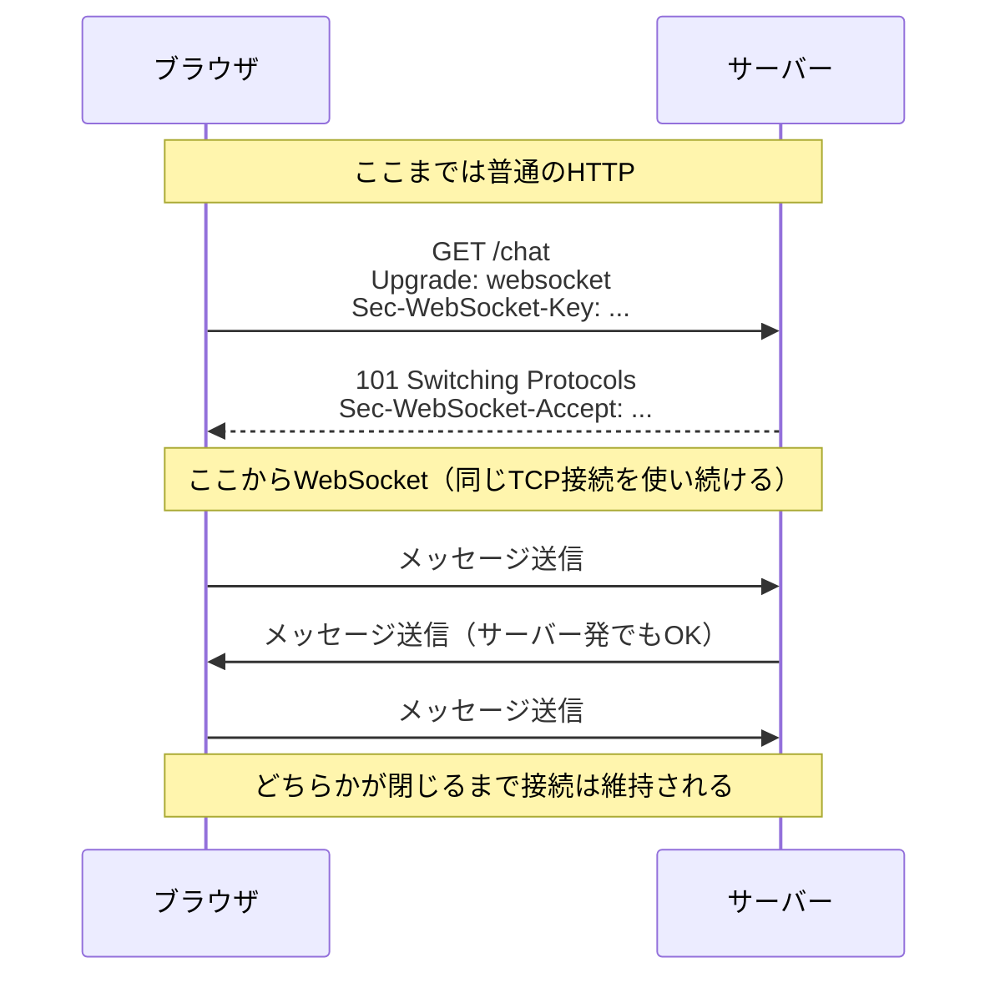

# WebSocketの基礎

前のページ[リアルタイム通信とは](/realtime/what_is_realtime/)で、WebSocketは「最初の1回だけHTTPで合図を交わし、その後は双方向の通信路に切り替える」方式だと学びました。このページでは、その「合図」であるハンドシェイクの中身を確認したうえで、実際にWebSocketのサーバーとクライアントを自分の手で動かします。

サーバーはNode.jsの`ws`（ダブリューエス）パッケージで、クライアントはブラウザに標準で備わっているWebSocket APIで作ります。ライブラリの便利な機能に頼らない「素のWebSocket」を一度体験しておくと、次のページで使うSocket.IOが何を肩代わりしてくれているのかが見えるようになります。

## 学習目標

- WebSocketのハンドシェイク（プロトコルのアップグレード）の流れを説明できる
- `ws://`と`wss://`の違いを説明できる
- Node.jsの`ws`パッケージで最小のWebSocketサーバーを書ける
- ブラウザのWebSocket APIで接続・送信・受信ができる
- 素のWebSocketに足りないもの（再接続など）を挙げられる

## ハンドシェイク — HTTPからWebSocketへの切り替え

WebSocketの接続は、意外なことに**普通のHTTPリクエストから始まります**。ただし、そのリクエストには「この接続をWebSocketに切り替えたい」という特別なヘッダーが付いています。

[HTTPとREST](/backend/http_and_rest/)で学んだヘッダーの知識を思い出しながら、実際にやり取りされる内容を見てみましょう。

**クライアントが送るリクエスト（抜粋）:**

```
GET /chat HTTP/1.1
Host: localhost:3000
Upgrade: websocket
Connection: Upgrade
Sec-WebSocket-Key: dGhlIHNhbXBsZSBub25jZQ==
Sec-WebSocket-Version: 13
```

**サーバーが返すレスポンス（抜粋）:**

```
HTTP/1.1 101 Switching Protocols
Upgrade: websocket
Connection: Upgrade
Sec-WebSocket-Accept: s3pPLMBiTxaQ9kYGzzhZRbK+xOo=
```

**コード解説**

- `Upgrade: websocket` — 「この接続をHTTPからWebSocketに切り替えたい」という意思表示です。この仕組みからWebSocketへの切り替えを「アップグレード」と呼びます。
- `Connection: Upgrade` — `Upgrade`ヘッダーが有効であることを示すおまけのヘッダーです。セットで送ります。
- `Sec-WebSocket-Key` — クライアントが生成するランダムな値です。サーバーはこの値から決まった計算で`Sec-WebSocket-Accept`を作って返します。これにより、クライアントは「相手が本当にWebSocketを理解するサーバーである」と確認できます。
- `101 Switching Protocols` — 見慣れない状態コードですが、意味はそのまま「プロトコルを切り替えます」です。200番台でも400番台でもない、切り替え専用のコードです。

この往復をシーケンス図にすると次のようになります。



重要なのは、ハンドシェイクが終わった後も**同じ接続をそのまま使い続ける**点です。新しい接続を張り直すのではなく、HTTPとして始まった1本の通信路が、途中からWebSocketの通信路に「変身」します。以降はリクエスト/レスポンスという形式から解放され、お互いが好きなタイミングでデータの断片（フレームと呼びます）を送り合えるようになります。

### ws:// と wss://

WebSocketのURLは`http://`ではなく`ws://`で始まります。暗号化された接続は`wss://`です。対応関係は次のとおりです。

| 通常のHTTP | WebSocket | 暗号化 |
|---|---|---|
| `http://` | `ws://` | なし |
| `https://` | `wss://` | あり（TLS） |

ローカル開発では`ws://`を使いますが、本番環境では必ず`wss://`を使います。`https://`のページから`ws://`（暗号化なし）への接続はブラウザにブロックされるため、本番では選択の余地なく`wss://`になると覚えておいてください。

## 手を動かす — 最小のエコーアプリを作る

仕組みがわかったところで、実際にWebSocketを動かしてみましょう。作るのは**エコーサーバー**です。クライアントから受け取ったメッセージを、そのまま送り返すだけの最小構成ですが、「双方向の通信路ができている」ことを確認するには十分です。

### プロジェクトの準備

ターミナルで作業用ディレクトリを作り、pnpmでプロジェクトを初期化して`ws`パッケージをインストールします（pnpmの導入は[実践: フルスタックTodoアプリ](/fullstack-todo/setup/)を参照）。

```bash
mkdir websocket-echo
cd websocket-echo
pnpm init
pnpm add ws
```

実行結果の例:

```
Packages: +1
+
Progress: resolved 1, reused 1, downloaded 0, added 1, done

dependencies:
+ ws 8.18.0
```

`ws`は、Node.jsでWebSocketサーバー（およびクライアント）を作るための定番パッケージです。ブラウザにはWebSocket APIが標準で備わっていますが、Node.jsには標準のWebSocket**サーバー**機能がないため、このパッケージを使います。

次に、`package.json`を開いて`"type": "module"`を追加します。これでこのプロジェクトでは`import`構文が使えるようになります。

**`package.json`**（該当部分のみ）

```json
{
  "name": "websocket-echo",
  "version": "1.0.0",
  "type": "module"
}
```

### サーバーを書く

プロジェクト直下に`server.js`を作成します。今回はコンパイルの手間を省くため、TypeScriptではなくJavaScriptで直接書きます（わずか10行ほどの実験用コードなので、型の恩恵よりも手軽さを優先します）。

**`server.js`**

```javascript
import { WebSocketServer } from 'ws';

const wss = new WebSocketServer({ port: 3000 });

wss.on('connection', (ws) => {
  console.log('クライアントが接続しました');

  ws.on('message', (data) => {
    console.log(`受信: ${data}`);
    ws.send(`エコー: ${data}`);
  });

  ws.on('close', () => {
    console.log('クライアントが切断しました');
  });
});

console.log('WebSocketサーバーを ws://localhost:3000 で起動しました');
```

**コード解説**

- `import { WebSocketServer } from 'ws';` — `ws`パッケージからサーバー用のクラスを読み込みます。
- `new WebSocketServer({ port: 3000 })` — ポート3000でWebSocketサーバーを起動します。前のセクションで説明したハンドシェイク（`Upgrade`ヘッダーの処理や`Sec-WebSocket-Accept`の計算）は、このクラスがすべて自動でやってくれます。
- `wss.on('connection', (ws) => { ... })` — クライアントとのハンドシェイクが完了するたびに呼ばれます。引数の`ws`が「そのクライアントとの接続」を表すオブジェクトで、クライアントごとに別のものが渡されます。
- `ws.on('message', (data) => { ... })` — そのクライアントからメッセージが届いたときに呼ばれます。
- `ws.send(...)` — そのクライアントへメッセージを送ります。サーバーから**いつでも**呼べるのがWebSocketの特徴ですが、今回は受信した直後に送り返しています。
- `ws.on('close', ...)` — クライアントが切断したときに呼ばれます。

サーバーを起動しましょう。

```bash
node server.js
```

実行結果の例:

```
WebSocketサーバーを ws://localhost:3000 で起動しました
```

このターミナルは起動したままにしておきます。

### クライアントを書く — ブラウザのWebSocket API

次はクライアント側です。ブラウザには`WebSocket`というクラスが標準で備わっており、ライブラリなしでWebSocket接続を扱えます。プロジェクト直下に`client.html`を作成します。

**`client.html`**

```html
<!DOCTYPE html>
<html lang="ja">
<head>
  <meta charset="UTF-8" />
  <title>WebSocketエコーテスト</title>
</head>
<body>
  <h1>WebSocketエコーテスト</h1>
  <p>状態: <span id="status">接続中...</span></p>
  <input id="input" type="text" placeholder="送信するメッセージ" />
  <button id="send">送信</button>
  <ul id="log"></ul>

  <script>
    const status = document.getElementById('status');
    const input = document.getElementById('input');
    const sendButton = document.getElementById('send');
    const log = document.getElementById('log');

    function addLog(text) {
      const li = document.createElement('li');
      li.textContent = text;
      log.appendChild(li);
    }

    // ここからWebSocket本体
    const socket = new WebSocket('ws://localhost:3000');

    socket.addEventListener('open', () => {
      status.textContent = '接続済み';
    });

    socket.addEventListener('message', (event) => {
      addLog(`受信: ${event.data}`);
    });

    socket.addEventListener('close', () => {
      status.textContent = '切断されました';
    });

    socket.addEventListener('error', () => {
      status.textContent = 'エラーが発生しました';
    });

    sendButton.addEventListener('click', () => {
      socket.send(input.value);
      addLog(`送信: ${input.value}`);
      input.value = '';
    });
  </script>
</body>
</html>
```

**コード解説**

- `new WebSocket('ws://localhost:3000')` — この1行でハンドシェイクが始まります。URLが`http://`ではなく`ws://`である点に注意してください。
- `open`イベント — ハンドシェイクが完了し、送受信できる状態になったときに発火します。`socket.send()`は`open`より前に呼ぶとエラーになるため、接続完了を待ってから送信するのが基本です。
- `message`イベント — サーバーからデータが届いたときに発火します。届いた内容は`event.data`に入っています。
- `close` / `error`イベント — 切断やエラーを検知できます。素のWebSocketでは、切断されても**自動では再接続されません**。この点は後で重要になります。
- `socket.send(input.value)` — 入力欄の文字列をサーバーへ送ります。

### 動かしてみる

`client.html`をブラウザで開きます。Finder（Macの場合）からダブルクリックで開くか、VS Codeの[Live Preview](/environment/live_preview/)で開いても構いません。

1. ページを開くと、状態表示が「接続中...」から「接続済み」に変わります。同時に、サーバー側のターミナルに`クライアントが接続しました`と表示されるはずです。
2. 入力欄に「こんにちは」と入力して送信ボタンを押すと、画面のログに次のように表示されます。

```
送信: こんにちは
受信: エコー: こんにちは
```

サーバー側のターミナルにも`受信: こんにちは`と表示されます。

たったこれだけ、と感じるかもしれませんが、裏側では「HTTPでハンドシェイク → 101でアップグレード → 双方向の通信路でデータをやり取り」という、このページの前半で学んだ流れがすべて動いています。

### 開発者ツールでハンドシェイクを覗いてみる

仕組みを目で確かめておきましょう。ブラウザの開発者ツール（Macは`Cmd + Option + I`、Windowsは`F12`）を開き、**Network**タブを表示した状態でページを再読み込みします。

`localhost`への通信の中に、種類が`websocket`となっている行があるはずです。それをクリックして**Headers**を見ると、リクエストヘッダーに`Upgrade: websocket`と`Sec-WebSocket-Key`、レスポンスに`101 Switching Protocols`が確認できます。さらに**Messages**（ブラウザによっては**Frames**）タブを開くと、送受信したメッセージの一覧がリアルタイムで流れていきます。

WebSocketの挙動を調べるとき、この画面は今後も頼りになります。場所を覚えておいてください。

## 素のWebSocketに足りないもの

エコーアプリは動きましたが、これを実際のチャットアプリに育てようとすると、すぐにいくつかの壁にぶつかります。

- **自動再接続がない** — Wi-Fiが一瞬切れたりサーバーが再起動したりすると接続は閉じ、`close`イベントが発火して終わりです。再接続のロジック（何秒後に再試行するか、何回まで試すかなど）はすべて自前で書く必要があります。
- **メッセージに「種類」の概念がない** — 届くのは生のデータだけです。「これはチャットメッセージ」「これは入室通知」のような区別をしたければ、JSONに`type`フィールドを持たせて自分で振り分ける仕組みを作ることになります。
- **「特定のグループだけに送る」仕組みがない** — サーバーは接続中のクライアントを自分で管理し、「ルームAにいる人にだけ送る」といった配信先の制御をすべて自前で実装する必要があります。

これらは決して実装不可能ではありませんが、どのチャットアプリでも必要になる「お決まりの処理」です。そこで実務では、これらをまとめて面倒見てくれるライブラリ**Socket.IO**がよく使われます。次のページで、NestJSとSocket.IOを組み合わせてミニチャットを作りながら、これらの問題がどう解決されるかを見ていきます。

## 理解度チェック

**Q1. WebSocketのハンドシェイクで、クライアントは`Upgrade: websocket`ヘッダー付きのHTTPリクエストを送ります。サーバーが切り替えを了承したとき、どんな状態コードのレスポンスが返りますか。**

<details markdown="1">
<summary>解答を見る</summary>

`101 Switching Protocols`です。200（成功）でも300番台（リダイレクト）でもなく、「プロトコルを切り替える」ことを表す専用の状態コードです。このレスポンスの後、同じ接続がWebSocketの通信路として使われ続けます。

</details>

**Q2. `ws://`と`wss://`の違いは何ですか。また、本番環境ではどちらを使うべきですか。**

<details markdown="1">
<summary>解答を見る</summary>

`ws://`は暗号化なし、`wss://`はTLSで暗号化された接続です。`http://`と`https://`の関係に対応します。本番環境では`wss://`を使います。そもそも`https://`で配信されたページからは`ws://`への接続がブラウザにブロックされるため、本番では実質的に`wss://`一択です。

</details>

**Q3. ブラウザのWebSocket APIで、`socket.send()`を呼んでよいのはどのイベントが発火した後ですか。理由も説明してください。**

<details markdown="1">
<summary>解答を見る</summary>

`open`イベントの後です。`new WebSocket(...)`を実行した時点ではハンドシェイクが進行中であり、まだ送受信できる状態になっていません。ハンドシェイクが完了して通信路が確立したことを知らせるのが`open`イベントなので、それより前に`send()`を呼ぶとエラーになります。

</details>

**Q4. 今回のエコーサーバーで、`wss.on('connection', ...)`のコールバックに渡される`ws`オブジェクトは何を表していますか。クライアントが3人接続した場合はどうなりますか。**

<details markdown="1">
<summary>解答を見る</summary>

`ws`は「1人のクライアントとの接続」を表すオブジェクトです。クライアントが3人接続すれば、`connection`イベントは3回発火し、それぞれ別の`ws`オブジェクトが渡されます。`ws.send()`はそのクライアントだけに届くため、全員に送りたい場合はサーバー側で接続の一覧を管理して全員分の`send()`を呼ぶ必要があります。

</details>

**Q5. 素のWebSocketでチャットアプリを作るときに、自前で実装しなければならない「お決まりの処理」を2つ挙げてください。**

<details markdown="1">
<summary>解答を見る</summary>

例として、(1) 切断時の自動再接続（素のWebSocketは切れたら切れたままで、再試行の間隔や回数の制御も含めて自前実装になる）、(2) メッセージの種類の区別（届くのは生データだけなので、JSONに`type`フィールドを持たせて振り分ける仕組みが必要）、(3) 特定のグループへの配信制御（接続中クライアントの管理と配信先の絞り込み）などがあります。これらをまとめて解決してくれるのが、次のページで学ぶSocket.IOです。

</details>

## セルフレビュー

- [ ] ハンドシェイクの流れ（Upgradeヘッダー → 101レスポンス → 双方向通信）をシーケンス図で描ける
- [ ] 「アップグレード」という言葉が何を指すのか自分の言葉で説明できる
- [ ] `ws://`と`wss://`の違いと使い分けを説明できる
- [ ] `ws`パッケージで最小のエコーサーバーを写経せずに書ける
- [ ] ブラウザのWebSocket APIの4つのイベント（open / message / close / error）の役割を説明できる
- [ ] 開発者ツールのNetworkタブでWebSocketのハンドシェイクとメッセージを確認できる
- [ ] 素のWebSocketに足りないものを2つ以上挙げられる

## 次のステップ

WebSocketの仕組みと素のAPIの感触がつかめました。次の[NestJSのGatewayでチャットを作る](/realtime/nestjs_gateway/)では、Socket.IOとNestJSのGateway機能を使って、複数人で会話できるミニチャットを作ります。このページの最後に挙げた「足りないもの」が、ライブラリによってどれだけ簡潔に解決されるかに注目してください。

ここで学んだハンドシェイクの知識は、[SNSのDMチャット](/sns/chat/)で通信がうまくいかないときのデバッグ（開発者ツールでの確認）にも役立ちます。
