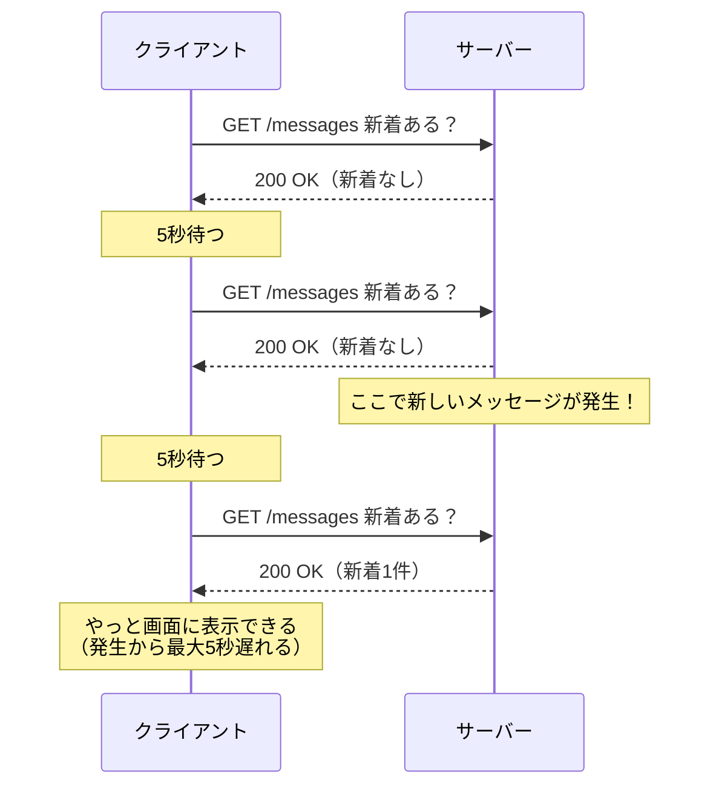
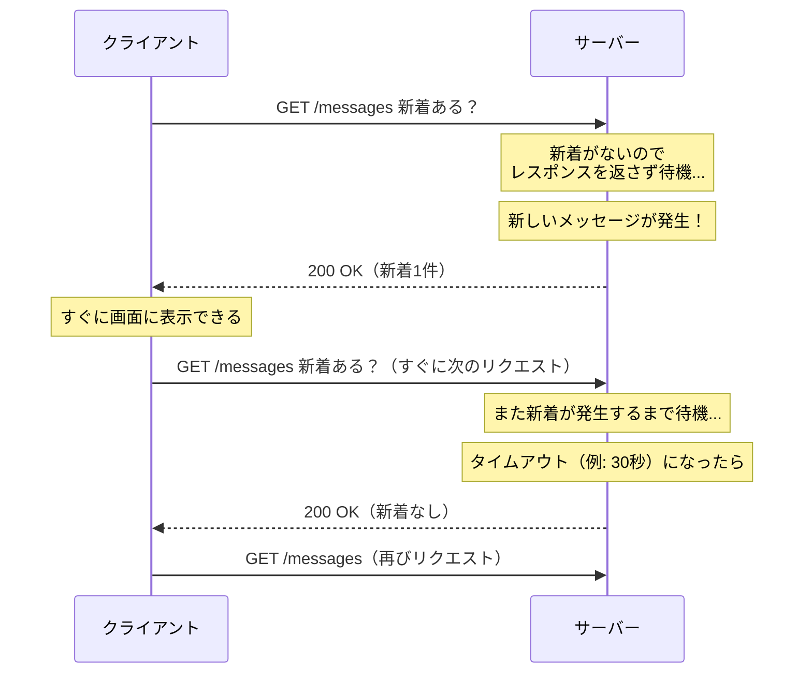
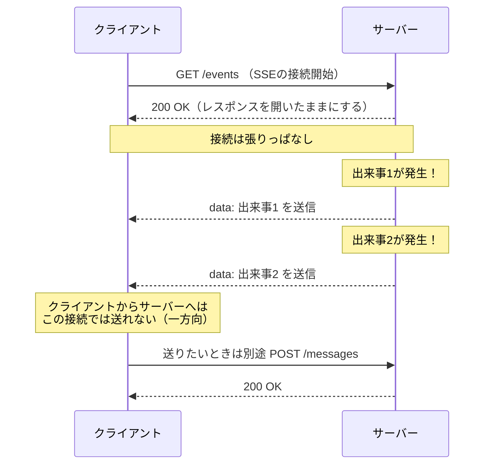
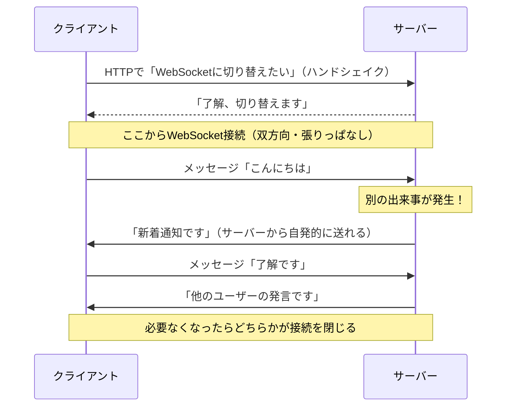

# リアルタイム通信とは

このページでは、「サーバーで起きた出来事をすぐにクライアントへ届ける」ための4つの方式 — ポーリング、ロングポーリング、SSE、WebSocket — を学びます。それぞれの通信の流れをシーケンス図で比較し、なぜ現代のチャットアプリでWebSocketがよく使われるのかを理解することがゴールです。

[HTTPとREST](/backend/http_and_rest/)で学んだとおり、HTTPは「クライアントが聞く → サーバーが答える」の繰り返しでした。まずは、このモデルのどこに限界があるのかから確認していきます。

## 学習目標

- 通常のHTTP通信だけではリアルタイム通信が難しい理由を説明できる
- ポーリング、ロングポーリング、SSE、WebSocketの通信の流れをシーケンス図で説明できる
- 4つの方式それぞれの長所と短所を比較できる
- 用途に応じてどの方式を選ぶべきか、判断の基準を持てる

## HTTPの「クライアント主導」という性質

HTTPの通信は、必ずクライアントから始まります。

1. クライアントがリクエストを送る
2. サーバーがレスポンスを返す
3. 通信が終わる

サーバーは、リクエストが来ない限り何もできません。レスポンスを返したら、その通信はそこで終わりです。サーバーの側から「ねえ、新しいメッセージが届いたよ」とクライアントに話しかける手段が、そもそも用意されていないのです。

これで困るのは、たとえば次のような機能を作るときです。

- **チャット**: 相手がメッセージを送った瞬間に、自分の画面に表示したい
- **通知**: 誰かが自分の投稿に「いいね」した瞬間に、ベルのアイコンに印をつけたい
- **共同編集**: 他の人が書いた変更を、すぐに自分の画面にも反映したい

どれも「サーバー側で起きた出来事を、クライアントが**何もしなくても**届けてほしい」という要求です。これをどう実現するか。先人たちが考えてきた方式を、古いものから順に見ていきましょう。

## 方式1: ポーリング

ポーリング（polling、ポーリング）は、最も素朴な方式です。「サーバーから話しかけられないなら、クライアントが何度も聞きに行けばいい」という発想で、クライアントが一定間隔（たとえば5秒ごと）でサーバーに「新着ある？」とリクエストを送り続けます。



図を見ると、2つの問題がわかります。

- **遅延がある**: メッセージが発生しても、次のポーリングのタイミングまでクライアントは気づけません。間隔が5秒なら、最大5秒遅れます。
- **無駄が多い**: 新着がなくても、リクエストとレスポンスの往復が発生し続けます。1000人のユーザーが5秒ごとにポーリングすれば、サーバーは毎秒200回の「新着なし」を返すことになります。

間隔を1秒に縮めれば遅延は減りますが、その分無駄なリクエストが増えます。遅延と負荷がトレードオフ（一方を改善するともう一方が悪化する関係）になっているのが、ポーリングの宿命です。

ただし、ポーリングには「**仕組みが単純で、普通のHTTPだけで実現できる**」という大きな利点があります。実は[React基礎のfetchでAPI通信](/react/api_fetch/)の知識だけで実装できます。`setInterval`でfetchを繰り返すだけだからです。「1分に1回更新されれば十分」というダッシュボードのような画面なら、今でもポーリングは合理的な選択です。

## 方式2: ロングポーリング

ロングポーリング（long polling、ロングポーリング）は、ポーリングの「無駄な往復」を減らす工夫です。発想を少し変えて、サーバーは「新着がなければ、**すぐには返事をせず、新着が発生するまでレスポンスを保留する**」ようにします。



クライアントは、レスポンスを受け取ったらすぐに次のリクエストを送ります。こうすると「サーバーが返事を保留している間」は常にリクエストが1本つながっている状態になり、新着が発生した瞬間にレスポンスとして届けられます。

- **長所**: 遅延がほぼなくなる。新着が発生した瞬間に届く。
- **短所**: サーバーは大量の「返事待ちリクエスト」を抱え続けることになり、接続管理が複雑になる。また、レスポンスを返すたびに接続を張り直すオーバーヘッド（やり取りに伴う余分な処理コスト）は残る。

ロングポーリングは、WebSocketが普及する前のチャットサービスで広く使われていた方式です。後で学ぶSocket.IOも、WebSocketが使えない環境ではロングポーリングに自動的に切り替えて動作します。古い技術に見えて、今も現役の「保険」として機能しているのです。

## 方式3: SSE（Server-Sent Events）

SSE（Server-Sent Events、サーバーセントイベント）は、「サーバーからクライアントへの一方向の push（プッシュ、送りつけ）」を、HTTPの仕組みの上で標準化したものです。

クライアントが一度リクエストを送ると、サーバーはレスポンスを「終わらせずに」開きっぱなしにして、新しい出来事が発生するたびにデータを少しずつ流し続けます。蛇口を開けたまま、水が出るたびに受け取るイメージです。



ブラウザには`EventSource`という専用のAPIが標準で用意されており、数行でSSEを受信できます。接続が切れたときの自動再接続もブラウザが面倒を見てくれます。

- **長所**: 仕組みがHTTPそのものなので扱いやすい。サーバー→クライアントの通知が低遅延で届く。自動再接続が標準装備。
- **短所**: **一方向**である。クライアントからサーバーへ送りたいときは、図のように別途通常のHTTPリクエストを送る必要がある。

「サーバーからの通知を受け取りたいだけ」の用途、たとえばニュース速報の配信、進捗バーの更新、AIチャットの返答をストリーミング表示する場面などでは、SSEは今もよく選ばれます。実際、後の[AIチャット開発（RAG）](/ai-chat/)セクションで扱うClaude APIのストリーミングも、SSEの仕組みで実現されています。

## 方式4: WebSocket

WebSocket（ウェブソケット）は、ここまでの方式とは根本的に異なるアプローチです。最初の1回だけHTTPで「これからWebSocketに切り替えます」という合図（ハンドシェイク）を交わし、その後は**HTTPではない双方向の通信路**に切り替えてしまいます。

一度通信路が確立すると、クライアントとサーバーは**どちらからでも、いつでも、何度でも**データを送り合えます。電話をつなぎっぱなしにして会話するイメージです。



- **長所**: 双方向・低遅延。一度接続すればリクエスト/レスポンスのオーバーヘッドがなく、小さなデータを高頻度でやり取りするのに向く。チャット、オンラインゲーム、共同編集など「お互いに送り合う」用途に最適。
- **短所**: HTTPとは別の仕組みなので、サーバー側に専用の実装が必要。接続を維持し続けるため、サーバーは「今つながっている全クライアント」を管理する必要がある。

このカリキュラムの最終プロジェクトで作る[SNSのDMチャット](/sns/chat/)は、まさに「お互いにメッセージを送り合う」機能なので、WebSocketを採用します。

## 4方式の比較まとめ

ここまでの4方式を表で整理します。

| 方式 | 方向 | 遅延 | 無駄な通信 | 実装の手軽さ | 向いている用途 |
|---|---|---|---|---|---|
| ポーリング | クライアント→サーバーの繰り返し | 間隔ぶん遅れる | 多い | とても簡単 | 更新頻度が低いダッシュボードなど |
| ロングポーリング | クライアント→サーバー（返事を保留） | 小さい | 中程度 | やや複雑 | WebSocketが使えない環境の代替 |
| SSE | サーバー→クライアントの一方向 | 小さい | 少ない | 簡単 | 通知、ストリーミング表示 |
| WebSocket | 双方向 | 小さい | 少ない | 専用実装が必要 | チャット、ゲーム、共同編集 |

選び方の目安は次のとおりです。

- 数十秒〜数分遅れても問題ない → **ポーリング**で十分
- サーバーからの通知を受け取るだけでよい → **SSE**
- 双方向にリアルタイムでやり取りしたい → **WebSocket**
- ロングポーリングは、自分でゼロから選ぶことは少なく、Socket.IOなどのライブラリが「WebSocketが使えないときの代替」として内部で使う

「リアルタイム＝常にWebSocket」ではない、という点は覚えておいてください。WebSocketは強力ですが、接続の維持や再接続の処理などサーバー・クライアント双方の実装が複雑になります。要件がポーリングやSSEで満たせるなら、単純な方式を選ぶほうが保守しやすいシステムになります。

## 手を動かす — ポーリングを体験してみる

概念の比較ができたところで、4方式のうち今すぐ手持ちの知識だけで作れる「ポーリング」を実際に体験してみましょう。題材として、[バックエンド基礎のCRUD実践](/backend/crud_practice/)で作ったメモAPI（`GET /memos`でメモ一覧を返すNestJSサーバー）が`http://localhost:3000`で起動しているものとします。

ただし、準備が1つ必要です。これから作るHTMLファイルはWebサーバーを介さずブラウザで直接開くため、メモAPIとは別のオリジンからのfetchになり、そのままではブラウザに通信をブロックされてしまいます。メモAPIの`src/main.ts`に`app.enableCors();`を1行追加して、サーバーを再起動しておいてください。

**`src/main.ts`（メモAPI側に追記）**

```typescript
async function bootstrap() {
  const app = await NestFactory.create(AppModule);
  app.enableCors(); // この1行を追加
  await app.listen(3000);
}
```

- `app.enableCors()` — 別のオリジンからのリクエストをサーバーが受け付けるようにする設定です。ブラウザで`file://`として直接開いたページのoriginは`null`になるため、特定のoriginを指定する書き方ではなく、引数なしの`enableCors()`を使います。この仕組みの詳細は[CORSとプロキシ](/fullstack-todo/integration/)で学びます。

ブラウザだけで試せるよう、次のHTMLファイルを作ります。場所はどこでも構いません（例: デスクトップに`polling.html`）。

**`polling.html`**

```html
<!DOCTYPE html>
<html lang="ja">
<head>
  <meta charset="UTF-8" />
  <title>ポーリングの実験</title>
</head>
<body>
  <h1>メモ一覧（5秒ごとに自動更新）</h1>
  <p>最終取得: <span id="time">-</span></p>
  <ul id="list"></ul>

  <script>
    async function fetchMemos() {
      const response = await fetch('http://localhost:3000/memos');
      const memos = await response.json();

      const list = document.getElementById('list');
      list.innerHTML = '';
      for (const memo of memos) {
        const li = document.createElement('li');
        li.textContent = memo.title;
        list.appendChild(li);
      }
      document.getElementById('time').textContent =
        new Date().toLocaleTimeString();
    }

    fetchMemos(); // まず1回取得
    setInterval(fetchMemos, 5000); // 以降は5秒ごとに繰り返す
  </script>
</body>
</html>
```

**コード解説**

- `fetchMemos()` — メモ一覧を取得して画面のリストを描き直す関数です。中身は[fetchでAPI通信](/react/api_fetch/)で学んだことと同じです。
- `setInterval(fetchMemos, 5000)` — この1行がポーリングの正体です。「5秒ごとに聞きに行く」を実現しているのは、ただのタイマーです。
- `innerHTML = ''`で一度リストを空にしてから作り直しています。簡易な実験用の書き方で、Reactで作る場合はstateの更新に置き換わります。

このファイルをブラウザで開いた状態で、別のターミナルからメモを追加してみてください。

```bash
curl -X POST http://localhost:3000/memos \
  -H "Content-Type: application/json" \
  -d '{"title": "ポーリングの実験"}'
```

追加した瞬間には画面は変わらず、**次の5秒のタイミングで**新しいメモが現れるはずです。ブラウザの開発者ツールのNetworkタブを開くと、5秒ごとに`/memos`へのリクエストが積み重なっていく様子も観察できます。内容が何も変わっていなくてもリクエストが発生し続けること、そして反映が最大5秒遅れること — シーケンス図で見たポーリングの性質が、そのまま目の前で再現されます。

この「遅れ」と「無駄」を取り除いたものが、次のページから学ぶWebSocketです。

## このカリキュラムではどれを使うか

最終プロジェクトのSNSアプリでは、機能ごとに必要なリアルタイム性が異なります。このセクションで学んだ判断基準を当てはめると、次のようになります。

- **タイムラインや「いいね」の数** — 画面を開いたとき・操作したときに取得すれば十分なので、**通常のHTTP（fetch）**のままにします。すべてをリアルタイムにする必要はありません。
- **DMチャット** — 相手の発言が即座に届き、自分も送る双方向の機能なので、**WebSocket**を使います（[SNSのDMチャット](/sns/chat/)で実装します）。

また、[AIチャット開発（RAG）](/ai-chat/)セクションでは、AIの返答を1文字ずつ流すストリーミング表示に**SSE**の仕組みが登場します。1つのアプリの中でも、機能ごとに適切な方式を選び分けるのが実務の感覚です。

## 理解度チェック

**Q1. 通常のHTTP通信だけでは、チャットの「相手のメッセージが即座に届く」機能を素直に実現できません。その理由をHTTPの性質から説明してください。**

<details markdown="1">
<summary>解答を見る</summary>

HTTPの通信は必ずクライアントのリクエストから始まり、サーバーはレスポンスを返したら通信が終了するためです。サーバー側で「新しいメッセージが届いた」という出来事が起きても、サーバーからクライアントへ自発的に通知を送る手段がHTTPには用意されていません。クライアントが聞きに来ない限り、サーバーは新着を伝えられないのです。

</details>

**Q2. ポーリングの間隔を5秒から1秒に縮めると、何が改善され、何が悪化しますか。**

<details markdown="1">
<summary>解答を見る</summary>

改善されるのは遅延です。新着が発生してからクライアントが気づくまでの時間が、最大5秒から最大1秒に縮まります。悪化するのはサーバーの負荷です。リクエストの回数が5倍になり、その大半は「新着なし」を返すだけの無駄な通信になります。ポーリングでは遅延と負荷がトレードオフの関係にあります。

</details>

**Q3. ロングポーリングは、通常のポーリングとどこが違いますか。サーバーの振る舞いに注目して説明してください。**

<details markdown="1">
<summary>解答を見る</summary>

通常のポーリングではサーバーは新着がなくても即座に「新着なし」を返しますが、ロングポーリングではサーバーは新着が発生するまで（またはタイムアウトまで）レスポンスを返さずに保留します。これにより、新着が発生した瞬間にレスポンスとして届けられるため遅延がほぼなくなり、「新着なし」を返すだけの無駄な往復も減ります。

</details>

**Q4. SSEとWebSocketの最も大きな違いは何ですか。また、SSEが向いている用途を1つ挙げてください。**

<details markdown="1">
<summary>解答を見る</summary>

最も大きな違いは通信の方向です。SSEはサーバーからクライアントへの一方向のみで、クライアントから送りたい場合は別途通常のHTTPリクエストが必要です。WebSocketは双方向で、どちらからでもデータを送れます。SSEが向いている用途の例は、ニュース速報の配信や通知、AIチャットの返答のストリーミング表示など、「サーバーからの情報を受け取るだけでよい」場面です。

</details>

**Q5. 「株価を1分ごとに更新して表示する管理画面」を作るとしたら、4方式のうちどれを選びますか。理由も説明してください。**

<details markdown="1">
<summary>解答を見る</summary>

ポーリングが適切です。1分ごとの更新で十分という要件なら、`setInterval`とfetchだけで実装でき、WebSocketやSSEのような接続維持の仕組みを導入する複雑さに見合いません。リアルタイム性の要件が緩いときは、最も単純な方式を選ぶのが保守性の面でも合理的です。

</details>

## セルフレビュー

- [ ] HTTPが「クライアント主導」であることの意味を自分の言葉で説明できる
- [ ] ポーリングのシーケンス図を、何も見ずに自分で描ける
- [ ] ロングポーリングで「サーバーがレスポンスを保留する」ことの効果を説明できる
- [ ] SSEが一方向であること、双方向にしたい場合の補い方を説明できる
- [ ] WebSocketが「最初だけHTTP、その後は双方向の通信路」であることを説明できる
- [ ] 4方式の使い分けの基準を、具体的なアプリの例を挙げて説明できる

## 次のステップ

4つの方式の全体像がつかめたら、次は本命のWebSocketを深掘りします。[WebSocketの基礎](/realtime/websocket_basics/)では、ハンドシェイクの中身を確認し、実際にブラウザとNode.jsでWebSocketのエコーアプリを動かします。

ここで学んだ方式の比較は、最終プロジェクトの[SNSのDMチャット](/sns/chat/)で「なぜWebSocketを選ぶのか」を判断する根拠になります。
