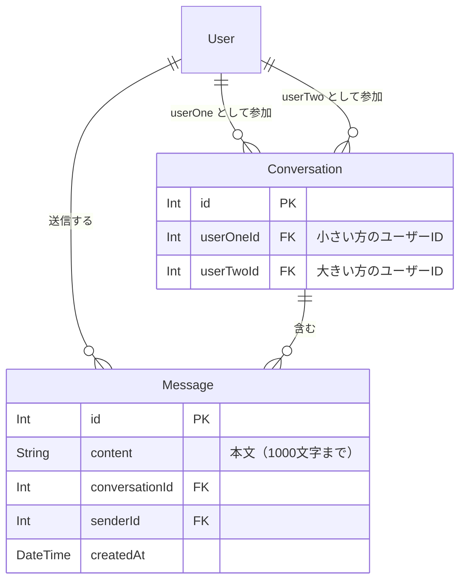
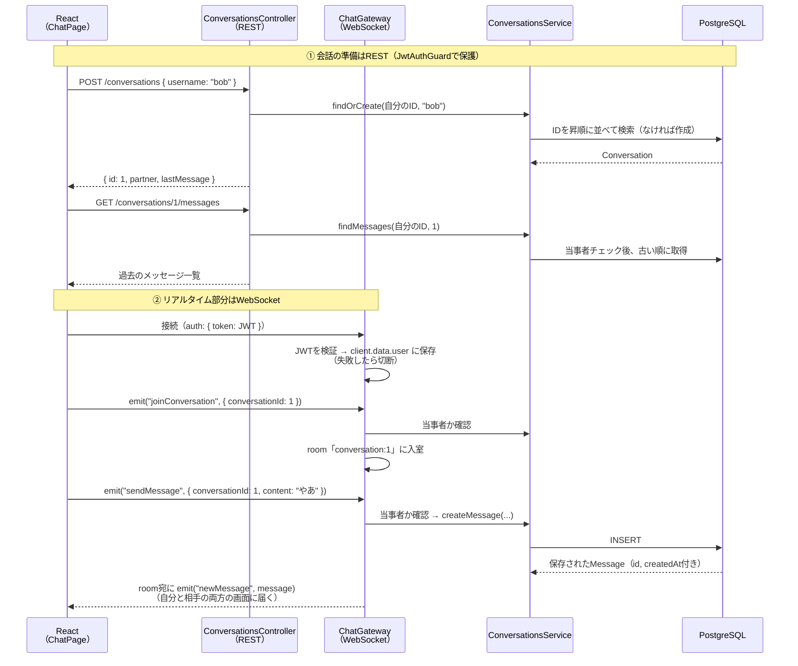

# DMチャット（リアルタイム）

[フォローとフォロー中タイムライン](/sns/follow/)までに作った機能は、すべて「ユーザーが画面を開いた（リロードした）ときにAPIから取得する」という方式でした。タイムラインはこれで十分です。しかしDM（ダイレクトメッセージ）のチャットは事情が違います。相手の発言は、リロードしなくても**その瞬間に**自分の画面へ現れてほしいからです。[リアルタイム通信とは](/realtime/what_is_realtime/)で学んだとおり、こうした「サーバー起点のプッシュ」にはHTTPのリクエスト/レスポンスモデルでは限界があり、**WebSocket**（→ [WebSocketの基礎](/realtime/websocket_basics/)）の出番になります。

このページでは、[NestJSのGatewayでチャットを作る](/realtime/nestjs_gateway/)で作ったミニチャットを土台に、SNSの1対1DMチャットを実装します。あのページの最後で予告したとおり、追加するのは次の3点です。

1. **認証** — JWT（→ [ユーザー登録とログイン（JWT認証）](/sns/auth/)）で本人確認してから接続を許可する
2. **永続化** — メッセージをPrismaでデータベースに保存し、過去の履歴も表示する
3. **1対1のroom設計** — 会話ごとのroomに当事者2人だけを入れる

## 学習目標

- 1対1の会話を表すConversation/Messageモデルを設計し、「IDの昇順に正規化 + 複合unique」で重複会話を防げる
- 「履歴の取得はREST、リアルタイム配信はWebSocket」という役割分担とその理由を説明できる
- HTTPのGuardがWebSocket接続には効かない理由を説明し、handshakeのトークンを自前で検証できる
- roomと当事者チェックを組み合わせて「会話の2人だけに届く」配信を実装できる
- Reactでsocket.io-clientを使い、useEffectのクリーンアップを含めたチャット画面を実装できる

## データ設計 — ConversationとMessage

DMに必要なテーブルは2つです。

- **Conversation**（カンバセーション、会話）— 「aliceとbobの会話」のような**2人の組**を表す行。チャットの部屋に相当します。
- **Message**（メッセージ）— 会話の中の発言1つ1つ。どの会話に属するか（conversationId）と、誰が送ったか（senderId）を持ちます。



ConversationがUserに**2本の線**でつながっている点は、[フォロー](/sns/follow/)のFollowテーブルと同じ構図です（会話も「ユーザーとユーザーの関係」だからです）。したがってここでも名前付きリレーション（`"UserOne"` / `"UserTwo"`）が必要になります。

### userOneId < userTwoId という正規化の規約

Followと違い、会話には**向きがありません**。「aliceとbobの会話」と「bobとaliceの会話」は同じものです。ところが素朴に作ると、`(userOneId: 1, userTwoId: 2)`と`(userOneId: 2, userTwoId: 1)`という**2つの行がどちらも作れて**しまい、同じ2人の会話が2部屋に分裂する事故が起きます。aliceが送ったメッセージは部屋Aに、bobの返信は部屋Bに保存される、という悲惨な状態です。

そこで次の規約を導入します。

> 会話を保存するときは、**必ず小さい方のユーザーIDをuserOneIdに、大きい方をuserTwoIdに**入れる。

aliceのID=1、bobのID=2なら、どちらから会話を始めても保存されるのは`(userOneId: 1, userTwoId: 2)`の1通りだけです。このようにデータの表現を1通りに揃えることを**正規化**（せいきか）と呼びます。さらに`@@unique([userOneId, userTwoId])`を付けることで、万一プログラムのミスで同じ組を2回作ろうとしても、データベースが制約違反として拒否してくれます。**アプリのコードの規約（昇順に並べる）+ データベースの制約（unique）の二段構え**で重複会話を防ぐわけです。

## スキーマ差分とマイグレーション

`backend/prisma/schema.prisma`に2モデルを追加し、Userモデルにリレーションフィールドを3行追記します。

**`backend/prisma/schema.prisma`**（差分。Userモデルには3行追記、2モデルを末尾に追加）

```prisma
model User {
  // ...既存のフィールド（id, ... following, followers）はそのまま...

  conversationsAsUserOne Conversation[] @relation("UserOne")
  conversationsAsUserTwo Conversation[] @relation("UserTwo")
  messages               Message[]
}

model Conversation {
  id        Int      @id @default(autoincrement())
  userOneId Int
  userTwoId Int
  userOne   User     @relation("UserOne", fields: [userOneId], references: [id], onDelete: Cascade)
  userTwo   User     @relation("UserTwo", fields: [userTwoId], references: [id], onDelete: Cascade)
  messages  Message[]
  createdAt DateTime @default(now())

  @@unique([userOneId, userTwoId])
}

model Message {
  id             Int          @id @default(autoincrement())
  content        String       @db.VarChar(1000)
  conversationId Int
  conversation   Conversation @relation(fields: [conversationId], references: [id], onDelete: Cascade)
  senderId       Int
  sender         User         @relation(fields: [senderId], references: [id], onDelete: Cascade)
  createdAt      DateTime     @default(now())
}
```

**コード解説**

- `@relation("UserOne")` / `@relation("UserTwo")` — ConversationとUserの間には「1人目として参加」「2人目として参加」の2本の線があるため、[フォローのページ](/sns/follow/)で学んだ名前付きリレーションで区別します。
- `@@unique([userOneId, userTwoId])` — 同じ2人の組の会話を1つに制限します。Followの`@@id`と似ていますが、Conversationは`id`を別に持つので（Messageから`conversationId`1つで参照したいため）、複合主キーではなく複合unique制約にしています。
- `content String @db.VarChar(1000)` — メッセージは1000文字までにします。Postの280文字制限と同じく、`@db.VarChar`でデータベース側にも長さ制限をかけます（→ [モデル定義とマイグレーション](/database/schema_and_migration/)）。
- `onDelete: Cascade` — 会話が消えればメッセージも消える、ユーザーが消えればその人の会話・メッセージも消える、という連鎖削除です。

マイグレーションを実行します。

```bash
cd backend
pnpm exec prisma migrate dev --name add_conversation_and_message
```

実行結果の例:

```
Environment variables loaded from .env
Prisma schema loaded from prisma/schema.prisma
Datasource "db": PostgreSQL database "sns", schema "public" at "localhost:5432"

Applying migration `20260612150000_add_conversation_and_message`

The following migration(s) have been created and applied from new schema changes:

migrations/
  └─ 20260612150000_add_conversation_and_message/
    └─ migration.sql

Your database is now in sync with your Prisma schema.

Generated Prisma Client (v5.22.0) to ./node_modules/@prisma/client
```

## 全体の流れ — RESTとWebSocketの役割分担

実装に入る前に、チャット機能全体がどう動くのかを押さえます。今回は**RESTとWebSocketを併用**します。

| 操作 | 手段 | 理由 |
|---|---|---|
| 会話を開始する（find or create） | REST: POST /conversations | 1回の要求→応答で完結する操作 |
| 会話の一覧を見る | REST: GET /conversations | 画面を開いたとき1回取得すれば足りる |
| 過去のメッセージ（履歴）を読む | REST: GET /conversations/:id/messages | 同上 |
| 新しいメッセージの送受信 | WebSocket: sendMessage / newMessage | 相手の発言を**サーバー起点で即時に**届けたい |

「全部WebSocketでやればいいのでは」と思うかもしれませんが、そうしない理由があります。RESTには、これまで積み上げてきた**Guardによる認証、DTOバリデーション、ステータスコードによるエラー表現**という仕組みがそのまま使えます。履歴取得のような「要求したら応答が返る」操作はHTTPの得意分野であり、わざわざWebSocketで作り直すと、これらを全部自前で再発明することになります。WebSocketは**HTTPにできない「サーバーからのプッシュ」だけ**に限定して使うのが、シンプルで保守しやすい設計です。

全体の流れをシーケンス図で確認します。登場人物は、Reactの画面（ChatPage）、RESTの入口（ConversationsController）、WebSocketの入口（ChatGateway）、ロジック担当（ConversationsService）、そしてデータベースです。



①が「部屋を用意して過去ログを読む」までのREST、②が「部屋に入って会話する」WebSocketです。②の最後で、サーバーはメッセージを**DBに保存してから**roomへ配信します（理由はGatewayの節で説明します）。room`conversation:1`には会話の当事者2人（の接続）だけが入っているため、`newMessage`は2人だけに届きます。

## ConversationsServiceとController

NestJSのモジュール構成として、RESTのControllerとWebSocketのGatewayをまとめた**ChatModule**（`src/chat/`）を作ります。まずモジュールをCLIで生成します。

```bash
cd backend
pnpm exec nest g module chat
```

実行結果の例:

```
CREATE src/chat/chat.module.ts (81 bytes)
UPDATE src/app.module.ts (1304 bytes)
```

Service・Controller・Gatewayのファイルは、構成をわかりやすくするため`src/chat/`直下に手で作っていきます。

### ConversationsService

ロジックの中心です。RESTのControllerとWebSocketのGatewayの**両方から**呼ばれます（[Gatewayのページ](/realtime/nestjs_gateway/)で見た「入口が違うだけでServiceは共通」という構造の実践です）。

**`backend/src/chat/conversations.service.ts`**（新規作成）

```typescript
import {
  BadRequestException,
  ForbiddenException,
  Injectable,
  NotFoundException,
} from '@nestjs/common';
import { PrismaService } from '../prisma/prisma.service';

const partnerSelect = {
  id: true,
  username: true,
  displayName: true,
  bio: true,
  avatarUrl: true,
};

@Injectable()
export class ConversationsService {
  constructor(private readonly prisma: PrismaService) {}

  async findOrCreate(meId: number, username: string) {
    const partner = await this.prisma.user.findUnique({
      where: { username },
      select: partnerSelect,
    });
    if (partner === null) {
      throw new NotFoundException('ユーザーが見つかりません');
    }
    if (partner.id === meId) {
      throw new BadRequestException('自分自身との会話は作れません');
    }

    const [userOneId, userTwoId] =
      meId < partner.id ? [meId, partner.id] : [partner.id, meId];

    let conversation = await this.prisma.conversation.findUnique({
      where: { userOneId_userTwoId: { userOneId, userTwoId } },
    });
    if (conversation === null) {
      conversation = await this.prisma.conversation.create({
        data: { userOneId, userTwoId },
      });
    }

    const lastMessage = await this.prisma.message.findFirst({
      where: { conversationId: conversation.id },
      orderBy: { createdAt: 'desc' },
    });

    return { id: conversation.id, partner, lastMessage };
  }

  async findMine(meId: number) {
    const conversations = await this.prisma.conversation.findMany({
      where: { OR: [{ userOneId: meId }, { userTwoId: meId }] },
      include: {
        userOne: { select: partnerSelect },
        userTwo: { select: partnerSelect },
        messages: { orderBy: { createdAt: 'desc' }, take: 1 },
      },
      orderBy: { createdAt: 'desc' },
    });
    return conversations.map((conversation) => ({
      id: conversation.id,
      partner:
        conversation.userOneId === meId
          ? conversation.userTwo
          : conversation.userOne,
      lastMessage: conversation.messages[0] ?? null,
    }));
  }

  async findMessages(meId: number, conversationId: number) {
    const conversation = await this.prisma.conversation.findUnique({
      where: { id: conversationId },
    });
    if (conversation === null) {
      throw new NotFoundException('会話が見つかりません');
    }
    if (conversation.userOneId !== meId && conversation.userTwoId !== meId) {
      throw new ForbiddenException('この会話には参加していません');
    }
    return this.prisma.message.findMany({
      where: { conversationId },
      orderBy: { createdAt: 'asc' },
    });
  }

  async isParticipant(userId: number, conversationId: number) {
    const conversation = await this.prisma.conversation.findUnique({
      where: { id: conversationId },
    });
    if (conversation === null) {
      return false;
    }
    return (
      conversation.userOneId === userId || conversation.userTwoId === userId
    );
  }

  async createMessage(
    senderId: number,
    conversationId: number,
    content: string,
  ) {
    return this.prisma.message.create({
      data: { senderId, conversationId, content },
    });
  }
}
```

**コード解説**

- `findOrCreate` — 「会話を開始する」操作です。すでに会話があればそれを、なければ新規作成して返します。
  - 相手をusernameで検索し、いなければ404、自分自身なら400。[フォロー](/sns/follow/)の`follow`メソッドと同じチェックの並びです。
  - `meId < partner.id ? [meId, partner.id] : [partner.id, meId]` — データ設計の節で決めた**昇順の規約**をコードにした部分です。会話に触れるのは必ずこのServiceなので、規約の実装をこの1か所に閉じ込められます。
  - 複合unique制約には`userOneId_userTwoId`という名前のキーで`findUnique`できます（複合主キーと同じ命名規則です）。見つからなければ`create`し、最後のメッセージを`findFirst`（新しい順の先頭 = 最新の1件）で添えて、設計どおりの`{ id, partner, lastMessage }`の形に整形して返します。
- `findMine` — 自分が当事者になっている会話の一覧です。自分は1人目としても2人目としても参加し得るので、`OR`で両方を拾います。
  - `messages: { orderBy: { createdAt: 'desc' }, take: 1 }` — 各会話のメッセージを新しい順に**1件だけ**includeします。一覧画面に「最後の発言」を添えるためで、全メッセージを取らないのがポイントです。
  - `map`の中で「userOne/userTwoのうち**自分ではない方**」を`partner`に詰め替えます。フロントエンドは「相手が誰か」だけ知りたいので、userOne/userTwoという保存上の都合を隠して返すわけです。
- `findMessages` — 履歴の取得です。会話が存在しなければ404、**自分が当事者でなければ403** `ForbiddenException`を返します。認証（誰であるか）は通っていても、他人の会話を覗くことは許可（authorization）されていない、という[投稿の削除](/sns/posts/)で学んだ403の使い方です。履歴は`createdAt: 'asc'`（古い順）で返します。チャット画面は上から古い順に並べるためです。
- `isParticipant` / `createMessage` — Gatewayから使う部品です。例外を投げる代わりに`boolean`を返す`isParticipant`を分けているのは、WebSocketにはHTTPのステータスコードという仕組みがなく、Gateway側で「黙って無視する」「エラーイベントを返す」など扱いを選びたいからです。

### DTOとConversationsController

POST /conversationsのボディを検証するDTO（→ [DTOとバリデーション](/backend/dto_and_validation/)）と、RESTのControllerを作ります。

**`backend/src/chat/dto/create-conversation.dto.ts`**（新規作成）

```typescript
import { IsNotEmpty, IsString } from 'class-validator';

export class CreateConversationDto {
  @IsNotEmpty()
  @IsString()
  username: string;
}
```

**`backend/src/chat/conversations.controller.ts`**（新規作成）

```typescript
import {
  Body,
  Controller,
  Get,
  Param,
  ParseIntPipe,
  Post,
  UseGuards,
} from '@nestjs/common';
import { CurrentUser } from '../auth/current-user.decorator';
import { JwtAuthGuard } from '../auth/jwt-auth.guard';
import { JwtPayload } from '../auth/jwt-payload';
import { ConversationsService } from './conversations.service';
import { CreateConversationDto } from './dto/create-conversation.dto';

@Controller('conversations')
@UseGuards(JwtAuthGuard)
export class ConversationsController {
  constructor(private readonly conversationsService: ConversationsService) {}

  @Get()
  findMine(@CurrentUser() user: JwtPayload) {
    return this.conversationsService.findMine(user.sub);
  }

  @Post()
  create(
    @CurrentUser() user: JwtPayload,
    @Body() dto: CreateConversationDto,
  ) {
    return this.conversationsService.findOrCreate(user.sub, dto.username);
  }

  @Get(':id/messages')
  findMessages(
    @CurrentUser() user: JwtPayload,
    @Param('id', ParseIntPipe) id: number,
  ) {
    return this.conversationsService.findMessages(user.sub, id);
  }
}
```

**コード解説**

- クラス全体を[JwtAuthGuard](/sns/auth/)で保護し、`@CurrentUser()`でログイン中のユーザーIDを受け取る、おなじみの形です。
- `@Param('id', ParseIntPipe)` — URLの`:id`は文字列で届くので、`ParseIntPipe`で数値に変換します（→ [コントローラ](/backend/controller/)）。数値でなければ自動的に400になります。

## ChatGateway — WebSocketの入口

いよいよリアルタイム部分です。まずWebSocket関連のパッケージを追加します（[Gatewayのページ](/realtime/nestjs_gateway/)ではミニチャット用の別プロジェクトに入れたので、SNSのbackendにはまだ入っていません）。

```bash
cd backend
pnpm add @nestjs/websockets@10 @nestjs/platform-socket.io@10 socket.io
```

`@10` は、NestJS 10系プロジェクトとのpeer dependency不整合を防ぐためのメジャーバージョン固定です（→ [ユーザー登録とログイン（JWT認証）](/sns/auth/)で説明した理由と同じです）。

実行結果の例:

```
dependencies:
+ @nestjs/platform-socket.io 10.4.4
+ @nestjs/websockets 10.4.4
+ socket.io 4.8.0

Done in 4.7s
```

### HTTPのGuardはWebSocket接続には効かない

実装の前に、このページで一番大事な注意点を説明します。**[auth.md](/sns/auth/)で作ったJwtAuthGuardは、WebSocketの接続をそのまま守ってはくれません。**

理由は2つあります。

1. JwtAuthGuardは「HTTPリクエストの`Authorization`ヘッダからトークンを取り出す」前提で書かれています。一方Socket.IOのクライアントは、接続時の**handshake**（ハンドシェイク。→ [WebSocketの基礎](/realtime/websocket_basics/)）に`auth`というオプションでトークンを載せてきます。トークンの置き場所がそもそも違います。
2. HTTPでは**リクエストのたびに**Guardが走りますが、WebSocketは**最初に1回接続したら、あとは同じ接続を使い回します**。NestJSのGuardの仕組みが介入できるのは`@SubscribeMessage`のハンドラ単位で、**「接続の瞬間」そのもの（handleConnection）には介入できません**。怪しい相手は、イベントを処理する前の接続の段階で門前払いしたいはずです。

そこで、`handleConnection`でhandshakeのトークンを**自前で**`JwtService.verifyAsync`にかけ、検証に成功したらペイロードを`client.data.user`に保存し、失敗したら即切断する、という方式を取ります。`client.data`はSocket.IOが用意している「この接続に紐づく自由なメモ欄」で、HTTPでGuardが`request.user`に書き込んでいたのと同じ役割を果たします。一度検証すれば、**同じ接続から届く以後のイベントはすべてそのユーザーのもの**とみなせます。これがWebSocketで認証が「接続時に1回」で済む理由です。

### Gatewayの実装

**`backend/src/chat/chat.gateway.ts`**（新規作成）

```typescript
import { Logger } from '@nestjs/common';
import { JwtService } from '@nestjs/jwt';
import {
  ConnectedSocket,
  MessageBody,
  OnGatewayConnection,
  SubscribeMessage,
  WebSocketGateway,
  WebSocketServer,
} from '@nestjs/websockets';
import { Server, Socket } from 'socket.io';
import { JwtPayload } from '../auth/jwt-payload';
import { ConversationsService } from './conversations.service';

@WebSocketGateway({
  namespace: 'chat',
  cors: { origin: process.env.FRONTEND_URL },
})
export class ChatGateway implements OnGatewayConnection {
  @WebSocketServer()
  server: Server;

  private readonly logger = new Logger(ChatGateway.name);

  constructor(
    private readonly jwtService: JwtService,
    private readonly conversationsService: ConversationsService,
  ) {}

  async handleConnection(client: Socket) {
    try {
      const token = client.handshake.auth.token as string | undefined;
      if (token === undefined) throw new Error('トークンがありません');
      const payload = await this.jwtService.verifyAsync<JwtPayload>(token);
      client.data.user = payload;
      this.logger.log(`接続: ${payload.username}`);
    } catch {
      this.logger.warn('認証できない接続を切断しました');
      client.disconnect();
    }
  }

  @SubscribeMessage('joinConversation')
  async handleJoinConversation(
    @ConnectedSocket() client: Socket,
    @MessageBody() payload: { conversationId: number },
  ) {
    const user = client.data.user as JwtPayload;
    const ok = await this.conversationsService.isParticipant(
      user.sub,
      payload.conversationId,
    );
    if (!ok) return;
    client.join(`conversation:${payload.conversationId}`);
  }

  @SubscribeMessage('sendMessage')
  async handleSendMessage(
    @ConnectedSocket() client: Socket,
    @MessageBody() payload: { conversationId: number; content: string },
  ) {
    const user = client.data.user as JwtPayload;
    const content = payload.content?.trim();
    if (!content || content.length > 1000) return;
    const ok = await this.conversationsService.isParticipant(
      user.sub,
      payload.conversationId,
    );
    if (!ok) return;

    const message = await this.conversationsService.createMessage(
      user.sub,
      payload.conversationId,
      content,
    );
    this.server
      .to(`conversation:${payload.conversationId}`)
      .emit('newMessage', message);
  }
}
```

**コード解説**

- `@WebSocketGateway({ namespace: 'chat', ... })` — [Gatewayのページ](/realtime/nestjs_gateway/)のミニチャットとの違いは`namespace`の指定です。namespace（ネームスペース、名前空間）は、roomが「接続のグループ分け」だったのに対して、**接続の入り口そのものを用途別に分ける**Socket.IOの仕組みです。クライアントは`http://localhost:3000/chat`という宛先で接続することになり、将来「通知用」など別のWebSocket機能を足しても互いに干渉しません。
- `cors: { origin: process.env.FRONTEND_URL }` — HTTPのCORS設定（[プロジェクトセットアップ](/sns/project_setup/)の`enableCors`）はWebSocketのhandshakeには別途必要なので、Gateway側にも指定します。URLを直書きせず環境変数にするのは、デプロイ時（→ [AWSへの全体デプロイ](/sns/deploy/)）に本番のフロントエンドURLへ差し替えるためです。
- `constructor(private readonly jwtService: JwtService, ...)` — `JwtService`をDIで受け取ります。[認証のページ](/sns/auth/)で`JwtModule.register({ global: true, ... })`としたおかげで、どのモジュールからもimportなしで注入できます。
- `handleConnection` — 接続の瞬間に呼ばれます（→ [Gatewayのページ](/realtime/nestjs_gateway/)）。
  - `client.handshake.auth.token` — クライアントが`io(url, { auth: { token } })`で渡してくる値です。
  - `verifyAsync<JwtPayload>(token)` — JwtAuthGuardの中でやっていた検証と同じものを、ここで自前実行します。署名が不正・期限切れなら例外になります。
  - 成功時は`client.data.user`にペイロードを保存します。以後のイベントハンドラはここから「誰の接続か」を取り出します。
  - 失敗時は`client.disconnect()`で即切断します。**認証できない相手はイベントを1つも処理させずに退場させる**のが方針です。
- `handleJoinConversation` — roomへの入室です。room名は`conversation:${id}`という規約で、「会話ID 1のroomはconversation:1」と機械的に決まります。**`client.join`の前に必ず`isParticipant`で当事者チェック**をします。これを忘れると、第三者が適当なconversationIdでjoinして他人のDMを盗み見できてしまいます。roomは「届く範囲を絞る」だけの仕組みで、「入ってよいか」の判断はアプリの責任です（→ [roomの仕組み](/realtime/nestjs_gateway/)）。
- `handleSendMessage` — メッセージ送信です。
  - `payload.content?.trim()`と長さチェック — [プロジェクトセットアップ](/sns/project_setup/)で設定したグローバルなValidationPipeは**HTTPリクエスト用**で、Gatewayのハンドラには自動では効きません。そのため最低限の検証（空でない・1000文字以内）を手で書いています。
  - ここでも送信前に`isParticipant`で当事者チェックをします。joinのチェックだけでは不十分です（roomに入らずに`sendMessage`だけ送る、という攻撃的なクライアントもあり得るからです）。
  - `createMessage`で**先にDBへ保存**し、保存結果（DBが採番した`id`と`createdAt`を含む完全なMessage）を`to(room).emit('newMessage', ...)`でroomの2人に配信します。
- なお`payload`の型注釈は付けていますが、これはコンパイル時の目印にすぎません。実行時の中身を保証するのはあくまで上記の手書きチェックです（→ [Gatewayのページ](/realtime/nestjs_gateway/)の「検証を忘れない」）。

### なぜ「保存してから配信」なのか

順序を逆（先に配信、あとで保存）にすると、保存が失敗したときに**相手の画面には見えたのにDBには存在しないメッセージ**が生まれます。相手が画面をリロードした瞬間、そのメッセージは消えます。「言った/言っていない」が食い違うチャットは致命的です。

保存→配信の順なら、保存に失敗した場合は単に何も配信されないだけで、「DBにあるもの = 全員に見えるもの」という一貫性が保たれます。さらに、配信するデータがDBの採番した`id`を持っているため、フロントエンドはそれをReactのリストの`key`にそのまま使えます（→ [リスト表示とkey](/react/forms_and_lists/)）。

### ChatModuleへの登録

**`backend/src/chat/chat.module.ts`**（書き換え後の全体）

```typescript
import { Module } from '@nestjs/common';
import { ChatGateway } from './chat.gateway';
import { ConversationsController } from './conversations.controller';
import { ConversationsService } from './conversations.service';

@Module({
  controllers: [ConversationsController],
  providers: [ConversationsService, ChatGateway],
})
export class ChatModule {}
```

GatewayはControllerではなく**provider**として登録します（→ [Gatewayのページ](/realtime/nestjs_gateway/)）。`pnpm run start:dev`でサーバーを起動すると、起動ログに次の行が現れ、Gatewayのイベント割り当てが効いていることを確認できます。

```
[Nest] 23456  - LOG [WebSocketsController] ChatGateway subscribed to the "joinConversation" message
[Nest] 23456  - LOG [WebSocketsController] ChatGateway subscribed to the "sendMessage" message
```

### REST部分をcurlで確認

WebSocketの前に、REST部分だけ先に確かめておきます。[フォローのページ](/sns/follow/)と同じ要領でaliceとbobのトークンを`$ALICE`・`$BOB`に入れた状態で、aliceからbobとの会話を開始します。

```bash
curl -s -X POST http://localhost:3000/conversations \
  -H "Authorization: Bearer $ALICE" \
  -H "Content-Type: application/json" \
  -d '{"username":"bob"}'
```

実行結果の例:

```json
{"id":1,"partner":{"id":2,"username":"bob","displayName":"ボブ","bio":"","avatarUrl":null},"lastMessage":null}
```

もう一度同じリクエストを送っても、**新しい会話は作られず同じid: 1が返る**ことを確認してください（find or create）。`GET /conversations`（一覧に上の会話が1件）と`GET /conversations/1/messages`（まだ`[]`）も同じ要領で確認できます。第三者（aliceでもbobでもないユーザー）のトークンで履歴を呼ぶと403になることも、余裕があれば確認してみてください。

## フロントエンド — チャット画面

クライアント側のSocket.IOライブラリを追加します（→ [Gatewayのページ](/realtime/nestjs_gateway/)で使ったものと同じです）。

```bash
cd frontend
pnpm add socket.io-client
```

実行結果の例:

```
dependencies:
+ socket.io-client 4.8.0

Done in 2.6s
```

### types.tsに型を追加

**`frontend/src/types.ts`**（末尾に追加）

```typescript
export type Message = {
  id: number;
  conversationId: number;
  senderId: number;
  content: string;
  createdAt: string;
};

export type Conversation = {
  id: number;
  partner: User;
  lastMessage: Message | null;
};
```

### チャットページ

画面は2ペイン構成です。左に会話一覧と「ユーザー名で新しい会話を開始するフォーム」、右に選択中の会話のメッセージと送信フォームを置きます。

**`frontend/src/pages/ChatPage.tsx`**（新規作成）

```tsx
import { useEffect, useRef, useState } from 'react';
import { io, Socket } from 'socket.io-client';
import { apiFetch } from '../lib/apiClient';
import type { Conversation, Message, User } from '../types';

export default function ChatPage() {
  const [conversations, setConversations] = useState<Conversation[]>([]);
  const [selected, setSelected] = useState<Conversation | null>(null);
  const [messages, setMessages] = useState<Message[]>([]);
  const [meId, setMeId] = useState<number | null>(null);
  const [username, setUsername] = useState('');
  const [text, setText] = useState('');
  const [error, setError] = useState('');
  const socketRef = useRef<Socket | null>(null);

  // 1. WebSocket接続（マウント時に1回だけ。アンマウントで切断）
  useEffect(() => {
    const socket = io(`${import.meta.env.VITE_API_URL}/chat`, {
      auth: { token: localStorage.getItem('token') },
    });
    socketRef.current = socket;
    return () => {
      socket.disconnect();
    };
  }, []);

  // 2. 会話一覧と自分のIDを取得（REST）
  useEffect(() => {
    apiFetch<Conversation[]>('/conversations')
      .then(setConversations)
      .catch((e) => setError(e instanceof Error ? e.message : 'エラーが発生しました'));
    apiFetch<User>('/auth/me').then((me) => setMeId(me.id));
  }, []);

  // 3. 会話を選んだら: 履歴を取得し、roomに入り、newMessageを購読
  useEffect(() => {
    if (selected === null) return;
    const socket = socketRef.current;
    if (socket === null) return;

    apiFetch<Message[]>(`/conversations/${selected.id}/messages`)
      .then(setMessages)
      .catch((e) => setError(e instanceof Error ? e.message : 'エラーが発生しました'));
    socket.emit('joinConversation', { conversationId: selected.id });

    const handleNewMessage = (message: Message) => {
      if (message.conversationId !== selected.id) return;
      setMessages((prev) => [...prev, message]);
    };
    socket.on('newMessage', handleNewMessage);
    return () => {
      socket.off('newMessage', handleNewMessage);
    };
  }, [selected]);

  const startConversation = async (e: React.FormEvent) => {
    e.preventDefault();
    if (username.trim() === '') return;
    try {
      const conversation = await apiFetch<Conversation>('/conversations', {
        method: 'POST',
        body: JSON.stringify({ username }),
      });
      setConversations((prev) =>
        prev.some((c) => c.id === conversation.id) ? prev : [conversation, ...prev],
      );
      setSelected(conversation);
      setUsername('');
      setError('');
    } catch (e) {
      setError(e instanceof Error ? e.message : 'エラーが発生しました');
    }
  };

  const sendMessage = (e: React.FormEvent) => {
    e.preventDefault();
    if (selected === null || text.trim() === '') return;
    socketRef.current?.emit('sendMessage', {
      conversationId: selected.id,
      content: text,
    });
    setText('');
  };

  return (
    <div className="chat-layout">
      <aside className="chat-sidebar">
        <form onSubmit={startConversation}>
          <input
            value={username}
            onChange={(e) => setUsername(e.target.value)}
            placeholder="ユーザー名"
          />
          <button type="submit">会話を開始</button>
        </form>
        {error !== '' && <p>{error}</p>}
        <ul>
          {conversations.map((c) => (
            <li key={c.id}>
              <button onClick={() => setSelected(c)}>
                <strong>{c.partner.displayName}</strong>
                <br />
                <small>{c.lastMessage?.content ?? '（メッセージはまだありません）'}</small>
              </button>
            </li>
          ))}
        </ul>
      </aside>
      <main className="chat-main">
        {selected === null ? (
          <p>左の一覧から会話を選ぶか、新しい会話を開始してください。</p>
        ) : (
          <>
            <h2>{selected.partner.displayName} さんとの会話</h2>
            <div className="chat-messages">
              {messages.map((m) => (
                <div
                  key={m.id}
                  className={m.senderId === meId ? 'message message-mine' : 'message'}
                >
                  <p>{m.content}</p>
                </div>
              ))}
            </div>
            <form onSubmit={sendMessage}>
              <input
                value={text}
                onChange={(e) => setText(e.target.value)}
                placeholder="メッセージを入力"
                maxLength={1000}
              />
              <button type="submit">送信</button>
            </form>
          </>
        )}
      </main>
    </div>
  );
}
```

**コード解説**

- 1つ目のuseEffect（接続）
  - `io(\`${import.meta.env.VITE_API_URL}/chat\`, { auth: { token } })` — URL末尾の`/chat`がGatewayで指定したnamespaceです。`auth`オプションのtokenが、サーバーの`handleConnection`で`client.handshake.auth.token`として取り出されます。トークンは[認証のページ](/sns/auth/)でlocalStorageのキー`"token"`に保存したものです。
  - 接続は`useRef`に保持します。refの書き換えはstateと違い再レンダリングを起こさないため、「レンダリングとは無関係に持っておきたい接続オブジェクト」の置き場所に向いています（→ [フック](/react/hooks/)）。クリーンアップで必ず`socket.disconnect()`を呼びます。忘れると、チャットページを出入りするたびに接続が増えていきます。
- 2つ目のuseEffect（初期データ）— 会話一覧と、自分のID（`GET /auth/me`。→ [認証のページ](/sns/auth/)）をRESTで取得します。自分のIDは、メッセージを左右どちらに寄せるかの判定（`message.senderId === meId`）に使います。
- 3つ目のuseEffect（会話の選択）— 依存配列が`[selected]`なので、**会話を選び直すたびに**実行されます。
  - 履歴をRESTで取得して`messages`を丸ごと置き換え、`joinConversation`でroomに入り、`newMessage`の購読を開始します。「履歴はREST、新着はWebSocket」という役割分担が、この数行にそのまま現れています。
  - `handleNewMessage`内の`conversationId`チェック — 別の会話のroomに入ったままになっているケースなどで、選択中でない会話のメッセージが紛れ込むのを防ぐ保険です。
  - クリーンアップの`socket.off('newMessage', handleNewMessage)` — これを忘れるとリスナーが多重登録され、**同じメッセージが2回以上表示される**バグになります。[Gatewayのページ](/realtime/nestjs_gateway/)で確認した、WebSocket実装で最も多いミスです。
- `startConversation` — `POST /conversations`はfind or createなので、相手のユーザー名さえ正しければ、既存の会話があるときはそれが返ってきます。`prev.some(...)`で一覧への重複追加を防いでいます。存在しないユーザー名なら404のメッセージが`error`に表示されます。
- `sendMessage` — WebSocketの`emit`だけで、`setMessages`は**呼んでいない**ことに注目してください。自分のメッセージも、サーバーがroomへ配信する`newMessage`を受けて画面に追加されます。送った内容が画面に出る = サーバーに保存されて配信された、という保証になり、コードも「追加経路はnewMessageの1本だけ」と単純になります。

### 最小限のCSS

自分のメッセージを右寄せにする程度の、最小限のスタイルだけ足しておきます（→ [HTML/CSS基礎](/frontend/html_css/)）。

**`frontend/src/index.css`**（末尾に追加)

```css
.chat-layout {
  display: flex;
  gap: 16px;
}

.chat-sidebar {
  width: 240px;
}

.chat-main {
  flex: 1;
}

.chat-messages {
  max-height: 60vh;
  overflow-y: auto;
}

.message {
  margin: 4px 0;
  text-align: left;
}

.message-mine {
  text-align: right;
}

.message p {
  display: inline-block;
  padding: 6px 10px;
  border-radius: 8px;
  background: #eeeeee;
}

.message-mine p {
  background: #cce4ff;
}
```

### App.tsxにルートを追加

**`frontend/src/App.tsx`**（pathで出し分けている部分に1分岐追加）

```tsx
import ChatPage from './pages/ChatPage';

// ...既存のルート分岐に追加...
if (path === '/chat') {
  return (
    <Layout>
      <ChatPage />
    </Layout>
  );
}
```

他のページと同じく、ページ自身は`Layout`を含めず**App.tsx側で`Layout`に包みます**。ヘッダー（[投稿機能のページ](/sns/posts/)で作ったLayout）の「チャット」リンクから`#/chat`へ遷移できるようになります。

## 動作確認 — 2つのブラウザでリアルタイムを体感する

DB・バックエンド・フロントエンドをすべて起動し、リアルタイム性を確認します。WebSocketの動作確認は**別ユーザーでログインした2つのブラウザ**を並べるのが基本です（同じブラウザの2タブだとlocalStorageのトークンを共有してしまい、同一ユーザーになってしまいます）。

1. 通常ウィンドウでalice、シークレットウィンドウ（プライベートウィンドウ）でbobとしてログインします。
2. alice側でヘッダーから「チャット」を開き、ユーザー名`bob`を入力して「会話を開始」を押します。右ペインに空の会話が表示されます。
3. alice側で「こんにちは」と送信します。自分のメッセージが右寄せで表示されます。
4. bob側で「チャット」を開くと、会話一覧にaliceとの会話が「こんにちは」付きで並んでいます。クリックして開きます。
5. bob側で「やあ、aliceさん」と返信します。**alice側の画面に、リロードなしで即座に**bobのメッセージが現れることを確認してください。これがWebSocketによるプッシュ配信です。
6. 両方のウィンドウで交互に送信し、双方向にリアルタイムで届くこと、リロードしても履歴（REST経由）が残っていることを確認します。

### 開発者ツールでWebSocketのフレームを観察する

[WebSocketの基礎](/realtime/websocket_basics/)でやったフレーム観察を、自作のSNSでもやってみましょう。

1. alice側のブラウザで開発者ツールを開き、**Network**（ネットワーク）タブを選びます。
2. フィルタで**WS**を選び、ページをリロードします。`/chat`への接続が1本表示されます。
3. その接続をクリックし、**Messages**（またはFrames）タブを開きます。
4. bob側からメッセージを送ると、`["newMessage",{"id":12,"conversationId":1,"senderId":2,"content":"やあ、aliceさん",...}]`のようなフレームが**受信方向**に流れるのが見えます。自分が送信したときは`["sendMessage",...]`が送信方向に流れます。

HTTPのリクエスト一覧には何も増えないのにメッセージが届く様子を見ると、「1本の接続を双方向に使い回す」というWebSocketの性質が実感できるはずです。

トークンを消した状態（ログアウトした状態）で`#/chat`を開くと、接続が即座に切断されることも確認できます。`handleConnection`の自前検証が働いている証拠です。

## 理解度チェック

**Q1. HTTPのAPIはJwtAuthGuardで保護できたのに、WebSocketの接続では`handleConnection`での自前のJWT検証が必要でした。その理由を2つ説明してください。**

<details markdown="1">
<summary>解答を見る</summary>

(1) トークンの置き場所が違うからです。HTTPでは毎リクエストの`Authorization`ヘッダにトークンが載りますが、Socket.IOでは接続時のhandshakeの`auth`オプションに載ってきます。Authorizationヘッダを読む前提のJwtAuthGuardはそのままでは使えません。(2) Guardが介入できるタイミングの問題です。NestJSのGuardはハンドラ（HTTPルートや`@SubscribeMessage`）の手前で動く仕組みで、「接続が確立する瞬間」には介入できません。認証できない相手はイベントを処理する前に門前払いしたいので、`handleConnection`で自前検証し、失敗したら`client.disconnect()`します。検証に成功したペイロードは`client.data.user`に保存し、以後のイベントで「誰の接続か」として使います。

</details>

**Q2. room`conversation:${id}`は何のためにあり、`client.join`の前の当事者チェックを忘れると何が起きますか。**

<details markdown="1">
<summary>解答を見る</summary>

roomは「`newMessage`の配信先を、その会話に参加している接続だけに絞る」ためにあります。`this.server.to(room).emit(...)`で、会話の当事者2人だけにメッセージが届きます。ただしroom自体は配信範囲を絞る仕組みでしかなく、「誰が入ってよいか」は判断しません。joinの前の当事者チェック（isParticipant）を忘れると、第三者が任意のconversationIdで`joinConversation`を送って他人のDMを受信できてしまいます。届く範囲の制御はroom、入室の許可はアプリのロジック、という役割分担です。

</details>

**Q3. `sendMessage`の処理で「DBに保存してから配信する」順序にした理由を説明してください。**

<details markdown="1">
<summary>解答を見る</summary>

逆順（配信→保存）だと、保存が失敗したときに「相手の画面には表示されたのに、DBには存在しない」メッセージが生まれ、リロードすると消えるという不整合が起きるからです。保存→配信の順なら、失敗時は何も配信されないだけで「DBにあるもの = 画面に見えるもの」という一貫性が保たれます。また、保存後のデータはDBが採番したidとcreatedAtを持つため、クライアントがReactのリストのkeyにそのまま使える、という実利もあります。

</details>

**Q4. Conversationを保存するとき「userOneId < userTwoId」になるよう並べ替える規約を設けたのはなぜですか。`@@unique([userOneId, userTwoId])`だけでは不十分なのですか。**

<details markdown="1">
<summary>解答を見る</summary>

unique制約だけでは`(1, 2)`と`(2, 1)`は**別の組**とみなされ、両方とも保存できてしまうからです。同じ2人の会話が2部屋に分裂し、お互いの発言が別の部屋に保存される事故につながります。「小さいIDを必ずuserOneIdに」という正規化の規約で表現を1通りに揃えれば、どちらのユーザーから会話を始めても同じ行にたどり着きます。その上でunique制約を付けることで、規約の実装にバグがあった場合もデータベースが最後の砦として重複を拒否してくれます。

</details>

**Q5. このページでは「履歴の取得はREST、新着の配信はWebSocket」と役割を分けました。すべてWebSocketで実装する場合と比べた利点は何ですか。**

<details markdown="1">
<summary>解答を見る</summary>

RESTにはこれまで構築してきた仕組み（JwtAuthGuardによる認証、DTOとValidationPipeによる入力検証、404/403などステータスコードによるエラー表現）がそのまま使えるからです。履歴取得のような「要求→応答」型の操作をWebSocketでやると、これらをすべてイベント設計として自前で再発明することになります。WebSocketは、HTTPでは実現できない「サーバー起点のプッシュ」だけに限定して使うことで、コード量も考えることも最小限に抑えられます。

</details>

## セルフレビュー

- [ ] Conversation/Messageのテーブル設計と、ConversationがUserに2本の線でつながる理由を説明できる
- [ ] 「userOneId < userTwoIdに正規化 + 複合unique」の二段構えで重複会話を防ぐ仕組みを説明できる
- [ ] RESTとWebSocketの役割分担（履歴と配信）を、理由を含めて自分の言葉で説明できる
- [ ] handshakeの`auth.token`を`verifyAsync`で検証し、失敗時に切断する`handleConnection`を写経せずに書ける
- [ ] joinConversation/sendMessageの両方で当事者チェックが必要な理由を説明できる
- [ ] 保存→配信の順序にする理由を説明できる
- [ ] useEffectで「接続・購読」と「切断・購読解除（クリーンアップ）」を対で書ける
- [ ] 開発者ツールのWSタブでフレームを観察し、どのイベントがどちら向きに流れたか読み取れる

## 次のステップ

DMチャットが完成し、SNSに「リロード不要のリアルタイム機能」が加わりました。[リアルタイム通信](/realtime/)のセクションで学んだミニチャットに、JWT認証・Prismaによる永続化・1対1のroom設計を組み合わせる、という予告どおりの発展ができたはずです。

- 前のページ: [フォローとフォロー中タイムライン](/sns/follow/)
- 次のページ: [プロフィール編集と画像アップロード](/sns/profile_and_images/) — プロフィールの編集と、S3への画像アップロードでアバターを設定できるようにします。
- このページのChatGatewayは、[AWSへの全体デプロイ](/sns/deploy/)でWebSocketをALB越しに動かすときの設定（アイドルタイムアウトなど）に関わってきます。
- 将来ECSタスクを2台以上に増やす場合は、Socket.IOの接続先固定とタスク間配信が必要になります。詳しくは[Socket.IOを複数台にするときのRedis](/sns/deploy/#socketioを複数台にするときのredis)で扱います。
