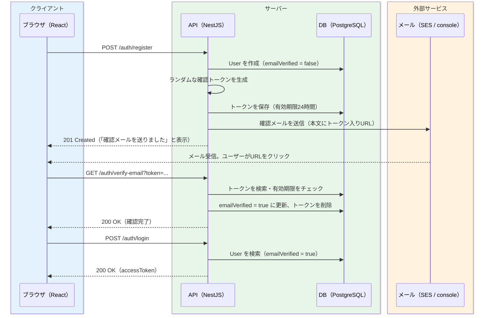

# メールアドレス確認（SES）

[前のページ](/sns/auth/)で作った登録機能には、1つ大きな穴があります。**メールアドレスが本当に本人のものか、確認していない**のです。今のままでは、他人のメールアドレスを勝手に使って登録できてしまいますし、存在しない適当なアドレスでも登録できてしまいます。パスワードリセットや通知のようにメールを前提とする機能は、この状態では安心して作れません。

そこで、世の中のほとんどのWebサービスが行っている「確認メール方式」を実装します。登録時に確認用のURLをメールで送り、そのURLを開いた人だけを「メールアドレスの持ち主」と認めてログインを許可する仕組みです。メール送信には、[SESでメール送信](/aws/ses/)で学んだAmazon SESを使います。ただし開発中は実際にメールを送らず、コンソール出力で代用する切り替え式にします。

## 学習目標

- メールアドレス確認がなぜ必要か（なりすまし登録の防止・実在性の確認）を説明できる
- 確認トークンの発行・検証・無効化という一連の流れを実装できる
- 環境変数で送信方法（console / SES）を切り替えられるMailModuleを設計できる
- ログイン時に `emailVerified` をチェックして403を返す制御を実装できる
- メールのURLからフロントエンドの確認画面へつなぎ、確認完了までを通しで動かせる

## 仕組みの全体像

最初に全体の流れをシーケンス図で確認します。登場するのは、ブラウザ（React）・API（NestJS）・DB（PostgreSQL）、そしてメール送信サービス（SES。開発中はコンソール出力）の4者です。



ポイントは3つです。

- 登録直後のユーザーは `emailVerified = false` のままで、**ログインできません**（403を返すようにします）。
- 確認トークンは「推測不可能なランダム文字列」です。このURLを知っているのは、メールを受け取れた本人だけのはずです。これが「メールアドレスの持ち主である」ことの証明になります。
- トークンには有効期限（24時間）を設け、使用後は削除します。万一URLが漏れても、使い回しや後日の悪用ができないようにするためです。

## スキーマ差分とマイグレーション

確認トークンを保存するモデル `EmailVerificationToken` を追加します。1人のユーザーが複数のトークンを持てる（再送に対応できる）よう、Userとは1対多のリレーションにします（→ [リレーション](/database/relations/)）。

**`backend/prisma/schema.prisma`**（`User` モデルに1行追記し、新しいモデルを追加）

```prisma
model User {
  // ...既存のフィールドはそのまま...

  verificationTokens EmailVerificationToken[]
}

model EmailVerificationToken {
  id        Int      @id @default(autoincrement())
  token     String   @unique
  expiresAt DateTime
  userId    Int
  user      User     @relation(fields: [userId], references: [id], onDelete: Cascade)
  createdAt DateTime @default(now())
}
```

**コード解説**

- `token String @unique` — トークン文字列そのものです。`@unique` を付けることで重複を防ぎ、トークンによる高速検索（`findUnique`）も可能になります。
- `expiresAt` — 有効期限です。この時刻を過ぎたトークンは無効として扱います。
- `userId` / `user` — どのユーザーの確認トークンかを表す外部キーです。`onDelete: Cascade` により、ユーザーが削除されればトークンも一緒に消えます（→ [モデル定義とマイグレーション](/database/schema_and_migration/)）。
- `verificationTokens EmailVerificationToken[]` — User側から見たリレーションの定義です。

マイグレーションを実行します。

```bash
cd sns-app/backend
pnpm exec prisma migrate dev --name add_email_verification_token
```

実行結果の例:

```
Environment variables loaded from .env
Prisma schema loaded from prisma/schema.prisma

Applying migration `20260612100000_add_email_verification_token`

The following migration(s) have been created and applied from new schema changes:

migrations/
  └─ 20260612100000_add_email_verification_token/
    └─ migration.sql

Your database is now in sync with your schema.

✔ Generated Prisma Client (v5.x.x) to ./node_modules/@prisma/client
```

## MailModule の実装

次に、メール送信を担当するモジュールを作ります。設計の要点は**送信方法の切り替え**です。

- 開発中（`MAIL_TRANSPORT="console"`）: 実際にはメールを送らず、本文と確認URLを `console.log` に出力する。SESの設定もAWSアカウントも不要で、料金もかからない。
- 本番（`MAIL_TRANSPORT="ses"`）: [SESでメール送信](/aws/ses/)で学んだ `@aws-sdk/client-ses` の `SendEmailCommand` で実際に送信する。

まず `backend/.env` に設定を追加します。

**`backend/.env`**（追記）

```
MAIL_TRANSPORT="console"
MAIL_FROM="no-reply@example.com"
AWS_REGION="ap-northeast-1"
```

- `MAIL_TRANSPORT` — 送信方法の切り替えスイッチです。
- `MAIL_FROM` — 送信元アドレスです。SESで実際に送る場合は、SESで検証済みのアドレス・ドメインである必要があります。
- `AWS_REGION` — SESを使うリージョンです（リージョンの概念は[AWSとは](/aws/what_is_aws/)を参照）。

> **SESの制約と料金に関する注意**
>
> - SESは初期状態では**サンドボックス**という制限モードで動いており、**事前に検証したメールアドレスにしか送信できません**。本番公開時にはサンドボックス解除の申請が必要です。検証手順・解除申請は[SESでメール送信](/aws/ses/)で学んだ通りです。
> - SESの送信には料金がかかります（少量なら月数円程度ですが、無料利用枠の条件はサービスや時期で変わります）。このページの開発作業は `MAIL_TRANSPORT="console"` のままで完結し、**AWSの料金は一切発生しません**。SESでの実送信を試した場合も、検証用に作ったIDが不要になったら削除しておきましょう（→ [AWSとは](/aws/what_is_aws/)の料金の注意）。

SES用のSDKをインストールします（console輸送しか使わない間も、コードのビルドには必要です）。

```bash
cd sns-app/backend
pnpm add @aws-sdk/client-ses
```

実行結果の例:

```
dependencies:
+ @aws-sdk/client-ses 3.654.0

Done in 5.8s
```

モジュールとサービスを生成します。

```bash
pnpm exec nest g module mail
pnpm exec nest g service mail --no-spec
```

**`backend/src/mail/mail.module.ts`**

```typescript
import { Global, Module } from '@nestjs/common';
import { MailService } from './mail.service';

@Global()
@Module({
  providers: [MailService],
  exports: [MailService],
})
export class MailModule {}
```

**コード解説**

- `@Global()` — このモジュールをグローバルにし、他のモジュール（AuthModuleなど）が `imports` に書かなくても `MailService` を注入できるようにします。[プロジェクトセットアップ](/sns/project_setup/)の `PrismaModule` と同じ作りです（モジュールとDIの仕組みは[ServiceとDI](/backend/service_and_di/)を参照）。
- `exports: [MailService]` — モジュールの外へ提供するプロバイダを宣言します。これがないと他のモジュールから注入できません。

**`backend/src/mail/mail.service.ts`**

```typescript
import { Injectable, Logger } from '@nestjs/common';
import { SendEmailCommand, SESClient } from '@aws-sdk/client-ses';

@Injectable()
export class MailService {
  private readonly logger = new Logger(MailService.name);
  private readonly ses = new SESClient({ region: process.env.AWS_REGION });

  async sendVerificationEmail(to: string, token: string): Promise<void> {
    const url = `${process.env.FRONTEND_URL}/#/verify-email?token=${token}`;
    const subject = '【SNSアプリ】メールアドレスの確認';
    const body = [
      '以下のURLをクリックして、メールアドレスの確認を完了してください。',
      '',
      url,
      '',
      'このURLの有効期限は24時間です。',
    ].join('\n');

    if (process.env.MAIL_TRANSPORT === 'ses') {
      await this.ses.send(
        new SendEmailCommand({
          Source: process.env.MAIL_FROM,
          Destination: { ToAddresses: [to] },
          Message: {
            Subject: { Data: subject, Charset: 'UTF-8' },
            Body: { Text: { Data: body, Charset: 'UTF-8' } },
          },
        }),
      );
      return;
    }

    // MAIL_TRANSPORT="console"（開発用）: 送らずにログへ出力する
    this.logger.log(`メール送信（console） To: ${to}`);
    this.logger.log(`件名: ${subject}`);
    this.logger.log(`\n${body}\n`);
  }
}
```

**コード解説**

- `Logger` — NestJS組み込みのロガーです。`console.log` でも動きますが、`Logger` を使うと他のNestJSのログと同じ形式（時刻・コンテキスト名付き）で出力されます。
- `new SESClient({ region: ... })` — SESクライアントの生成です。クライアントを作るだけでは通信は発生しないので、console輸送のときに作っても害はありません。
- `url` — 確認URLは `${FRONTEND_URL}/#/verify-email?token=...` です。リンク先を**API（3000番）ではなくフロントエンド（5173番）**にしている点が重要です。ユーザーにはJSONではなく「確認が完了しました」という画面を見せたいので、まずReactの画面を開かせ、その画面からAPIを呼びます。`#/verify-email` は[前のページ](/sns/auth/)で作ったハッシュルーティングのパスです。
- `if (process.env.MAIL_TRANSPORT === 'ses')` — 環境変数による分岐です。`SendEmailCommand` の組み立ては[SESでメール送信](/aws/ses/)で実装したものと同じです（`Source` = 送信元、`Destination` = 宛先、`Message` = 件名と本文）。
- console分岐 — 開発中はここに本文がそのまま出ます。ログに出たURLをコピーしてブラウザで開けば、メール受信と同じ体験ができます。

## AuthService の拡張

メール送信の部品がそろったので、認証フローに組み込みます。変更は3箇所です。

1. `register` — ユーザー作成後にトークンを発行し、確認メールを送る
2. `login` — `emailVerified` が `false` ならログインを拒否する（403）
3. `verifyEmail` — トークンを検証して `emailVerified` を `true` にする（新規メソッド）

**`backend/src/auth/auth.service.ts`**（importの追加と、各メソッドの変更箇所）

```typescript
import {
  BadRequestException,
  ConflictException,
  ForbiddenException,
  Injectable,
  UnauthorizedException,
} from '@nestjs/common';
import { randomBytes } from 'crypto';
import { MailService } from '../mail/mail.service';
// （既存の import はそのまま）

@Injectable()
export class AuthService {
  constructor(
    private readonly prisma: PrismaService,
    private readonly jwtService: JwtService,
    private readonly mailService: MailService, // 追加
  ) {}

  async register(dto: RegisterDto) {
    // ...重複チェックとユーザー作成は前のまま...

    // ここから追加: 確認トークンを発行してメールを送る
    const token = randomBytes(32).toString('hex');
    const expiresAt = new Date(Date.now() + 24 * 60 * 60 * 1000); // 24時間後

    await this.prisma.emailVerificationToken.create({
      data: { token, expiresAt, userId: user.id },
    });
    await this.mailService.sendVerificationEmail(user.email, token);

    return { id: user.id, email: user.email, username: user.username };
  }

  async login(dto: LoginDto) {
    // ...ユーザー検索と bcrypt.compare は前のまま...

    // ここから追加: パスワード照合の後に確認状態をチェックする
    if (!user.emailVerified) {
      throw new ForbiddenException('メールアドレスの確認が完了していません');
    }

    // ...JWT発行は前のまま...
  }

  // 新規メソッド
  async verifyEmail(token: string) {
    const record = await this.prisma.emailVerificationToken.findUnique({
      where: { token },
    });
    if (!record) {
      throw new BadRequestException('確認用トークンが正しくありません');
    }
    if (record.expiresAt < new Date()) {
      throw new BadRequestException('確認用トークンの有効期限が切れています');
    }

    await this.prisma.user.update({
      where: { id: record.userId },
      data: { emailVerified: true },
    });
    await this.prisma.emailVerificationToken.deleteMany({
      where: { userId: record.userId },
    });

    return { message: 'メールアドレスの確認が完了しました' };
  }
}
```

**コード解説**

- `randomBytes(32).toString('hex')` — Node.js標準の `crypto` モジュールで、暗号学的に安全な乱数32バイトを生成し、64文字の16進数文字列にします。`Math.random()` は予測可能性があるためこの用途には使えません。トークンが推測できてしまうと「URLを知っている＝本人」という前提が崩れます。
- `expiresAt` — 現在時刻に24時間（ミリ秒換算）を足した日時です。
- `mailService.sendVerificationEmail(...)` — MailModuleが `@Global()` なので、AuthModuleの `imports` を変更せずにコンストラクタへ追加するだけで注入できます。
- `ForbiddenException` — HTTP 403（Forbidden、禁止）を返します。401（認証情報が正しくない）とは区別される点に注意してください。メールとパスワードは正しい、つまり「誰であるか」は確認できたが、「まだ操作を許可できない」状態なので403が適切です。
- 403チェックを `bcrypt.compare` の**後**に置く理由 — パスワード照合の前に403を返すと、パスワードを知らない第三者でも「このメールアドレスは登録済みで未確認だ」と分かってしまいます。本人確認を通った相手にだけ、未確認という状態を伝えます。
- `verifyEmail` — トークンが存在しない場合と期限切れの場合は、どちらも `BadRequestException`（400）です。成功したら `emailVerified` を更新し、`deleteMany` で**そのユーザーのトークンをすべて削除**します。使用済みトークンを残しておく理由はなく、消しておけば同じURLの二度目以降のアクセスは自然に400になります。

コントローラにエンドポイントを追加します。メールのリンクはブラウザのアドレスバーから開かれる（＝GETリクエストになる）ため、メソッドはGETにします。

**`backend/src/auth/auth.controller.ts`**（importに `Get`・`Query` を追加し、クラスにメソッドを追加）

```typescript
  @Get('verify-email')
  verifyEmail(@Query('token') token: string) {
    return this.authService.verifyEmail(token);
  }
```

**コード解説**

- `@Get('verify-email')` — `GET /auth/verify-email` になります。Guardは付けません。確認しに来るユーザーはまだログインできないのですから、認証を要求したら本末転倒です。
- `@Query('token')` — クエリ文字列 `?token=...` の値を受け取ります（→ [ルーティングとパラメータ](/backend/controller/)）。

## フロントエンドの実装

### 確認画面 — pages/VerifyEmailPage.tsx

メールのURL（`#/verify-email?token=...`）を開いたときに表示する画面です。マウント時にトークンを取り出してAPIを呼び、結果を表示します（→ [fetchでAPI通信](/react/api_fetch/)）。

**`frontend/src/pages/VerifyEmailPage.tsx`**

```tsx
import { useEffect, useState } from "react";
import { apiFetch } from "../lib/apiClient";

type Props = { path: string };
type Status = "loading" | "success" | "error";

export default function VerifyEmailPage({ path }: Props) {
  const [status, setStatus] = useState<Status>("loading");
  const [message, setMessage] = useState("");

  useEffect(() => {
    const query = new URLSearchParams(path.split("?")[1]);
    const token = query.get("token");
    if (!token) {
      setStatus("error");
      setMessage("URLが正しくありません");
      return;
    }
    apiFetch<{ message: string }>(`/auth/verify-email?token=${token}`)
      .then((res) => {
        setStatus("success");
        setMessage(res.message);
      })
      .catch((err) => {
        setStatus("error");
        setMessage(err instanceof Error ? err.message : "確認に失敗しました");
      });
  }, [path]);

  return (
    <main className="auth-page">
      <h1>メールアドレスの確認</h1>
      {status === "loading" && <p>確認しています...</p>}
      {status === "success" && (
        <>
          <p>{message}</p>
          <p>
            <a href="#/login">ログインへ進む</a>
          </p>
        </>
      )}
      {status === "error" && <p className="error">{message}</p>}
    </main>
  );
}
```

**コード解説**

- `path.split("?")[1]` — `useHashRoute` の `path` は `"/verify-email?token=abc"` のような文字列なので、`?` 以降を取り出します。`URLSearchParams` はクエリ文字列を解析するブラウザ標準のAPIで、`query.get("token")` でトークンを取得できます。
- `useEffect(..., [path])` — マウント時（とパス変更時）に1回だけAPIを呼びます（→ [useEffectと依存配列](/react/hooks/)）。
- `status` — `"loading" | "success" | "error"` のユニオン型（→ [TypeScriptの基本型](/typescript/basic_types/)）で画面の状態を表し、条件付きレンダリングで出し分けます（→ [条件付きレンダリング](/react/forms_and_lists/)）。
- 成功時はログイン画面へのリンクを表示します。期限切れ・不正トークンのときはAPIのエラーメッセージがそのまま表示されます。

### RegisterPage の変更 — 「確認メールを送りました」

[前のページ](/sns/auth/)では登録成功でログイン画面へ遷移していましたが、今はログインの前にメール確認が必要です。登録成功後は案内文を表示するように変更します。

**`frontend/src/pages/RegisterPage.tsx`**（変更箇所のみ）

```tsx
// 変更: navigate を使わなくなるので、type Props の定義ごと削除する
export default function RegisterPage() {
  // ...既存の useState 群はそのまま...
  const [registered, setRegistered] = useState(false); // 追加

  const handleSubmit = async (e: React.FormEvent) => {
    e.preventDefault();
    setError(null);
    setSubmitting(true);
    try {
      await apiFetch("/auth/register", {
        method: "POST",
        body: JSON.stringify({ email, username, displayName, password }),
      });
      setRegistered(true); // 変更: navigate("/login") をやめる
    } catch (err) {
      setError(err instanceof Error ? err.message : "登録に失敗しました");
    } finally {
      setSubmitting(false);
    }
  };

  // 追加: 登録完了後の表示
  if (registered) {
    return (
      <main className="auth-page">
        <h1>確認メールを送りました</h1>
        <p>
          {email} 宛てに確認メールを送りました。メール内のURLを開いて、
          登録を完了してください。
        </p>
        <p>（開発中はメールは送られず、APIのログにURLが表示されます）</p>
      </main>
    );
  }

  return (
    // ...フォームの JSX は前のまま...
  );
}
```

**コード解説**

- `registered` state — 「登録が完了したか」を持ち、`true` なら案内文、`false` ならフォームを表示します。
- `navigate` は使わなくなるので、`type Props` の定義ごと削除して引数なしのコンポーネントにします。未使用の引数が残っていると、Vite雛形のTypeScript設定（`noUnusedParameters`）とESLintにより `pnpm run build` や `pnpm run lint` が失敗するためです。

### App.tsx の変更 — ルートの追加

`#/verify-email?token=...` でこの画面が開くように、ルーティングに1分岐追加します。未ログインリダイレクトの対象からも外します（確認しに来た人はログインできないため）。

**`frontend/src/App.tsx`**（変更箇所のみ）

```tsx
import VerifyEmailPage from "./pages/VerifyEmailPage"; // 追加

export default function App() {
  const { path, navigate } = useHashRoute();

  useEffect(() => {
    const isPublic =
      path === "/login" || path === "/register" || path.startsWith("/verify-email");
    if (!isLoggedIn() && !isPublic) {
      navigate("/login");
    }
  }, [path]);

  if (path === "/register") return <RegisterPage />; // 変更: navigate を渡さない
  if (path === "/login") return <LoginPage navigate={navigate} />;
  if (path.startsWith("/verify-email")) return <VerifyEmailPage path={path} />; // 追加
  return <TemporaryHome navigate={navigate} />;
}
```

**コード解説**

- `path.startsWith("/verify-email")` — このパスはクエリ（`?token=...`）が付くため、完全一致ではなく前方一致で判定します。
- `isPublic` — ログインなしで開ける画面の一覧です。確認画面を加えました。
- `<RegisterPage />` — RegisterPageから `navigate` のPropsを削除したので、こちらも渡さない形に変えます。

## 動作確認

console輸送のまま、登録からログインまでを通しで確認します。DB・バックエンド・フロントエンドを起動した状態で進めてください（起動コマンドは[前のページ](/sns/auth/)の動作確認と同じです）。

1. ブラウザで `#/register` を開き、新しいユーザー（例: `bob@example.com` / `bob`）を登録します。「確認メールを送りました」と表示されます。
2. `pnpm run start:dev` を実行しているターミナルを見ると、次のようなログが出ています。

```
[Nest] 41320  - 2026/06/12 21:00:12     LOG [MailService] メール送信（console） To: bob@example.com
[Nest] 41320  - 2026/06/12 21:00:12     LOG [MailService] 件名: 【SNSアプリ】メールアドレスの確認
[Nest] 41320  - 2026/06/12 21:00:12     LOG [MailService]
以下のURLをクリックして、メールアドレスの確認を完了してください。

http://localhost:5173/#/verify-email?token=3f2a9c0d8e1b4a76f5c2d9e8b7a6c5d4e3f2a1b0c9d8e7f6a5b4c3d2e1f0a9b8

このURLの有効期限は24時間です。
```

3. この状態でログインを試すと、403で拒否されます。curlでも確認できます。

```bash
curl -i -X POST http://localhost:3000/auth/login \
  -H "Content-Type: application/json" \
  -d '{"email":"bob@example.com","password":"password123"}'
```

実行結果の例:

```
HTTP/1.1 403 Forbidden
Content-Type: application/json; charset=utf-8

{"message":"メールアドレスの確認が完了していません","error":"Forbidden","statusCode":403}
```

4. ログに出たURLをコピーしてブラウザで開きます。「メールアドレスの確認が完了しました」と表示され、「ログインへ進む」リンクが出ます。APIを直接叩いて確認することもできます。

```bash
curl -s "http://localhost:3000/auth/verify-email?token=3f2a9c0d8e1b4a76f5c2d9e8b7a6c5d4e3f2a1b0c9d8e7f6a5b4c3d2e1f0a9b8"
```

実行結果の例:

```json
{"message":"メールアドレスの確認が完了しました"}
```

5. もう一度ログインすると、今度は200で `accessToken` が返り、画面からもログインできます。同じ確認URLをもう一度開くと、トークンが削除済みなので「確認用トークンが正しくありません」（400）になることも確認してください。

> **注意: 前のページで作ったユーザーはログインできなくなります**
>
> [前のページ](/sns/auth/)で登録した `alice` は、確認トークンが発行される前に作られたため `emailVerified = false` のままで、もうログインできません。動作確認用に直したい場合は、SQLで直接更新してしまうのが手軽です（→ [psqlで触る](/database/postgresql_setup/)）。
>
> ```bash
> docker compose exec db psql -U postgres -d sns \
>   -c "UPDATE \"User\" SET \"emailVerified\" = true WHERE email = 'alice@example.com';"
> ```
>
> 実行結果の例: `UPDATE 1`

SESで実際にメールを送りたい場合は、[SESでメール送信](/aws/ses/)の手順で送信元（`MAIL_FROM`）と、サンドボックス中は宛先のアドレスも検証した上で、`.env` の `MAIL_TRANSPORT` を `"ses"` に変えて再起動するだけです。コードの変更は不要です。

## 理解度チェック

**Q1. メールアドレス確認を行わないと、どのような問題が起きますか。**

<details markdown="1">
<summary>解答を見る</summary>

(1) 他人のメールアドレスを勝手に使って登録する「なりすまし登録」ができてしまいます。本来の持ち主が後から登録しようとするとアドレスが使用済みになっており、被害を受けます。(2) 実在しないアドレスでも登録できるため、パスワードリセットや通知などメールに依存する機能が成立しません。確認メール方式は「そのアドレスに届いたURLを開けるのは持ち主だけ」という事実を利用して、この2つを同時に解決します。

</details>

**Q2. 確認トークンの生成に `Math.random()` ではなく `crypto.randomBytes` を使うのはなぜですか。**

<details markdown="1">
<summary>解答を見る</summary>

確認方式の安全性は「トークンが推測不可能であること」だけに支えられています。`Math.random()` は乱数の質が暗号用途には不十分で、内部状態から将来の値を予測できる可能性があります。`crypto.randomBytes` は暗号学的に安全な乱数生成器で、32バイト（256ビット）あれば総当たりも事実上不可能です。推測できるトークンを使うと、メールを受け取れない第三者でも確認URLを偽造できてしまいます。

</details>

**Q3. 未確認ユーザーのログイン拒否に、401ではなく403を使うのはなぜですか。また、このチェックをパスワード照合の後に置くのはなぜですか。**

<details markdown="1">
<summary>解答を見る</summary>

401 Unauthorizedは「認証情報が正しくない（誰なのか確認できない）」、403 Forbiddenは「誰なのかは分かったが、その操作は許可しない」を表します。メールとパスワードが正しい未確認ユーザーは後者なので403が適切です。

チェックをパスワード照合の後に置くのは、照合前に403を返すと、パスワードを知らない第三者にも「このメールアドレスは登録済みで未確認」という情報が漏れてしまうからです。本人確認を通った相手にだけ未確認という状態を伝えます。

</details>

**Q4. 確認URLのリンク先を、API（`localhost:3000`）ではなくフロントエンド（`localhost:5173/#/verify-email`）にしているのはなぜですか。**

<details markdown="1">
<summary>解答を見る</summary>

APIのURLを直接開かせると、ユーザーに見えるのは生のJSON（またはエラーJSON）です。フロントエンドの画面を経由させることで、「確認が完了しました」という分かりやすい表示と「ログインへ進む」という次の行動への導線を用意できます。処理の実体はVerifyEmailPageがマウント時にAPIを呼ぶことで実行されており、役割分担は「画面はReact、判定はAPI」のままです。

</details>

**Q5. 確認に成功したとき、使用済みトークンを削除するのはなぜですか。**

<details markdown="1">
<summary>解答を見る</summary>

トークンは「1回の確認」のための使い捨ての証明書だからです。残しておくと、メールの転送や画面ののぞき見などでURLが後から漏れた場合に再利用される余地が生まれます。削除しておけば、同じURLへの2回目以降のアクセスは「トークンが存在しない」として400になり、悪用の窓口が閉じます。有効期限（24時間）も同じ目的で、漏えい時の被害を時間的に限定します。

</details>

## セルフレビュー

- [ ] メールアドレス確認が必要な理由（なりすまし登録防止・実在性確認）を自分の言葉で説明できる
- [ ] 登録→トークン発行→メール送信→URLクリック→確認完了→ログイン、の流れをシーケンス図に描ける
- [ ] `EmailVerificationToken` モデルの各フィールドの役割（`@unique`、`expiresAt`、`onDelete: Cascade`）を説明できる
- [ ] `MAIL_TRANSPORT` による console / SES の切り替えがどこで行われているか説明できる
- [ ] 401と403の使い分けを、未確認ユーザーのログイン拒否を例に説明できる
- [ ] `verifyEmail` の3つの分岐（存在しない・期限切れ・成功）を写経せずに書ける
- [ ] SESのサンドボックス制約（検証済みアドレスにしか送れない）と料金の注意点を説明できる

## 次のステップ

このページでは、確認トークンとメール送信によって「メールアドレスの持ち主だけが登録を完了できる」仕組みを作りました。MailModuleは送信方法を環境変数で切り替えられるため、[AWSへの全体デプロイ](/sns/deploy/)では `MAIL_TRANSPORT="ses"` に変えるだけで本番のメール送信に移行できます。

- 前のページ: [ユーザー登録とログイン（JWT認証）](/sns/auth/) — JWTやGuardの仕組みを見直したいときはこちら
- 次のページ: [投稿機能とタイムライン](/sns/posts/) — 認証基盤が完成したので、いよいよSNSの中心機能である「投稿」を作ります。`JwtAuthGuard` と `@CurrentUser()` がさっそく活躍します。
