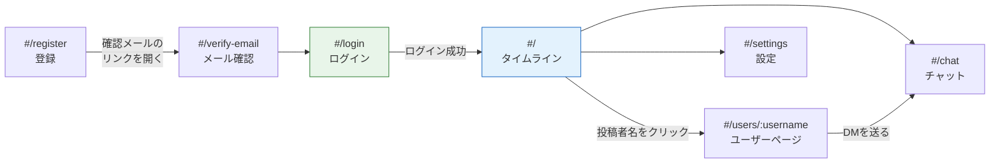
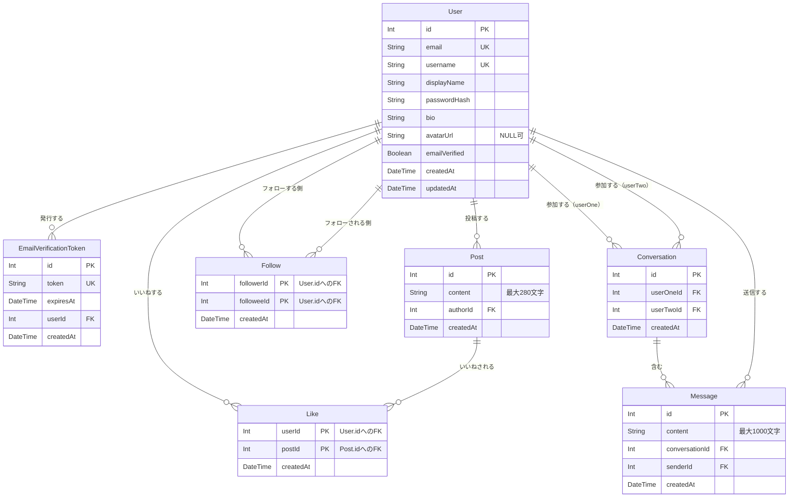
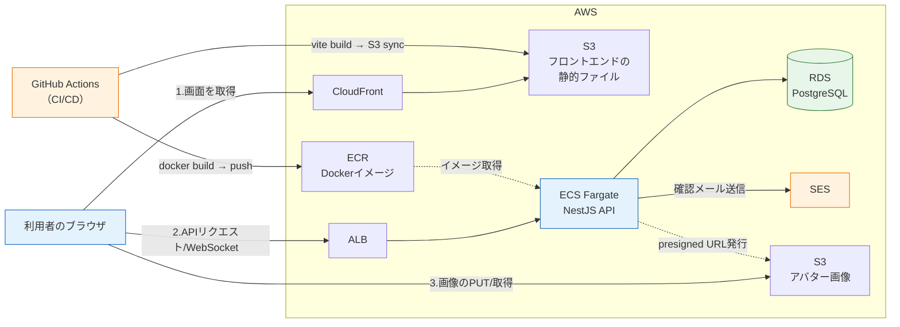
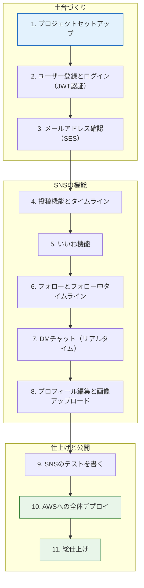

# SNS開発（最終プロジェクト）

このセクションは、本カリキュラムの**集大成**です。これまでの章で学んだフロントエンド、バックエンド、データベース、コンテナ、テスト、CI/CD、AWS、リアルタイム通信の知識をすべて使って、1つのSNSアプリケーションをゼロから作り上げ、本番環境（AWS）に公開するところまでを通しで行います。

[実践: フルスタックTodoアプリ](/fullstack-todo/)では「ReactとNestJSとPrismaをつなぐ」感覚を掴みました。今回はそこに**認証・メール送信・リアルタイム通信・画像アップロード・本番デプロイ**が加わります。つまり、実務で作られているWebサービスの縮図です。このセクションを完走すれば、「Webアプリケーションを一人で設計し、実装し、公開できる」と胸を張って言えるようになります。

このページ（セクションの入口）では、コードはまだ書きません。代わりに、**完成形の全体像**を先に頭に入れます。何を作るのか（機能と画面）、データをどう持つのか（ER図）、本番でどう動くのか（アーキテクチャ）、どの順で作るのか（開発の進め方）。全体像を持って各ページに入るのと、行き当たりばったりで入るのとでは、理解の速さがまったく違います。地図を持ってから歩き始めましょう。

これまでの各章が、このプロジェクトのどこで活きるのかを最初に確認しておきましょう。

| 学んだ章 | このプロジェクトでの役割 |
|---|---|
| [Git/GitHub基礎](/git/) | リポジトリ管理。機能（ページ）ごとにコミットし、変更履歴を残しながら開発を進めます |
| [React基礎](/react/) | フロントエンド全体。コンポーネント、useState/useEffect、フォーム、fetchによるAPI通信を総動員します |
| [バックエンド基礎（NestJS）](/backend/) | API全体。Module/Controller/Service、DI、DTOとバリデーションがすべてのAPIの土台になります |
| [Docker基礎](/docker/) | 開発用PostgreSQLをDocker Composeで起動します。デプロイ時にはAPIをコンテナ化します |
| [データベースとPrisma](/database/) | 7つのテーブルからなるデータ設計と、リレーションを駆使したクエリを書きます |
| [コード品質と開発ツール](/tooling/) | Prettier/ESLintでコードの品質を保ちながら開発します |
| [バックエンドテスト](/testing/) | 投稿・フォロー機能を題材に、単体テストとE2Eテストを書きます |
| [CI/CD](/cicd/) | GitHub Actionsでテストとビルドを自動化し、AWSへの自動デプロイにつなげます |
| [AWSデプロイ](/aws/) | S3 + CloudFront、ECS Fargate、RDS、SESを組み合わせた本番環境をCDKで構築します |
| [リアルタイム通信](/realtime/) | WebSocket（Socket.IO）でDMチャットをリアルタイム化します |

このように、**どの章の知識も欠けると完成しません**。逆に言えば、途中で詰まった箇所は「どの章の理解が曖昧だったか」を教えてくれるサインです。

## 言語別SNS開発の進め方

SNS開発は、Reactフロントエンドを共通にし、バックエンドだけを言語・フレームワークごとに差し替えられる構成にします。まず [共通要件定義・仕様書](/sns/requirements/) で、画面、API、データモデル、認証方式、エラー形式を固定します。その後、作りたいバックエンド版のページを選びます。

<div class="course-grid wide">
  <a class="course-card project" data-accent="green" href="/sns/requirements/">
    <span>Common</span>
    <h3>共通要件定義・仕様書</h3>
    <p>全スタックで変えない仕様。HttpOnly Cookie認証、API、DB、完成条件を定義します。</p>
  </a>
  <a class="course-card project" data-accent="blue" href="/sns/nestjs/">
    <span>TypeScript</span>
    <h3>SNS NestJS + Prisma版</h3>
    <p>詳細チュートリアルがある標準ルート。投稿、認証、リアルタイムDMまで実装します。</p>
  </a>
  <a class="course-card project" data-accent="amber" href="/sns/spring_boot/">
    <span>Java</span>
    <h3>SNS Spring Boot + JPA版</h3>
    <p>Spring Security、JPA、netty-socketioで同じSNS仕様をJavaで実装します。</p>
  </a>
  <a class="course-card project" data-accent="blue" href="/sns/fastapi/">
    <span>Python</span>
    <h3>SNS FastAPI + SQLAlchemy版</h3>
    <p>Pydantic、SQLAlchemy、Alembicで同じAPIとデータモデルを実装します。</p>
  </a>
  <a class="course-card project" data-accent="purple" href="/sns/laravel/">
    <span>PHP</span>
    <h3>SNS Laravel + Eloquent版</h3>
    <p>Laravel Sanctum、Eloquent、Broadcastingを使う実装方針を確認します。</p>
  </a>
  <a class="course-card project" data-accent="ink" href="/sns/gin_gorm/">
    <span>Go</span>
    <h3>SNS Gin + GORM版</h3>
    <p>薄いフレームワークで、HTTP、DB、認証、WebSocketの責務を明確に分けます。</p>
  </a>
  <a class="course-card project" data-accent="purple" href="/sns/rails/">
    <span>Ruby</span>
    <h3>SNS Rails + Active Record版</h3>
    <p>Rails API、Active Record、Action Cableを使う実装方針を確認します。</p>
  </a>
  <a class="course-card project" data-accent="ink" href="/sns/framework_roadmap/">
    <span>Roadmap</span>
    <h3>全スタック比較</h3>
    <p>各フレームワークでのORM、認証、リアルタイム通信、テスト方針を一覧で比較します。</p>
  </a>
  <a class="course-card project" data-accent="blue" href="/ai/">
    <span>AI</span>
    <h3>AI開発入門</h3>
    <p>巨大な仕様をAIに渡し、実装やレビューの補助に使う方法を学びます。</p>
  </a>
</div>

既存の詳細チュートリアルは NestJS + Prisma 版として残しています。現在の既存版は `localStorage` + `Authorization: Bearer` のJWT方式で実装されていますが、新しい言語別カリキュラムと解答コードでは [共通要件定義・仕様書](/sns/requirements/) に合わせて HttpOnly Cookie セッション方式を標準にします。サイドバーも版ごとに分けているため、NestJS版を開いたときにSpring Boot版や他言語版のページが混ざることはありません。

## 学習目標

- これから作るSNSの機能要件・画面構成・データ設計（ER図）・本番アーキテクチャを説明できる
- ER図を読み、各テーブルの主キー・外部キー・リレーションの種類（1対多、多対多、自己参照）を読み取れる
- APIの一覧から、RESTに沿ったリソースとHTTPメソッドの対応を読み取れる
- 本番環境で各AWSサービス（CloudFront/S3/ALB/ECS/RDS/SES）がどの役割を担うかを説明できる
- このセクションの進め方（ページの順番と、各ページで使う既習知識）を把握し、学習の計画を立てられる

## 作るもの

作るのは、短文を投稿して交流する「ミニSNS」です。X（旧Twitter）を簡略化したものをイメージしてください。

完成すると、次のような利用の流れが一通り動くようになります。

1. アリスがメールアドレスとパスワードで登録すると、確認メールが届く。リンクを開くと本登録が完了し、ログインできるようになる
2. アリスが「はじめての投稿です」と書き込むと、全体タイムラインに表示される
3. ボブがその投稿を見ていいねを押すと、いいね数が1になる
4. ボブがアリスをフォローすると、ボブの「フォロー中タイムライン」にアリスの投稿だけが流れるようになる
5. アリスとボブはDMチャットを開始でき、メッセージは**画面を再読み込みしなくても**相手に即座に届く
6. アリスは設定画面で自己紹介を書き、アバター画像をアップロードできる

「よくあるSNSの基本機能ぜんぶ」です。1つ1つは小さい機能ですが、認証・リレーション・リアルタイム通信・ファイルアップロードと、Webアプリ開発の主要な型がすべて登場します。SNSを題材に選んだのはこのためで、ここで身につく型は、ECサイトでも業務システムでも形を変えて再登場するものばかりです。

### 機能要件一覧

機能要件と、それぞれをどのページで実装するかは次の通りです。

| # | 機能 | 概要 | 実装するページ |
|---|---|---|---|
| 1 | ユーザー登録（メール確認つき） | メールアドレス・ユーザー名・パスワードで登録。登録後に確認メールが届き、リンクを開くと本登録が完了する | [ユーザー登録とログイン（JWT認証）](/sns/nestjs/auth/)・[メールアドレス確認（SES）](/sns/nestjs/email_verification/) |
| 2 | ログイン | メールアドレスとパスワードでログインし、以降のAPIを認証つきで呼べるようになる | [ユーザー登録とログイン（JWT認証）](/sns/nestjs/auth/) |
| 3 | 投稿 | 280文字以内の短文を投稿する。自分の投稿は削除できる | [投稿機能とタイムライン](/sns/nestjs/posts/) |
| 4 | 全体タイムライン | 全ユーザーの投稿を新しい順に表示する | [投稿機能とタイムライン](/sns/nestjs/posts/) |
| 5 | いいね | 投稿にいいね・いいね解除ができ、いいね数が表示される | [いいね機能](/sns/nestjs/likes/) |
| 6 | フォロー・フォロー解除 | 他のユーザーをフォロー・フォロー解除できる。ユーザーページにフォロワー数が出る | [フォローとフォロー中タイムライン](/sns/nestjs/follow/) |
| 7 | フォロー中タイムライン | フォローしているユーザーと自分の投稿だけを表示する | [フォローとフォロー中タイムライン](/sns/nestjs/follow/) |
| 8 | DMチャット（リアルタイム） | ユーザー同士が1対1でメッセージを送り合える。相手のメッセージは再読み込みなしで即座に届く | [DMチャット（リアルタイム）](/sns/nestjs/chat/) |
| 9 | プロフィール編集・アバター画像アップロード | 表示名・自己紹介を編集し、アバター画像をS3にアップロードできる | [プロフィール編集と画像アップロード](/sns/nestjs/profile_and_images/) |

機能の実装が終わったら、[SNSのテストを書く](/sns/nestjs/testing/)で品質を固め、[AWSへの全体デプロイ](/sns/nestjs/deploy/)で世界に公開し、[総仕上げ](/sns/nestjs/wrap_up/)で振り返ります。

逆に、**あえて実装しない**ものも決めておきます。通知、投稿の検索、タイムラインのページネーション（ページ分割）などは、本筋の理解に必須ではないため本編から外します。これらは[総仕上げ（セルフレビューと追加課題）](/sns/nestjs/wrap_up/)で追加課題として挑戦できます。実務でも「何を作らないか」を最初に決めるのは、設計の大事な一歩です。

### APIの全体像

バックエンドのAPIは、最終的に次のエンドポイント群になります。[HTTPとREST](/backend/http_and_rest/)で学んだRESTの設計（リソースをURLで表し、操作をHTTPメソッドで表す）に沿っています。「認証」列の「要」は、ログイン済みのユーザーしか呼べないAPIという意味です（その仕組みは[ユーザー登録とログイン（JWT認証）](/sns/nestjs/auth/)で作ります）。

| メソッドとパス | 認証 | 役割 | 実装するページ |
|---|---|---|---|
| `GET /health` | 不要 | 稼働確認（ヘルスチェック） | [project_setup](/sns/nestjs/project_setup/) |
| `POST /auth/register` | 不要 | ユーザー登録 | [auth](/sns/nestjs/auth/) |
| `POST /auth/login` | 不要 | ログイン | [auth](/sns/nestjs/auth/) |
| `GET /auth/me` | 要 | 自分の情報の取得 | [auth](/sns/nestjs/auth/) |
| `GET /auth/verify-email?token=` | 不要 | メールアドレスの確認 | [email_verification](/sns/nestjs/email_verification/) |
| `POST /posts` | 要 | 投稿の作成 | [posts](/sns/nestjs/posts/) |
| `GET /posts` | 要 | 全体タイムラインの取得 | [posts](/sns/nestjs/posts/) |
| `DELETE /posts/:id` | 要 | 自分の投稿の削除 | [posts](/sns/nestjs/posts/) |
| `POST /posts/:id/likes` | 要 | いいね | [likes](/sns/nestjs/likes/) |
| `DELETE /posts/:id/likes` | 要 | いいね解除 | [likes](/sns/nestjs/likes/) |
| `GET /posts/timeline` | 要 | フォロー中タイムラインの取得 | [follow](/sns/nestjs/follow/) |
| `GET /users/:username` | 要 | プロフィールの取得 | [follow](/sns/nestjs/follow/) |
| `GET /users/:username/posts` | 要 | 特定ユーザーの投稿一覧 | [follow](/sns/nestjs/follow/) |
| `POST /users/:username/follow` | 要 | フォロー | [follow](/sns/nestjs/follow/) |
| `DELETE /users/:username/follow` | 要 | フォロー解除 | [follow](/sns/nestjs/follow/) |
| `GET /conversations` | 要 | 会話一覧の取得 | [chat](/sns/nestjs/chat/) |
| `POST /conversations` | 要 | 会話の開始（既存なら取得） | [chat](/sns/nestjs/chat/) |
| `GET /conversations/:id/messages` | 要 | メッセージ履歴の取得 | [chat](/sns/nestjs/chat/) |
| `PATCH /users/me` | 要 | プロフィールの更新 | [profile_and_images](/sns/nestjs/profile_and_images/) |
| `POST /users/me/avatar-upload-url` | 要 | 画像アップロード用URLの発行 | [profile_and_images](/sns/nestjs/profile_and_images/) |

この表を暗記する必要はありません。「投稿というリソースに対してPOST/GET/DELETEがある」「いいねは投稿の下にぶら下がるリソースとして表現する」といった**RESTらしい形**が読み取れれば十分です。なお、DMチャットのメッセージ送信だけはHTTPではなくWebSocketのイベントで行います（→ [リアルタイム通信](/realtime/)で学んだ通り、サーバーからのプッシュ配信が必要だからです）。

## 画面一覧

フロントエンドはReactのSPA（シングルページアプリケーション、→ [なぜReactか](/react/what_is_react/)）として作ります。画面の切り替えは、URLの `#` 以降（ハッシュ）を使った自作のルーティングで行います。世の中にはReact Routerのようなルーティングライブラリもありますが、このプロジェクトでは「URLが変わったらどの画面を出すか」という仕組みそのものを、[Reactのフック](/react/hooks/)で学んだカスタムフックとして自作します。ライブラリの使い方を1つ覚えるより、仕組みを1つ理解する方が応用が利くからです（実装は[ユーザー登録とログイン（JWT認証）](/sns/nestjs/auth/)で行います）。

| 画面 | URL（ハッシュ） | 役割と主な要素 |
|---|---|---|
| 登録 | `#/register` | 新規登録フォーム（メールアドレス・ユーザー名・表示名・パスワード）。送信すると確認メールの案内を表示 |
| ログイン | `#/login` | ログインフォーム（メールアドレス・パスワード）。成功するとタイムラインへ遷移 |
| メール確認 | `#/verify-email?token=...` | 確認メールのリンクから開く画面。トークンを検証し、結果（成功/失敗）を表示 |
| タイムライン | `#/` | アプリの中心画面。投稿フォーム、投稿一覧（全体/フォロー中の切り替え）、各投稿のいいねボタン |
| ユーザーページ | `#/users/:username` | プロフィール（表示名・自己紹介・アバター）、フォロワー数/フォロー数、フォローボタン、そのユーザーの投稿一覧 |
| チャット | `#/chat` | 会話一覧と、選択した相手とのメッセージのやりとり（リアルタイム更新） |
| 設定 | `#/settings` | プロフィール編集フォームとアバター画像のアップロード |

画面数は7つと多くありませんが、「フォーム送信」「一覧表示」「クエリパラメータの処理」「リアルタイム更新」「ファイル選択」と、[React基礎](/react/)で学んだUIパターンが一通り含まれています。

各画面はヘッダー（タイムライン / チャット / 設定 / ログアウトへのリンク）を共有します。デザインは最小限のCSSに留め、機能の実装に集中します（CSSは[HTML/CSS](/frontend/html_css/)で学習済みです）。

画面の間の主な行き来は次のようになります。



図のとおり、ログイン後の中心はタイムライン（`#/`）で、そこから各画面へ移動します。ログインしていない状態で認証が必要な画面を開いた場合は、ログイン画面（`#/login`）へ自動的に戻す作りにします（この仕組みは[ユーザー登録とログイン（JWT認証）](/sns/nestjs/auth/)で実装します）。

## データ設計（ER図）

このSNSのデータベースは7つのテーブルで構成されます。[データベースとPrisma](/database/)で学んだ主キー・外部キー・リレーションの知識を総動員する設計です。

読み方を少しだけ復習しておきます（→ [RDBとは](/database/what_is_database/)）。

- 四角がテーブル、その中の行が列（カラム）です。`PK` は主キー（Primary Key）、`FK` は外部キー（Foreign Key）、`UK` は一意制約（Unique Key）を表します
- テーブル間の線がリレーションです。`||--o{` は「1対多」（線の `||` 側が1、`o{` 側が0以上の多）を表します

それでは全体像を見てください。



この図から読み取ってほしいポイントを順に説明します。

### Userがすべての中心

`User` は他のすべてのテーブルから参照される中心的なテーブルです。`email` と `username` には一意制約（UK = Unique Key）がつき、同じメールアドレスやユーザー名での重複登録を防ぎます。パスワードは平文ではなく `passwordHash`（ハッシュ化された値）として保存します（理由と方法は[ユーザー登録とログイン（JWT認証）](/sns/nestjs/auth/)で学びます）。`bio`（自己紹介）と `avatarUrl`（アバター画像のURL）は[プロフィール編集と画像アップロード](/sns/nestjs/profile_and_images/)で使う列です。

また、Userを参照する外部キーにはすべて「ユーザーが削除されたら、そのユーザーの投稿・いいね・フォロー関係なども一緒に削除する」という設定（カスケード削除）を入れます。親を消したのに子が残る「宙に浮いたデータ」を防ぐためです。外部キーと参照整合性については[RDBとは](/database/what_is_database/)で学びました。

### LikeとFollowは「中間テーブル」

`Like` は「どのユーザーが、どの投稿にいいねしたか」を表す**多対多の中間テーブル**です（→ [リレーション](/database/relations/)で学んだ通り、多対多は中間テーブルで表現します）。`id` 列を持たず、`userId` と `postId` の組み合わせを**複合主キー**にしています。主キーは重複できないので、「同じユーザーが同じ投稿に2回いいねする」ことをデータベースのレベルで防げる、という設計です。

`Follow` も同じく中間テーブルですが、こちらは「ユーザーとユーザー」を結ぶ点が特徴です。`followerId`（フォローする側）と `followeeId`（フォローされる側）の**両方が `User` テーブルを参照**しています。このように同じテーブル同士を結ぶリレーションを**自己参照（じこさんしょう）**と呼びます。1つのテーブルに対して2本の線が引かれているのはそのためです。

### ConversationとMessageでDMを表す

`Conversation`（会話）は「ユーザーAとユーザーBの1対1の会話部屋」を表し、`Message` はその部屋に投稿された個々のメッセージです。`userOneId` と `userTwoId` の組み合わせに一意制約を設け、さらに「常に `userOneId < userTwoId` になるよう保存する」という規約を設けることで、同じ2人の会話部屋が2つできてしまうことを防ぎます（詳細は[DMチャット（リアルタイム）](/sns/nestjs/chat/)で説明します）。

### EmailVerificationTokenは使い捨ての確認券

`EmailVerificationToken` は、登録確認メールに含める使い捨てのトークン（合言葉のような長いランダム文字列）を保存します。`expiresAt`（有効期限）を持ち、期限切れのトークンは無効として扱います（→ [メールアドレス確認（SES）](/sns/nestjs/email_verification/)）。

### テーブルはページごとに積み上げる

このER図は、Prismaのスキーマとしてページを進めるごとに少しずつ実装していきます。最初から全部を作るのではなく、**機能を足すたびにテーブルを足し、マイグレーションする**という実務に近い進め方をします（→ [モデル定義とマイグレーション](/database/schema_and_migration/)）。どのページで何を追加するかは次の通りです。

| ページ | 追加するモデル | マイグレーション名 |
|---|---|---|
| [auth](/sns/nestjs/auth/) | User | `add_user` |
| [email_verification](/sns/nestjs/email_verification/) | EmailVerificationToken | `add_email_verification_token` |
| [posts](/sns/nestjs/posts/) | Post | `add_post` |
| [likes](/sns/nestjs/likes/) | Like | `add_like` |
| [follow](/sns/nestjs/follow/) | Follow | `add_follow` |
| [chat](/sns/nestjs/chat/) | Conversation・Message | `add_conversation_and_message` |

マイグレーションの履歴がそのまま「開発の歴史」になるわけです。[マイグレーションとは何か](/database/schema_and_migration/)を思い出しながら、各ページで `pnpm exec prisma migrate dev` を実行していきます。

## 本番アーキテクチャ

完成したアプリは、[AWSデプロイ](/aws/)で学んだ構成をほぼそのまま使ってAWSに公開します。デプロイ作業は最後のほうのページですが、[AWSデプロイの章](/aws/)で「完成図を先に見る」と学んだのと同じ理由で、目的地を先に確認しておきます。開発中に書く環境変数やヘルスチェックAPIには「本番のための布石」がいくつも含まれており、この図を知っていればその意味が分かるからです。

全体像は次の通りです。



それぞれの経路を確認しましょう。

- **画面の配信**: Reactをビルドした静的ファイルをS3に置き、CloudFront経由で配信します（→ [S3 + CloudFront](/aws/s3_cloudfront/)）。
- **API**: NestJSをDockerイメージにしてECS Fargateで動かし、ALB（ロードバランサー）経由で受けます。DMチャットのWebSocket通信もALBを通ります（→ [ECR + ECS Fargate](/aws/ecr_ecs/)）。
- **データベース**: 本番のPostgreSQLはRDSで運用し、接続情報はSecrets Managerで管理します（→ [RDS](/aws/rds/)）。
- **メール**: 登録確認メールはSESから送信します（→ [SES](/aws/ses/)）。
- **画像**: アバター画像は専用のS3バケットに、ブラウザから直接アップロードします（presigned URLという仕組みを[プロフィール編集と画像アップロード](/sns/nestjs/profile_and_images/)で学びます）。
- **デプロイ**: mainブランチへのpushをきっかけに、GitHub Actionsがフロントエンドのビルド・S3への同期と、DockerイメージのビルドとECRへのpush・ECSの更新を自動で行います(→ [GitHub ActionsからAWSへ自動デプロイ](/aws/deploy_from_cicd/))。

各AWSサービスの役割を忘れてしまった場合は、[AWSの主要サービス](/aws/core_services/)に戻って確認してください。なお、**RDS・ALB・Fargateは無料利用枠を超えやすいサービス**です。デプロイは[AWSへの全体デプロイ](/sns/nestjs/deploy/)の料金注意と削除手順（`cdk destroy`）を必ず読んでから進めてください。

### 開発環境と本番環境の対応

開発中は、この本番構成を手元で簡略化した形で動かします。[開発環境をcomposeで組む](/docker/dev_environment/)で確立した「DBだけコンテナ、アプリはローカル実行」という標準形です。

| 役割 | 開発環境（手元） | 本番環境（AWS） |
|---|---|---|
| フロントエンド | Viteの開発サーバー（`pnpm run dev`、ポート5173） | S3 + CloudFront（`vite build` の成果物を配信） |
| API | ローカルのNestJS（`pnpm run start:dev`、ポート3000） | ECS Fargate上のDockerコンテナ + ALB |
| データベース | Docker ComposeのPostgreSQLコンテナ | RDS for PostgreSQL |
| 確認メール | コンソールに内容を表示するだけ（擬似送信） | SESで実際に送信 |
| アバター画像 | 開発用S3バケット | 本番用S3バケット |

「開発ではViteが画面を配信し、本番ではS3+CloudFrontが配信する」「開発ではコンテナのDB、本番ではRDS」という**対応関係**を頭に置いておくと、デプロイのページ（[AWSへの全体デプロイ](/sns/nestjs/deploy/)）で環境変数を切り替えていく作業の意味がすっと入ってきます。アプリのコード自体は、環境変数の値が違うだけで開発と本番で同じものが動きます。

## NestJS版の技術スタックとバージョン

以下は既存の詳細チュートリアルで扱う NestJS + Prisma 版の技術スタックです。言語別に実装する場合は、[SNS開発ロードマップ（言語別）](/sns/framework_roadmap/) の各スタックページを参照してください。

| 技術 | バージョン | 用途 |
|---|---|---|
| Node.js | 20 | 実行環境（フロント・バックエンド共通） |
| TypeScript | 5系 | フロント・バックエンドの開発言語 |
| React + Vite | React 18 / Vite 5 | フロントエンド |
| NestJS | 10 | バックエンドAPI |
| Prisma | 5 | ORM（データベース操作） |
| PostgreSQL | 16 | データベース（開発はDockerコンテナ、本番はRDS） |
| Socket.IO | （`@nestjs/websockets` 経由） | DMチャットのリアルタイム通信 |
| Jest | 29 | テスト（supertestによるE2E含む） |
| GitHub Actions | - | CI/CD |
| AWS CDK | 2系 | インフラ構築（IaC） |

パッケージマネージャはこれまでの章と同じくpnpmを使います。「新しい道具を学ぶ」要素は意図的にゼロにしてあります。新しいのは**組み合わせ方**だけです。だからこそ、このセクションは「知識の確認テスト」としても機能します。スラスラ進む箇所はよく身についている箇所、手が止まる箇所は復習が必要な箇所です。

なお、Node.jsのバージョンが20系であることを `node -v` で確認してから始めてください（→ [Node.jsの導入](/environment/node/)）。

## 開発の進め方（章の歩き方）

### リポジトリ構成

コードは `sns-app` という1つのリポジトリにまとめます。最終的なディレクトリ構成は次の通りです。

```
sns-app/
├── compose.yaml          # 開発用DB（PostgreSQL 16）の定義
├── backend/              # NestJS 10 + Prisma 5（http://localhost:3000）
├── frontend/             # Vite 5 + React 18 + TypeScript（http://localhost:5173）
├── infra/                # AWS CDK（deploy のページで作成）
└── .github/workflows/    # CI/CD（ci.yml はCI/CDの章で作成済み、デプロイ用は deploy のページで作成）
```

CIのワークフロー（`ci.yml`）は[CIパイプラインを作る](/cicd/ci_pipeline/)の手順で作成済みのものを流用し、デプロイ用のワークフローは[AWSへの全体デプロイ](/sns/nestjs/deploy/)で作成します。フロントエンド・バックエンド・インフラを1つのリポジトリに同居させる構成を**モノレポ（monorepo、単一リポジトリ）**と呼びます。採用する理由は[プロジェクトセットアップ](/sns/nestjs/project_setup/)で説明します。

### NestJS版ページの順番

既存のNestJS版チュートリアルは11ページ構成です。各ページが「1つの機能の追加」に対応しており、**前のページの完成形が次のページの出発点**になります。順番に進めてください。



各ページで「足す機能」と「主に使う既習知識」は次の通りです。詰まったときに戻るべき章の地図として使ってください。

| ページ | 足す機能 | 主に使う既習知識 |
|---|---|---|
| [プロジェクトセットアップ](/sns/nestjs/project_setup/) | リポジトリ・開発用DB・NestJSとReactの雛形・Prisma導入 | [Git/GitHub基礎](/git/)、[Docker Compose](/docker/docker_compose/)、[Prisma導入](/database/prisma_setup/) |
| [ユーザー登録とログイン（JWT認証）](/sns/nestjs/auth/) | 登録・ログインAPI、認証の仕組み（このページだけ新概念: JWT・bcrypt・Guard） | [DTOとバリデーション](/backend/dto_and_validation/)、[フォーム](/react/forms_and_lists/) |
| [メールアドレス確認（SES）](/sns/nestjs/email_verification/) | 確認メールの送信とトークン検証 | [SES](/aws/ses/)、[1対多リレーション](/database/relations/) |
| [投稿機能とタイムライン](/sns/nestjs/posts/) | 投稿のCRUDと全体タイムライン | [PrismaでCRUD](/database/crud_with_prisma/)、[fetchでAPI通信](/react/api_fetch/) |
| [いいね機能](/sns/nestjs/likes/) | いいね・いいね解除、いいね数の表示 | [多対多リレーション](/database/relations/) |
| [フォローとフォロー中タイムライン](/sns/nestjs/follow/) | フォロー関係とタイムラインの絞り込み | [リレーションのクエリ](/database/relations/) |
| [DMチャット（リアルタイム）](/sns/nestjs/chat/) | 1対1チャットのリアルタイム配信 | [NestJS Gateway](/realtime/nestjs_gateway/)、[WebSocket](/realtime/websocket_basics/)、[Redisアダプタが必要になる場面](/sns/nestjs/deploy/#socketioを複数台にするときのredis) |
| [プロフィール編集と画像アップロード](/sns/nestjs/profile_and_images/) | プロフィール更新、S3への画像アップロード | [S3](/aws/core_services/)、[フォーム](/react/forms_and_lists/) |
| [SNSのテストを書く](/sns/nestjs/testing/) | Serviceの単体テストとAPIのE2Eテスト | [単体テスト](/testing/unit_test/)、[E2Eテスト](/testing/e2e_test/) |
| [AWSへの全体デプロイ](/sns/nestjs/deploy/) | 本番インフラ構築と自動デプロイ | [AWSデプロイ](/aws/)の全ページ、[CI/CD](/cicd/)、[Dockerfile](/docker/dockerfile/) |
| [総仕上げ（セルフレビューと追加課題）](/sns/nestjs/wrap_up/) | 全体の振り返りと発展課題 | すべて |

どのページも「バックエンドに機能を足す → curlで確認 → フロントエンドに画面を足す → ブラウザで確認 → コミット」という同じリズムで進みます。最初の2〜3ページでこのリズムを体に入れてしまえば、あとは加速していきます。

進め方について、いくつか指針を示しておきます。

> **完成形のコード**: [practice/sns-app](https://github.com/dik-ab/curriculum/tree/main/practice/sns-app)（全機能・テスト・Docker動作検証済み）。手詰まりになったら参照してください。

### 1ページ終えるごとにコミットする

[Gitの基本コマンド](/git/basic_commands/)で学んだ通り、コミットは「動く状態のセーブポイント」です。各ページの最後で必ず動作確認をしてコミットしてください。次のページで動かなくなっても、`git diff` でどこを変えたかを確認したり、最悪の場合は前のセーブポイントに戻ったりできます。

### 詰まったら「どの章の話か」を考えて戻る

このセクションでは、認証関連（JWT・bcrypt・Guard）以外の新しい概念は登場しません。エラーや「なぜこう書くのか分からない」に出会ったら、それは必ずどこかの章で学んだことです。上の表を手がかりに該当章へ戻り、理解してから先へ進んでください。急がば回れ、が結局いちばん速い道です。

### 動作確認は「APIをcurlで→画面で」の二段階で

バックエンドとフロントエンドを同時に書いて同時に壊れると、原因の切り分けが難しくなります。各ページでは、まずAPI単体を `curl` で確認し（→ [メモAPIを作る](/backend/crud_practice/)でやった通り）、APIが正しいと確信してから画面をつなぎます。「動かないのはAPIか、画面か、その間（CORSや認証ヘッダ）か」を切り分ける習慣は、実務でもそのまま役立ちます。

### 動かなくなったときのチェックリスト

長いプロジェクトでは「さっきまで動いていたのに」という場面が必ず来ます。次の順で確認すると、原因の大半が見つかります。

1. 3つのプロセス（DBコンテナ・NestJS・Vite）はすべて起動しているか（`docker compose ps` と各ターミナルの表示を確認）
2. ターミナルにエラーメッセージは出ていないか（NestJSの起動ログ、ブラウザの開発者ツールのConsoleとNetworkタブ）
3. 直前に変えたファイルはどれか（`git status` と `git diff` で確認 → [Gitの基本コマンド](/git/basic_commands/)）
4. `.env` の値は正しいか（環境変数の間違いはエラーメッセージが分かりにくいことが多い、要注意ポイントです）

### 写経で終わらせない

コードを貼り付けて動けばゴール、ではありません。各ページの「コード解説」を読み、「自分ならこの次に何を書くか」を一度考えてからコードを見る、という読み方をすると理解の深さが大きく変わります。なお、[AI開発入門](/ai/)で学んだ通り、AIにコードの意図を質問したりレビューを頼んだりするのも有効な学び方です。ただし「AIに全部書かせて終わり」では集大成になりませんので、主役は自分であることを忘れないでください。

## 理解度チェック

**Q1. ER図から、Likeテーブルの主キーはどのように構成されていますか。また、その設計によって何が防げますか。**

<details markdown="1">
<summary>解答を見る</summary>

Likeテーブルは単独の `id` 列を持たず、`userId` と `postId` の2列を組み合わせた**複合主キー**です。主キーは重複できないため、「同じユーザーが同じ投稿に2回いいねする」という不正なデータの発生を、アプリのコードに頼らずデータベースのレベルで防げます。多対多のリレーションを中間テーブルで表す方法は[リレーション](/database/relations/)で学びました。

</details>

**Q2. 「フォロー中タイムライン（フォローしているユーザーと自分の投稿だけを表示）」を実現するために必要なテーブルはどれですか。**

<details markdown="1">
<summary>解答を見る</summary>

`Follow` と `Post`（および投稿者情報のための `User`）です。まず `Follow` テーブルを `followerId = 自分のID` で検索してフォロー中のユーザーID一覧を取得し、そのID一覧と自分のIDを合わせた集合で `Post.authorId` を絞り込みます。具体的な実装は[フォローとフォロー中タイムライン](/sns/nestjs/follow/)で行います。

</details>

**Q3. Followテーブルの「自己参照」とはどういう意味ですか。**

<details markdown="1">
<summary>解答を見る</summary>

Followテーブルの外部キー `followerId` と `followeeId` が、**どちらも同じUserテーブルを参照している**ことを指します。「ユーザーがユーザーをフォローする」という、同じ種類のデータ同士の多対多関係なので、中間テーブルの両端が同じテーブルに向かう形になります。ER図でUserとFollowの間に2本の線があるのはこのためです。

</details>

**Q4. ブラウザがこのSNSの「画面（HTML/JS）」を取得する経路と、「APIリクエスト」が処理される経路は、本番アーキテクチャ上でどう違いますか。**

<details markdown="1">
<summary>解答を見る</summary>

画面は **CloudFront → S3** の経路で配信されます。ReactのビルドはただのHTML/CSS/JavaScriptファイルなので、サーバーで処理する必要がなく、静的ファイル配信の仕組みに載せられるからです（→ [S3 + CloudFront](/aws/s3_cloudfront/)）。一方APIリクエストは **ALB → ECS Fargate上のNestJS → RDS** の経路で処理されます。リクエストごとに認証やデータベース操作という「計算」が必要だからです（→ [ECR + ECS Fargate](/aws/ecr_ecs/)）。

</details>

**Q5. EmailVerificationTokenに `expiresAt` 列があるのはなぜですか。**

<details markdown="1">
<summary>解答を見る</summary>

確認用トークンを**有効期限つきの使い捨て**にするためです。確認メールのリンクは第三者の手に渡る可能性がゼロではないため、いつまでも有効なままにしておくのは危険です。検証時に `expiresAt` が現在時刻より過去なら無効として扱います。実装は[メールアドレス確認（SES）](/sns/nestjs/email_verification/)で行います。

</details>

**Q6. 開発環境ではデータベースだけをDockerコンテナで動かし、NestJSとReactはローカルで実行します。この使い分けの理由を説明してください。**

<details markdown="1">
<summary>解答を見る</summary>

データベースは「決まったバージョンのものが動いていればよい」ソフトウェアなので、コンテナで起動するのが最も手軽で、PCを汚さず、チーム全員が同じバージョンを使えます（→ [Docker Compose](/docker/docker_compose/)）。一方、NestJSとReactは自分が書き換え続けるコードなので、ローカルで `pnpm run start:dev` / `pnpm run dev` を実行した方がホットリロードが速く、開発体験が良いためです。アプリのコンテナ化は本番デプロイのために行います（→ [開発環境をcomposeで組む](/docker/dev_environment/)、[AWSへの全体デプロイ](/sns/nestjs/deploy/)）。

</details>

## セルフレビュー

- [ ] このSNSの機能要件（9機能）を、見ないで列挙できる
- [ ] 7つのテーブルの名前と役割を自分の言葉で説明できる
- [ ] LikeとFollowがなぜ中間テーブルなのか、Followがなぜ自己参照なのかを説明できる
- [ ] 本番アーキテクチャ図を白紙から描き、各AWSサービスの役割を添えられる
- [ ] 「画面の配信」と「APIの処理」が別の経路になっている理由を説明できる
- [ ] 各ページがどの章の知識を前提にしているかを把握し、詰まったときに戻る場所が分かる
- [ ] APIの一覧を見て、RESTの設計（リソースとHTTPメソッドの対応）を読み取れる
- [ ] ページごとにコミットする理由（動く状態のセーブポイント）を説明できる

## 次のステップ

それでは開発を始めましょう。最初のページは[プロジェクトセットアップ](/sns/nestjs/project_setup/)です。次のことを行い、以降のすべてのページの土台を整えます。

- `sns-app` リポジトリの作成とGitHubへのpush
- Docker Composeによる開発用PostgreSQLの起動
- NestJSバックエンドの雛形作成（ValidationPipe・CORS・Prisma・ヘルスチェックAPI）
- Vite + Reactフロントエンドの雛形作成

このページで見たER図とアーキテクチャ図には、これから何度も戻ってくることになります。「いま作っているテーブルは全体のどこか」「いまデプロイしているのは図のどの箱か」と迷子になったら、いつでもこのページに帰ってきてください。セクションを終える頃には、図のすべての要素を「自分で作ったもの」として説明できるようになっているはずです。
