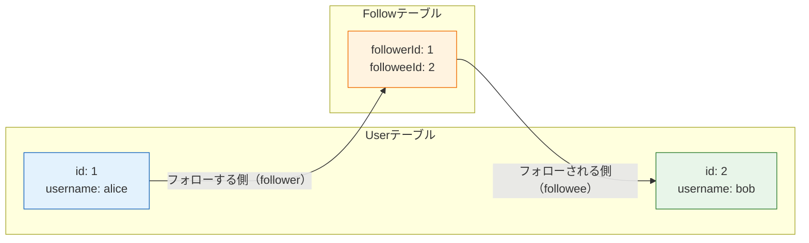

# フォローとフォロー中タイムライン

[いいね機能](/sns/nestjs/likes/)では「ユーザーが投稿に反応する」仕組みを、UserとPostの多対多リレーションとして実装しました。このページではSNSの核心である**フォロー**を実装します。フォローとは「ユーザーがユーザーを購読する」関係です。つまり今回は、**Userテーブル同士**を多対多で結ぶことになります。これは[リレーション](/database/relations/)で学んだ多対多の発展形で、**自己参照多対多**（じこさんしょうたたいた、self-referencing many-to-many）と呼ばれます。

後半では、フォロー機能の最大の見せ場である**フォロー中タイムライン**（自分とフォローしているユーザーの投稿だけが流れるタイムライン）をAPIと画面の両方に追加し、ユーザーのプロフィールページも作ります。

## 学習目標

- 自己参照多対多のテーブル設計と、Prismaの名前付きリレーションがなぜ必要かを説明できる
- follower（フォローする側）とfollowee（フォローされる側）を区別して、フォロー/フォロー解除のAPIを実装できる
- `_count`とリレーションの絞り込みを使って、フォロワー数と「自分がフォローしているか」を1クエリで取得できる
- 「フォロー中のユーザーのIDを集めてから投稿を取る」という2段階のクエリでフォロー中タイムラインを実装できる
- Reactでプロフィールページとタイムラインのタブ切り替えを実装できる

## 自己参照多対多のデータ設計

### 「ユーザーがユーザーをフォローする」をテーブルにする

[いいね機能](/sns/nestjs/likes/)では、UserとPostの多対多を**Like**という中間テーブル（`userId` + `postId`の複合主キー）で表しました。フォローも考え方はまったく同じです。違いはただひとつ、**結ばれる両端がどちらもUserテーブル**だという点です。

ここで用語を定義しておきます。フォロー関係には必ず「する側」と「される側」がいます。

- **follower**（フォロワー）— フォロー**する**側のユーザー
- **followee**（フォロイー）— フォロー**される**側のユーザー

「aliceがbobをフォローする」なら、follower = alice、followee = bob です。この関係を、FollowテーブルにIDのペアを1行入れることで表現します。



図のとおり、「aliceがbobをフォローしている」という事実は、Followテーブルの`(followerId: 1, followeeId: 2)`という**1行**で表されます。逆に「bobがaliceをフォローし返す」なら、別の行`(followerId: 2, followeeId: 1)`が増えます。フォローは「いいね」と違って**向きのある関係**なので、この2行は別物です。

ER図として眺めると、FollowテーブルはUserテーブルに対して「follower側」と「followee側」の**2本の線**でつながることになります。この「同じテーブル同士を2本の線で結ぶ」構造こそが自己参照多対多です。[リレーション](/database/relations/)で学んだ多対多では中間テーブルの両端が別々のテーブル（UserとPost）でしたが、今回は両端が同じUserなので、**2本の線をそれぞれ区別する名前**が必要になります。次でその書き方を見ます。

### Followモデルと名前付きリレーション

Followモデルの定義は次のとおりです（このあと実際にschema.prismaへ追記します）。

```prisma
model Follow {
  followerId Int
  followeeId Int
  follower   User     @relation("Follower", fields: [followerId], references: [id], onDelete: Cascade)
  followee   User     @relation("Followee", fields: [followeeId], references: [id], onDelete: Cascade)
  createdAt  DateTime @default(now())

  @@id([followerId, followeeId])
}
```

注目してほしいのは`@relation("Follower", ...)`と`@relation("Followee", ...)`の**名前**です。[いいね機能](/sns/nestjs/likes/)のLikeモデルでは`@relation`に名前を付けませんでした。UserとPostを結ぶ線は1本しかないので、Prismaは「このリレーションはあのリレーションと対応する」と迷わず判断できたからです。

しかしFollowは、UserとFollowの間に`follower`と`followee`という**2本の線**があります。名前を付けないと、Prismaは「User側の`following`フィールドは、Follow側の`follower`と`followee`のどちらに対応するのか」を判断できず、マイグレーション時にエラーになります。`"Follower"`・`"Followee"`という名前は、**2本の線にラベルを付けて区別するため**にあるわけです。

また、主キーは[いいね機能](/sns/nestjs/likes/)と同じく`@@id([followerId, followeeId])`の複合主キーです。これにより「aliceがbobを2回フォローする」という重複データはデータベースのレベルで禁止されます。

## スキーマ差分とマイグレーション

それでは実装に入ります。`backend/prisma/schema.prisma`に、Followモデルの追加と、Userモデルへのリレーションフィールドの追記を行います。

**`backend/prisma/schema.prisma`**（差分。Userモデルには2行追記、Followモデルは末尾に追加）

```prisma
model User {
  // ...既存のフィールド（id, email, username, ... posts, likes）はそのまま...

  following Follow[] @relation("Follower")
  followers Follow[] @relation("Followee")
}

model Follow {
  followerId Int
  followeeId Int
  follower   User     @relation("Follower", fields: [followerId], references: [id], onDelete: Cascade)
  followee   User     @relation("Followee", fields: [followeeId], references: [id], onDelete: Cascade)
  createdAt  DateTime @default(now())

  @@id([followerId, followeeId])
}
```

**コード解説**

- `following Follow[] @relation("Follower")` — このユーザーが**フォローしている**関係の一覧です。リレーション名`"Follower"`は「Followテーブルの`follower`列にこのユーザーが入っている行」を指します。「自分がfollower（する側）である行の集まり」=「自分のフォロー中リスト」という対応です。
- `followers Follow[] @relation("Followee")` — 逆に、このユーザーが**フォローされている**関係の一覧です。「自分がfollowee（される側）である行の集まり」=「自分のフォロワーリスト」です。
- `onDelete: Cascade` — ユーザーが削除されたら、そのユーザーが関わるフォロー関係も一緒に消します（→ [リレーション](/database/relations/)）。

ここは初学者が必ず一度は混乱するポイントなので、対応関係を表にしておきます。

| Userのフィールド | リレーション名 | 意味 | Followのどちらの列で自分を探すか |
|---|---|---|---|
| `following`（フォロー中） | `"Follower"` | 自分が**する側**の関係 | `followerId` = 自分のid |
| `followers`（フォロワー） | `"Followee"` | 自分が**される側**の関係 | `followeeId` = 自分のid |

「`following`に付くリレーション名が`"Follower"`」という一見ねじれた対応は、**フィールド名は自分から見た意味、リレーション名は自分がどちらの役か**を表していると整理すると覚えやすいはずです。

スキーマを保存したら、マイグレーションを実行します（→ [モデル定義とマイグレーション](/database/schema_and_migration/)）。

```bash
cd backend
pnpm exec prisma migrate dev --name add_follow
```

実行結果の例:

```
Environment variables loaded from .env
Prisma schema loaded from prisma/schema.prisma
Datasource "db": PostgreSQL database "sns", schema "public" at "localhost:5432"

Applying migration `20260612140000_add_follow`

The following migration(s) have been created and applied from new schema changes:

migrations/
  └─ 20260612140000_add_follow/
    └─ migration.sql

Your database is now in sync with your Prisma schema.

Generated Prisma Client (v5.22.0) to ./node_modules/@prisma/client
```

これで`Follow`テーブルが作成され、Prisma Clientから`prisma.follow`が使えるようになりました。

## UsersModule — プロフィールとフォローAPI

フォロー機能と一緒に「ユーザーのプロフィール取得」「あるユーザーの投稿一覧」も必要になるため、これらをまとめて担当する**UsersModule**を新設します。エンドポイントは次の4つで、すべて[ユーザー登録とログイン（JWT認証）](/sns/nestjs/auth/)で作ったJwtAuthGuardで保護します。

| メソッド/パス | 役割 |
|---|---|
| GET /users/:username | プロフィール + フォロワー数/フォロー数/isFollowing |
| GET /users/:username/posts | そのユーザーの投稿一覧 |
| POST /users/:username/follow | フォローする（自分自身は400、二重は409） |
| DELETE /users/:username/follow | フォローを解除する（フォローしていなければ404、成功は204） |

Nest CLI（→ [NestJSのセットアップ](/backend/setup/)）で雛形を生成します。

```bash
cd backend
pnpm exec nest g module users
pnpm exec nest g service users --no-spec
pnpm exec nest g controller users --no-spec
```

実行結果の例:

```
CREATE src/users/users.module.ts (82 bytes)
UPDATE src/app.module.ts (1224 bytes)
CREATE src/users/users.service.ts (89 bytes)
UPDATE src/users/users.module.ts (159 bytes)
CREATE src/users/users.controller.ts (97 bytes)
UPDATE src/users/users.module.ts (241 bytes)
```

AppModuleへの登録は自動で済んでいます。PrismaServiceは[プロジェクトセットアップ](/sns/nestjs/project_setup/)で`@Global()`なPrismaModuleとして登録済みなので、importsの追加は不要です（→ [ServiceとDI](/backend/service_and_di/)）。

### UsersService

**`backend/src/users/users.service.ts`**

```typescript
import {
  BadRequestException,
  ConflictException,
  Injectable,
  NotFoundException,
} from '@nestjs/common';
import { Prisma } from '@prisma/client';
import { PrismaService } from '../prisma/prisma.service';

const authorSelect = {
  id: true,
  username: true,
  displayName: true,
  bio: true,
  avatarUrl: true,
};

@Injectable()
export class UsersService {
  constructor(private readonly prisma: PrismaService) {}

  async findProfile(currentUserId: number, username: string) {
    const user = await this.prisma.user.findUnique({
      where: { username },
      include: {
        _count: { select: { followers: true, following: true } },
        followers: { where: { followerId: currentUserId } },
      },
    });
    if (user === null) {
      throw new NotFoundException('ユーザーが見つかりません');
    }
    return {
      id: user.id,
      username: user.username,
      displayName: user.displayName,
      bio: user.bio,
      avatarUrl: user.avatarUrl,
      followersCount: user._count.followers,
      followingCount: user._count.following,
      isFollowing: user.followers.length > 0,
    };
  }

  async findPosts(currentUserId: number, username: string) {
    const user = await this.prisma.user.findUnique({ where: { username } });
    if (user === null) {
      throw new NotFoundException('ユーザーが見つかりません');
    }
    const posts = await this.prisma.post.findMany({
      where: { authorId: user.id },
      orderBy: { createdAt: 'desc' },
      include: {
        author: { select: authorSelect },
        _count: { select: { likes: true } },
        likes: { where: { userId: currentUserId } },
      },
    });
    return posts.map((post) => ({
      id: post.id,
      content: post.content,
      createdAt: post.createdAt,
      author: post.author,
      likeCount: post._count.likes,
      likedByMe: post.likes.length > 0,
    }));
  }

  async follow(followerId: number, username: string) {
    const followee = await this.prisma.user.findUnique({ where: { username } });
    if (followee === null) {
      throw new NotFoundException('ユーザーが見つかりません');
    }
    if (followee.id === followerId) {
      throw new BadRequestException('自分自身はフォローできません');
    }
    try {
      await this.prisma.follow.create({
        data: { followerId, followeeId: followee.id },
      });
    } catch (error) {
      if (
        error instanceof Prisma.PrismaClientKnownRequestError &&
        error.code === 'P2002'
      ) {
        throw new ConflictException('すでにフォローしています');
      }
      throw error;
    }
    return { following: true };
  }

  async unfollow(followerId: number, username: string) {
    const followee = await this.prisma.user.findUnique({ where: { username } });
    if (followee === null) {
      throw new NotFoundException('ユーザーが見つかりません');
    }
    try {
      await this.prisma.follow.delete({
        where: {
          followerId_followeeId: { followerId, followeeId: followee.id },
        },
      });
    } catch (error) {
      if (
        error instanceof Prisma.PrismaClientKnownRequestError &&
        error.code === 'P2025'
      ) {
        throw new NotFoundException('フォローしていません');
      }
      throw error;
    }
  }
}
```

**コード解説**

- `findProfile` — プロフィール表示に必要な情報を**1回のクエリ**でまとめて取得します。
  - `_count: { select: { followers: true, following: true } }` — 関連レコードの**件数だけ**を集計するPrismaの機能です（→ [リレーション](/database/relations/)）。`followers`の件数 = 「自分がfolloweeである行の数」= フォロワー数、`following`の件数 = フォロー中の数です。
  - `followers: { where: { followerId: currentUserId } }` — 「このユーザーのフォロワーのうち、followerIdがログイン中ユーザーであるもの」だけを取り出します。1件でもあれば「自分はこの人をフォローしている」ことになるので、`isFollowing: user.followers.length > 0`で判定できます。[いいね機能](/sns/nestjs/likes/)の`likedByMe`とまったく同じパターンです。
  - 戻り値は設計どおりの`UserProfile`の形（プロフィール + `followersCount` / `followingCount` / `isFollowing`）に整形します。`passwordHash`や`email`を**含めない**点に注意してください。他人に見せるプロフィールに認証情報を混ぜてはいけません。
- `findPosts` — まずusernameからユーザーを探し、いなければ`NotFoundException`（404）。投稿の取得と整形は[いいね機能](/sns/nestjs/likes/)のPostsService.findAllと同じです（`likeCount`と`likedByMe`を付けてPost型に整形）。
- `follow` — エラーハンドリングは[いいね機能](/sns/nestjs/likes/)で決めた方針にそのまま従います。
  - 相手が存在しない → 404 `NotFoundException`
  - 相手が自分自身 → 400 `BadRequestException`。自分をフォローしてもタイムラインの意味が壊れるだけなので、APIの入力として不正と扱います。
  - すでにフォロー済み → 409 `ConflictException`。「先に`findUnique`で確認」せず、**`create`を試みてP2002（一意制約違反）を捕まえて409に変換**します。複合主キー`@@id([followerId, followeeId])`が最後の砦なので、コードもその制約に乗るほうが競合状態（race condition）に強く、クエリも1回少なくて済む——[いいね機能](/sns/nestjs/likes/)の二重いいねで学んだとおりです。
- `unfollow` — こちらも[いいね機能](/sns/nestjs/likes/)のunlikeと同じ方針です。複合主キー指定の`delete`を試み、対象の行が存在しないことを示す**P2025を捕まえて404 `NotFoundException`** に変換します。「フォローしていない相手の解除」をエラーにすることで、フロントエンドの不整合に早く気づけます。成功時はControllerの`@HttpCode(204)`により204 No Contentが返ります。

### UsersController

**`backend/src/users/users.controller.ts`**

```typescript
import {
  Controller,
  Delete,
  Get,
  HttpCode,
  Param,
  Post,
  UseGuards,
} from '@nestjs/common';
import { CurrentUser } from '../auth/current-user.decorator';
import { JwtAuthGuard } from '../auth/jwt-auth.guard';
import { JwtPayload } from '../auth/jwt-payload';
import { UsersService } from './users.service';

@Controller('users')
@UseGuards(JwtAuthGuard)
export class UsersController {
  constructor(private readonly usersService: UsersService) {}

  @Get(':username')
  findProfile(
    @CurrentUser() user: JwtPayload,
    @Param('username') username: string,
  ) {
    return this.usersService.findProfile(user.sub, username);
  }

  @Get(':username/posts')
  findPosts(
    @CurrentUser() user: JwtPayload,
    @Param('username') username: string,
  ) {
    return this.usersService.findPosts(user.sub, username);
  }

  @Post(':username/follow')
  follow(
    @CurrentUser() user: JwtPayload,
    @Param('username') username: string,
  ) {
    return this.usersService.follow(user.sub, username);
  }

  @Delete(':username/follow')
  @HttpCode(204)
  unfollow(
    @CurrentUser() user: JwtPayload,
    @Param('username') username: string,
  ) {
    return this.usersService.unfollow(user.sub, username);
  }
}
```

**コード解説**

- `@UseGuards(JwtAuthGuard)`をクラスに付けることで、このControllerの**全エンドポイント**が認証必須になります（→ [ユーザー登録とログイン（JWT認証）](/sns/nestjs/auth/)で作ったJwtAuthGuard）。
- `@CurrentUser() user: JwtPayload` — Guardが検証したJWTのペイロードを受け取ります。`user.sub`がログイン中ユーザーのIDです（こちらも[認証のページ](/sns/nestjs/auth/)で作った自作デコレータです）。
- `@Param('username')` — URLの`:username`部分を受け取ります（→ [コントローラ](/backend/controller/)）。IDではなくusernameをURLに使うのは、`/users/alice`のような**人間が読めるURL**にするためです。
- `@HttpCode(204)` — DELETEの成功時は「返す内容がない」ので204 No Contentにします。POSTの方はデフォルトの201 Createdのままです。

これでバックエンドのフォローAPIは完成です。次は、フォローの成果が現れる場所であるタイムラインを拡張します。

## フォロー中タイムライン — GET /posts/timeline

現在のタイムライン（GET /posts）は全ユーザーの投稿を新しい順に返す「全体タイムライン」です。これに加えて、**自分とフォロー中のユーザーの投稿だけ**を返す`GET /posts/timeline`を[投稿機能とタイムライン](/sns/nestjs/posts/)で作ったPostsModuleに追加します。

処理は2段階に分けます。①Followテーブルから`followerId = 自分`の行を取ってフォロー中のユーザーID一覧（例: `[2, 5]`）を作り、②Postテーブルから`authorId`がその一覧 + 自分のいずれかである投稿を新しい順に取得します。

「1回のクエリで書けないのか」と思うかもしれません。実はPrismaのリレーション絞り込みを駆使すれば1クエリでも書けますが、条件のネストが深くなり、初見では何をしているのか読み取りにくいコードになります。**「フォロー中のIDを集める」→「そのIDの投稿を取る」という2クエリに分けると、コードがそのまま日本語の説明と一致して読みやすい**ため、ここでは素直な2段階の実装を採用します。投稿の取得時に自分のIDも配列に加えるのは、「自分の投稿も自分のタイムラインに流れる」というSNSの一般的な仕様に合わせるためです。

### PostsServiceにメソッドを追加

**`backend/src/posts/posts.service.ts`**（クラス内にメソッドを追加）

```typescript
  async findTimeline(userId: number) {
    const follows = await this.prisma.follow.findMany({
      where: { followerId: userId },
      select: { followeeId: true },
    });
    const followeeIds = follows.map((follow) => follow.followeeId);

    const posts = await this.prisma.post.findMany({
      where: { authorId: { in: [...followeeIds, userId] } },
      orderBy: { createdAt: 'desc' },
      include: {
        author: {
          select: {
            id: true,
            username: true,
            displayName: true,
            bio: true,
            avatarUrl: true,
          },
        },
        _count: { select: { likes: true } },
        likes: { where: { userId } },
      },
    });

    return posts.map((post) => ({
      id: post.id,
      content: post.content,
      createdAt: post.createdAt,
      author: post.author,
      likeCount: post._count.likes,
      likedByMe: post.likes.length > 0,
    }));
  }
```

**コード解説**

- `prisma.follow.findMany({ where: { followerId: userId }, select: { followeeId: true } })` — ①の段階です。「自分がfollower（する側）の行」を取り、`select`で必要な`followeeId`列だけに絞ります。
- `follows.map((follow) => follow.followeeId)` — `[{ followeeId: 2 }, { followeeId: 5 }]`のような配列を`[2, 5]`という数値の配列に変換します。
- `authorId: { in: [...followeeIds, userId] }` — ②の段階です。`in`は「この配列のいずれかに一致する」という条件で、SQLの`IN`句に対応します（→ [SQL基礎](/database/what_is_database/)）。スプレッド構文でフォロー中のID群に自分のIDを足しています。誰もフォローしていなければ`[自分のID]`だけになり、自分の投稿のみが返ります。
- `include`以降の取得と`map`での整形は、[いいね機能](/sns/nestjs/likes/)で完成させた`findAll`とまったく同じです。レスポンスの形（`likeCount` / `likedByMe`付きのPost型）を全体タイムラインと揃えることで、フロントエンドは取得先のURLを切り替えるだけで済みます。同じ整形が2か所になったのが気になる場合は、privateメソッドに共通化してみてください。

### PostsControllerにルートを追加

**`backend/src/posts/posts.controller.ts`**（クラス内にメソッドを追加）

```typescript
  @Get('timeline')
  findTimeline(@CurrentUser() user: JwtPayload) {
    return this.postsService.findTimeline(user.sub);
  }
```

ここで**ルート定義の順序**について重要な注意があります。NestJSはルートを**宣言された順**に上から照合します。もしControllerに`@Get(':id')`のような「パスパラメータを受けるGETルート」がある場合、それより**後**に`@Get('timeline')`を書くと、`GET /posts/timeline`へのリクエストは先に`:id`にマッチしてしまい、「idが`"timeline"`という文字列の投稿」を探そうとして失敗します。

現在のPostsControllerには`@Get(':id')`はなく、GETは一覧の`@Get()`だけなので（`:id`を使うのは`@Delete(':id')`などメソッドが異なるルートのみ。設計上のエンドポイント一覧は[セクションの概要](/sns/)を参照）、どこに書いても動作はします。ただし、**「固定の文字列のルートは、パスパラメータのルートより先に書く」**という習慣を付けておくと、将来`GET /posts/:id`を追加したときの事故を防げます。`@Get()`の直後あたりに置いておきましょう。

## 動作確認（API）

[投稿機能とタイムライン](/sns/nestjs/posts/)までと同じく、curlで動作を確認します。バックエンドとDBが起動している状態で、aliceとbobの2ユーザーでログインし、それぞれのCookie jarに `sns_session` を保存しておきます（2人をまだ登録していない場合は[認証のページ](/sns/nestjs/auth/)の手順で登録してください）。

```bash
curl -i -c alice.cookies -X POST http://localhost:3000/auth/login \
  -H "Content-Type: application/json" \
  -d '{"email":"alice@example.com","password":"password123"}'

curl -i -c bob.cookies -X POST http://localhost:3000/auth/login \
  -H "Content-Type: application/json" \
  -d '{"email":"bob@example.com","password":"password123"}'
```

bobの投稿が1件もない場合は、[投稿機能とタイムライン](/sns/nestjs/posts/)の手順でbobとして1件投稿しておいてください（以下の例ではid: 4の投稿があるものとします）。

### フォロー前のプロフィール

aliceからbobのプロフィールを見ます。

```bash
curl -s -b alice.cookies http://localhost:3000/users/bob
```

実行結果の例:

```json
{"id":2,"username":"bob","displayName":"ボブ","bio":"","avatarUrl":null,"followersCount":0,"followingCount":0,"isFollowing":false}
```

この時点でaliceのフォロー中タイムライン（GET /posts/timeline）を見ても、aliceは誰もフォローしていないので自分の投稿だけが返り、bobの投稿は**出てきません**。

### フォローする

aliceがbobをフォローします。

```bash
curl -i -s -X POST http://localhost:3000/users/bob/follow \
  -b alice.cookies
```

実行結果の例:

```
HTTP/1.1 201 Created
Content-Type: application/json; charset=utf-8

{"following":true}
```

もう一度プロフィールを見ると、`followersCount`と`isFollowing`が変わっています。

```bash
curl -s -b alice.cookies http://localhost:3000/users/bob
```

実行結果の例:

```json
{"id":2,"username":"bob","displayName":"ボブ","bio":"","avatarUrl":null,"followersCount":1,"followingCount":0,"isFollowing":true}
```

フォロー中タイムラインにbobの投稿が**現れる**ことを確認します。

```bash
curl -s -b alice.cookies http://localhost:3000/posts/timeline
```

実行結果の例:

```json
[
  {"id":4,"content":"bobの投稿です。フォローのテスト用。","createdAt":"2026-06-12T09:30:00.000Z","author":{"id":2,"username":"bob","displayName":"ボブ","bio":"","avatarUrl":null},"likeCount":0,"likedByMe":false},
  {"id":1,"content":"はじめての投稿です","createdAt":"2026-06-12T08:00:00.000Z","author":{"id":1,"username":"alice","displayName":"アリス","bio":"","avatarUrl":null},"likeCount":0,"likedByMe":false}
]
```

### エラーケースの確認

二重フォローは409、自分自身へのフォローは400になることを確かめます。

```bash
curl -i -s -X POST http://localhost:3000/users/bob/follow \
  -b alice.cookies
curl -i -s -X POST http://localhost:3000/users/alice/follow \
  -b alice.cookies
```

実行結果の例:

```
HTTP/1.1 409 Conflict
{"message":"すでにフォローしています","error":"Conflict","statusCode":409}

HTTP/1.1 400 Bad Request
{"message":"自分自身はフォローできません","error":"Bad Request","statusCode":400}
```

### フォロー解除

アンフォローすると、タイムラインからbobの投稿が消えます。

```bash
curl -i -s -X DELETE http://localhost:3000/users/bob/follow \
  -b alice.cookies
curl -s -b alice.cookies http://localhost:3000/posts/timeline
```

実行結果の例（204のあと、タイムラインはaliceの投稿だけに戻る）:

```
HTTP/1.1 204 No Content

[{"id":1,"content":"はじめての投稿です","createdAt":"2026-06-12T08:00:00.000Z","author":{"id":1,"username":"alice","displayName":"アリス","bio":"","avatarUrl":null},"likeCount":0,"likedByMe":false}]
```

なお、同じDELETEをもう一度送ると、今度はフォローしていない状態なので404（`{"message":"フォローしていません",...}`）が返ります。[いいね機能](/sns/nestjs/likes/)の解除と同じ方針です。APIは期待どおりです。

## フロントエンド — プロフィールページとタブ切り替え

画面側では次の3つを作ります。

1. ユーザーページ（`#/users/:username`）— プロフィール、フォロー数、フォローボタン、その人の投稿一覧
2. PostCardの著者名をユーザーページへのリンクにする
3. タイムラインに「全体 / フォロー中」のタブを追加する

### types.tsにUserProfileを追加

**`frontend/src/types.ts`**（末尾に追加）

```typescript
export type UserProfile = User & {
  followersCount: number;
  followingCount: number;
  isFollowing: boolean;
};
```

`User & { ... }`は交差型（こうさがた、intersection type）で、「Userのすべてのプロパティ + 追加の3つ」という型になります。GET /users/:username のレスポンスそのままの形です。

### ユーザーページ

**`frontend/src/pages/UserPage.tsx`**（新規作成）

```tsx
import { useEffect, useState } from 'react';
import { PostCard } from '../components/PostCard';
import { useHashRoute } from '../hooks/useHashRoute';
import { apiFetch } from '../lib/apiClient';
import type { Post, User, UserProfile } from '../types';

export default function UserPage() {
  const { path } = useHashRoute();
  const username = path.replace('/users/', '');

  const [profile, setProfile] = useState<UserProfile | null>(null);
  const [posts, setPosts] = useState<Post[]>([]);
  const [me, setMe] = useState<User | null>(null);
  const [error, setError] = useState('');

  const load = async () => {
    try {
      const [profileData, postsData] = await Promise.all([
        apiFetch<UserProfile>(`/users/${username}`),
        apiFetch<Post[]>(`/users/${username}/posts`),
      ]);
      setProfile(profileData);
      setPosts(postsData);
      setError('');
    } catch (e) {
      setError(e instanceof Error ? e.message : 'エラーが発生しました');
    }
  };

  useEffect(() => {
    apiFetch<User>('/auth/me')
      .then(setMe)
      .catch(() => setMe(null));
  }, []);

  useEffect(() => {
    load();
  }, [username]);

  const toggleFollow = async () => {
    if (profile === null) return;
    try {
      await apiFetch(`/users/${username}/follow`, {
        method: profile.isFollowing ? 'DELETE' : 'POST',
      });
      await load();
    } catch (e) {
      setError(e instanceof Error ? e.message : 'エラーが発生しました');
    }
  };

  const handleDelete = async (postId: number) => {
    if (!confirm('この投稿を削除しますか？')) {
      return;
    }
    try {
      await apiFetch(`/posts/${postId}`, { method: 'DELETE' });
      await load();
    } catch (e) {
      setError(e instanceof Error ? e.message : '削除に失敗しました');
    }
  };

  const handleToggleLike = async (post: Post) => {
    try {
      if (post.likedByMe) {
        await apiFetch(`/posts/${post.id}/likes`, { method: 'DELETE' });
      } else {
        await apiFetch(`/posts/${post.id}/likes`, { method: 'POST' });
      }
      await load();
    } catch (e) {
      setError(e instanceof Error ? e.message : 'いいねの操作に失敗しました');
    }
  };

  if (profile === null) {
    return <p>{error !== '' ? error : '読み込み中...'}</p>;
  }

  return (
    <>
      {error !== '' && <p>{error}</p>}
      <section>
        <h2>{profile.displayName}</h2>
        <p>@{profile.username}</p>
        {profile.bio !== '' && <p>{profile.bio}</p>}
        <p>
          フォロー {profile.followingCount} ／ フォロワー{' '}
          {profile.followersCount}
        </p>
        <button onClick={toggleFollow}>
          {profile.isFollowing ? 'フォロー解除' : 'フォローする'}
        </button>
      </section>
      <section>
        <h3>投稿</h3>
        {posts.length === 0 && <p>まだ投稿がありません。</p>}
        {posts.map((post) => (
          <PostCard
            key={post.id}
            post={post}
            currentUserId={me?.id ?? null}
            onDelete={handleDelete}
            onToggleLike={handleToggleLike}
          />
        ))}
      </section>
    </>
  );
}
```

**コード解説**

- `const { path } = useHashRoute();` — [認証のページ](/sns/nestjs/auth/)で作った自作フックです。URLが`#/users/alice`なら`path`は`"/users/alice"`なので、`replace('/users/', '')`で`"alice"`を取り出せます。
- `load` — プロフィールと投稿一覧を`Promise.all`で**並行に**取得します。2つのリクエストに依存関係はないので、直列に`await`するより速く済みます（→ [fetchでAPI通信](/react/api_fetch/)）。
- `useEffect(() => { load(); }, [username])` — 依存配列に`username`を入れているのがポイントです。ユーザーページから別のユーザーページへ（例えば投稿一覧の著者リンクで）遷移したとき、コンポーネントは同じでも`username`が変わるため、再取得が走ります（→ [useEffectと依存配列](/react/hooks/)）。
- `toggleFollow` — `isFollowing`の値に応じてPOSTとDELETEを使い分け、成功したら`load()`で再取得します。サーバー上の最新の数字（フォロワー数）を画面に反映するためです。
- `me`の取得と`handleDelete` / `handleToggleLike` — `PostCard`は`post`・`currentUserId`・`onDelete`・`onToggleLike`の4つのpropsを取るので（→ [投稿機能](/sns/nestjs/posts/)・[いいね機能](/sns/nestjs/likes/)）、TimelinePageと同じものをこのページにも用意します。`currentUserId`は削除ボタンの出し分けに使われ、削除・いいねの成功後は`load()`でこのページの一覧を取得し直します。
- このページ自身は`Layout`を含めません。[投稿機能](/sns/nestjs/posts/)のTimelinePageと同じく、**LayoutはApp.tsx側で包む**方針で統一します。
- ローディング中とエラー時の出し分けは[fetchでAPI通信](/react/api_fetch/)で学んだ定番パターンです。自分自身のページでボタンを押すとAPIが400を返し、そのメッセージが表示されます。「自分のページではボタン自体を隠す」改良は、[総仕上げ](/sns/nestjs/wrap_up/)の課題として取り組んでみてください。

### App.tsxにルートを追加

**`frontend/src/App.tsx`**（pathで出し分けている部分に1分岐追加）

```tsx
import UserPage from './pages/UserPage';

// ...既存のルート分岐に追加...
if (path.startsWith('/users/')) {
  return (
    <Layout>
      <UserPage />
    </Layout>
  );
}
```

`/users/alice`のようにusername部分が可変なので、完全一致ではなく`startsWith`で判定します。TimelinePageと同じく、`Layout`で包むのはApp.tsx側です（UserPageはdefault exportなので、importは波かっこなしで書きます）。

### PostCardの著者名をリンクにする

タイムラインからユーザーページへ飛べるように、[投稿機能とタイムライン](/sns/nestjs/posts/)で作ったPostCardの著者名表示部分を`<a>`タグに変えます。

**`frontend/src/components/PostCard.tsx`**（著者名を表示している部分を変更）

```tsx
<a href={`#/users/${post.author.username}`}>
  <strong>{post.author.displayName}</strong> @{post.author.username}
</a>
```

リンク先が`#/users/...`という**ハッシュ**である点に注目してください。`<a>`をクリックすると`location.hash`が変わり、`useHashRoute`が購読している`hashchange`イベントが発火して画面が切り替わります。つまり、自作ルーティングでも普通の`<a>`タグがそのまま使えます。

### タイムラインにタブを追加

最後に、TimelinePageへ「全体 / フォロー中」のタブを追加します。タブの状態は`useState`で持ち、状態に応じて取得先のURLを切り替えるだけです（→ [propsとstate](/react/props_and_state/)）。

**`frontend/src/pages/TimelinePage.tsx`**（書き換え後の全体）

```tsx
import { FormEvent, useEffect, useState } from 'react';
import { apiFetch } from '../lib/apiClient';
import { Post, User } from '../types';
import { PostCard } from '../components/PostCard';

type Tab = 'all' | 'following';

export default function TimelinePage() {
  const [tab, setTab] = useState<Tab>('all');
  const [posts, setPosts] = useState<Post[]>([]);
  const [me, setMe] = useState<User | null>(null);
  const [content, setContent] = useState('');
  const [loading, setLoading] = useState(true);
  const [error, setError] = useState('');

  const loadPosts = async () => {
    try {
      const url = tab === 'all' ? '/posts' : '/posts/timeline';
      const data = await apiFetch<Post[]>(url);
      setPosts(data);
      setError('');
    } catch (e) {
      setError(e instanceof Error ? e.message : '読み込みに失敗しました');
    } finally {
      setLoading(false);
    }
  };

  useEffect(() => {
    apiFetch<User>('/auth/me')
      .then(setMe)
      .catch(() => setMe(null));
  }, []);

  useEffect(() => {
    loadPosts();
  }, [tab]);

  const handleSubmit = async (e: FormEvent) => {
    e.preventDefault();
    if (content.trim() === '') {
      return;
    }
    try {
      await apiFetch('/posts', {
        method: 'POST',
        body: JSON.stringify({ content }),
      });
      setContent('');
      await loadPosts();
    } catch (e) {
      setError(e instanceof Error ? e.message : '投稿に失敗しました');
    }
  };

  const handleDelete = async (postId: number) => {
    if (!confirm('この投稿を削除しますか？')) {
      return;
    }
    try {
      await apiFetch(`/posts/${postId}`, { method: 'DELETE' });
      await loadPosts();
    } catch (e) {
      setError(e instanceof Error ? e.message : '削除に失敗しました');
    }
  };

  const handleToggleLike = async (post: Post) => {
    try {
      if (post.likedByMe) {
        await apiFetch(`/posts/${post.id}/likes`, { method: 'DELETE' });
      } else {
        await apiFetch(`/posts/${post.id}/likes`, { method: 'POST' });
      }
      await loadPosts();
    } catch (e) {
      setError(e instanceof Error ? e.message : 'いいねの操作に失敗しました');
    }
  };

  if (loading) {
    return <p>読み込み中...</p>;
  }

  return (
    <div className="timeline">
      <form className="post-form" onSubmit={handleSubmit}>
        <textarea
          value={content}
          onChange={(e) => setContent(e.target.value)}
          maxLength={280}
          rows={3}
          placeholder="いまどうしてる？"
        />
        <div className="post-form-footer">
          <span className="char-count">{content.length}/280</span>
          <button type="submit" disabled={content.trim() === ''}>
            投稿する
          </button>
        </div>
      </form>

      <div>
        <button onClick={() => setTab('all')} disabled={tab === 'all'}>
          全体
        </button>
        <button
          onClick={() => setTab('following')}
          disabled={tab === 'following'}
        >
          フォロー中
        </button>
      </div>

      {error && <p className="error">{error}</p>}

      {posts.length === 0 ? (
        <p>
          {tab === 'following'
            ? 'フォロー中のユーザーの投稿がまだありません。'
            : 'まだ投稿がありません。最初の投稿をしてみましょう。'}
        </p>
      ) : (
        posts.map((post) => (
          <PostCard
            key={post.id}
            post={post}
            currentUserId={me?.id ?? null}
            onDelete={handleDelete}
            onToggleLike={handleToggleLike}
          />
        ))
      )}
    </div>
  );
}
```

**コード解説**

- 投稿フォーム・`me`の取得・`handleSubmit` / `handleDelete` / `handleToggleLike`は[投稿機能](/sns/nestjs/posts/)・[いいね機能](/sns/nestjs/likes/)で作ったままです。今回の追加点はタブだけです。
- `const [tab, setTab] = useState<Tab>('all');` — 現在のタブをstateで管理します。`'all' | 'following'`のユニオン型（→ [TypeScriptの基本型](/typescript/basic_types/)）にしておくと、タイプミスをコンパイル時に検出できます。
- `useEffect(() => { loadPosts(); }, [tab])` — 依存配列に`tab`を入れているので、タブを切り替えるたびに再取得が走ります。`loadPosts`の中で`tab`に応じてURLを`/posts`と`/posts/timeline`で切り替えます。レスポンスの形は両方とも同じ`Post[]`なので、表示側のコードは一切変わりません。バックエンドでレスポンスの形を揃えた効果がここに出ています。`me`の取得（`/auth/me`）はタブに関係なく1回でよいため、依存配列`[]`の別のuseEffectに分けました。
- `disabled={tab === 'all'}` — 選択中のタブのボタンを無効化して、現在地をわかりやすくしています。
- ページ自身は`Layout`を含めず、App.tsx側で包む構成は[投稿機能](/sns/nestjs/posts/)のままです。
- **1点だけApp.tsxの修正が必要です。** [投稿機能](/sns/nestjs/posts/)の初版では`export function TimelinePage()`（named export）として定義していましたが、今回の書き換えで他のページ（RegisterPageやUserPageなど）と同じ**default export**に揃えました。App.tsxのimportを次のように変更してください。

```tsx
// 変更前
import { TimelinePage } from './pages/TimelinePage';
// 変更後
import TimelinePage from './pages/TimelinePage';
```

## 動作確認（画面）

DB・バックエンド・フロントエンドを起動した状態で、画面から一連の流れを確認します。

1. ブラウザを2つ用意します（通常ウィンドウとシークレットウィンドウ）。片方でalice、もう片方でbobとしてログインします。
2. bob側で何か投稿します。
3. alice側のタイムライン（全体タブ）でbobの投稿が見え、著者名がリンクになっていることを確認します。クリックするとbobのユーザーページ（`#/users/bob`）に移動します。
4. bobのユーザーページで「フォローする」を押します。ボタンが「フォロー解除」に変わり、フォロワー数が1になります。
5. タイムラインに戻り「フォロー中」タブに切り替えると、bobの投稿と自分の投稿だけが表示されます。
6. bob側でもaliceのユーザーページを開いてフォローし合い、bobの「フォロー中」タブにaliceの投稿が出ることを確認します。
7. alice側でbobをフォロー解除すると、「フォロー中」タブからbobの投稿が消えます。

ここまで確認できれば、フォロー機能は完成です。

## 理解度チェック

**Q1. Followモデルの`@relation("Follower", ...)`のように、リレーションに名前を付ける必要があったのはなぜですか。Likeモデルでは不要だったのに、Followモデルで必要になった理由を説明してください。**

<details markdown="1">
<summary>解答を見る</summary>

FollowはUserテーブル同士を結ぶ自己参照の中間テーブルで、UserとFollowの間に「follower（する側）」と「followee（される側）」という**2本のリレーション**が存在するからです。名前がないと、Prismaは「User側の`following`フィールドがFollow側のどちらのフィールドと対になるのか」を判別できません。LikeはUserとPostという**別々のテーブル**を結ぶため線が1本ずつしかなく、名前なしでも対応関係が一意に決まりました。

</details>

**Q2. あるユーザーのフォロワー数（followersCount）を数えるとき、Followテーブルの`followerId`と`followeeId`のどちらの列に「そのユーザーのid」を指定して絞り込みますか。**

<details markdown="1">
<summary>解答を見る</summary>

`followeeId`です。フォロワーとは「自分をフォローしている人」、つまり「自分がフォロー**される側**（followee）になっている行」の数なので、`followeeId = そのユーザーのid`で絞り込みます。Prismaではこの絞り込みが`followers @relation("Followee")`というリレーションフィールドに対応しており、`_count: { select: { followers: true } }`で件数を取得しました。逆に`followerId`で絞ると「フォロー中の数（followingCount）」になります。

</details>

**Q3. `GET /posts/timeline`のルートは、`@Get(':id')`のようなルートより前に定義すべきだと説明しました。後に定義すると何が起きますか。**

<details markdown="1">
<summary>解答を見る</summary>

NestJSはルートを宣言順に照合するため、`GET /posts/timeline`というリクエストが先に`@Get(':id')`へマッチし、`id = "timeline"`という文字列として処理されてしまいます。数値変換やDB検索の段階でエラー（400や404）になり、timeline用のハンドラには永遠に到達しません。固定文字列のルートはパスパラメータのルートより先に書く、というのが安全な習慣です。

</details>

**Q4. フォロー中タイムラインをあえて2つのクエリ（フォロー中のID取得 → 投稿取得）に分けました。この実装の利点を説明してください。**

<details markdown="1">
<summary>解答を見る</summary>

コードの各段階が「フォローしている相手のID一覧を集める」「そのID（+自分）が著者の投稿を取る」という日本語の説明と1対1で対応し、読みやすく、デバッグもしやすいからです（途中の`followeeIds`をログに出せば、どこまで正しいかすぐ確認できます）。リレーション絞り込みを使えば1クエリでも書けますが、条件のネストが深くなって意図が読み取りにくくなります。まず素直に書き、性能が問題になったときに最適化を検討するのが堅実な進め方です。

</details>

## セルフレビュー

- [ ] follower（する側）とfollowee（される側）の違いを自分の言葉で説明できる
- [ ] 自己参照多対多がなぜ「Userテーブルに2本の線」になるのかをER図で描ける
- [ ] `following @relation("Follower")` / `followers @relation("Followee")`の対応関係を表を見ずに説明できる
- [ ] `@@id([followerId, followeeId])`が二重フォローを防ぐ仕組みを説明できる
- [ ] 自分フォロー（400）と二重フォロー（409）でステータスコードを使い分けた理由を説明できる
- [ ] `_count`とリレーションの絞り込みで`followersCount` / `isFollowing`を取るクエリを写経せずに書ける
- [ ] フォロー中タイムラインの2段階クエリを写経せずに書ける
- [ ] タブ切り替え（useStateと依存配列付きuseEffect）の仕組みを説明できる

## 次のステップ

フォローとフォロー中タイムラインが完成し、SNSの「人とつながる」部分ができあがりました。投稿（[投稿機能とタイムライン](/sns/nestjs/posts/)）・いいね（[いいね機能](/sns/nestjs/likes/)）・フォローと、リレーションのパターンを3種類（1対多、多対多、自己参照多対多）すべて実装したことになります。

- 前のページ: [いいね機能](/sns/nestjs/likes/)
- 次のページ: [DMチャット（リアルタイム）](/sns/nestjs/chat/) — 次はWebSocketを使い、つながったユーザー同士が1対1で会話できるDM機能を作ります。
- このページで作ったUsersModuleは、[プロフィール編集と画像アップロード](/sns/nestjs/profile_and_images/)で`PATCH /users/me`などを追加して拡張します。また、フォローAPIは[SNSのテストを書く](/sns/nestjs/testing/)でE2Eテストの題材になります。
