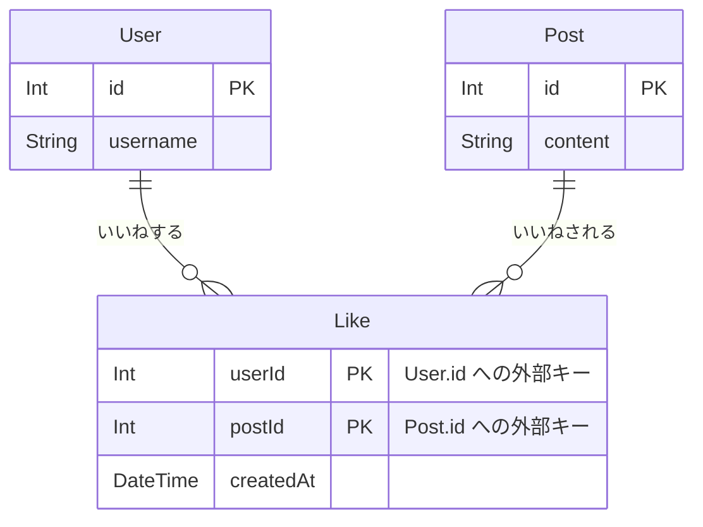
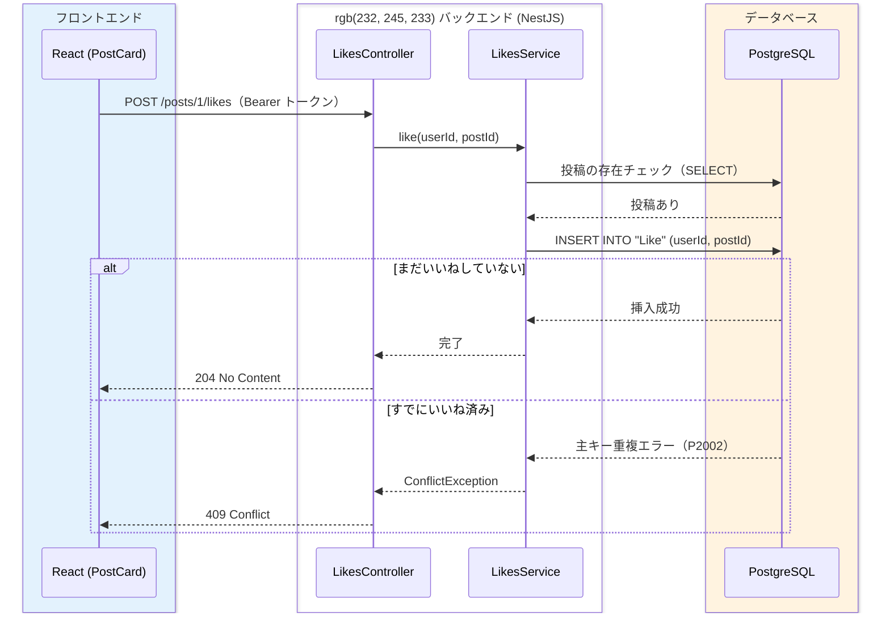

# いいね機能

[投稿機能とタイムライン](/sns/nestjs/posts/) で、投稿の作成・一覧・削除ができるようになりました。このページでは、SNSらしさの象徴である「いいね」を実装します。

いいねは、これまでの機能と決定的に違う点が1つあります。User と Post の**多対多（many-to-many、メニー・トゥ・メニー）**の関係を扱うことです。[リレーション](/database/relations/) で学んだ中間テーブルがついに実戦投入されます。さらに、「同じ投稿に2回いいねできてはいけない」という制約をデータベースの**複合主キー**で保証する方法、既存の `GET /posts` を拡張して「いいね数」と「自分がいいね済みか」を返す方法も学びます。バックエンドの定石が詰まったページです。

## 学習目標

- 多対多のリレーションを中間テーブル（Likeモデル）としてPrismaスキーマで設計できる
- 複合主キー `@@id([userId, postId])` が「二重いいね」をデータベースレベルで防ぐ仕組みを説明できる
- 一意制約違反（P2002）を捕まえて409 Conflictに変換する、堅牢なエラーハンドリングを実装できる
- `_count` とフィルタ付き `include` を使って、`likeCount` / `likedByMe` を効率よく取得できる
- 既存のAPIとReactコンポーネントを、他の機能を壊さずに拡張できる

## 多対多のデータ設計

### 中間テーブルで表す

いいねの関係を言葉にすると、「1人のユーザーは**多くの投稿**にいいねでき、1つの投稿は**多くのユーザー**からいいねされる」となります。両方向に「多」が付くので、これは多対多の関係です。

[リレーション](/database/relations/) で学んだ通り、リレーショナルデータベースは多対多を直接表現できません。外部キーは「1つの行が1つの親を指す」仕組みだからです。そこで、**「誰が・どの投稿に」いいねしたかを1行とする中間テーブル**を間に挟み、「User対Like＝1対多」と「Post対Like＝1対多」の2つに分解します。



図の中央が中間テーブル `Like` です。たとえば「alice（id: 1）がbobの投稿（id: 2）にいいねした」なら、`Like` に `(userId: 1, postId: 2)` という1行が増えるだけです。いいね解除はその行を消すだけです。「いいねの数」は `postId` が一致する行を数えれば求まり、「自分がいいね済みか」は `(自分のid, 投稿id)` の行が存在するかを調べれば分かります。**関係そのものを行として保存する**のが中間テーブルの考え方です。

### 複合主キーで二重いいねを防ぐ

`Like` テーブルの設計で注目してほしいのが、主キーです。`Post` のような連番の `id` 列を持たせず、**`userId` と `postId` の組み合わせを主キーにします**。これを複合主キー（composite primary key、コンポジット・プライマリ・キー）と呼びます。Prismaでは `@@id([userId, postId])` と書きます。

主キーには「テーブル内で重複できない」という性質がありました（→ [データベースとは](/database/what_is_database/)）。つまり `(userId, postId)` を主キーにすると、**「同じユーザーが同じ投稿にいいねした」という行は2つ作れない**ことをデータベース自体が保証してくれます。

アプリのコードで「すでにいいね済みかチェックしてから登録する」こともできますが、チェックと登録の間に同じリクエストがもう1本割り込む可能性は排除できません（この問題は後ほど詳しく見ます）。データベースの制約なら、どんなタイミング・どんな経路で書き込まれても絶対に重複しません。[投稿機能とタイムライン](/sns/nestjs/posts/) の `@db.VarChar(280)` と同じ、「最後の砦はデータベースに置く」という設計です。

## スキーマ差分とマイグレーション

設計が決まったので、スキーマに反映します。`Like` モデルを追加し、`User` と `Post` にリレーションフィールドを1行ずつ追記します。

**`backend/prisma/schema.prisma`**（抜粋。既存部分はそのまま）

```prisma
model User {
  // ...既存のフィールドはそのまま...
  verificationTokens EmailVerificationToken[]
  posts              Post[]
  likes              Like[]                       // ← この行を追記
}

model Post {
  id        Int      @id @default(autoincrement())
  content   String   @db.VarChar(280)
  authorId  Int
  author    User     @relation(fields: [authorId], references: [id], onDelete: Cascade)
  likes     Like[]                                // ← この行を追記
  createdAt DateTime @default(now())
}

model Like {                                      // ← このモデルを追加
  userId    Int
  postId    Int
  user      User     @relation(fields: [userId], references: [id], onDelete: Cascade)
  post      Post     @relation(fields: [postId], references: [id], onDelete: Cascade)
  createdAt DateTime @default(now())

  @@id([userId, postId])
}
```

**コード解説**

- `Like` は外部キーを2本持ちます。`userId` は「誰が」、`postId` は「どの投稿に」を表し、それぞれ `User` と `Post` への1対多リレーションです（→ [リレーション](/database/relations/)）。
- `onDelete: Cascade` — ユーザーが消えたらそのユーザーのいいねも、投稿が消えたらその投稿へのいいねも、連動して削除します。
- `@@id([userId, postId])` — 複合主キーの宣言です。モデル全体に対する設定なので、`@id` ではなく `@@`（2つ）で始まるブロック属性として書きます。
- `createdAt` — 主キーには含めませんが、「いつ、いいねしたか」を記録しておきます。並び替えや分析に使えるため、中間テーブルにも作成日時を持たせるのが定石です。

マイグレーションを実行します。

```bash
cd backend
pnpm exec prisma migrate dev --name add_like
```

実行結果の例:

```
Environment variables loaded from .env
Prisma schema loaded from prisma/schema.prisma
Datasource "db": PostgreSQL database "sns", schema "public" at "localhost:5432"

Applying migration `20260612130000_add_like`

The following migration(s) have been created and applied from new schema changes:

migrations/
  └─ 20260612130000_add_like/
    └─ migration.sql

Your database is now in sync with your schema.

Generated Prisma Client (v5.22.0) to ./node_modules/@prisma/client
```

生成された `migration.sql` の中心部分は次の通りです。

```sql
CREATE TABLE "Like" (
    "userId" INTEGER NOT NULL,
    "postId" INTEGER NOT NULL,
    "createdAt" TIMESTAMP(3) NOT NULL DEFAULT CURRENT_TIMESTAMP,

    CONSTRAINT "Like_pkey" PRIMARY KEY ("userId","postId")
);
```

`PRIMARY KEY ("userId","postId")` が複合主キーの実体です。この1行が、二重いいねをデータベースレベルで不可能にしています。

## LikesModule の作成

### いいね登録の流れ

実装の前に、いいね登録のリクエストがどう処理されるかを図で確認します。特に「すでにいいね済みだった場合」の分岐に注目してください。



挿入を試みて、データベースが重複エラーを返したら409に変換する——という流れです（`JwtAuthGuard` の検証は [投稿機能とタイムライン](/sns/nestjs/posts/) の図と同じため省略しています）。「先に存在チェック」ではなく「まず挿入してエラーを拾う」を選ぶ理由は、コードを見た後で説明します。

### モジュールの生成

[NestJSのセットアップ](/backend/setup/) のNest CLIで一式生成します。

```bash
pnpm exec nest g module likes
pnpm exec nest g service likes --no-spec
pnpm exec nest g controller likes --no-spec
```

実行結果の例:

```
CREATE src/likes/likes.module.ts (82 bytes)
UPDATE src/app.module.ts (516 bytes)
CREATE src/likes/likes.service.ts (90 bytes)
UPDATE src/likes/likes.module.ts (163 bytes)
CREATE src/likes/likes.controller.ts (101 bytes)
UPDATE src/likes/likes.module.ts (250 bytes)
```

### LikesService

**`backend/src/likes/likes.service.ts`**

```typescript
import {
  ConflictException,
  Injectable,
  NotFoundException,
} from '@nestjs/common';
import { Prisma } from '@prisma/client';
import { PrismaService } from '../prisma/prisma.service';

@Injectable()
export class LikesService {
  constructor(private readonly prisma: PrismaService) {}

  async like(userId: number, postId: number) {
    const post = await this.prisma.post.findUnique({
      where: { id: postId },
    });
    if (!post) {
      throw new NotFoundException('投稿が見つかりません');
    }
    try {
      await this.prisma.like.create({ data: { userId, postId } });
    } catch (error) {
      if (
        error instanceof Prisma.PrismaClientKnownRequestError &&
        error.code === 'P2002'
      ) {
        throw new ConflictException('すでにいいね済みです');
      }
      throw error;
    }
  }

  async unlike(userId: number, postId: number) {
    try {
      await this.prisma.like.delete({
        where: { userId_postId: { userId, postId } },
      });
    } catch (error) {
      if (
        error instanceof Prisma.PrismaClientKnownRequestError &&
        error.code === 'P2025'
      ) {
        throw new NotFoundException('いいねしていません');
      }
      throw error;
    }
  }
}
```

**コード解説**

- `like()` の最初の `findUnique` — 存在しない投稿へのいいねを404で弾くためのチェックです。これを省くと外部キー制約違反という別のエラーになり、クライアントに分かりにくい500が返ってしまいます。
- `prisma.like.create(...)` を `try/catch` で包む — 二重いいねの場合、複合主キーの重複でデータベースが挿入を拒否し、Prismaは `PrismaClientKnownRequestError` を投げます。エラーコード **`P2002` は「一意制約違反」**を意味するPrisma共通のコードです。これを捕まえて `ConflictException`（409 Conflict、「リクエストが現在の状態と矛盾している」→ [HTTPとREST](/backend/http_and_rest/)）に変換します。
- `error.code === 'P2002'` の判定 — P2002**以外**のエラー（接続断など）は `throw error` でそのまま投げ直します。想定外のエラーまで409にしてしまうと、本当の障害が隠れてしまうためです。
- `unlike()` の `where: { userId_postId: { ... } }` — 複合主キーで1行を特定するときのPrismaの記法です。`@@id([userId, postId])` と宣言すると、Prismaがフィールド名をアンダースコアでつないだ `userId_postId` という複合キー指定を自動生成します。
- `P2025` は「対象の行が見つからない」を意味するコードです。いいねしていない投稿への解除リクエストは404にします。

ここで2つの設計判断をしているので、理由を説明します。

**判断1: 二重いいねの検出は「先にfindUniqueで確認」ではなく「createを試みてP2002を捕まえる」方式に統一する。**
先に確認する方式には、**確認と登録のすき間**という問題があります。同じユーザーがボタンを連打して、リクエストAとBがほぼ同時に届いたとします。Aが「いいねは存在しない」と確認した直後、まだAが登録する前にBも「存在しない」と確認してしまうと、両方が登録に進みます。このような問題を競合状態（race condition、レース・コンディション）と呼びます。複合主キーがあるので2つ目の挿入はどのみちデータベースに拒否されますが、その場合に発生するのは「確認方式」では処理していない想定外のエラー、つまり500です。だったら最初から「挿入してみて、拒否されたら409」と書くほうが、コードが守りの要であるDB制約と一致し、クエリも1回少なくて済みます。

**判断2: いいねしていない投稿への解除は404にする。**
もう1つの選択肢は、「もともと無いなら消えた状態は実現できているので成功（204）と見なす」という冪等（べきとう、idempotent。何回実行しても結果が同じ）な設計です。どちらも実務で使われる妥当な設計ですが、このアプリでは「フロントエンドのバグ（いいねしていないのに解除を送るなど）に早く気づける」ことを優先し、明示的にエラーを返す方式に統一します。**どちらかに決めて一貫させる**ことが大切です。

### LikesController

**`backend/src/likes/likes.controller.ts`**

```typescript
import {
  Controller,
  Delete,
  HttpCode,
  Param,
  ParseIntPipe,
  Post,
  UseGuards,
} from '@nestjs/common';
import { JwtAuthGuard } from '../auth/jwt-auth.guard';
import { CurrentUser } from '../auth/current-user.decorator';
import { JwtPayload } from '../auth/jwt-payload';
import { LikesService } from './likes.service';

@UseGuards(JwtAuthGuard)
@Controller('posts/:id/likes')
export class LikesController {
  constructor(private readonly likesService: LikesService) {}

  @Post()
  @HttpCode(204)
  like(
    @CurrentUser() user: JwtPayload,
    @Param('id', ParseIntPipe) postId: number,
  ) {
    return this.likesService.like(user.sub, postId);
  }

  @Delete()
  @HttpCode(204)
  unlike(
    @CurrentUser() user: JwtPayload,
    @Param('id', ParseIntPipe) postId: number,
  ) {
    return this.likesService.unlike(user.sub, postId);
  }
}
```

**コード解説**

- `@Controller('posts/:id/likes')` — 「投稿に属するいいね」というURL設計です。コントローラのパスに含まれる `:id` も、メソッド側の `@Param('id', ParseIntPipe)` で受け取れます（→ [Controller](/backend/controller/)）。
- `@UseGuards(JwtAuthGuard)` と `@CurrentUser()` — [ユーザー登録とログイン（JWT認証）](/sns/nestjs/auth/) で作ったものをそのまま使います。「誰がいいねしたか」は検証済みトークンの `user.sub` だけを信頼します。
- `@HttpCode(204)` を両方に付与 — いいねの登録・解除とも、クライアントに返すべき本文がないため204 No Contentにします。[ユーザー登録とログイン（JWT認証）](/sns/nestjs/auth/) で作った `apiFetch` は「204なら本文を読まずに返す」仕様なので、空ボディのレスポンスとも相性が良い設計です。

## GET /posts の拡張

タイムラインの各投稿に「いいね数（likeCount）」と「自分がいいね済みか（likedByMe）」を付けて返すよう、[投稿機能とタイムライン](/sns/nestjs/posts/) で作った `PostsService.findAll` を拡張します。

`likedByMe` は「誰にとって」の情報かがユーザーごとに違うため、`findAll` がログイン中のユーザーIDを受け取る必要があります。ServiceとControllerの両方を修正します。

**`backend/src/posts/posts.service.ts`**（`findAll` を置き換え。他のメソッドはそのまま）

```typescript
  async findAll(userId: number) {
    const posts = await this.prisma.post.findMany({
      orderBy: { createdAt: 'desc' },
      include: {
        author: { select: authorSelect },
        _count: { select: { likes: true } },
        likes: { where: { userId }, select: { userId: true } },
      },
    });
    return posts.map((post) => ({
      id: post.id,
      content: post.content,
      createdAt: post.createdAt,
      author: post.author,
      likeCount: post._count.likes,
      likedByMe: post.likes.length > 0,
    }));
  }
```

**コード解説**

- `_count: { select: { likes: true } }` — リレーション先の**行数だけ**を数えて返すPrismaの機能です。各投稿に `_count.likes`（いいね数）が付きます。`likes: true` で全行を取得して長さを数える方法と違い、いいねが何万件あってもデータベースが数えた数値1つしか転送されません。
- `likes: { where: { userId }, select: { userId: true } }` — いいね行のうち**自分のものだけ**に絞って取得する、フィルタ付きの `include` です（→ [リレーション](/database/relations/)）。複合主キーの片割れで絞るので、結果は0行（いいねしていない）か1行（いいね済み）のどちらかです。
- `posts.map(...)` — Prismaの結果（`_count` や絞り込んだ `likes` を含む内部的な形）を、APIのレスポンスとして公開する形に**整形**しています。`likedByMe: post.likes.length > 0` で「自分のいいね行が存在するか」を真偽値に変換します。データベースの都合をそのまま外に出さず、境界で形を整えるのは良い習慣です。

コントローラ側は、`@CurrentUser()` でユーザーIDを受け取って渡すだけです。

**`backend/src/posts/posts.controller.ts`**（`findAll` を置き換え）

```typescript
  @Get()
  findAll(@CurrentUser() user: JwtPayload) {
    return this.postsService.findAll(user.sub);
  }
```

なお `PostsService.create` のレスポンスは変更しません。フロントエンドは投稿後に一覧を取得し直す方針（→ [投稿機能とタイムライン](/sns/nestjs/posts/)）なので、作成APIの戻り値に `likeCount` / `likedByMe` を含める必要がないためです。

## 動作確認（API）

[投稿機能とタイムライン](/sns/nestjs/posts/) と同様に、aliceとbobのトークン（`TOKEN_ALICE` / `TOKEN_BOB`）を取得済みとします。bobの投稿（ここでは id: 2）にaliceがいいねしてみます。

```bash
curl -i -X POST http://localhost:3000/posts/2/likes \
  -H "Authorization: Bearer $TOKEN_ALICE"
```

```
HTTP/1.1 204 No Content
```

aliceとして一覧を取得すると、`likeCount` と `likedByMe` が反映されています。

```bash
curl -s http://localhost:3000/posts \
  -H "Authorization: Bearer $TOKEN_ALICE"
```

実行結果の例（読みやすく整形しています）:

```json
[
  {
    "id": 2,
    "content": "bobです。よろしくお願いします",
    "createdAt": "2026-06-12T12:12:00.000Z",
    "author": { "id": 2, "username": "bob", "displayName": "ボブ", "bio": "", "avatarUrl": null },
    "likeCount": 1,
    "likedByMe": true
  }
]
```

同じ一覧を**bobのトークン**で取得すると、`likeCount` は同じ1のまま `likedByMe` だけが `false` になります。`likedByMe` が「見ている人によって変わる」値であることを確認してください。

次に、aliceがもう一度同じ投稿にいいねしてみます。

```bash
curl -i -X POST http://localhost:3000/posts/2/likes \
  -H "Authorization: Bearer $TOKEN_ALICE"
```

```
HTTP/1.1 409 Conflict

{"message":"すでにいいね済みです","error":"Conflict","statusCode":409}
```

複合主キー違反がP2002として捕捉され、409に変換されました。存在しない投稿へのいいねは404です。

```bash
curl -i -X POST http://localhost:3000/posts/999/likes \
  -H "Authorization: Bearer $TOKEN_ALICE"
```

```
HTTP/1.1 404 Not Found

{"message":"投稿が見つかりません","error":"Not Found","statusCode":404}
```

最後に解除です。1回目は204、2回目は（もう行が無いので）404になります。

```bash
curl -i -X DELETE http://localhost:3000/posts/2/likes \
  -H "Authorization: Bearer $TOKEN_ALICE"
```

```
HTTP/1.1 204 No Content
```

```bash
curl -i -X DELETE http://localhost:3000/posts/2/likes \
  -H "Authorization: Bearer $TOKEN_ALICE"
```

```
HTTP/1.1 404 Not Found

{"message":"いいねしていません","error":"Not Found","statusCode":404}
```

APIは完成です。

## フロントエンド

### Post型の更新

`GET /posts` のレスポンスに2つのフィールドが増えたので、[投稿機能とタイムライン](/sns/nestjs/posts/) で予告した通り `Post` 型に追記します。

**`frontend/src/types.ts`**（`Post` 型を更新）

```typescript
export type Post = {
  id: number;
  content: string;
  createdAt: string;
  author: User;
  likeCount: number;   // 追加
  likedByMe: boolean;  // 追加
};
```

### PostCard にいいねボタンを追加

投稿カードにいいねボタンを足します。見た目は「いいね 3」「いいね済み 4」というテキストだけの簡素なものにします（装飾は本質ではないため）。

**`frontend/src/components/PostCard.tsx`**（更新後の全体）

```tsx
import { Post } from '../types';

type Props = {
  post: Post;
  currentUserId: number | null;
  onDelete: (postId: number) => void;
  onToggleLike: (post: Post) => void;
};

function formatDate(iso: string): string {
  return new Date(iso).toLocaleString('ja-JP');
}

export function PostCard({
  post,
  currentUserId,
  onDelete,
  onToggleLike,
}: Props) {
  const isMine = currentUserId !== null && post.author.id === currentUserId;

  return (
    <article className="post-card">
      <div className="post-header">
        <span className="post-display-name">{post.author.displayName}</span>
        <span className="post-username">@{post.author.username}</span>
        <time className="post-date">{formatDate(post.createdAt)}</time>
      </div>
      <p className="post-content">{post.content}</p>
      <div className="post-actions">
        <button className="like-button" onClick={() => onToggleLike(post)}>
          {post.likedByMe ? 'いいね済み' : 'いいね'} {post.likeCount}
        </button>
        {isMine && (
          <button className="post-delete" onClick={() => onDelete(post.id)}>
            削除
          </button>
        )}
      </div>
    </article>
  );
}
```

**コード解説**

- `onToggleLike: (post: Post) => void` — 削除と同じく、API呼び出しは親に任せて「ボタンが押された」とだけ伝えます（→ [propsとstate](/react/props_and_state/) の単方向データフロー）。`postId` だけでなく `post` 全体を渡すのは、親が `likedByMe` を見て登録と解除を切り替えるためです。
- `{post.likedByMe ? 'いいね済み' : 'いいね'} {post.likeCount}` — 条件付きレンダリング（→ [フォームとリスト](/react/forms_and_lists/)）でラベルを出し分け、隣にいいね数を表示します。
- 削除ボタンと違い、いいねボタンは**他人の投稿にも表示**します（自分の投稿にもいいねできる仕様とします。禁止したい場合の拡張は各自で考えてみてください）。

### TimelinePage に切り替え処理を追加

[投稿機能とタイムライン](/sns/nestjs/posts/) で作った `TimelinePage.tsx` に、いいねの切り替え処理を追加します。方針は投稿・削除と同じく、**操作が成功したら一覧を取得し直す**で一貫させます。レスポンスを手元のstateに反映する方法より通信は1回増えますが、`likeCount` のような集計値もサーバの正しい値で必ず揃います。

**`frontend/src/pages/TimelinePage.tsx`**（`handleDelete` の下に追記し、`PostCard` に渡す）

```tsx
  const handleToggleLike = async (post: Post) => {
    try {
      if (post.likedByMe) {
        await apiFetch(`/posts/${post.id}/likes`, { method: 'DELETE' });
      } else {
        await apiFetch(`/posts/${post.id}/likes`, { method: 'POST' });
      }
      await loadPosts();
    } catch (e) {
      setError(e instanceof Error ? e.message : 'いいねの操作に失敗しました');
    }
  };
```

```tsx
        posts.map((post) => (
          <PostCard
            key={post.id}
            post={post}
            currentUserId={me?.id ?? null}
            onDelete={handleDelete}
            onToggleLike={handleToggleLike}
          />
        ))
```

**コード解説**

- `post.likedByMe` で分岐 — いいね済みなら `DELETE`、未いいねなら `POST` を呼びます。同じボタンが状態によって逆の操作になる「トグル（toggle、切り替え）」です。
- `await loadPosts()` — 成功後に一覧を再取得して、`likeCount` と `likedByMe` の最新値を画面に反映します。
- `PostCard` の呼び出しに `onToggleLike={handleToggleLike}` を追加するのを忘れないでください。渡し忘れるとTypeScriptが「propsが足りない」とコンパイルエラーで教えてくれます。

ボタンの並びを整えるため、`frontend/src/index.css` の末尾に1ルールだけ追記します。

**`frontend/src/index.css`**（末尾に追記）

```css
.post-actions {
  display: flex;
  gap: 8px;
}
```

## 動作確認（画面）

`pnpm run dev` でフロントエンドを起動し、[投稿機能とタイムライン](/sns/nestjs/posts/) と同じく通常ウィンドウでalice、シークレットウィンドウでbobにログインして確認します。

1. aliceの画面で、bobの投稿の「いいね 0」を押すと「いいね済み 1」に変わります。
2. bobの画面を再読み込みすると、同じ投稿が「いいね 1」と表示されます。bobはまだいいねしていないので「済み」は付きません（`likedByMe` が人によって違うことの確認です）。
3. bobも同じ投稿にいいねすると「いいね済み 2」になります。
4. aliceの画面で「いいね済み 2」を押すと解除され、「いいね 1」に戻ります。
5. ページを再読み込みしても、いいねの状態と数が保たれていることを確認します。状態がlocalStorageなどではなくデータベースに保存されている証拠です。

## 理解度チェック

**Q1. Likeテーブルに連番の `id` 列を作らず、`@@id([userId, postId])` の複合主キーを採用しました。この設計が「二重いいね防止」にどう効いているか説明してください。**

<details markdown="1">
<summary>解答を見る</summary>

主キーはテーブル内で重複できないため、`(userId, postId)` の組み合わせが同じ行は2行存在できません。つまり「同じユーザーが同じ投稿にいいねした」記録は、アプリのコードが何もしなくてもデータベース自体が拒否します。連番の `id` を主キーにしてしまうと `(1, 2)` のいいねが何行でも作れてしまい、重複防止には別途一意制約（`@@unique`）が必要になります。関係そのものが識別子になる中間テーブルでは、複合主キーが自然な設計です。

</details>

**Q2. `likedByMe` を素のSQLで求めるとしたら、どんな考え方になりますか。**

<details markdown="1">
<summary>解答を見る</summary>

「Likeテーブルに、`userId` が自分のIDで `postId` がその投稿のIDである行が**存在するか**」を調べます。SQLなら `SELECT EXISTS (SELECT 1 FROM "Like" WHERE "userId" = 自分のID AND "postId" = 投稿のID)` のような存在チェックです。今回の実装では、Prismaのフィルタ付き `include`（`likes: { where: { userId } }`）で自分のいいね行だけを取得し、`length > 0` で存在を真偽値にしています。発想は同じで、「行の存在＝関係の存在」という中間テーブルの性質を使っています。

</details>

**Q3. 「先に `findUnique` でいいねの有無を確認し、無ければ `create` する」方式には、どんな問題がありますか。**

<details markdown="1">
<summary>解答を見る</summary>

確認と登録の間に他のリクエストが割り込む競合状態（race condition）があります。ボタン連打などで2つのリクエストがほぼ同時に届くと、両方が「いいねは存在しない」という確認を通過し、両方が登録に進みます。複合主キーにより2つ目の挿入はデータベースに拒否されますが、確認方式のコードはそのエラーを処理していないため500になります。`create` を試みてP2002（一意制約違反）を捕まえる方式なら、どのタイミングで重複しても必ず409を返せます。重複防止の本当の保証はDB制約にあるので、コードもそれに乗るのが堅牢です。

</details>

**Q4. いいね解除（unlike）で、いいねしていない投稿に対して404を返す設計と、何もせず204を返す冪等な設計があります。それぞれの利点を説明してください。**

<details markdown="1">
<summary>解答を見る</summary>

404を返す設計の利点は、クライアント側の不整合（いいねしていないのに解除を送ってしまうバグ）に早く気づけることです。冪等な設計の利点は、「結果として『いいねしていない状態』になっていれば成功」と見なすため、リトライや二重送信に強く、クライアントの実装が単純になることです。どちらも妥当な設計であり、重要なのはAPI全体でどちらかに統一して、利用者が迷わないようにすることです。本カリキュラムでは前者に統一しました。

</details>

**Q5. いいね数を `likes: true` で全行取得して配列の長さを数えるのではなく、`_count: { select: { likes: true } }` を使うのはなぜですか。**

<details markdown="1">
<summary>解答を見る</summary>

転送するデータ量が違うからです。`likes: true` は全いいね行を取得するため、人気の投稿に1万いいねが付いていれば1万行がアプリに転送されます。`_count` ならデータベースが数えた「10000」という数値1つだけが返ります。集計はデータベースの得意分野なので、数えるだけならデータベースに数えさせるのが原則です。一方 `likedByMe` 用のフィルタ付き `include` は最大1行しか返さないので、行を取得しても問題ありません。

</details>

## セルフレビュー

- [ ] 多対多のリレーションを中間テーブルで2つの1対多に分解する考え方を、自分の言葉で説明できる
- [ ] `@@id([userId, postId])` がデータベース上で何になり、何を保証するかを説明できる
- [ ] P2002がどんなときに発生し、なぜ409 Conflictに変換するのかを説明できる
- [ ] 「先に確認」方式の競合状態の問題を、具体的なシナリオで説明できる
- [ ] `_count` とフィルタ付き `include` を使った `findAll` を写経せずに書ける
- [ ] `likedByMe` がリクエストするユーザーによって変わる理由と、その実装方法を説明できる
- [ ] 既存のControllerとReactコンポーネントに、型エラーを手がかりにしながら機能を追加できる

## 次のステップ

このページでは、多対多のリレーションを中間テーブルと複合主キーで設計し、いいねの登録・解除と、タイムラインへの `likeCount` / `likedByMe` の追加を実装しました。「DB制約を最後の砦にして、制約違反をHTTPエラーに変換する」パターンは、この先も繰り返し登場します。

- 前のページ: [投稿機能とタイムライン](/sns/nestjs/posts/)
- 次のページ: [フォローとフォロー中タイムライン](/sns/nestjs/follow/)

次のページのフォロー機能は、実は今回と同じ多対多です。ただし「ユーザーとユーザー」という**自己参照**の多対多になる点が新しい挑戦です。Followモデルも複合主キーを持ち、二重フォローの防止やP2002の処理など、今回学んだパターンがそのまま再利用できます。また、[SNSのテストを書く](/sns/nestjs/testing/) では、そのフォローAPIを題材にE2Eテストを書きます。
