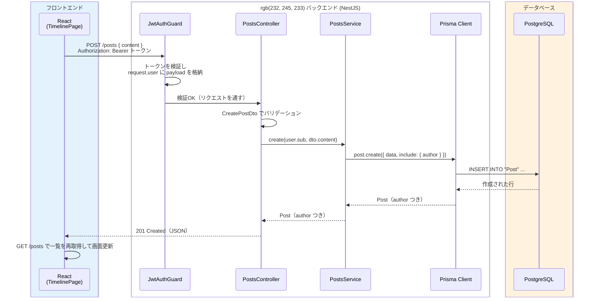

# 投稿機能とタイムライン

[メールアドレス確認（SES）](/sns/nestjs/email_verification/) までで、「登録 → メール確認 → ログイン」というユーザー基盤が完成しました。このページからは、いよいよSNSの中心機能を作っていきます。最初に取り組むのは**投稿（ポスト）**と、全ユーザーの投稿を新しい順に並べる**タイムライン**です。

進め方はこれまでの章で学んだ手順の組み合わせです。Prismaスキーマに `Post` モデルを追加してマイグレーションし、NestJSに `PostsModule` を作ってAPIを実装し、Reactでタイムライン画面を作ります。認証まわりは [ユーザー登録とログイン（JWT認証）](/sns/nestjs/auth/) で作った `JwtAuthGuard` と `@CurrentUser()` をそのまま使うだけなので、新しい概念はほとんど登場しません。「学んだ部品を組み合わせてアプリの機能を1つ完成させる」感覚を掴んでください。

## 学習目標

- 1対多のリレーション（User と Post）をPrismaスキーマに追加し、マイグレーションできる
- ログイン中のユーザーIDを `@CurrentUser()` で受け取り、「誰の操作か」に基づいた処理（投稿の作成・削除）を実装できる
- 「自分の投稿しか削除できない」という所有者チェックを、適切な例外（404 / 403）とともにServiceに実装できる
- `include` と `select` を使って、投稿に必要な範囲の投稿者情報だけを付けて返せる
- Reactで「フォームから作成 → 一覧を再取得して表示」という画面の基本パターンを実装できる

## 機能設計

### 今回作る機能

このページで実装するのは次の3つです。

1. **投稿の作成** — ログイン中のユーザーが280字以内のテキストを投稿できる
2. **全体タイムライン** — 全ユーザーの投稿を新しい順に一覧できる。各投稿には投稿者（author）の情報が付く
3. **投稿の削除** — 自分の投稿だけを削除できる

「280字以内」という上限は、Twitter（現X）と同じ制限です。上限を設ける理由は、見た目の問題だけではありません。上限のないテキスト列はデータベースの行サイズを予測不能にし、画面のレイアウトも壊しやすくなります。**入力には必ず上限を設ける**のは、Webアプリ設計の基本です。

APIは次の3本です。[HTTPとREST](/backend/http_and_rest/) で学んだ「リソースに対するメソッドの使い分け」をそのまま適用しています。3本ともログイン必須なので、[ユーザー登録とログイン（JWT認証）](/sns/nestjs/auth/) で作った `JwtAuthGuard` で保護します。

| メソッド | パス | 認証 | 説明 |
|---|---|---|---|
| POST | /posts | 必須 | 投稿を作成する |
| GET | /posts | 必須 | 全体タイムライン（新しい順、投稿者情報つき） |
| DELETE | /posts/:id | 必須 | 自分の投稿を削除する（他人の投稿は403） |

### 投稿作成の流れ

投稿を作成するとき、リクエストがどの層を通ってデータベースに届き、画面が更新されるのかを先に図で確認しておきます。



ポイントは2つあります。1つ目は、**「誰が投稿したか」をクライアントから受け取らない**ことです。リクエストボディに `authorId` を含めると、他人のIDを名乗った偽装が可能になってしまいます。投稿者IDは、`JwtAuthGuard` が検証済みトークンから取り出した `request.user`（`JwtPayload` の `sub`）だけを信頼します。2つ目は、各層の役割分担が [NestJSとは何か](/backend/what_is_nestjs/) で学んだ通りであることです。Controllerは入出力、Serviceは業務ロジック、Prismaがデータベースアクセスを担当します。

## スキーマ差分とマイグレーション

### Postモデルの追加

「1人のユーザーは多くの投稿を持ち、1つの投稿は必ず1人のユーザーに属する」——これは [リレーション](/database/relations/) で学んだ**1対多（one-to-many、ワン・トゥ・メニー）**の関係そのものです。子側（Post）に外部キー `authorId` を持たせ、親側（User）にはリスト型のリレーションフィールドを書くのでした。

`backend/prisma/schema.prisma` に `Post` モデルを追加し、`User` モデルに `posts` の1行を追記します。

**`backend/prisma/schema.prisma`**（抜粋。既存部分はそのまま）

```prisma
model User {
  id            Int      @id @default(autoincrement())
  email         String   @unique
  username      String   @unique
  displayName   String
  passwordHash  String
  bio           String   @default("")
  avatarUrl     String?
  emailVerified Boolean  @default(false)
  createdAt     DateTime @default(now())
  updatedAt     DateTime @updatedAt

  verificationTokens EmailVerificationToken[]
  posts              Post[]                       // ← この行を追記
}

model Post {                                       // ← このモデルを追加
  id        Int      @id @default(autoincrement())
  content   String   @db.VarChar(280)
  authorId  Int
  author    User     @relation(fields: [authorId], references: [id], onDelete: Cascade)
  createdAt DateTime @default(now())
}
```

**コード解説**

- `posts Post[]` — User側のリレーションフィールドです。これはデータベースに列を作るのではなく、「UserからPostをたどれる」ことをPrismaに教えるための宣言です（→ [リレーション](/database/relations/)）。
- `content String @db.VarChar(280)` — `@db.VarChar(280)` は「PostgreSQL上の列の型を `VARCHAR(280)` にする」という指定です。Prismaの `String` はそのままだとPostgreSQLでは長さ無制限の `TEXT` 型になりますが、この指定により**データベース自体が280文字を超える値を拒否**するようになります。なお、PostgreSQLの `VARCHAR(n)` はバイト数ではなく文字数で数えるため、日本語でも280「文字」です。
- `authorId Int` と `author User @relation(...)` — `authorId` が実際にデータベースに作られる外部キー列で、`author` はPrismaからUserをたどるためのフィールドです。
- `onDelete: Cascade` — 親のUserが削除されたら、そのユーザーの投稿も連動して削除する指定です（→ [リレーション](/database/relations/)）。投稿者のいない「宙に浮いた投稿」が残ることを防ぎます。
- `likes` のリレーションはまだ書きません。次のページ [いいね機能](/sns/nestjs/likes/) で追加します。

「アプリ側（DTO）でも280字をチェックするのに、なぜデータベースでも制限するのか」と思うかもしれません。アプリのバリデーションはあくまで「NestJSを通ったリクエスト」にしか効きません。将来別のプログラムが同じデータベースに書き込む可能性や、実装ミスでバリデーションが抜ける可能性を考えると、**最後の砦としてデータベース自体に制約を持たせる**のが堅牢な設計です。

### マイグレーションの実行

スキーマを変更したらマイグレーションです（→ [モデル定義とマイグレーション](/database/schema_and_migration/)）。`compose.yaml` のデータベースコンテナが起動していることを確認してから、`backend/` で実行します。

```bash
cd backend
pnpm exec prisma migrate dev --name add_post
```

実行結果の例:

```
Environment variables loaded from .env
Prisma schema loaded from prisma/schema.prisma
Datasource "db": PostgreSQL database "sns", schema "public" at "localhost:5432"

Applying migration `20260612120000_add_post`

The following migration(s) have been created and applied from new schema changes:

migrations/
  └─ 20260612120000_add_post/
    └─ migration.sql

Your database is now in sync with your schema.

Generated Prisma Client (v5.22.0) to ./node_modules/@prisma/client
```

生成された `backend/prisma/migrations/20260612120000_add_post/migration.sql` を開いてみてください。`@db.VarChar(280)` が `VARCHAR(280)` の列定義に、`@relation` が外部キー制約（`FOREIGN KEY ... ON DELETE CASCADE`）になっていることが読み取れます。スキーマに書いた宣言が、[データベースとは](/database/what_is_database/) で学んだテーブル定義にそのまま対応しています。

## PostsModule の作成

### モジュール・サービス・コントローラの生成

[NestJSのセットアップ](/backend/setup/) で学んだNest CLIで、投稿機能の置き場所を一式生成します。

```bash
pnpm exec nest g module posts
pnpm exec nest g service posts --no-spec
pnpm exec nest g controller posts --no-spec
```

実行結果の例:

```
CREATE src/posts/posts.module.ts (82 bytes)
UPDATE src/app.module.ts (438 bytes)
CREATE src/posts/posts.service.ts (90 bytes)
UPDATE src/posts/posts.module.ts (163 bytes)
CREATE src/posts/posts.controller.ts (101 bytes)
UPDATE src/posts/posts.module.ts (250 bytes)
```

`--no-spec` はテストファイルの生成を省略するオプションです。テストは [SNSのテストを書く](/sns/nestjs/testing/) でまとめて書くため、ここでは省略します。CLIが `app.module.ts` への登録（`UPDATE` の行）まで済ませてくれている点は [NestJSのセットアップ](/backend/setup/) で見た通りです。生成された `posts.module.ts` は次のようになっています。

**`backend/src/posts/posts.module.ts`**

```typescript
import { Module } from '@nestjs/common';
import { PostsService } from './posts.service';
import { PostsController } from './posts.controller';

@Module({
  controllers: [PostsController],
  providers: [PostsService],
})
export class PostsModule {}
```

`PrismaService` は [プロジェクトセットアップ](/sns/nestjs/project_setup/) で `@Global()` なPrismaModuleとして登録済みなので、このモジュールの `imports` に何も書かなくても注入できます（→ [Prisma ClientでCRUD](/database/crud_with_prisma/)）。

### CreatePostDto

リクエストボディの検証は、[DTOとバリデーション](/backend/dto_and_validation/) で学んだ class-validator で行います。

**`backend/src/posts/dto/create-post.dto.ts`**

```typescript
import { IsNotEmpty, IsString, MaxLength } from 'class-validator';

export class CreatePostDto {
  @IsString()
  @IsNotEmpty()
  @MaxLength(280)
  content: string;
}
```

**コード解説**

- `@IsString()` — `content` が文字列であることを検証します。数値やオブジェクトが来たら400 Bad Requestになります。
- `@IsNotEmpty()` — 空文字列 `""` を拒否します。空の投稿には意味がないためです。
- `@MaxLength(280)` — 280文字を超える文字列を拒否します。データベースの `VARCHAR(280)` に到達する前に、分かりやすいエラーメッセージで弾くのが目的です。
- [プロジェクトセットアップ](/sns/nestjs/project_setup/) で `main.ts` に `ValidationPipe({ whitelist: true })` をグローバル登録済みなので、DTOに書いていないプロパティ（たとえば不正に紛れ込ませた `authorId`）は自動で取り除かれます。

### PostsService

業務ロジックの本体です。作成・一覧・削除の3メソッドを実装します。

**`backend/src/posts/posts.service.ts`**

```typescript
import {
  ForbiddenException,
  Injectable,
  NotFoundException,
} from '@nestjs/common';
import { PrismaService } from '../prisma/prisma.service';

const authorSelect = {
  id: true,
  username: true,
  displayName: true,
  bio: true,
  avatarUrl: true,
} as const;

@Injectable()
export class PostsService {
  constructor(private readonly prisma: PrismaService) {}

  create(authorId: number, content: string) {
    return this.prisma.post.create({
      data: { authorId, content },
      include: { author: { select: authorSelect } },
    });
  }

  findAll() {
    return this.prisma.post.findMany({
      orderBy: { createdAt: 'desc' },
      include: { author: { select: authorSelect } },
    });
  }

  async remove(userId: number, postId: number) {
    const post = await this.prisma.post.findUnique({
      where: { id: postId },
    });
    if (!post) {
      throw new NotFoundException('投稿が見つかりません');
    }
    if (post.authorId !== userId) {
      throw new ForbiddenException('自分の投稿しか削除できません');
    }
    await this.prisma.post.delete({ where: { id: postId } });
  }
}
```

**コード解説**

- `authorSelect` — 投稿者として返すフィールドの一覧を定数にまとめています。`include: { author: true }` と書いてしまうと `passwordHash` を含む**Userの全列**がレスポンスに乗ってしまうため、`select` で必要な5つに絞ります（→ [リレーション](/database/relations/) の include / select）。同じ指定を3か所に書くとずれの原因になるので、定数化して使い回します。
- `constructor(private readonly prisma: PrismaService)` — [ServiceとDI](/backend/service_and_di/) で学んだ依存性注入です。
- `create(authorId, content)` — 投稿を1件作成します。`include` を付けているのは、作成直後のレスポンスにも投稿者情報を含めるためです。`authorId` はControllerが検証済みトークンから渡してくる値で、クライアントの入力ではありません。
- `findAll()` — `orderBy: { createdAt: 'desc' }` で作成日時の降順、つまり**新しい投稿が先頭**になるよう並べます。タイムラインの「新着順」はデータベースのソートで実現します。
- `remove(userId, postId)` — まず投稿を取得し、(1) 存在しなければ `NotFoundException`（404）、(2) 存在するが投稿者が本人でなければ `ForbiddenException`（403）を投げます（→ 例外とステータスコードの対応は [CRUD実践](/backend/crud_practice/) と [HTTPとREST](/backend/http_and_rest/)）。両方のチェックを通過した場合だけ削除します。

ここで重要なのが、**所有者チェックをControllerではなくServiceに置いている**ことです。理由は2つあります。

1. 「自分の投稿しか削除できない」は業務ルールそのものであり、HTTPの入出力（Controllerの責務）ではなくロジック（Serviceの責務）だからです。
2. 将来、別のControllerや [SNSのテストを書く](/sns/nestjs/testing/) のテストコードなど、**別の入り口から `remove` が呼ばれても**必ずチェックが効くからです。Controllerに書いてしまうと、Serviceを直接呼ぶ経路ができた瞬間にチェックが抜けます。

なお、404と403を使い分けるのは「リソースが存在しない」と「存在するが権限がない」は別のエラーだからです。クライアント（フロントエンド）はこの違いを見て、ユーザーへの表示を変えられます。

### PostsController

HTTPの入り口です。3つのエンドポイントをルーティングします。

**`backend/src/posts/posts.controller.ts`**

```typescript
import {
  Body,
  Controller,
  Delete,
  Get,
  HttpCode,
  Param,
  ParseIntPipe,
  Post,
  UseGuards,
} from '@nestjs/common';
import { JwtAuthGuard } from '../auth/jwt-auth.guard';
import { CurrentUser } from '../auth/current-user.decorator';
import { JwtPayload } from '../auth/jwt-payload';
import { CreatePostDto } from './dto/create-post.dto';
import { PostsService } from './posts.service';

@UseGuards(JwtAuthGuard)
@Controller('posts')
export class PostsController {
  constructor(private readonly postsService: PostsService) {}

  @Post()
  create(@CurrentUser() user: JwtPayload, @Body() dto: CreatePostDto) {
    return this.postsService.create(user.sub, dto.content);
  }

  @Get()
  findAll() {
    return this.postsService.findAll();
  }

  @Delete(':id')
  @HttpCode(204)
  remove(
    @CurrentUser() user: JwtPayload,
    @Param('id', ParseIntPipe) id: number,
  ) {
    return this.postsService.remove(user.sub, id);
  }
}
```

**コード解説**

- `@UseGuards(JwtAuthGuard)` をクラスに付与 — メソッドごとではなく**コントローラ全体**にGuardを掛けています。投稿APIは3本ともログイン必須なので、クラスに1回書くだけで全エンドポイントが保護されます。付け忘れの事故も防げます。`JwtAuthGuard` の仕組みは [ユーザー登録とログイン（JWT認証）](/sns/nestjs/auth/) で作った通りです。
- `@CurrentUser() user: JwtPayload` — Guardが `request.user` に格納した検証済みペイロードを受け取る、[ユーザー登録とログイン（JWT認証）](/sns/nestjs/auth/) で作った自作デコレータです。`user.sub` がユーザーIDです。
- `@Post()` / `@Get()` / `@Delete(':id')` — [Controller](/backend/controller/) で学んだルーティングです。`@Controller('posts')` と組み合わさって `POST /posts`、`GET /posts`、`DELETE /posts/:id` になります。
- `@Param('id', ParseIntPipe) id: number` — URLのパラメータは文字列で届くため、`ParseIntPipe` で数値に変換します（→ [Controller](/backend/controller/)）。`/posts/abc` のような不正な値は400 Bad Requestになります。
- `@HttpCode(204)` — 削除成功時は返す本文がないので、204 No Content を明示します（NestJSのデフォルトではDELETEも200になります。→ [HTTPとREST](/backend/http_and_rest/)）。

## 動作確認（API）

フロントエンドを作る前に、curlでAPI単体の動作を確認します（→ [メモAPIを作る](/backend/crud_practice/) と同じ進め方です）。データベースとAPIを起動しておきます。

```bash
# プロジェクトルートで
docker compose up -d
# backend/ で
pnpm run start:dev
```

ユーザーは [ユーザー登録とログイン（JWT認証）](/sns/nestjs/auth/)・[メールアドレス確認（SES）](/sns/nestjs/email_verification/) の動作確認で作成した `alice` と `bob`（どちらもメール確認済み）を使います。まだ作っていない場合は、先にその2ページの手順で2人分の登録とメール確認を済ませてください。

まずaliceでログインしてトークンを取得します。

```bash
curl -s -X POST http://localhost:3000/auth/login \
  -H "Content-Type: application/json" \
  -d '{"email":"alice@example.com","password":"password123"}'
```

実行結果の例:

```json
{"accessToken":"eyJhbGciOiJIUzI1NiIsInR5cCI6IkpXVCJ9.eyJzdWIiOjEsInVzZXJuYW1lIjoiYWxpY2UiLCJpYXQiOjE3NjU1MjAwMDAsImV4cCI6MTc2NTYwNjQwMH0.S3xkQ..."}
```

`accessToken` の値をシェル変数に入れておくと、以降のコマンドが楽になります。同じ手順でbobのトークンも取得しておきます。

```bash
TOKEN_ALICE="eyJhbGciOiJIUzI1NiIsInR5cCI6IkpXVCJ9.eyJzdWIiOjEs...（aliceのトークン）"
TOKEN_BOB="eyJhbGciOiJIUzI1NiIsInR5cCI6IkpXVCJ9.eyJzdWIiOjIs...（bobのトークン）"
```

### 投稿の作成

```bash
curl -i -X POST http://localhost:3000/posts \
  -H "Content-Type: application/json" \
  -H "Authorization: Bearer $TOKEN_ALICE" \
  -d '{"content":"はじめての投稿です"}'
```

実行結果の例:

```
HTTP/1.1 201 Created
Content-Type: application/json; charset=utf-8

{"id":1,"content":"はじめての投稿です","authorId":1,"createdAt":"2026-06-12T12:10:00.000Z","author":{"id":1,"username":"alice","displayName":"アリス","bio":"","avatarUrl":null}}
```

`author` に `passwordHash` や `email` が**含まれていない**ことを確認してください。`select` で絞った効果です。なお、`Authorization` ヘッダなしで叩くとGuardに弾かれて `401 Unauthorized` が、`content` を空文字列にするとDTOのバリデーションに弾かれて `400 Bad Request` が返ります。余裕があれば試してみてください。

bobでも1件投稿しておきます。

```bash
curl -s -X POST http://localhost:3000/posts \
  -H "Content-Type: application/json" \
  -H "Authorization: Bearer $TOKEN_BOB" \
  -d '{"content":"bobです。よろしくお願いします"}'
```

### タイムラインの取得

```bash
curl -s http://localhost:3000/posts \
  -H "Authorization: Bearer $TOKEN_ALICE"
```

実行結果の例（読みやすく整形しています）:

```json
[
  {
    "id": 2,
    "content": "bobです。よろしくお願いします",
    "authorId": 2,
    "createdAt": "2026-06-12T12:12:00.000Z",
    "author": { "id": 2, "username": "bob", "displayName": "ボブ", "bio": "", "avatarUrl": null }
  },
  {
    "id": 1,
    "content": "はじめての投稿です",
    "authorId": 1,
    "createdAt": "2026-06-12T12:10:00.000Z",
    "author": { "id": 1, "username": "alice", "displayName": "アリス", "bio": "", "avatarUrl": null }
  }
]
```

後から投稿したbobの投稿が先頭に来ています。`orderBy: { createdAt: 'desc' }` が効いている証拠です。

### 投稿の削除（403 / 404 / 204）

まず、**bobのトークンでaliceの投稿（id: 1）を削除**しようとしてみます。

```bash
curl -i -X DELETE http://localhost:3000/posts/1 \
  -H "Authorization: Bearer $TOKEN_BOB"
```

```
HTTP/1.1 403 Forbidden

{"message":"自分の投稿しか削除できません","error":"Forbidden","statusCode":403}
```

存在しない投稿の削除は404です。

```bash
curl -i -X DELETE http://localhost:3000/posts/999 \
  -H "Authorization: Bearer $TOKEN_ALICE"
```

```
HTTP/1.1 404 Not Found

{"message":"投稿が見つかりません","error":"Not Found","statusCode":404}
```

最後に、aliceが自分の投稿を削除します。

```bash
curl -i -X DELETE http://localhost:3000/posts/1 \
  -H "Authorization: Bearer $TOKEN_ALICE"
```

```
HTTP/1.1 204 No Content
```

もう一度 `GET /posts` を叩くと、bobの投稿だけが残っているはずです。APIは完成です。

## フロントエンド

次にタイムライン画面を作ります。[ユーザー登録とログイン（JWT認証）](/sns/nestjs/auth/) で作った `apiFetch`（トークンを自動付与する自作ラッパー）と `useHashRoute` をそのまま使います。

### Post型の追加

**`frontend/src/types.ts`**（既存の `User` 型の下に追記）

```typescript
export type Post = {
  id: number;
  content: string;
  createdAt: string;
  author: User;
};
```

**コード解説**

- `createdAt: string` — JSONには日時型がないため、APIからはISO 8601形式の文字列（例 `"2026-06-12T12:10:00.000Z"`）で届きます。表示するときに `Date` に変換します。
- `author: User` — `GET /posts` のレスポンス構造に対応しています。
- `likeCount` と `likedByMe` は**まだ定義しません**。次のページ [いいね機能](/sns/nestjs/likes/) でAPIを拡張するときに、この型にも2つのフィールドを追加します。

### Layout コンポーネント

ログイン後の画面に共通するヘッダー（ナビゲーション）を、[JSXとコンポーネント](/react/jsx_and_components/) で学んだ通り、再利用できるコンポーネントとして切り出します。

**`frontend/src/components/Layout.tsx`**（新規作成）

```tsx
import { ReactNode } from 'react';
import { clearToken } from '../lib/apiClient';

type Props = {
  children: ReactNode;
};

export function Layout({ children }: Props) {
  const handleLogout = () => {
    clearToken();
    location.hash = '#/login';
  };

  return (
    <div className="layout">
      <header className="header">
        <a className="logo" href="#/">SNS</a>
        <nav className="nav">
          <a href="#/">タイムライン</a>
          <a href="#/chat">チャット</a>
          <a href="#/settings">設定</a>
          <button className="logout-button" onClick={handleLogout}>
            ログアウト
          </button>
        </nav>
      </header>
      <main className="main">{children}</main>
    </div>
  );
}
```

**コード解説**

- `children: ReactNode` — ヘッダーの下に表示する中身を [propsとstate](/react/props_and_state/) で学んだpropsとして受け取ります。これで各ページを `<Layout>...</Layout>` で包むだけになります。
- `<a href="#/...">` — ルーティングはハッシュベース（→ [ユーザー登録とログイン（JWT認証）](/sns/nestjs/auth/) の `useHashRoute`）なので、リンクは普通の `<a>` タグで書けます。
- 「チャット」「設定」のリンク先は、それぞれ [DMチャット（リアルタイム）](/sns/nestjs/chat/) と [プロフィール編集と画像アップロード](/sns/nestjs/profile_and_images/) で実装します。**今はリンクだけ用意しておき、クリックしても「ページが見つかりません」と表示されるだけ**で問題ありません。
- `handleLogout` — `apiFetch` と一緒に作った `clearToken()` でlocalStorageのトークンを消し、ログイン画面へ移動します。

### PostCard コンポーネント

投稿1件分の表示を担当するコンポーネントです。タイムライン以外（後の章のプロフィールページなど）でも使い回せるよう、独立させておきます。

**`frontend/src/components/PostCard.tsx`**（新規作成）

```tsx
import { Post } from '../types';

type Props = {
  post: Post;
  currentUserId: number | null;
  onDelete: (postId: number) => void;
};

function formatDate(iso: string): string {
  return new Date(iso).toLocaleString('ja-JP');
}

export function PostCard({ post, currentUserId, onDelete }: Props) {
  const isMine = currentUserId !== null && post.author.id === currentUserId;

  return (
    <article className="post-card">
      <div className="post-header">
        <span className="post-display-name">{post.author.displayName}</span>
        <span className="post-username">@{post.author.username}</span>
        <time className="post-date">{formatDate(post.createdAt)}</time>
      </div>
      <p className="post-content">{post.content}</p>
      {isMine && (
        <button className="post-delete" onClick={() => onDelete(post.id)}>
          削除
        </button>
      )}
    </article>
  );
}
```

**コード解説**

- `formatDate` — ISO形式の文字列を `Date` にし、`toLocaleString('ja-JP')` で「2026/6/12 21:10:00」のような日本語表記にします。
- `currentUserId` — ログイン中のユーザーIDです。親（TimelinePage）から渡してもらい、`post.author.id` と比較して**自分の投稿のときだけ削除ボタンを表示**します（条件付きレンダリング → [フォームとリスト](/react/forms_and_lists/)）。
- ここでの出し分けはあくまで**見た目の制御**です。仮に細工して他人の投稿の削除リクエストを送っても、サーバ側のServiceが403で拒否します。「フロントの出し分けは利便性のため、本当の防御はサーバ側」という役割分担を覚えてください。
- `onDelete` — 削除処理そのもの（API呼び出しと再取得）は親が持ち、PostCardは「削除ボタンが押された」と伝えるだけにします。コンポーネントの責務が小さくなり再利用しやすくなります（→ [propsとstate](/react/props_and_state/) の単方向データフロー）。

### TimelinePage

タイムライン画面の本体です。「初回読み込みで一覧取得」「フォームから投稿」「投稿・削除後に再取得」をまとめます。

**`frontend/src/pages/TimelinePage.tsx`**（新規作成）

```tsx
import { FormEvent, useEffect, useState } from 'react';
import { apiFetch } from '../lib/apiClient';
import { Post, User } from '../types';
import { PostCard } from '../components/PostCard';

export function TimelinePage() {
  const [posts, setPosts] = useState<Post[]>([]);
  const [me, setMe] = useState<User | null>(null);
  const [content, setContent] = useState('');
  const [loading, setLoading] = useState(true);
  const [error, setError] = useState('');

  const loadPosts = async () => {
    try {
      const data = await apiFetch<Post[]>('/posts');
      setPosts(data);
      setError('');
    } catch (e) {
      setError(e instanceof Error ? e.message : '読み込みに失敗しました');
    } finally {
      setLoading(false);
    }
  };

  useEffect(() => {
    apiFetch<User>('/auth/me')
      .then(setMe)
      .catch(() => setMe(null));
    loadPosts();
  }, []);

  const handleSubmit = async (e: FormEvent) => {
    e.preventDefault();
    if (content.trim() === '') {
      return;
    }
    try {
      await apiFetch('/posts', {
        method: 'POST',
        body: JSON.stringify({ content }),
      });
      setContent('');
      await loadPosts();
    } catch (e) {
      setError(e instanceof Error ? e.message : '投稿に失敗しました');
    }
  };

  const handleDelete = async (postId: number) => {
    if (!confirm('この投稿を削除しますか？')) {
      return;
    }
    try {
      await apiFetch(`/posts/${postId}`, { method: 'DELETE' });
      await loadPosts();
    } catch (e) {
      setError(e instanceof Error ? e.message : '削除に失敗しました');
    }
  };

  if (loading) {
    return <p>読み込み中...</p>;
  }

  return (
    <div className="timeline">
      <form className="post-form" onSubmit={handleSubmit}>
        <textarea
          value={content}
          onChange={(e) => setContent(e.target.value)}
          maxLength={280}
          rows={3}
          placeholder="いまどうしてる？"
        />
        <div className="post-form-footer">
          <span className="char-count">{content.length}/280</span>
          <button type="submit" disabled={content.trim() === ''}>
            投稿する
          </button>
        </div>
      </form>

      {error && <p className="error">{error}</p>}

      {posts.length === 0 ? (
        <p>まだ投稿がありません。最初の投稿をしてみましょう。</p>
      ) : (
        posts.map((post) => (
          <PostCard
            key={post.id}
            post={post}
            currentUserId={me?.id ?? null}
            onDelete={handleDelete}
          />
        ))
      )}
    </div>
  );
}
```

**コード解説**

- `useState` を5つ — 投稿一覧・自分の情報・入力中の本文・ローディング・エラーを、それぞれ独立したstateで持ちます（→ [propsとstate](/react/props_and_state/)）。
- `loadPosts` — `apiFetch<Post[]>('/posts')` で一覧を取得します。失敗時は `error` に、完了時は `loading` を `false` にする、[fetchでAPI通信](/react/api_fetch/) で学んだローディング/エラー処理の定型です。投稿後・削除後にも呼び直すので関数として切り出しています。
- `useEffect(..., [])` — [useEffectと依存配列](/react/hooks/) で学んだ通り、依存配列を空にして**初回マウント時に1回だけ**実行します。`GET /auth/me`（→ [ユーザー登録とログイン（JWT認証）](/sns/nestjs/auth/)）で自分のIDを取得し、削除ボタンの出し分けに使います。
- `<textarea value={content} onChange={...}>` — [フォームとリスト](/react/forms_and_lists/) で学んだ**制御コンポーネント**です。入力値をstateで管理しているので、投稿成功後に `setContent('')` とするだけでフォームを空にできます。
- `handleSubmit` — `e.preventDefault()` でブラウザ標準のフォーム送信（ページリロード）を止め、`apiFetch` でPOSTします。成功したら `loadPosts()` で**一覧を取得し直す**のがこのページの方針です。手元の配列に直接追加するより実装が単純で、サーバ上の正しい状態（他のユーザーの新着投稿も含む）と必ず一致します。
- `posts.map(...)` と `key={post.id}` — リスト表示では各要素に一意な `key` が必須でした（→ [フォームとリスト](/react/forms_and_lists/)）。投稿IDをそのまま使います。
- `posts.length === 0 ? ... : ...` — 投稿が1件もないときの表示を条件付きレンダリングで出し分けます。

### App.tsx への組み込み

[ユーザー登録とログイン（JWT認証）](/sns/nestjs/auth/)・[メールアドレス確認（SES）](/sns/nestjs/email_verification/) で作った `App.tsx` に、タイムラインの分岐を追加します。ログイン済みユーザーが `#/` を開いたら `Layout` に包んだ `TimelinePage` を表示します。

**`frontend/src/App.tsx`**（更新後の全体）

```tsx
import { useHashRoute } from './hooks/useHashRoute';
import { isLoggedIn } from './lib/apiClient';
import { Layout } from './components/Layout';
import RegisterPage from './pages/RegisterPage';
import LoginPage from './pages/LoginPage';
import VerifyEmailPage from './pages/VerifyEmailPage';
import { TimelinePage } from './pages/TimelinePage';

export default function App() {
  const { path, navigate } = useHashRoute();

  // 未ログインでもアクセスできるページ
  if (path === '/register') return <RegisterPage />;
  if (path === '/login') return <LoginPage navigate={navigate} />;
  if (path.startsWith('/verify-email')) return <VerifyEmailPage path={path} />;

  // ここから下はログイン必須
  if (!isLoggedIn()) {
    location.hash = '#/login';
    return null;
  }

  if (path === '/') {
    return (
      <Layout>
        <TimelinePage />
      </Layout>
    );
  }

  return (
    <Layout>
      <p>ページが見つかりません</p>
    </Layout>
  );
}
```

**コード解説**

- `useHashRoute()` — `#` 以降のパスと遷移用の `navigate` を返す自作フックです（→ [ユーザー登録とログイン（JWT認証）](/sns/nestjs/auth/)）。
- import の書き分けに注意してください。`RegisterPage` / `LoginPage` / `VerifyEmailPage` は **default export** で定義したページなので `import RegisterPage from ...` の形で読み込みます。`LoginPage` と `VerifyEmailPage` には必要なprops（`navigate` / `path`）を渡し、`RegisterPage` は[メールアドレス確認（SES）](/sns/nestjs/email_verification/)でPropsを削除したので何も渡しません（→ [ユーザー登録とログイン（JWT認証）](/sns/nestjs/auth/)）。一方、`Layout` のような部品コンポーネントと、このページで named export として定義した `TimelinePage` は `import { ... }` の形で読み込みます。
- `isLoggedIn()` — localStorageにトークンがあるかを見るだけの簡易チェックです。トークンが期限切れでも `true` になりますが、その場合は最初のAPI呼び出しが401になり、`apiFetch` がトークンを消してログイン画面へ戻してくれるので問題ありません。
- 最後の `return` — `#/chat` や `#/settings` など、まだ実装していないパスの受け皿です。[フォローとフォロー中タイムライン](/sns/nestjs/follow/) 以降のページで、ここに分岐を増やしていきます。

### CSSの追記

最小限の見た目を整えます。CSSの書き方自体は [HTML/CSS](/frontend/html_css/) で学習済みなので、ここでは深入りせずコピーして使ってください。

**`frontend/src/index.css`**（末尾に追記）

```css
/* レイアウト */
.layout {
  max-width: 600px;
  margin: 0 auto;
}
.header {
  display: flex;
  justify-content: space-between;
  align-items: center;
  padding: 12px 0;
  border-bottom: 1px solid #ddd;
}
.logo { font-weight: bold; text-decoration: none; }
.nav { display: flex; gap: 12px; align-items: center; }

/* 投稿フォーム */
.post-form textarea {
  width: 100%;
  box-sizing: border-box;
  margin-top: 16px;
}
.post-form-footer {
  display: flex;
  justify-content: space-between;
  align-items: center;
}
.char-count { color: #666; font-size: 0.85rem; }

/* 投稿カード */
.post-card {
  border: 1px solid #ddd;
  border-radius: 8px;
  padding: 12px;
  margin-top: 12px;
}
.post-header {
  display: flex;
  gap: 8px;
  align-items: baseline;
}
.post-display-name { font-weight: bold; }
.post-username,
.post-date {
  color: #666;
  font-size: 0.85rem;
}
.post-content {
  margin: 8px 0;
  white-space: pre-wrap;
}
.error { color: #b00020; }
```

`white-space: pre-wrap` は、投稿本文に含まれる改行をそのまま表示するための指定です。

## 動作確認（画面）

フロントエンドを起動して、ブラウザで確認します。

```bash
# frontend/ で
pnpm run dev
```

実行結果の例:

```
  VITE v5.4.8  ready in 312 ms

  ➜  Local:   http://localhost:5173/
```

次の手順で確認してください。

1. ブラウザで `http://localhost:5173` を開き、aliceでログインします。タイムライン画面（投稿フォームと一覧）が表示されます。
2. フォームに「画面からの投稿です」と入力して「投稿する」を押すと、一覧の先頭に自分の投稿が現れ、フォームが空に戻ります。
3. **別のブラウザ（またはシークレットウィンドウ）**で `http://localhost:5173` を開き、bobでログインして何か投稿します。シークレットウィンドウを使うのは、localStorageが分離されていて2人のログイン状態を同時に保てるためです。
4. aliceのウィンドウを再読み込みすると、**aliceとbobの投稿が新しい順に混ざって**表示されます。これが全体タイムラインです。
5. aliceの画面では、aliceの投稿にだけ「削除」ボタンが表示され、bobの投稿には表示されないことを確認します。
6. aliceが自分の投稿を削除すると、確認ダイアログのあと一覧から消えます。

うまく動かないときは、ブラウザの開発者ツールのNetworkタブでリクエストとレスポンスを確認するのでした（→ [fetchでAPI通信](/react/api_fetch/)）。401が返っている場合はトークン切れなので、ログインし直してください。

## 理解度チェック

**Q1. PostsController は `authorId` をリクエストボディから受け取らず、`@CurrentUser()` の `user.sub` を使っています。なぜですか。**

<details markdown="1">
<summary>解答を見る</summary>

リクエストボディはクライアントが自由に書き換えられるため、`authorId` をボディで受け取ると「他人のIDを名乗った投稿」が可能になってしまうからです。`@CurrentUser()` が返すのは、`JwtAuthGuard` が署名を検証したJWTのペイロードであり、サーバが信頼できる唯一の「本人確認済みのID」です。一般化すると、**「誰がやったか」はクライアントの申告ではなく認証情報から決める**のが原則です。

</details>

**Q2. 投稿の削除で、404（NotFoundException）と403（ForbiddenException）を分けて返しています。それぞれどんな状況で返り、なぜ区別が必要なのですか。**

<details markdown="1">
<summary>解答を見る</summary>

404は「指定されたIDの投稿が存在しない」、403は「投稿は存在するが、ログイン中のユーザーに削除する権限がない（他人の投稿）」という状況で返ります。区別する理由は、クライアントが適切な対応を取れるようにするためです。404なら「すでに削除された投稿です」、403なら「自分の投稿のみ削除できます」のように、ユーザーへの案内を変えられます。ステータスコードの意味は [HTTPとREST](/backend/http_and_rest/) で学んだ通りです。

</details>

**Q3. 所有者チェック（`post.authorId !== userId`）をControllerではなくServiceに書く理由を説明してください。**

<details markdown="1">
<summary>解答を見る</summary>

「自分の投稿しか削除できない」はHTTPの入出力ではなく業務ルールなので、ロジック担当のServiceに置くのが責務分担として正しいからです。さらに実用上の理由として、Serviceは将来別のController・別のGateway・テストコードなど複数の入り口から呼ばれる可能性があり、Service側にチェックがあれば**どの経路から呼ばれても必ず権限チェックが効く**ことが保証されます。Controllerに書くと、Serviceを直接呼ぶ経路ができたときにチェックが抜けます。

</details>

**Q4. `content` の長さ制限を、DTOの `@MaxLength(280)` とスキーマの `@db.VarChar(280)` の二重に掛けています。どちらか片方ではいけないのですか。**

<details markdown="1">
<summary>解答を見る</summary>

役割が違うため両方必要です。DTOのバリデーションは、不正な入力を**分かりやすいエラーメッセージで早期に**弾くためのもので、NestJSを通るリクエストにしか効きません。一方 `@db.VarChar(280)` はデータベース自体の制約で、実装ミスや別経路からの書き込みがあっても**最終的にデータが守られる**最後の砦です。アプリ層は使い勝手、DB層は整合性の保証、と考えると整理できます。

</details>

**Q5. `include: { author: true }` ではなく `include: { author: { select: ... } }` と書いています。`author: true` にすると何が起きますか。**

<details markdown="1">
<summary>解答を見る</summary>

`author: true` はUserの**全列**を結合して返すため、レスポンスに `passwordHash` や `email` などの秘匿情報が含まれてしまいます。タイムラインは全ユーザーが見られるAPIなので、これは重大な情報漏えいです。`select` で `id` / `username` / `displayName` / `bio` / `avatarUrl` の5つに絞ることで、公開してよい情報だけを返しています（→ [リレーション](/database/relations/)）。

</details>

**Q6. TimelinePage では投稿成功後に `loadPosts()` で一覧全体を取得し直しています。手元の `posts` 配列に新しい投稿を追加する方法と比べたときの利点は何ですか。**

<details markdown="1">
<summary>解答を見る</summary>

サーバ上の最新状態と画面が必ず一致することです。取得し直せば、自分の投稿だけでなく、その間に他のユーザーが行った投稿や削除も反映されます。また、サーバが採番したIDや日時を手元の配列にどう反映するかを考える必要がなく、実装が単純になります。欠点は通信が1回増えることですが、この規模では問題になりません。

</details>

## セルフレビュー

- [ ] 1対多のリレーションをPrismaスキーマで表現する方法（外部キー側とリスト側）を自分の言葉で説明できる
- [ ] `@db.VarChar(280)` がデータベースに何をもたらすか、DTOのバリデーションとの役割の違いを説明できる
- [ ] `@UseGuards(JwtAuthGuard)` をコントローラ全体に掛ける書き方と、その利点を説明できる
- [ ] 「authorIdをボディで受け取ってはいけない理由」を説明できる
- [ ] NotFoundException と ForbiddenException の使い分けを、具体的な状況とともに説明できる
- [ ] PostsService の `findAll`（orderBy / include / select）を写経せずに書ける
- [ ] Reactで「制御コンポーネントのフォーム → POST → 一覧再取得」の流れを写経せずに書ける
- [ ] リスト表示で `key` に投稿IDを使う理由を説明できる

## 次のステップ

このページでは、Postモデルの追加からタイムライン画面まで、SNSの中心機能を一気通貫で実装しました。「スキーマ差分 → マイグレーション → Service → Controller → 画面」という流れは、この後のページでも毎回繰り返す基本形です。

- 前のページ: [メールアドレス確認（SES）](/sns/nestjs/email_verification/)
- 次のページ: [いいね機能](/sns/nestjs/likes/)

次のページでは、投稿に「いいね」を付けられるようにします。ユーザーと投稿の**多対多**のリレーションを中間テーブルで設計し、今回作った `GET /posts` を拡張して `likeCount` / `likedByMe` を返すようにします。また、[フォローとフォロー中タイムライン](/sns/nestjs/follow/) では「フォローしている人だけのタイムライン」を追加します。今回の `findAll` で使った `orderBy` と `include` のパターンがそのまま土台になります。
