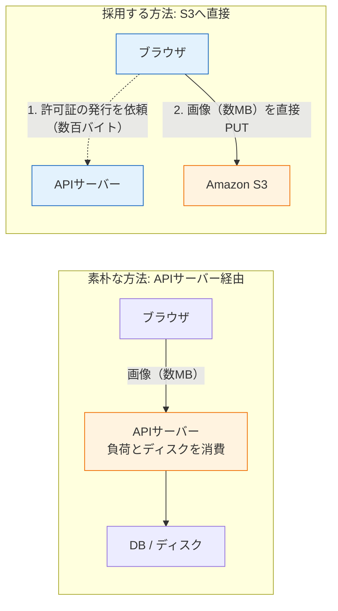
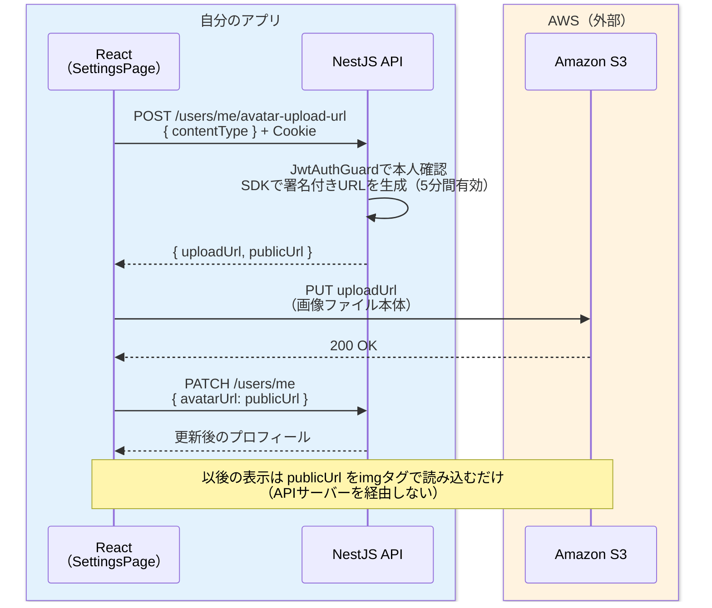

# プロフィール編集と画像アップロード

前のページ[DMチャット（リアルタイム）](/sns/nestjs/chat/)までで、SNSの主要な機能（認証・投稿・いいね・フォロー・チャット）が一通り動くようになりました。このページでは、ユーザーが自分のプロフィール（表示名・自己紹介・アイコン画像）を編集できるようにします。

このページで扱う内容は2つに分かれます。前半の「プロフィール編集API」は、これまで何度も書いてきたCRUDの復習に近い内容です。後半の「画像アップロード」が本題で、**presigned URL（プリサインドユーアールエル、署名付きURL）**という新しいテクニックを使って、ブラウザからAmazon S3へ画像を直接アップロードする仕組みを作ります。

なお、このページでは**データベースのスキーマ変更（マイグレーション）はありません**。プロフィール編集で使う`bio`（自己紹介）と`avatarUrl`（アイコン画像のURL）の2つの列は、[ユーザー登録とログイン（JWT認証）](/sns/nestjs/auth/)で`User`モデルを定義したときに「後の章で使う列も先に定義しておきます」として既に作ってあるからです。今回はその列をついに使うときが来た、ということです。

## 学習目標

- 部分更新（PATCH）のAPIを、省略可能なフィールドを持つDTOとあわせて実装できる
- 画像をAPIサーバー経由で保存する素朴な方法の問題点を説明できる
- presigned URLの仕組みと、それが安全である理由を説明できる
- S3バケットのバケットポリシーとCORS設定の役割を説明し、設定できる
- ReactからS3へ画像を直接アップロードする処理を実装できる

## プロフィール編集API

まずは表示名（`displayName`）と自己紹介（`bio`）を編集できるAPIを作ります。アイコン画像のURL（`avatarUrl`）も同じAPIで更新できるようにしておき、後半のアップロード機能から利用します。

エンドポイントは設計どおり `PATCH /users/me` です。PATCHは「リソースの一部だけを更新する」HTTPメソッドでした（→ [HTTPとREST](/backend/http_and_rest/)）。「表示名だけ変えたい」「自己紹介だけ変えたい」という使い方を想定し、3つのフィールドすべてを省略可能にします。

### UpdateProfileDto

リクエストボディの検証には、[DTOとバリデーション](/backend/dto_and_validation/)で学んだclass-validatorを使います。[フォローとフォロー中タイムライン](/sns/nestjs/follow/)で作った`UsersModule`（`backend/src/users/`）に、DTO用のファイルを追加します。

**`backend/src/users/dto/update-profile.dto.ts`**

```typescript
import {
  IsOptional,
  IsString,
  IsUrl,
  Length,
  MaxLength,
} from 'class-validator';

export class UpdateProfileDto {
  @IsOptional()
  @IsString()
  @Length(1, 50)
  displayName?: string;

  @IsOptional()
  @IsString()
  @MaxLength(160)
  bio?: string;

  @IsOptional()
  @IsUrl()
  avatarUrl?: string;
}
```

**コード解説**

- `@IsOptional()` — このフィールドは**省略してもよい**ことを示します。省略された場合は残りのバリデーション（`@Length`など）もスキップされます。PATCHの「一部だけ更新」を支えるのがこのデコレーターです。
- `displayName?: string` — TypeScript側でも`?`を付けて省略可能にします（→ [TypeScriptの基本型](/typescript/basic_types/)のオプショナルなプロパティ）。
- `@Length(1, 50)` — 表示名は1〜50文字。登録時のRegisterDto（→ [ユーザー登録とログイン（JWT認証）](/sns/nestjs/auth/)）と同じ制約に揃えます。
- `@MaxLength(160)` — 自己紹介は160文字まで。空文字列は許可するので最小長は付けません。
- `@IsUrl()` — `avatarUrl`はURLの形式であることを検証します。でたらめな文字列が画像URLとして保存されるのを防ぎます。

### UsersServiceにupdateProfileを追加

次に、[フォローとフォロー中タイムライン](/sns/nestjs/follow/)で作った`UsersService`（`backend/src/users/users.service.ts`）に、プロフィール更新のメソッドを追記します。

**`backend/src/users/users.service.ts`（クラス内にメソッドを追記）**

```typescript
  async updateProfile(userId: number, dto: UpdateProfileDto) {
    return this.prisma.user.update({
      where: { id: userId },
      data: dto,
      select: {
        id: true,
        username: true,
        displayName: true,
        bio: true,
        avatarUrl: true,
      },
    });
  }
```

ファイル先頭に`import { UpdateProfileDto } from './dto/update-profile.dto';`を追加してください。

**コード解説**

- `prisma.user.update` — [PrismaでのCRUD](/database/crud_with_prisma/)で学んだ更新メソッドです。`where`で対象ユーザーを特定し、`data`に更新内容を渡します。
- `data: dto` — DTOをそのまま渡しています。Prismaは`undefined`のフィールドを**更新対象から除外する**ため、「送られてきたフィールドだけ更新する」というPATCHの動きが自然に実現できます。なお、[プロジェクトセットアップ](/sns/nestjs/project_setup/)で`ValidationPipe({ whitelist: true })`を設定済みなので、DTOに定義していない余計なフィールドは事前に取り除かれています。
- `select: {...}` — 返すのは**公開してよいフィールドだけ**です。`passwordHash`や`email`を含むユーザーの全列を返さないよう、明示的に絞り込みます（→ [リレーション](/database/relations/)の`select`）。

### UsersControllerにPATCH /users/meを追加

`UsersController`（`backend/src/users/users.controller.ts`）にルートを追記します。[フォローとフォロー中タイムライン](/sns/nestjs/follow/)の時点でControllerクラス全体に `@UseGuards(JwtAuthGuard)` を付けているため、このメソッドもログイン必須になります。現在のユーザーは `@CurrentUser()` で受け取ります。

**`backend/src/users/users.controller.ts`（クラス内にメソッドを追記）**

```typescript
  @Patch('me')
  updateProfile(
    @CurrentUser() user: JwtPayload,
    @Body() dto: UpdateProfileDto,
  ) {
    return this.usersService.updateProfile(user.sub, dto);
  }
```

ファイル先頭のimportに、`@nestjs/common`の`Patch`・`Body`（未importの場合）と`UpdateProfileDto`を追加します。`JwtAuthGuard` はクラス全体にすでに付いている前提です。

**コード解説**

- `@UseGuards(JwtAuthGuard)` — `UsersController`クラス全体に付いているため、ログイン中のユーザーだけが自分のプロフィールを更新できます。Guardは `sns_session` Cookie内のJWTを検証し、`@CurrentUser()` に渡すユーザー情報を用意します。
- `@Patch('me')` — `PATCH /users/me`になります。`UsersController`には既に`@Get(':username')`（`GET /users/:username`）がありますが、**HTTPメソッドが違う（GETとPATCH）ので衝突しません**。ルーティングは「メソッド＋パス」の組み合わせで判定されるためです（→ [ルーティング](/backend/controller/)）。なお、この後で追加する`POST /users/me/avatar-upload-url`のように同じPOST同士でパスが似てくる場合に備えて、`me`で始まるルートは`:username`を使うルートより**上（先）に書く**習慣をつけておくと安全です。NestJSは定義した順にルートを照合するからです。
- `user.sub` — JWTのペイロードに入っているユーザーIDです（→ [ユーザー登録とログイン（JWT認証）](/sns/nestjs/auth/)の`JwtPayload`）。URLやボディで「誰を更新するか」を受け取らず、**Cookie内JWTから特定した本人だけ**を更新します。他人のプロフィールを書き換えられない構造です。

### curlで動作確認

[投稿機能とタイムライン](/sns/nestjs/posts/)までと同じ要領で、ログインして `alice.cookies` に `sns_session` を保存してから試します。

```bash
curl -X PATCH http://localhost:3000/users/me \
  -b alice.cookies \
  -H "Content-Type: application/json" \
  -d '{"displayName":"アリス","bio":"猫と暮らすエンジニアです"}'
```

```json
{"id":1,"username":"alice","displayName":"アリス","bio":"猫と暮らすエンジニアです","avatarUrl":null}
```

161文字以上の`bio`を送ると、`{"message":["bio must be shorter than or equal to 160 characters"],...}`という400エラーが返ることも確認しておきましょう。プロフィール編集APIはこれで完成です。ここまでは復習でした。ここからが本題です。

## 画像アップロードはなぜ難しいか

アイコン画像のアップロードを考えます。文字列のデータと違って、画像には次の特徴があります。

- **サイズが大きい**: テキストの投稿は最大280文字（1KB未満）ですが、スマートフォンで撮った写真は数MBあります。
- **増え続ける**: ユーザーが増えるほど、保存すべき画像は際限なく増えます。
- **配信回数が多い**: アイコン画像はタイムラインに表示されるたびに読み込まれます。1回のアップロードに対して、何千回も読み出されます。

素朴に考えると、「画像をAPIサーバーに送って、APIサーバーがDBかサーバーのディスクに保存する」という方法が思い浮かびます。しかしこの方法には問題があります。

- **APIサーバーの負荷**: 数MBの画像データがすべてAPIサーバーを通過します。APIサーバーは本来、JSONのやりとりという軽い仕事をするためのもので、大きなファイルの中継は得意ではありません。
- **ディスクの限界**: サーバーのディスクに保存すると、容量が尽きたら終わりです。また[ECR・ECS](/aws/ecr_ecs/)で学んだとおり、コンテナで動くAPIサーバーは入れ替わる（再起動・スケールする）前提なので、コンテナ内のディスクに保存したファイルは消えてしまいます。
- **スケールできない**: サーバーを2台に増やすと、「1台目に保存した画像が2台目にはない」という問題が起きます。

この問題への定番の答えが、[コアサービスの全体像](/aws/core_services/)と[S3とCloudFront](/aws/s3_cloudfront/)で学んだ**Amazon S3**です。S3は容量無制限・高耐久のオブジェクトストレージで、まさに「増え続けるファイルを置く場所」として設計されています。さらに一歩進めて、画像データを**APIサーバーを経由させず、ブラウザからS3へ直接アップロードさせる**のが今回の構成です。



採用する方法では、重い画像データはAPIサーバーを一切通りません。APIサーバーがやるのは「許可証の発行」という軽い仕事だけです。

### presigned URLという解決策

ただし、ここで新しい問題が生まれます。「ブラウザから直接アップロードできる」ということは、S3バケットへの書き込みを外部に開くということです。誰でも自由に書き込めるバケットにしてしまうと、悪意のある人が無関係なファイルを大量に置いたり、他人のアイコンを上書きしたりできてしまいます。

そこで使うのが**presigned URL（署名付きURL）**です。これはS3の新しいサービスではなく、[AWS章](/aws/core_services/)で学んだS3が標準で持っている機能の応用で、一言でいえば「**期限と内容を限定した、一時的なアップロード許可証**」です。

- APIサーバーは、AWSの認証情報（秘密鍵に相当するもの）を使って「このキー（ファイルパス）に、このContent-Typeで、PUTすることを、今から5分間だけ許可する」という**署名**を計算し、それをクエリパラメータとして付けたURLを生成します。
- そのURLを受け取った人は、**AWSの認証情報を持っていなくても**、URLが示す操作だけを実行できます。
- 署名はURLに含まれる条件（キー・メソッド・有効期限など）から計算されているため、URLの一部を改ざんすると署名が合わなくなり、S3に拒否されます。

つまり「バケット自体は外部に閉じたまま、ログイン済みユーザーにだけ、5分間限定・場所限定の許可証をAPIサーバーが発行する」という構造です。許可証の発行はJWT認証で保護されたAPIで行うので、誰がどこにアップロードできるかをサーバー側で完全にコントロールできます。

### 全体の流れ

アップロードの一連の流れをシーケンス図で確認しましょう。登場人物は3人です。ReactとNestJS APIは自分たちのアプリ、S3は外部（AWS）のサービスです。



ポイントを整理します。

1. Reactはまず、`credentials: "include"` により `sns_session` Cookieを送って、APIに「アップロードさせてほしい」と依頼します。APIは`JwtAuthGuard`で本人確認をしたうえで、そのユーザー専用の保存先キーに対するpresigned URL（`uploadUrl`）と、アップロード完了後に画像を表示するためのURL（`publicUrl`）を返します。
2. Reactは`uploadUrl`に対して画像ファイルを**直接PUT**します。この通信はS3との間で行われ、APIサーバーは関与しません。
3. 最後に、前半で作った`PATCH /users/me`で`publicUrl`を`avatarUrl`として保存します。以後、タイムラインなどでは``と書くだけで画像が表示されます。

## バケットの準備

実装の前に、アイコン画像を置く開発用のS3バケットを用意します。AWSのアカウント・IAMユーザーの作成と、AWS CLIの認証情報の設定（`aws configure`）は[AWSとは](/aws/what_is_aws/)で完了している前提です。

> **注意（料金と公開範囲）**
>
> - S3には無料利用枠（アカウント作成から12か月間、ストレージ5GBなど）がありますが、**枠を超えると課金されます**。アイコン画像程度のサイズなら枠内に収まりますが、[AWSとは](/aws/what_is_aws/)で設定した予算アラートが有効なことを確認しておきましょう。
> - このバケットの`avatars/`配下は、この後の設定で**インターネット全体に公開**されます。**個人が特定できる写真や、人に見られて困る画像は絶対にアップロードしないでください**。練習にはフリー素材やスクリーンショットを使いましょう。
> - 練習が終わったら、バケットごと削除してください。`aws s3 rb s3://<バケット名> --force`（中のオブジェクトごと削除）で消せます。

### バケットを作る

バケット名は**世界中で一意**である必要があるため、自分の名前や適当な英数字を含めてください（以降の例では`sns-avatars-yourname-dev`を自分のバケット名に読み替えてください）。リージョンは、これまでのAWS章と同じ東京リージョン（`ap-northeast-1`）を使います。

```bash
aws s3api create-bucket \
  --bucket sns-avatars-yourname-dev \
  --region ap-northeast-1 \
  --create-bucket-configuration LocationConstraint=ap-northeast-1
```

```json
{
    "Location": "http://sns-avatars-yourname-dev.s3.amazonaws.com/"
}
```

**コード解説**

- `aws s3api create-bucket` — S3バケットを作成するAWS CLIコマンドです。
- `--create-bucket-configuration LocationConstraint=ap-northeast-1` — バージニア北部（us-east-1）以外のリージョンに作るときに必要な指定です。

マネジメントコンソールで作る場合は、S3のページで「バケットを作成」を選び、バケット名とリージョン（東京）を指定すれば同じものが作れます。その場合、以降の「ブロックパブリックアクセス」もバケット作成画面のチェックボックスで設定できます。

### ブロックパブリックアクセスの設定

S3バケットは初期状態で「**ブロックパブリックアクセス**」という安全装置がすべて有効になっており、どんな設定をしても外部に公開されないようになっています。今回は「`avatars/`配下だけ公開読み取りを許可するバケットポリシー」を設定したいので、**バケットポリシーによる公開をブロックする2項目だけ**を無効にします。

```bash
aws s3api put-public-access-block \
  --bucket sns-avatars-yourname-dev \
  --public-access-block-configuration \
  BlockPublicAcls=true,IgnorePublicAcls=true,BlockPublicPolicy=false,RestrictPublicBuckets=false
```

このコマンドは成功すると何も出力しません。

**コード解説**

- `BlockPublicAcls=true,IgnorePublicAcls=true` — ACL（オブジェクト単位の古い公開設定の仕組み）による公開は引き続きブロックします。今回は使わないので有効のままにします。
- `BlockPublicPolicy=false` — 「公開を許可するバケットポリシーの設定」をブロックしない、という意味です。これを無効にしないと、次の手順のバケットポリシーが拒否されます。
- `RestrictPublicBuckets=false` — 公開ポリシーを持つバケットへの匿名アクセスの制限を解除します。

「ブロックを外す」操作なので慎重に行ってください。間違っても、仕事で使う本番アカウントの重要なバケットでこの設定を真似しないこと。**公開してよいのは、公開する前提で作った専用バケットだけ**です。

### バケットポリシー: avatars/配下だけ公開する

次に、「`avatars/`で始まるキーのオブジェクトは、誰でも読み取れる（ただし書き込みは不可）」というバケットポリシーを設定します。まずポリシーのJSONをファイルに保存します。

**`bucket-policy.json`（作業用の一時ファイル。どこに置いてもよい）**

```json
{
  "Version": "2012-10-17",
  "Statement": [
    {
      "Sid": "PublicReadAvatars",
      "Effect": "Allow",
      "Principal": "*",
      "Action": "s3:GetObject",
      "Resource": "arn:aws:s3:::sns-avatars-yourname-dev/avatars/*"
    }
  ]
}
```

**コード解説**

- `"Effect": "Allow"` / `"Principal": "*"` — 「誰に対しても許可する」という意味です。これが「公開」の正体です。
- `"Action": "s3:GetObject"` — 許可するのは**オブジェクトの読み取りだけ**です。書き込み（`s3:PutObject`）や一覧取得（`s3:ListBucket`）は含めません。書き込みはあくまでpresigned URL経由でのみ行わせます。
- `"Resource": "arn:aws:s3:::.../avatars/*"` — 対象を`avatars/`で始まるキーに限定します。バケット全体（`/*`）にしないことで、万一バケットに別のファイルを置いても公開されません。

このポリシーをバケットに適用します。

```bash
aws s3api put-bucket-policy \
  --bucket sns-avatars-yourname-dev \
  --policy file://bucket-policy.json
```

このコマンドも成功すると何も出力しません。

### CORS設定

もうひとつ必要なのが**CORS（コルス、オリジン間リソース共有）**の設定です。CORSは[つなぎ込みで起きること](/fullstack-todo/nestjs/integration/)で学んだとおり、「ブラウザ上のJavaScriptが、ページのオリジンと異なるオリジンへ通信すること」をサーバー側が許可する仕組みでした。

今回、`http://localhost:5173`で動くReactのコードが、`https://sns-avatars-....amazonaws.com`というまったく別のオリジンへ`fetch`でPUTします。ブラウザはPUTの前に**プリフライトリクエスト**（OPTIONSメソッドでの事前確認）をS3に送り、S3が「そのオリジンからのPUTは許可済みです」と答えない限り、本番のPUTを実行しません。つまりS3側に「localhost:5173からのPUTを許可する」と教えておく必要があります。

**`cors.json`（作業用の一時ファイル）**

```json
{
  "CORSRules": [
    {
      "AllowedOrigins": ["http://localhost:5173"],
      "AllowedMethods": ["PUT", "GET"],
      "AllowedHeaders": ["*"],
      "MaxAgeSeconds": 3000
    }
  ]
}
```

```bash
aws s3api put-bucket-cors \
  --bucket sns-avatars-yourname-dev \
  --cors-configuration file://cors.json
```

このコマンドも成功すると何も出力しません。

**コード解説**

- `AllowedOrigins` — 許可するオリジンです。開発中のフロントエンド（Viteの開発サーバー）だけを許可します。[AWSへの全体デプロイ](/sns/nestjs/deploy/)で本番公開するときは、ここにCloudFrontのURLを追加することになります。
- `AllowedMethods` — presigned URLでのアップロードに使う`PUT`を許可します。`GET`も入れていますが、実は``タグでの画像表示にCORSは関係ありません（CORSが効くのはJavaScriptからの`fetch`等だけです）。将来JavaScriptから画像を読み込む加工処理などを書く場合に備えた指定です。
- `AllowedHeaders: ["*"]` — アップロード時に付ける`Content-Type`などのヘッダーを許可します。
- `MaxAgeSeconds` — プリフライトの結果をブラウザがキャッシュしてよい秒数です。毎回OPTIONSを送らずに済みます。

これでバケットの準備は完了です。

## presigned URLの発行API

次はバックエンドです。presigned URLを生成するには、[SESでメール送信](/aws/ses/)でも使ったAWS SDK for JavaScript v3の、S3用パッケージを使います。

```bash
cd backend
pnpm add @aws-sdk/client-s3 @aws-sdk/s3-request-presigner
```

```text
dependencies:
+ @aws-sdk/client-s3 3.654.0
+ @aws-sdk/s3-request-presigner 3.654.0

Done in 6.2s
```

- `@aws-sdk/client-s3` — S3を操作するためのクライアントと、各操作を表すコマンド（`PutObjectCommand`など）が入っています。
- `@aws-sdk/s3-request-presigner` — コマンドから署名付きURLを生成する`getSignedUrl`関数が入っています。

### 環境変数の追加

バケット名はコードに直書きせず、環境変数にします。`backend/.env`に1行追加してください（リージョンを表す`AWS_REGION`は[メールアドレス確認（SES）](/sns/nestjs/email_verification/)で追加済みです）。

**`backend/.env`（追記）**

```text
AVATAR_BUCKET="sns-avatars-yourname-dev"
```

### CreateAvatarUploadUrlDto

アップロードを依頼するリクエストのDTOを作ります。受け取るのはアップロードしたいファイルの種類（Content-Type）だけです。

**`backend/src/users/dto/create-avatar-upload-url.dto.ts`**

```typescript
import { IsIn } from 'class-validator';

export class CreateAvatarUploadUrlDto {
  @IsIn(['image/png', 'image/jpeg'])
  contentType: 'image/png' | 'image/jpeg';
}
```

**コード解説**

- `@IsIn([...])` — 値が指定したリストのどれかであることを検証します。PNGとJPEG以外（たとえば`application/zip`や`text/html`）を指定されたら400で弾きます。presigned URLは指定されたContent-Typeでしか使えないように署名するため、**ここで種類を絞ることが「画像以外を置かせない」防御**になります。
- `'image/png' | 'image/jpeg'` — TypeScriptのユニオン型（→ [TypeScriptの基本型](/typescript/basic_types/)）で、型のうえでも2種類に限定しています。

### UsersServiceにcreateAvatarUploadUrlを追加

`UsersService`にURL発行のメソッドを追記します。

**`backend/src/users/users.service.ts`（import文とクラス内への追記）**

```typescript
import { PutObjectCommand, S3Client } from '@aws-sdk/client-s3';
import { getSignedUrl } from '@aws-sdk/s3-request-presigner';
```

```typescript
  private readonly s3 = new S3Client({ region: process.env.AWS_REGION });

  async createAvatarUploadUrl(
    userId: number,
    contentType: 'image/png' | 'image/jpeg',
  ) {
    const bucket = process.env.AVATAR_BUCKET;
    const region = process.env.AWS_REGION;
    const ext = contentType === 'image/png' ? 'png' : 'jpg';
    const key = `avatars/${userId}/${Date.now()}.${ext}`;

    const command = new PutObjectCommand({
      Bucket: bucket,
      Key: key,
      ContentType: contentType,
    });
    const uploadUrl = await getSignedUrl(this.s3, command, {
      expiresIn: 300,
    });
    const publicUrl = `https://${bucket}.s3.${region}.amazonaws.com/${key}`;

    return { uploadUrl, publicUrl };
  }
```

**コード解説**

- `new S3Client({ region: ... })` — S3と通信するクライアントです。クラスのフィールドとして1つだけ作り、使い回します。
- **認証情報をコードに書いていない**ことに注目してください。AWS SDKは認証情報を**標準の解決順序**で自動的に探します。ローカル開発では[AWSとは](/aws/what_is_aws/)で`aws configure`した認証情報（`~/.aws/credentials`）が使われ、[AWSへの全体デプロイ](/sns/nestjs/deploy/)で本番に出すときは[ECR・ECS](/aws/ecr_ecs/)で学んだ**ECSタスクロール**が自動的に使われます。コードを一切変えずに環境ごとの認証が切り替わる、AWS SDKの重要な作法です（アクセスキーを`.env`やコードに書くのは漏えい事故のもとなので避けます）。
- `const key = \`avatars/${userId}/${Date.now()}.${ext}\`` — 保存先のキー（S3内のファイルパス）です。`avatars/`で始める（＝バケットポリシーで公開した範囲に入れる）こと、ユーザーIDでディレクトリを分けること、現在時刻のミリ秒（`Date.now()`）をファイル名にして**毎回別のキーになる**ことがポイントです。同じキーに上書きしないため、ブラウザやCDNの古いキャッシュに悩まされません。
- `new PutObjectCommand({...})` — 「このバケットのこのキーに、このContent-TypeでPUTする」という操作を表すオブジェクトです。実行はせず、署名の材料にします。
- `getSignedUrl(this.s3, command, { expiresIn: 300 })` — コマンドの内容に署名し、**300秒（5分）だけ有効**なURLを生成します。この関数自体はAWSと通信しません（署名は手元の認証情報から計算できるため）。
- `publicUrl` — アップロード完了後に画像を読むためのURLです。S3のオブジェクトは`https://<バケット名>.s3.<リージョン>.amazonaws.com/<キー>`という形のURLで参照できます。`avatars/*`はバケットポリシーで公開済みなので、このURLは誰でも（``タグからでも）読み取れます。

### コントローラーにPOST /users/me/avatar-upload-urlを追加

**`backend/src/users/users.controller.ts`（クラス内にメソッドを追記）**

```typescript
  @UseGuards(JwtAuthGuard)
  @Post('me/avatar-upload-url')
  createAvatarUploadUrl(
    @CurrentUser() user: JwtPayload,
    @Body() dto: CreateAvatarUploadUrlDto,
  ) {
    return this.usersService.createAvatarUploadUrl(user.sub, dto.contentType);
  }
```

importに`Post`（未importの場合）と`CreateAvatarUploadUrlDto`を追加してください。先ほど述べたとおり、このメソッドは`@Post(':username/follow')`より**上に**書いてください。`POST /users/me/avatar-upload-url`が`:username = "me"`のルートに誤って吸い込まれる事故を防げます。

### curlで動作確認

```bash
curl -X POST http://localhost:3000/users/me/avatar-upload-url \
  -b alice.cookies \
  -H "Content-Type: application/json" \
  -d '{"contentType":"image/png"}'
```

```json
{
  "uploadUrl": "https://sns-avatars-yourname-dev.s3.ap-northeast-1.amazonaws.com/avatars/1/1765432100000.png?X-Amz-Algorithm=AWS4-HMAC-SHA256&X-Amz-Credential=AKIA...%2Fap-northeast-1%2Fs3%2Faws4_request&X-Amz-Date=20260612T120000Z&X-Amz-Expires=300&X-Amz-SignedHeaders=content-type%3Bhost&X-Amz-Signature=a1b2c3...",
  "publicUrl": "https://sns-avatars-yourname-dev.s3.ap-northeast-1.amazonaws.com/avatars/1/1765432100000.png"
}
```

`uploadUrl`のクエリパラメータに注目してください。`X-Amz-Expires=300`（有効期限）や`X-Amz-Signature=...`（署名）が見えます。これが「許可証」の実体です。

せっかくなのでcurlでアップロードまで試せます。手元のPNGファイルを使って、返ってきた`uploadUrl`へPUTしてみましょう（URLが長いので、シェル変数`$UPLOAD_URL`に入れると楽です）。

```bash
curl -i -X PUT "$UPLOAD_URL" -H "Content-Type: image/png" --data-binary @test.png
```

```text
HTTP/1.1 200 OK
ETag: "9b2cf535f27731c974343645a3985328"
```

200が返れば成功です。なお、**curlではCORSのエラーは起きません**。CORSはあくまで「ブラウザが」JavaScriptのオリジン間通信に課す制限であり、curlのようなコマンドラインツールには関係ないからです。この違いは後の動作確認でもう一度登場します。

## フロントエンド

仕上げに、設定画面（`#/settings`）を作ります。[フォームの扱い](/react/forms_and_lists/)、[useEffectでの初期データ取得](/react/hooks/)、[fetchによるAPI通信](/react/api_fetch/)の総復習です。APIとの通信には[ユーザー登録とログイン（JWT認証）](/sns/nestjs/auth/)で作った`apiFetch`を使います。

### SettingsPage

**`frontend/src/pages/SettingsPage.tsx`**

```tsx
import { useEffect, useState } from "react";
import { apiFetch } from "../lib/apiClient";
import { User } from "../types";

type Me = User & { email: string };

export default function SettingsPage() {
  const [displayName, setDisplayName] = useState("");
  const [bio, setBio] = useState("");
  const [avatarUrl, setAvatarUrl] = useState<string | null>(null);
  const [loading, setLoading] = useState(true);
  const [saving, setSaving] = useState(false);
  const [uploading, setUploading] = useState(false);
  const [message, setMessage] = useState("");
  const [error, setError] = useState("");

  useEffect(() => {
    apiFetch<Me>("/auth/me")
      .then((me) => {
        setDisplayName(me.displayName);
        setBio(me.bio);
        setAvatarUrl(me.avatarUrl);
      })
      .catch((e) => setError((e as Error).message))
      .finally(() => setLoading(false));
  }, []);

  const handleSubmit = async (e: React.FormEvent) => {
    e.preventDefault();
    setSaving(true);
    setMessage("");
    setError("");
    try {
      await apiFetch("/users/me", {
        method: "PATCH",
        body: JSON.stringify({ displayName, bio }),
      });
      setMessage("プロフィールを保存しました");
    } catch (e) {
      setError((e as Error).message);
    } finally {
      setSaving(false);
    }
  };

  const handleFileChange = async (
    e: React.ChangeEvent<HTMLInputElement>,
  ) => {
    const file = e.target.files?.[0];
    if (!file) return;
    setUploading(true);
    setMessage("");
    setError("");
    try {
      // 1. APIからアップロード用のpresigned URLをもらう
      const { uploadUrl, publicUrl } = await apiFetch<{
        uploadUrl: string;
        publicUrl: string;
      }>("/users/me/avatar-upload-url", {
        method: "POST",
        body: JSON.stringify({ contentType: file.type }),
      });

      // 2. S3へ直接PUTする（送り先はAPIサーバーではないのでapiFetchは使わない）
      const res = await fetch(uploadUrl, {
        method: "PUT",
        headers: { "Content-Type": file.type },
        body: file,
      });
      if (!res.ok) {
        throw new Error("画像のアップロードに失敗しました");
      }

      // 3. 公開URLをプロフィールに保存する
      await apiFetch("/users/me", {
        method: "PATCH",
        body: JSON.stringify({ avatarUrl: publicUrl }),
      });
      setAvatarUrl(publicUrl);
      setMessage("アイコンを更新しました");
    } catch (err) {
      setError((err as Error).message);
    } finally {
      setUploading(false);
      e.target.value = "";
    }
  };

  if (loading) return <p>読み込み中...</p>;

  return (
    <div>
      <h2>設定</h2>
      {error && <p className="error">{error}</p>}
      {message && <p className="success">{message}</p>}

      <section>
        <h3>アイコン画像</h3>
        {avatarUrl ? (
          
        ) : (
          <p>アイコンは未設定です</p>
        )}
        <input
          type="file"
          accept="image/png,image/jpeg"
          onChange={handleFileChange}
          disabled={uploading}
        />
        {uploading && <p>アップロード中...</p>}
      </section>

      <section>
        <h3>プロフィール</h3>
        <form onSubmit={handleSubmit}>
          <label>
            表示名
            <input
              type="text"
              value={displayName}
              onChange={(e) => setDisplayName(e.target.value)}
              maxLength={50}
              required
            />
          </label>
          <label>
            自己紹介（160文字まで）
            <textarea
              value={bio}
              onChange={(e) => setBio(e.target.value)}
              maxLength={160}
              rows={3}
            />
          </label>
          <button type="submit" disabled={saving}>
            {saving ? "保存中..." : "保存する"}
          </button>
        </form>
      </section>
    </div>
  );
}
```

**コード解説**

- `type Me = User & { email: string }` — `GET /auth/me`は`types.ts`の`User`型に`email`を加えた形を返すので、交差型で表現しています。
- `useEffect(..., [])` — 画面を開いたときに1回だけ現在のプロフィールを取得し、フォームの初期値に流し込みます（→ [useEffect](/react/hooks/)）。
- `handleSubmit` — 表示名と自己紹介を`PATCH /users/me`で保存します。`saving`の間はボタンを無効化して二重送信を防ぎます（→ [フォーム](/react/forms_and_lists/)）。
- `<input type="file" accept="image/png,image/jpeg">` — ファイル選択のinputです。`accept`でファイル選択ダイアログをPNG/JPEGに絞ります。ただしこれはあくまで利便性のためのもので、**本当の検証はサーバー側の`@IsIn`が担います**（クライアント側の制限はいくらでもすり抜けられるため）。
- `e.target.files?.[0]` — 選択されたファイル（`File`オブジェクト）です。`file.type`にContent-Type（`image/png`など）が入っています。
- 手順1〜3がシーケンス図のとおりに並んでいます。手順2だけ`apiFetch`ではなく素の`fetch`を使うのは、送り先がAPIサーバーではなくS3だからです。`apiFetch`を使うと`VITE_API_URL`が先頭に付き、JWTヘッダーも送られてしまいます。
- `body: file` — `fetch`の`body`には`File`オブジェクトをそのまま渡せます。JSONではなくバイナリがそのまま送られます。
- `e.target.value = ""` — 処理後にinputをリセットします。こうしないと、同じファイルをもう一度選んだときに`change`イベントが発火しません。

### App.tsxにルートを追加

[投稿機能とタイムライン](/sns/nestjs/posts/)以降に作ってきた`App.tsx`のページ出し分けに、`#/settings`の分岐を追加します（ページ自身は`Layout`を含めず、App.tsx側で`Layout`に包むという形式は他のページと同じです）。

**`frontend/src/App.tsx`（出し分けへの追記イメージ）**

```tsx
import SettingsPage from "./pages/SettingsPage";

// ...path による出し分けの並びに追加...
if (path === "/settings") {
  return (
    <Layout>
      <SettingsPage />
    </Layout>
  );
}
```

`Layout`のヘッダーには[投稿機能とタイムライン](/sns/nestjs/posts/)の時点で「設定」リンクを置いてあるので、ナビゲーションの変更は不要です。

### PostCardにアイコンを表示する

アップロードした画像が活きるように、[投稿機能とタイムライン](/sns/nestjs/posts/)で作った`PostCard`の著者表示部分にアイコンを追加します。表示名の左隣に、次の要素を置いてください。

**`frontend/src/components/PostCard.tsx`（著者表示部分への追記）**

```tsx
      {post.author.avatarUrl ? (
        
      ) : (
        <span className="avatar avatar-placeholder">
          {post.author.displayName.charAt(0)}
        </span>
      )}
```

**コード解説**

- `post.author.avatarUrl ? ... : ...` — `avatarUrl`は`string | null`なので、条件付きレンダリング（→ [条件付きレンダリング](/react/forms_and_lists/)）で出し分けます。未設定のユーザーには、表示名の頭文字1文字を丸枠で出すプレースホルダーを表示します。
- `` — 表示はこれだけです。ブラウザがS3の公開URLから直接画像を取得するので、APIサーバーには一切負荷がかかりません。

最小限のスタイルも足しておきます。

**`frontend/src/index.css`（追記）**

```css
.avatar {
  width: 40px;
  height: 40px;
  border-radius: 50%;
  object-fit: cover;
  vertical-align: middle;
}
.avatar-large {
  width: 80px;
  height: 80px;
}
.avatar-placeholder {
  display: inline-flex;
  align-items: center;
  justify-content: center;
  background-color: #e0e0e0;
  color: #555;
}
.success {
  color: #2e7d32;
}
```

## 動作確認

一連の流れを画面から確認します。[プロジェクトセットアップ](/sns/nestjs/project_setup/)どおり、DB（`docker compose up -d`）・backend（`pnpm run start:dev`）・frontend（`pnpm run dev`）が起動している状態で進めてください。

1. `http://localhost:5173/#/login`からログインし、ヘッダーの「設定」から`#/settings`を開きます。現在の表示名と自己紹介がフォームに入っていれば、`GET /auth/me`からの初期値読み込みが動いています。
2. 表示名と自己紹介を書き換えて「保存する」を押し、「プロフィールを保存しました」と表示されることを確認します。タイムラインに戻ると、自分の過去の投稿の表示名も変わっています。
3. 「ファイルを選択」からPNGまたはJPEGの画像を選びます。「アップロード中...」の表示の後、「アイコンを更新しました」と出てプレビューが切り替われば成功です。
4. ブラウザの開発者ツールのNetworkタブを見ると、`avatar-upload-url`（API）→ S3への`PUT` → `users/me`への`PATCH`という3つのリクエストが順に飛んでいることが確認できます。シーケンス図そのままの動きです。
5. タイムライン（`#/`）に戻り、自分の投稿にアイコンが表示されることを確認します。

S3側も見ておきましょう。マネジメントコンソールのS3で自分のバケットを開くと、`avatars/1/1765432100000.png`のようなオブジェクトができているはずです（CLIなら`aws s3 ls s3://<バケット名>/avatars/ --recursive`でも確認できます）。オブジェクトを選んで「オブジェクトURL」を開けば、ブラウザで直接画像が表示されます。これが`publicUrl`の正体です。

### よくある失敗: CORSエラー

バケットのCORS設定を忘れる（またはオリジンを書き間違える）と、S3へのPUTの段階で失敗します。このとき画面には「画像のアップロードに失敗しました」とだけ出ますが、ブラウザの開発者ツールのConsoleには次のようなエラーが表示されます。

```text
Access to fetch at 'https://sns-avatars-yourname-dev.s3.ap-northeast-1.amazonaws.com/avatars/1/...'
from origin 'http://localhost:5173' has been blocked by CORS policy:
Response to preflight request doesn't pass access control check:
No 'Access-Control-Allow-Origin' header is present on the requested resource.
```

「preflight request」とあるとおり、ブラウザが事前確認のOPTIONSリクエストを送ったものの、S3が許可を返さなかったという意味です。[つなぎ込みで起きること](/fullstack-todo/nestjs/integration/)で見たAPIサーバーとのCORSエラーと同じ構図で、今回は「許可を返すべき相手」がS3だという点だけが違います。`cors.json`の`AllowedOrigins`のURL（ポート番号や`http/https`の違いに注意）を確認して、`put-bucket-cors`を再実行してください。

このほか、presigned URLの取得から5分以上たってからPUTすると、S3が`403 Forbidden`（レスポンスボディに`Request has expired`）を返します。許可証の期限切れです。その場合はもう一度ファイルを選び直せば、新しいURLが発行されます。

## 理解度チェック

**Q1. 誰でも書き込めるS3バケットを公開する方法と比べて、presigned URL方式が安全だと言える理由を説明してください。**

<details markdown="1">
<summary>解答を見る</summary>

presigned URLには次の制限が署名として焼き込まれており、改ざんすると無効になるためです。

- **発行相手の制限**: URLを発行するAPI（`POST /users/me/avatar-upload-url`）は`JwtAuthGuard`で保護されており、ログイン済みユーザーしか入手できません。
- **場所の制限**: 署名は特定のキー（`avatars/<自分のID>/<時刻>.png`）に対するもので、他人の領域や別のキーには使えません。キーはサーバー側が決めるので、クライアントは保存先を選べません。
- **操作と内容の制限**: PUTかつ指定したContent-Typeのみ許可されます。
- **期限の制限**: 300秒で失効します。URLが漏れても恒久的な書き込み口にはなりません。

一方、誰でも書き込めるバケットは、無関係なファイルの大量設置や上書きを防ぐ手段がありません。

</details>

**Q2. 画像をAPIサーバー経由で受け取って保存する方式と、S3へ直接アップロードさせる方式を比較し、後者の利点を2つ以上挙げてください。**

<details markdown="1">
<summary>解答を見る</summary>

- **APIサーバーの負荷軽減**: 数MBの画像データがAPIサーバーを通過しなくなり、APIサーバーはpresigned URLの発行という軽い処理（数百バイトのJSON）だけを行えば済みます。
- **スケールと永続性**: コンテナで動くAPIサーバーのディスクは再起動で消え、複数台に増やすとファイルを共有できませんが、S3は容量無制限でどのサーバーからも同じように参照できます。
- **配信の効率**: 表示時もブラウザがS3から直接取得するため、読み出しのトラフィックがAPIサーバーにかかりません（さらに[S3とCloudFront](/aws/s3_cloudfront/)で学んだCloudFrontを前段に置けばキャッシュ配信もできます）。

</details>

**Q3. S3へのPUTはcurlからは成功するのに、ブラウザのfetchからはCORS設定なしだと失敗します。なぜですか。**

<details markdown="1">
<summary>解答を見る</summary>

CORSは**ブラウザが**JavaScriptによるオリジン間通信に対して課している制限だからです。ブラウザは`http://localhost:5173`のページ上のコードが別オリジン（S3）へPUTしようとすると、まずプリフライト（OPTIONS）で相手の許可を確認し、許可がなければ本番のリクエストを中止します。curlはブラウザではないのでこの仕組みの対象外であり、署名さえ正しければそのまま成功します。つまりCORSはS3側のアクセス制御ではなく、ブラウザ上のユーザーを守るための仕組みです。

</details>

**Q4. このページではマイグレーションを1つも実行していません。なぜプロフィール編集機能がスキーマ変更なしで作れたのですか。**

<details markdown="1">
<summary>解答を見る</summary>

`bio`と`avatarUrl`の列は、[ユーザー登録とログイン（JWT認証）](/sns/nestjs/auth/)で`User`モデルを定義した時点で先回りして含めてあったからです（`add_user`マイグレーションに含まれています）。また、画像ファイルそのものはデータベースではなくS3に保存し、DBには**URL（文字列）だけ**を持たせる設計なので、画像のための新しいテーブルや列も不要です。

</details>

**Q5. `avatarUrl`に保存した`publicUrl`は、ログインしていない人でも開けます。これはどの設定によるものですか。また、なぜバケット全体ではなくその範囲に限定したのですか。**

<details markdown="1">
<summary>解答を見る</summary>

バケットポリシーで`arn:aws:s3:::<バケット>/avatars/*`に対して`s3:GetObject`を`Principal: "*"`（全員）に許可しているためです。アイコン画像はSNSの全ユーザーのタイムラインに表示されるものなので、公開読み取りが前提の設計です。一方、対象を`avatars/*`に限定しているのは、将来バケットに別の用途のファイル（非公開にしたいもの）を置いた場合に誤って公開されないようにするためです。許可は常に必要最小限の範囲に絞る、というIAM以来の原則（→ [AWSとは](/aws/what_is_aws/)）の応用です。

</details>

## セルフレビュー

- [ ] PATCHによる部分更新と、`@IsOptional`なDTOの組み合わせを自分の言葉で説明できる
- [ ] `PATCH /users/me`が「Cookie内JWTから特定した本人」しか更新できない理由を説明できる
- [ ] 画像をAPIサーバー経由で保存する方式の問題点を3つ挙げられる
- [ ] presigned URLの「何が署名されていて、何が制限されるのか」を説明できる
- [ ] アップロードの3ステップ（URL発行 → S3へPUT → avatarUrl保存）のシーケンスを図に描ける
- [ ] バケットポリシーとCORS設定がそれぞれ何のためにあるかを説明できる
- [ ] AWS SDKの認証情報をコードに書かない理由と、ローカル/本番それぞれでの解決方法を説明できる
- [ ] 練習用バケットの削除手順（`aws s3 rb --force`）を知っており、不要になったら削除できる

## 次のステップ

これでSNSの機能実装は完了です。認証から始まり、投稿・いいね・フォロー・チャット、そしてプロフィールと画像まで、[要件一覧](/sns/)に挙げた機能がすべて動くようになりました。

機能が揃った今こそ、品質を固める番です。次のページ[SNSのテストを書く](/sns/nestjs/testing/)では、[バックエンドテスト](/testing/)で学んだ手法をこのSNSに適用し、単体テストとE2Eテストを書きます。その後の[AWSへの全体デプロイ](/sns/nestjs/deploy/)では、このページで作ったS3バケットの考え方（環境変数`AVATAR_BUCKET`、ECSタスクロールによる認証）がそのまま本番構成に登場します。
