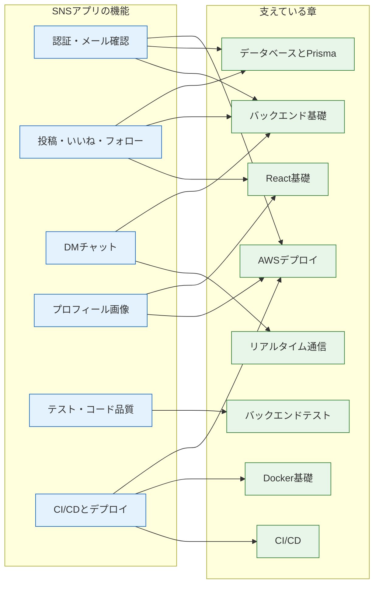

# 総仕上げ（セルフレビューと追加課題）

ここまで完走したことを、まず静かに振り返ってみてください。手元には、ユーザー登録からメール確認、投稿、いいね、フォロー、リアルタイムのDM、画像アップロードまでを備え、テストに守られ、[AWSの本番環境](/sns/nestjs/deploy/)にデプロイされたSNSアプリがあります。半年前、変数の型から学び始めたときには遠く見えたはずのものです。

このページはカリキュラムの最終ページです。3つのことを行います。第一に、学んだ内容の全体を地図として見渡すこと。第二に、全機能を対象にしたセルフレビューで「分かったつもり」を洗い出すこと。第三に、ここから先へ進むための追加課題と学び方を知ることです。追加課題には完成コードを載せません。**設計のヒントだけを頼りに自力で作る**ことが、最後の課題だからです。

> **完成形のコード**: [共通Reactフロントエンド](https://github.com/dik-ab/curriculum-react-projects-answer/tree/main/apps/sns) / [NestJS + Prisma バックエンド](https://github.com/dik-ab/curriculum-sns-nestjs-answer)（全機能・テスト・Docker動作検証済み）。手詰まりになったら参照してください。

## 学習目標

- SNSの各機能が、どの章で学んだ技術の組み合わせでできているかを説明できる
- セルフレビューを通じて、自分の弱点領域を特定し、復習の計画を立てられる
- 追加課題（通知・検索・ページネーション等）の設計方針を、ヒントを元に自分で考えられる
- 作ったものをポートフォリオとして見せるための整え方を説明できる

## 学んだことの全体マップ

SNSの各機能を分解すると、すべてがこのカリキュラムのどこかの章に対応しています。機能と章の対応を図で見てみましょう。



矢印は「この機能を作るのに、この章の知識を使った」という対応です。図に収まらなかった土台も含めて、章ごとに振り返ります。それぞれ「SNSのどこで使ったか」を思い出しながら読んでください。思い出せない章があれば、そこが復習ポイントです。

- [Git/GitHub基礎](/git/) … すべての作業の土台。コミットの積み重ねが、そのまま開発の記録になりました
- [React基礎](/react/) … すべての画面。`useState` / `useEffect`、フォーム、リスト表示、そして `useHashRoute` のようなカスタムフック
- [バックエンド基礎（NestJS）](/backend/) … すべてのAPI。Controller / Service / DI / DTOとバリデーション
- [Docker基礎](/docker/) … 開発用DBのコンテナ起動と、[デプロイ](/sns/nestjs/deploy/)での本番用イメージ作成
- [データベースとPrisma](/database/) … 全7テーブルのスキーマ設計、マイグレーション、リレーションのクエリ
- [実践: フルスタックTodoアプリ](/fullstack-todo/) … フロントとAPIの「つなぎ込み」の原体験。CORSやエラーハンドリングはここで学びました
- [コード品質と開発ツール](/tooling/) … Prettier / ESLintによる、読みやすいコードの維持
- [バックエンドテスト](/testing/) … 単体テストとE2Eテスト。[SNSのテスト](/sns/nestjs/testing/)で実践しました
- [CI/CD](/cicd/) … pushのたびに走るパイプライン。壊れたコードを本番に出さない仕組み
- [AWSデプロイ](/aws/) … S3 / CloudFront / ECS / RDS / SES / CDK。アプリが「世界で動く」ための知識
- [リアルタイム通信](/realtime/) … WebSocketとSocket.IO。DMチャットの心臓部
- [AI開発入門](/ai/) … Claude Codeとの協働。開発の進め方そのものを変えるスキル
- [AIチャット開発（RAG）](/ai-chat/) … LLMをアプリに組み込む実践。追加課題でSNSとの合流先があります

## 全機能セルフレビュー総チェックリスト

機能ごとに、理解と再現性を確認するチェックリストです。基準は「**説明できる**」（人に教えられる）と「**写経せずに実装できる**」（白紙から書ける）の2段階です。チェックが付かない項目は、見出しのリンク先に戻って復習してください。全部に即答できる必要はありません。**どこが弱いかを知ること**がこのリストの目的です。

### 環境構築（[プロジェクトセットアップ](/sns/nestjs/project_setup/)）

- [ ] frontend / backend / compose.yaml というリポジトリ構成の意図を自分の言葉で説明できる
- [ ] なぜDBだけをコンテナにし、アプリはローカル実行にしたのか説明できる
- [ ] compose.yamlを写経せずに書いて、PostgreSQL 16を起動できる
- [ ] PrismaService（PrismaModule）が何のためにあるのか説明できる
- [ ] `GET /health` のような疎通確認用エンドポイントがなぜ必要か説明できる（デプロイで誰が使ったか）

### 認証（[ユーザー登録とログイン](/sns/nestjs/auth/)）

- [ ] パスワードを平文で保存してはいけない理由と、bcryptのハッシュ化の仕組みを説明できる
- [ ] JWTの構造（ヘッダ・ペイロード・署名)と「署名があると何が保証されるか」を説明できる
- [ ] セッション方式と比べたJWT方式の特徴を説明できる
- [ ] JwtAuthGuardの処理の流れ（ヘッダ取り出し→検証→request.userへの格納）を写経せずに実装できる
- [ ] `@CurrentUser()` のようなカスタムデコレータを自分で作れる
- [ ] ログイン失敗時に「メールとパスワードのどちらが違うか」を教えない理由を説明できる

### メール確認（[メールアドレス確認](/sns/nestjs/email_verification/)）

- [ ] なぜメールアドレスの所有確認が必要なのか説明できる
- [ ] トークンを発行して期限付きで保存し、リンクで検証する流れをシーケンス図に描ける
- [ ] 開発では console、本番では SES と送信方法を切り替える設計の利点を説明できる
- [ ] SESのサンドボックスの制限と、その理由を説明できる
- [ ] 確認用トークンを推測されにくいランダム値にする理由を説明できる

### 投稿（[投稿機能とタイムライン](/sns/nestjs/posts/)）

- [ ] PostモデルとUserモデルの1対多リレーションをスキーマとして写経せずに書ける
- [ ] 投稿の作成・一覧・削除のAPIを、DTOバリデーション込みで写経せずに実装できる
- [ ] 「自分の投稿しか削除できない」を実装する場所（Service内の所有チェック）と返すべきステータスを説明できる
- [ ] `include` を使って投稿に著者情報を付けて返すクエリを書ける
- [ ] フロントで一覧表示する際の `key` の役割を説明できる

### いいね（[いいね機能](/sns/nestjs/likes/)）

- [ ] 多対多リレーションを中間テーブルで表す理由を説明できる
- [ ] Likeテーブルの複合主キー `@@id([userId, postId])` が二重いいねをどう防ぐか説明できる
- [ ] 「いいね数」と「自分がいいね済みか」を `_count` と条件付き `include` で取る方法を説明できる
- [ ] いいね済みの投稿への再いいねに409を返す設計の意味を説明できる
- [ ] フロントでいいねの状態を即時に反映する処理（再取得または状態更新）を実装できる

### フォロー（[フォローとフォロー中タイムライン](/sns/nestjs/follow/)）

- [ ] 自己参照の多対多（UserとUserの関係）をPrismaスキーマで書ける
- [ ] 同じUserモデルに `@relation("Follower")` と `@relation("Followee")` の2つの名前が必要な理由を説明できる
- [ ] 自分自身のフォローを400にするチェックをどこに書くか説明できる
- [ ] 「フォロー中 + 自分」の投稿だけを取るタイムラインのクエリ（`in` を使った絞り込み）を説明できる
- [ ] followersCount / followingCount / isFollowing をプロフィールAPIでどう算出したか説明できる

### チャット（[DMチャット](/sns/nestjs/chat/)）

- [ ] ポーリング・SSE・WebSocketの違いと、チャットにWebSocketを選ぶ理由を説明できる
- [ ] Conversationを `userOneId < userTwoId` の規約で一意にする設計の狙いを説明できる
- [ ] WebSocket接続時にhandshakeのCookieから `sns_session` を読み、JWTを検証する理由を説明できる
- [ ] roomの概念と、`conversation:${id}` というroom設計を説明できる
- [ ] 「DBに保存してからemitする」順序にした理由を説明できる
- [ ] join時・送信時に「会話の当事者か」を検証しないと何が起きるか説明できる

### プロフィールと画像（[プロフィール編集と画像アップロード](/sns/nestjs/profile_and_images/)）

- [ ] 画像をAPIサーバー経由にせず、presigned URLで直接S3に上げる構成の利点を説明できる
- [ ] presigned URLの発行から画像表示までの流れをシーケンス図に描ける
- [ ] S3バケットのCORS設定がなぜ必要になるのか説明できる
- [ ] `avatars/*` だけを公開読み取りにする設定の意図と危険性を説明できる
- [ ] PATCHによる部分更新のDTO（全フィールド任意）を書ける

### テスト（[SNSのテストを書く](/sns/nestjs/testing/)）

- [ ] 単体テストとE2Eテストの守備範囲の違いを説明できる
- [ ] PrismaServiceを `jest.fn()` でモックする理由と方法を説明できる
- [ ] テスト用DBを本物のDBと分ける理由を説明できる
- [ ] 「いいねの二重登録で409」のような異常系のテストを自分で書ける
- [ ] 新しい機能を追加するとき、何をテストすべきか自分で判断できる

### デプロイ（[AWSへの全体デプロイ](/sns/nestjs/deploy/)）

- [ ] 本番アーキテクチャ図を何も見ずに描き、各サービスの役割を説明できる
- [ ] マルチステージDockerfileの各ステージの役割を説明できる
- [ ] 秘密情報（DBパスワード・JWT_SECRET）を本番でどう扱ったか、なぜ `.env` ではだめか説明できる
- [ ] ALBのヘルスチェックパスを `/health` にしないと何が起きるか説明できる
- [ ] GitHub Actionsのデプロイフロー（test → frontend / backend）を `needs` の意味込みで説明できる
- [ ] `cdk destroy` 後に残るリソースと、課金を止める確認手順を説明できる

## 追加課題

ここからは、SNSを自分の作品に育てるための課題です。**コードは載せません。** 要件を読み、設計を考え、過去の章を参照しながら自力で実装してください。行き詰まったら、似た構造の既存機能（いいね・フォロー等）のコードを「設計の手本」として読み直すのがコツです。難易度は ★（半日）〜★★★（数日）の目安です。

### 課題1: 通知機能（難易度 ★★★)

**課題内容** … 「いいねされた」「フォローされた」「DMが届いた」を通知として記録し、画面のベルアイコンから一覧できるようにします。未読件数のバッジも表示します。

**実装のヒント**

- テーブル案: `Notification`（id, type, recipientId, actorId, postId?, read, createdAt）。`type` は `"like" | "follow" | "message"` のような文字列。「誰が（actor）」「誰に（recipient）」「何を」が基本形です。likeとfollowでは関連する対象が違う（投稿 / ユーザー）ので、`postId` をnullableにするか、typeごとにカラムを分けるか、設計の分かれ目になります
- エンドポイント案: `GET /notifications`（一覧）、`PATCH /notifications/read`（既読化）。未読数は一覧と別に `GET /notifications/unread-count` を作るか、一覧のレスポンスに含めるか検討してください
- 通知の作成は、いいね・フォロー・メッセージ送信の各Serviceに追記します。「自分で自分にいいねした場合は通知しない」などの例外も考えてみてください
- 発展: ベルの未読数をリアルタイムに増やすには、チャットで使ったGatewayが流用できます（→ [NestJS Gateway](/realtime/nestjs_gateway/)）

### 課題2: ハッシュタグと検索（難易度 ★★★)

**課題内容** … 投稿本文中の `#旅行` のようなハッシュタグを認識し、タグをクリックするとそのタグが付いた投稿の一覧が見られるようにします。あわせてキーワードによる投稿検索も作ります。

**実装のヒント**

- タグの抽出は投稿作成時に正規表現で行います（`#` に続く文字列を抜き出す。日本語をどこまで許すかも仕様の決めどころです）
- テーブル案: `Tag`（id, name）と中間テーブル `PostTag`（postId, tagId）の**多対多**です。いいね（User-Post）で作った構造のTag版だと考えてください（→ [リレーション](/database/relations/)）。同名タグを重複登録しないために `name` にユニーク制約を付け、「あれば使う、なければ作る」処理が必要です
- エンドポイント案: `GET /tags/:name/posts`（タグの投稿一覧）、`GET /posts/search?q=...`（本文検索。Prismaの `contains` が使えます）

### 課題3: ページネーション（難易度 ★★)

**課題内容** … 現在のタイムラインは全件を一度に返しています。投稿が1万件になっても動くように、ページを分けて返すAPIに改修します。

**実装のヒント**

- 方式は2つあります。**オフセット方式**（「21件目から20件」）はPrismaの `skip` / `take` で素直に書けますが、ページが深くなるほど遅くなり、読み込み中に新規投稿が挟まると同じ投稿が2回見える問題があります。**カーソル方式**（「ID 105より古いものを20件」）は `cursor` / `take` で書け、深いページでも速度が落ちません。両方実装して比較すると学びが大きいです
- タイムラインのような「下に伸びる一覧」にはカーソル方式が定石です。レスポンスに「次のページを取るためのカーソル（最後の投稿のID）」を含める設計を考えてみてください
- なぜオフセット方式は深いページで遅いのか——これは理解度チェックで問います

### 課題4: 無限スクロール（難易度 ★★)

**課題内容** … 課題3のAPIと組み合わせ、タイムラインの最下部に近づいたら自動で次のページを読み足すUIを作ります。

**実装のヒント**

- 一覧の末尾に「番兵」となる空のdivを置き、それが画面内に入ったことを `IntersectionObserver` で検知するのが現代的な方法です（スクロールイベントを監視する古典的な方法もあります）
- Observerの登録と解除は `useEffect` のクリーンアップの出番です（→ [フック](/react/hooks/)）。「読み込み中はそれ以上発火させない」「最後まで読んだら止める」という状態管理も必要になります
- 投稿配列への「追記」（置き換えではなく）になるので、stateの更新方法に注意してください

### 課題5: リポスト（難易度 ★★)

**課題内容** … 他人の投稿を自分のタイムラインに再共有する機能（いわゆるリツイート）を作ります。

**実装のヒント**

- 最小の設計は中間テーブル `Repost`（userId, postId, createdAt、複合主キー）。構造は**いいねと同型**です。いいねのコードを手本に、自力でどこまで作れるか試すのに最適な課題です
- 難しいのはタイムラインへの混ぜ込みです。「自分とフォロー中のユーザーの投稿 + その人たちがリポストした投稿」を時系列に並べる必要があります。「誰のリポストか」をフロントに伝えるレスポンス設計も考えどころです
- 発展: 投稿に `repostOfId`（自己参照の外部キー）を持たせると「引用リポスト」も表現できます。Followで学んだ自己参照の応用です

### 課題6: その他の小さな拡張（難易度 ★〜)

軽めの題材をいくつか挙げます。気に入ったものから手を付けてください。

- **返信（スレッド）** … Postに `replyToId`（自己参照）を足し、投稿詳細画面で返信ツリーを表示する
- **画像つき投稿** … アバターで作ったpresigned URLの仕組みを投稿画像に応用する（→ [プロフィール編集と画像アップロード](/sns/nestjs/profile_and_images/)）。1投稿に複数枚を許すならテーブルが1つ増えます
- **AI機能の組み込み** … [RAGチャットの構築](/ai-chat/build_rag_chat/)で作った仕組みを応用し、「タイムラインの話題を要約するボット」や「投稿の下書きを提案する機能」をSNSに組み込む

## ポートフォリオとしての仕上げ

このSNSは、就職・転職活動や開発仲間への自己紹介で見せられる**ポートフォリオ**になります。コードが書けることと、それを伝えられることは別のスキルです。最後に「見せ方」を整えましょう。

### READMEを書く

リポジトリの顔はREADMEです。初めて見る人が3分で全体を掴める構成を目指します。

- **概要** … 何を作ったか1〜2文で。スクリーンショットを1枚添える
- **構成図** … [デプロイ](/sns/nestjs/deploy/)で描いたアーキテクチャ図（Mermaidで描けばGitHub上で描画されます）とER図
- **技術スタック** … React 18 / NestJS 10 / Prisma 5 / PostgreSQL 16 / Socket.IO / AWS (CDK) / GitHub Actions のような一覧
- **工夫した点** … ここが最重要です。「presigned URLでサーバーを経由しない画像アップロードにした」「Guardを自作してJWT検証の仕組みを理解した」など、**設計判断とその理由**を3〜5個。面接で聞かれるのはまさにここです
- **ローカルでの起動手順** … `docker compose up -d` からの手順を、初見の人が再現できるように

### デモの見せ方

常時AWSで動かし続けると課金が続いてしまうので、現実的な見せ方を選びます。画面収録（GIFや短い動画）をREADMEに載せるのが手軽で効果的です。面接などの予定に合わせて `cdk deploy` で一時的に本番を立ち上げ、終わったら `cdk destroy` する、という運用も[デプロイ](/sns/nestjs/deploy/)を完了したあなたなら数十分でできます。

### 公開前の安全確認

コードを公開リポジトリにする前に、**秘密情報が含まれていないか**を必ず確認してください。

- `.env` がコミットされていないこと（`.gitignore` に入っていても、**過去のコミット履歴**に一度でも入っていれば公開されます。`git log --all -- backend/.env` で履歴を確認。→ [基本コマンドと.gitignore](/git/basic_commands/)）
- AWSのアクセスキー、APIキー、本番のパスワードがコード内にハードコードされていないこと
- 万一履歴に秘密情報が見つかったら、そのキーは**漏えいしたものとして無効化・再発行**するのが原則です（履歴の書き換えより先に、まず無効化です）

## ここからの学び方

カリキュラムは終わりですが、学び方そのものは変わらず使えます。3つだけ道しるべを残します。

**公式ドキュメントを一次情報にする** … ここまでは教材が「何をどの順で読むか」を決めていました。これからはReact、NestJS、Prisma、AWSの公式ドキュメントを直接読みます。最初は英語量に圧倒されますが、読み方には型があります。(1) Getting Startedは全部読む、(2) APIリファレンスは「困ったときに該当ページだけ」読む、(3) 概念ガイド（Concepts）は手を動かした後に読むと腹落ちする、の3つです。本カリキュラムで「概念→例→実践」の流れに慣れたあなたは、もうドキュメントを読む下地ができています。

**AIと協働する** … [AIペアプログラミング](/ai/ai_pair_programming/)で学んだ「計画を立てさせ、実装させ、自分がレビューする」流れは、追加課題でそのまま使えます。重要なのは、このカリキュラムを終えた今のあなたには**AIの出力の良し悪しを判断する力**があることです。生成されたコードのGuardの掛け忘れや、N+1になりそうなクエリに気づけるかどうか——それが「AIに使われる人」と「AIを使う人」の分かれ目です。

**次のテーマ** … 興味に応じて、このアプリを土台に広げられます。例えば、キャッシュとジョブキュー（Redis）、Next.jsのようなフレームワークによるSSR、より深いSQLとパフォーマンスチューニング、セキュリティ（OWASP Top 10を自分のSNSに当てはめて点検する）、スタック分割やTerraformなどIaCの深掘り。どれを選ぶにしても、「小さく作って動かして確かめる」というこの半年のやり方が通用します。

## 理解度チェック

最後のチェックは知識の確認ではなく、**設計を考える問題**です。紙に書いてから解答を開いてください。

**Q1. 通知機能のテーブルを設計してください。「いいねされた」「フォローされた」の2種類を通知でき、未読管理ができることが要件です。**

<details markdown="1">
<summary>解答を見る</summary>

一例です（これと違っていても、要件を満たせば正解です）。

```
Notification
- id          Int      主キー
- type        String   "like" | "follow"
- recipientId Int      通知を受け取る人（User外部キー）
- actorId     Int      行動した人（User外部キー）
- postId      Int?     typeがlikeのときだけ対象投稿を指す（nullable）
- read        Boolean  既読フラグ（default: false）
- createdAt   DateTime
```

設計のポイントは、(1) 受け手（recipient）と行動者（actor）の両方がUserへの外部キーになる（Followの自己参照2本と同じ考え方）、(2) typeによって関連対象が違うため `postId` をnullableにしている、(3) 未読は `read` フラグで管理し、未読数は `count` で算出できる、の3点です。typeが増えてnullableな列が増えすぎるようなら、種類ごとにテーブルを分ける設計もあり得ます。

</details>

**Q2. オフセット方式のページネーションは、offsetが大きくなる（深いページを開く）ほど遅くなります。なぜですか。カーソル方式はなぜこの問題がありませんか。**

<details markdown="1">
<summary>解答を見る</summary>

オフセット方式の「10000件目から20件」というクエリは、データベースが**先頭から10000行を実際にたどって読み捨てた**うえで20件を返すためです。offsetに比例して読む量が増えるので、深いページほど遅くなります。カーソル方式の「ID 105より古いものを20件」は、主キー（インデックス）で**105の位置へ直接ジャンプ**してそこから20件読むだけなので、どれだけ深くても読む量が一定です。さらに、読み込みの合間に新規投稿が増えても基準がIDなので、同じ投稿が二重に表示される問題も起きません。

</details>

**Q3. リポスト機能を追加するとき、「いいね」と同じ中間テーブル方式で設計できる部分と、いいねより難しくなる部分をそれぞれ挙げてください。**

<details markdown="1">
<summary>解答を見る</summary>

同じにできるのは記録の構造です。`Repost`（userId, postId, 複合主キー）という中間テーブルで「誰がどの投稿をリポストしたか」を表せ、二重リポスト防止も複合主キーで実現できます。難しくなるのはタイムラインへの表示です。いいねは投稿の属性（件数と自分の状態）を足すだけでしたが、リポストは**タイムラインに新しい行を挿入する**機能です。「元の投稿の作成日時」ではなく「リポストされた日時」で並べる必要があり、投稿とリポストという**2種類のものを1本の時系列にマージする**クエリとレスポンス設計（「誰のリポストか」を含める）が必要になります。

</details>

**Q4. ハッシュタグを「Postテーブルにtagsという文字列カラムを足してカンマ区切りで保存する」設計にした場合、多対多（Tag + PostTag）設計と比べてどんな問題が起きますか。**

<details markdown="1">
<summary>解答を見る</summary>

カンマ区切り文字列は、(1) 「このタグが付いた投稿一覧」を取るのに全行の文字列を部分一致検索することになりインデックスが効かない、(2) 部分一致のため `#旅` で検索すると `#旅行` も誤って一致する、(3) 「タグごとの投稿数ランキング」のような集計がSQLで素直に書けない、という問題を抱えます。多対多設計なら、これらはすべて外部キーとユニーク制約に基づく高速で正確なクエリになります。[正規化されたリレーション設計](/database/relations/)の価値が表れる典型例です。

</details>

## セルフレビュー

- [ ] SNSの全機能について、使った技術を章単位で対応付けて説明できる
- [ ] 総チェックリストを実施し、自分の弱い領域を3つ以内に特定した
- [ ] 弱い領域について、該当ページに戻って復習する計画を立てた
- [ ] 追加課題から1つ以上を選び、コードを書く前にテーブル設計とエンドポイント設計を紙に書いた
- [ ] READMEに「工夫した点」を設計判断の理由つきで3つ以上書ける
- [ ] 公開前の安全確認（履歴を含めた秘密情報のチェック）の手順を実行できる
- [ ] 公式ドキュメントを使って、このカリキュラムにない機能を1つ調べて実装する道筋を描ける

## 次のステップ

前のページは[AWSへの全体デプロイ](/sns/nestjs/deploy/)です。追加課題を実装したら、ぜひもう一度デプロイまで通してみてください。機能追加→テスト→push→自動デプロイ、という流れを自分の意思で回せたとき、この章で作った仕組みが本当に自分のものになります。

このページをもって、NestJS版SNSの詳細チュートリアルは完了です。入門編の最初のページでターミナルの開き方から始めた学習が、テストとCI/CDに守られたフルスタックSNSをAWSで運用するところまで到達しました。ここからは、他スタック版SNSで同じ仕様を別フレームワークへ移す、[AI開発準備](/ai/)で仕様書を実装支援に使う、[RAGチャット](/ai-chat/)へ拡張するなど、目的に合わせて次の課題を選んでください。作りたいものを見つけて、小さく作り、動かして、確かめる。このサイクルを自分のプロジェクトでも続けられる状態が、この章のゴールです。
