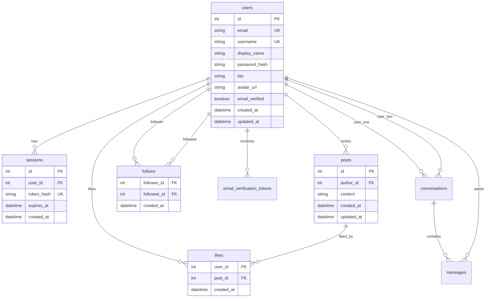

# 共通要件定義・仕様書

このページは、SNS開発をどのバックエンドフレームワークで実装しても変えない**共通仕様**です。Reactフロントエンド、画面、API、データ設計、認証方針、テスト観点をここで固定し、各スタックのページでは「この仕様をそのフレームワークでどう実装するか」だけに集中します。

対象スタックは次の6つです。

- TypeScript / NestJS + Prisma
- Java / Spring Boot + JPA
- Python / FastAPI + SQLAlchemy
- PHP / Laravel + Eloquent
- Go / Gin + GORM
- Ruby / Rails + Active Record

> 実務では、仕様を先に固定すると、フレームワークごとの差分が見えやすくなります。受講者が別スタックへ移るときも、「何を作るか」ではなく「このフレームワークではどこに書くか」だけを比較できます。

## この仕様書の使い方

このページは、実装前に必ず一度読みます。実装中は、API名、テーブル名、エラー形式、認証方式で迷ったときの基準として戻ってきます。

AIエージェントを使って開発する場合は、このページと自分が選んだスタック別ページをプロジェクトのドキュメントとして渡すと便利です。たとえば `docs/sns-spec.md` のようなファイルに仕様を置き、AIに「この仕様から外れないで実装して」と指示できます。AIの使い方は [AI開発入門](/ai/) を参照してください。ローカルで開発サーバーを起動している場合は `http://localhost:8787/ai/` からも開けます。

ただし、AIに任せる前提でも、教材には正しいコードと動作確認手順を載せます。AIは補助であり、仕様、テスト、レビューで正しさを確認する責任は開発者側にあります。

解答コードは、[SNS開発ロードマップ（言語別）](/sns/framework_roadmap/) から確認できます。Reactフロントエンドは共通リポジトリ、バックエンドはNestJS版とSpring Boot版を先に公開しています。

## 開発フェーズ

SNS開発は2段階に分けます。

| 段階 | 目的 | 実装する範囲 |
|---|---|---|
| 第1段階: 最低限SNS | 認証つきSNSとして成立する最小機能を作る | セットアップ、登録、ログイン、投稿、いいね、フォロー、プロフィール、基本テスト |
| 第2段階: 応用SNS | 実務寄りの機能と運用まで広げる | メール確認、DMチャット、画像アップロード、ページネーション、通知の土台、CI/CD、AWSデプロイ |

最初から第2段階まで一気に作る必要はありません。第1段階が動けば、ポートフォリオとして最低限説明できるSNSになります。第2段階は、実務に近い設計、非同期処理、リアルタイム通信、クラウド運用まで伸ばす段階です。

## 画面仕様

フロントエンドは全スタック共通で React + Vite + TypeScript を使います。

| 画面 | パス | 第1段階 | 役割 |
|---|---|---:|---|
| 登録 | `#/register` | 必須 | メールアドレス、ユーザー名、表示名、パスワードで登録する |
| ログイン | `#/login` | 必須 | メールアドレスとパスワードでログインする |
| タイムライン | `#/` | 必須 | 投稿フォーム、投稿一覧、いいね、投稿削除を扱う |
| ユーザーページ | `#/users/:username` | 必須 | プロフィール、投稿一覧、フォローボタンを表示する |
| 設定 | `#/settings` | 必須 | 表示名、自己紹介を編集する |
| メール確認 | `#/verify-email?token=...` | 応用 | 確認メールのリンクから登録を完了する |
| チャット | `#/chat` | 応用 | 1対1のDMをリアルタイムに送受信する |

第1段階では、画像アップロードを入れず、プロフィール画像は空または固定URLで構いません。画像アップロードはS3やpresigned URLが絡むため、第2段階に回します。

## 認証仕様

新しい言語別SNSカリキュラムでは、ログイン状態の保存に **HttpOnly Cookie** を使います。

既存のNestJSチュートリアルは学習しやすさを優先して `localStorage` + `Authorization: Bearer` 方式で書かれています。ただし、複数スタックへ展開する新仕様では、XSSでトークンを盗まれにくい構成に寄せるため、HttpOnly Cookie方式を標準にします。

### 採用する方式

第1段階では、サーバー側でセッションを管理する方式を採用します。

```text
ログイン成功
-> サーバーがランダムな session token を生成
-> token のハッシュだけを DB の Session テーブルへ保存
-> 生の token は HttpOnly Cookie としてブラウザへ保存
-> 以後のリクエストでは Cookie を自動送信
-> サーバーは Cookie の token をハッシュ化して Session を検索
```

この方式を選ぶ理由は3つです。

- `HttpOnly` により、ブラウザ上のJavaScriptからセッション値を読めない
- DBの `Session` を削除すればログアウトや強制失効ができる
- JWTの失効管理やrefresh tokenを最初から説明しなくてよい

Cookie名は `sns_session` に統一します。

| 項目 | 開発環境 | 本番環境 |
|---|---|---|
| Cookie名 | `sns_session` | `sns_session` |
| HttpOnly | `true` | `true` |
| Secure | `false` | `true` |
| SameSite | `Lax` | `Lax` |
| Path | `/` | `/` |
| 有効期限 | 7日 | 7日 |

ReactからAPIを呼ぶときは、必ず `credentials: "include"` を付けます。API側はCORSでフロントエンドのoriginを許可し、credentials付きリクエストを受け付けます。

```typescript
await fetch(`${API_URL}/auth/me`, {
  credentials: "include",
});
```

### CSRF対策

Cookie認証では、CSRF（別サイトから勝手にリクエストを送らせる攻撃）を考える必要があります。この教材では段階的に扱います。

| 段階 | 対策 |
|---|---|
| 第1段階 | `SameSite=Lax`、JSON APIのみ受け付ける、`Origin` ヘッダーを検証する |
| 第2段階 | CSRFトークンを導入し、状態を変更するリクエストで検証する |

第1段階では「ログインCookieをHttpOnlyにする」だけで終わらせず、状態変更APIでは `Origin` が許可したフロントエンドURLかを確認します。第2段階で、Laravel/Rails/Springなど各フレームワークのCSRF機構も比較します。

## パスワード仕様

パスワードは平文で保存しません。

| 項目 | 仕様 |
|---|---|
| 最小文字数 | 8文字 |
| 保存形式 | ハッシュのみ |
| 推奨アルゴリズム | bcrypt または Argon2id |
| 教材標準 | bcrypt cost 10以上 |
| 保存カラム | `passwordHash` または各ORMの命名規則に合わせた同等カラム |

Argon2idを標準で扱えるスタックではArgon2idを使っても構いません。ただし、カリキュラム横断で比較しやすくするため、教材本文ではbcryptを基準に説明します。

## API仕様

APIのレスポンスはJSONに統一します。認証が必要なAPIでは、Cookieの `sns_session` を検証して現在のユーザーを特定します。

### 認証

| メソッド | パス | 認証 | 段階 | 役割 |
|---|---|---|---|---|
| `POST` | `/auth/register` | 不要 | 第1段階 | ユーザー登録 |
| `POST` | `/auth/login` | 不要 | 第1段階 | ログインしてCookieを発行 |
| `POST` | `/auth/logout` | 要 | 第1段階 | セッションを削除してCookieを失効 |
| `GET` | `/auth/me` | 要 | 第1段階 | ログイン中ユーザーの取得 |
| `GET` | `/auth/verify-email?token=...` | 不要 | 第2段階 | メールアドレス確認 |

### 投稿・タイムライン

| メソッド | パス | 認証 | 段階 | 役割 |
|---|---|---|---|---|
| `POST` | `/posts` | 要 | 第1段階 | 投稿作成 |
| `GET` | `/posts` | 要 | 第1段階 | 全体タイムライン |
| `DELETE` | `/posts/:id` | 要 | 第1段階 | 自分の投稿を削除 |
| `POST` | `/posts/:id/likes` | 要 | 第1段階 | いいね |
| `DELETE` | `/posts/:id/likes` | 要 | 第1段階 | いいね解除 |
| `GET` | `/posts/following` | 要 | 第1段階 | フォロー中タイムライン |

### ユーザー・フォロー

| メソッド | パス | 認証 | 段階 | 役割 |
|---|---|---|---|---|
| `GET` | `/users/:username` | 要 | 第1段階 | プロフィール取得 |
| `GET` | `/users/:username/posts` | 要 | 第1段階 | ユーザー別投稿一覧 |
| `POST` | `/users/:username/follow` | 要 | 第1段階 | フォロー |
| `DELETE` | `/users/:username/follow` | 要 | 第1段階 | フォロー解除 |
| `PATCH` | `/users/me` | 要 | 第1段階 | プロフィール更新 |
| `POST` | `/users/me/avatar-upload-url` | 要 | 第2段階 | アバター画像アップロードURL発行 |

### 応用機能

| メソッド | パス | 認証 | 段階 | 役割 |
|---|---|---|---|---|
| `GET` | `/conversations` | 要 | 第2段階 | 会話一覧 |
| `POST` | `/conversations` | 要 | 第2段階 | 会話開始 |
| `GET` | `/conversations/:id/messages` | 要 | 第2段階 | メッセージ履歴 |
| WebSocket | `/chat` | 要 | 第2段階 | DM送受信 |

## エラー形式

フレームワークが違っても、フロントエンドから見えるエラー形式はそろえます。

```json
{
  "message": "投稿内容は1文字以上280文字以内で入力してください",
  "code": "VALIDATION_ERROR"
}
```

複数項目のバリデーションエラーでは `fields` を付けます。

```json
{
  "message": "入力内容を確認してください",
  "code": "VALIDATION_ERROR",
  "fields": {
    "email": "メールアドレスの形式が正しくありません",
    "password": "パスワードは8文字以上で入力してください"
  }
}
```

| HTTPステータス | code | 例 |
|---|---|---|
| `400` | `VALIDATION_ERROR` | 入力値が不正 |
| `401` | `UNAUTHENTICATED` | 未ログイン |
| `403` | `FORBIDDEN` | 他人の投稿を削除しようとした |
| `404` | `NOT_FOUND` | ユーザーや投稿が存在しない |
| `409` | `CONFLICT` | 既にいいね済み、メールアドレス重複 |
| `500` | `INTERNAL_ERROR` | 想定外のサーバーエラー |

## データモデル

第1段階で必要なテーブルは次の通りです。

| テーブル | 段階 | 役割 |
|---|---|---|
| `users` | 第1段階 | ユーザー情報 |
| `sessions` | 第1段階 | Cookieログイン用セッション |
| `posts` | 第1段階 | 投稿 |
| `likes` | 第1段階 | 投稿へのいいね |
| `follows` | 第1段階 | ユーザー同士のフォロー |

第2段階で追加するテーブルは次の通りです。

| テーブル | 段階 | 役割 |
|---|---|---|
| `email_verification_tokens` | 第2段階 | メール確認トークン |
| `conversations` | 第2段階 | 1対1の会話 |
| `messages` | 第2段階 | DMメッセージ |
| `notifications` | 第2段階 | 通知機能の土台 |

### ER図



## 第1段階の完成条件

第1段階は、次の確認がすべて通れば完了です。

- 新規登録できる
- ログインすると `sns_session` Cookie が発行される
- 画面を再読み込みしてもログイン状態が維持される
- ログアウトするとセッションが削除される
- 投稿を作成、表示、削除できる
- 他人の投稿は削除できない
- いいねといいね解除ができる
- フォローとフォロー解除ができる
- フォロー中タイムラインが表示できる
- プロフィールを編集できる
- APIの単体テストまたはE2Eテストが最低1本通る

## 第2段階の完成条件

第2段階は、次の確認がすべて通れば完了です。

- メール確認後にログインできる
- DMチャットがリアルタイムに届く
- アバター画像をS3または互換ストレージへアップロードできる
- タイムラインにページネーションがある
- CIでテストとビルドが走る
- Dockerイメージを作成できる
- AWSまたは同等のクラウド環境にデプロイできる

## 解答コードの方針

言語別の解答コードは必要です。教材本文だけでは、受講者が途中で崩れたときに復旧しづらく、フレームワークごとの差分も比較できません。

推奨は、スタックごとに独立したリポジトリを作る方式です。

| リポジトリ | 内容 |
|---|---|
| `sns-react-shared-frontend` | 共通Reactフロントエンド |
| `sns-nestjs-prisma-answer` | NestJS + Prisma版 |
| `sns-spring-jpa-answer` | Spring Boot + JPA版 |
| `sns-fastapi-sqlalchemy-answer` | FastAPI + SQLAlchemy版 |
| `sns-laravel-eloquent-answer` | Laravel + Eloquent版 |
| `sns-gin-gorm-answer` | Gin + GORM版 |
| `sns-rails-active-record-answer` | Rails + Active Record版 |

モノレポ1つに全スタックを入れる方法もありますが、依存関係、起動手順、CI、Dockerfileが大きく異なるため、受講者には独立リポジトリの方が扱いやすいです。比較用にまとめたい場合は、別途 `sns-answer-index` のような案内リポジトリを作り、各解答リポジトリへリンクします。

## 次のステップ

次は [SNS開発ロードマップ（言語別）](/sns/framework_roadmap/) へ進み、自分が実装するバックエンドスタックを選びます。
