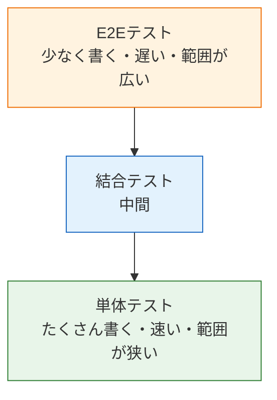

# バックエンドテスト

ここまでのセクションで、NestJSでAPIを作り（[バックエンド基礎](/backend/)）、PrismaでデータベースとつなぎSQLを書かずにデータを操作できるようになりました（[データベースとPrisma](/database/)）。しかし「作ったAPIが本当に正しく動くか」は、これまでブラウザやcurlで手動で確認してきました。このセクションでは、その確認作業を**コードで自動化する**方法、つまり**自動テスト（テスト）**を学びます。

このセクションは意図的にコンパクトにまとめています。テストの世界は奥が深いですが、まずは「テストとは何か」「単体テストとE2Eテストをどう書くか」という核を押さえ、実践は[SNS開発セクション](/sns/testing/)で行います。

なお、このセクションで扱うのは**バックエンド（NestJS）のテスト**です。Reactコンポーネントのテストなど、フロントエンドのテストは本カリキュラムの対象外とします（テストの考え方自体は共通なので、ここで学ぶ知識はフロントエンドのテストを学ぶときにも役立ちます）。

## 学習目標

- 自動テストを書く理由を、手動確認との比較で説明できる
- テストピラミッドの考え方と、単体テスト・結合テスト・E2Eテストの違いを説明できる
- それぞれのテストが「何を対象に」「何を検証するか」を具体例で言える
- このカリキュラムでどの種類のテストを書くのか（単体とE2E）を理解する

## なぜテストを書くのか

### 手動確認の限界

これまでAPIの動作確認は、おおむね次のような手順で行ってきました。

1. `pnpm run start:dev` でサーバーを起動する
2. curlやブラウザでリクエストを送る
3. レスポンスを目で見て「正しそうだ」と判断する

この方法は最初のうちは十分ですが、アプリが育つにつれて破綻します。たとえばSNSアプリには、投稿・いいね・フォロー・チャットなど多くの機能があります。「いいね機能を修正したら、投稿一覧の動きを壊していないか？」を確認するには、関係する機能を**毎回すべて手で**試さなければなりません。

- **時間がかかる**: 機能が10個あれば、修正のたびに10個の確認が必要です。
- **漏れる**: 人間は確認を忘れます。「ここは変えていないから大丈夫だろう」という思い込みがバグを見逃します。
- **再現できない**: 「昨日は動いていた」を証明する記録が残りません。

### 自動テストが解決すること

**自動テスト**とは、「この入力を与えたら、この結果になるはず」という確認作業をコードとして書いたものです。一度書けば、コマンド1つで何百個の確認を数秒〜数十秒で実行できます。

```bash
pnpm run test
```

```text
 PASS  src/posts/posts.service.spec.ts
 PASS  src/users/users.service.spec.ts

Test Suites: 2 passed, 2 total
Tests:       12 passed, 12 total
Time:        2.314 s
```

このように、テストを実行すると「どの確認が成功（PASS）し、どれが失敗（FAIL）したか」が一覧で表示されます。自動テストには次の利点があります。

- **リグレッション（regression、回帰＝修正によって既存機能が壊れること）をすぐ検知できる**。修正のたびに全テストを流せば、壊した瞬間に気づけます。
- **仕様のドキュメントになる**。「投稿の本文が空ならエラーになる」というテストコードは、そのまま仕様書として読めます。
- **CIで自動実行できる**。次のセクションで学ぶ[CI/CD](/cicd/)では、GitHubにpushするたびにテストを自動実行し、壊れたコードがmainブランチに入るのを防ぎます。テストはCI/CDの土台です。

## テストの3つの種類

ひとくちにテストといっても、「どの範囲を対象にするか」によっていくつかの種類に分かれます。代表的なのは次の3つです。

| 種類 | 対象 | 例（SNSアプリの場合） |
|---|---|---|
| 単体テスト（Unit Test、ユニットテスト） | 関数やクラス1つ | 「PostsServiceのcreateメソッドは、正しいデータでPrismaを呼ぶか」 |
| 結合テスト（Integration Test、インテグレーションテスト） | 複数の部品の組み合わせ | 「ControllerとServiceとDBをつないだとき、投稿が保存されるか」 |
| E2Eテスト（End-to-End Test、エンドツーエンドテスト） | システム全体 | 「POST /posts にHTTPリクエストを送ると、201が返りDBに行が増えるか」 |

### 単体テスト

**単体テスト**は、関数やクラスなどの小さな部品を**1つだけ取り出して**検証します。部品が依存している他の部品（たとえばServiceが依存するデータベース）は、**モック**（mock、本物そっくりの偽物）に置き換えます。依存を切り離すので、実行が非常に速く、失敗したときに「どこが悪いか」をすぐ特定できます。

### 結合テスト

**結合テスト**は、複数の部品を組み合わせたときに正しく連携するかを検証します。単体テストでは部品単体の正しさしか保証できないため、「部品同士のつなぎ目」のバグはここで見つけます。

### E2Eテスト

**E2Eテスト**は、利用者と同じ入口（バックエンドならHTTPリクエスト）からシステム全体を通して検証します。ルーティング・バリデーション・Service・データベースまで、すべてが本物のまま動くため、「実際に使えるか」を最も忠実に確認できます。その代わり、実行は遅く、準備（データベースの用意など）も必要です。

## テストピラミッド

3種類のテストを「どのくらいの割合で書くべきか」を表した有名な考え方が**テストピラミッド**です。



ピラミッドの下に行くほど「数を多く」、上に行くほど「数を少なく」書くのが基本方針です。理由はシンプルで、**上のテストほど実行が遅く、壊れたときの原因特定が難しい**からです。

- 土台の**単体テスト**を厚く書き、ロジックの正しさを高速に検証する
- 頂点の**E2Eテスト**は「主要なシナリオが通しで動くか」に絞って少数書く
- 結合テストはその中間を埋める

逆に、E2Eテストばかり大量に書くと「テストの実行に30分かかる」「1つの失敗の原因調査に1時間かかる」という状態になりがちです。範囲が広いテストは強力ですが、数で勝負するものではありません。

## テストはいつ・どこで実行されるのか

テストは「書いて終わり」ではなく、開発の流れの中で**繰り返し実行される**ことで価値を発揮します。テストが実行されるタイミングは大きく2つあります。


- **ローカルでの実行** — コードを修正したら、pushする前に自分の手元でテストを実行します。後のページで学ぶ`pnpm run test`（単体テスト）や`pnpm run test:e2e`（E2Eテスト）がこれにあたります。
- **CIでの自動実行** — GitHubにpushすると、[CI/CD](/cicd/)で学ぶGitHub Actionsがテストを自動実行します。自分が実行し忘れても、チームの誰かが忘れても、CIは必ず実行します。テストが失敗したコードは[Pull Request](/git/github_and_pr/)の段階で発見され、mainブランチに入る前に止められます。

「ローカルで素早く回し、CIで確実に守る」——この二段構えが現代の開発の標準です。

## 良いテストの3つの性質

種類を問わず、良いテストには共通する性質があります。次の3つを意識すると、後から読み返しやすく壊れにくいテストになります。

1. **速い** — テストが遅いと実行が億劫になり、実行されないテストは存在しないのと同じです。だからこそ高速な単体テストを土台にします。
2. **独立している** — 各テストは他のテストの結果や実行順序に依存せず、単独で実行しても同じ結果になるべきです。「前のテストが作ったデータを前提にする」テストは、順序が変わった瞬間に壊れます。
3. **読みやすい** — テストは仕様書でもあります。「何を準備し、何を実行し、何を確認しているか」が一目で分かる構成にします。

3つ目に関連して、テストコードの世界には**AAAパターン**（Arrange-Act-Assert、アレンジ・アクト・アサート）という定番の構成があります。

| 段階 | 意味 | 例（投稿作成のテスト） |
|---|---|---|
| Arrange（準備） | テストに必要なデータや状態を用意する | テスト用ユーザーを作る |
| Act（実行） | テスト対象の処理を1つ実行する | 投稿作成の処理を呼ぶ |
| Assert（検証） | 結果が期待どおりかを確認する | 投稿が保存されたことを確認する |

この後の2ページで書くテストコードも、すべてこの「準備 → 実行 → 検証」の3段構成になっています。コードを読むときに意識してみてください。

## どこまでテストを書けばよいのか

「全部の関数にテストを書くべきか」という疑問が出てくるかもしれません。テストがコードのどれだけの割合を実行したかを示す指標を**カバレッジ（coverage、網羅率）**と呼びますが、本カリキュラムではカバレッジ100%は目指しません。テストにも書く・直すコストがかかるため、効果の高いところに集中するのが現実的です。優先順位の目安は次のとおりです。

1. **条件分岐があるロジック** — 「投稿が見つからなければ404」「二重いいねは拒否」のような分岐は、バグの温床なので最優先でテストします。
2. **アプリの主要なシナリオ** — 「投稿できる」「いいねできる」のような、壊れたらサービスが成り立たない流れはE2Eテストで守ります。
3. **過去にバグが出た箇所** — バグを直したら、同じバグを再発させないテストを一緒に書きます（これもリグレッション対策です）。

逆に、設定値を返すだけのコードや、フレームワークが保証してくれる部分（NestJSのルーティングそのものなど）にまでテストを書く必要はありません。

## このカリキュラムの方針

本カリキュラムでは、ピラミッドの**土台（単体テスト）と頂点（E2Eテスト）の2つ**を書きます。

- **単体テスト** — Serviceのロジックを、Prismaをモックにして検証します。次のページ[単体テスト](/testing/unit_test/)で学びます。
- **E2Eテスト** — 実際にHTTPリクエストを送り、テスト用データベースまで含めて検証します。[E2Eテスト](/testing/e2e_test/)で学びます。

結合テストを省略するのは、NestJSのバックエンドにおいては「E2Eテストが結合テストの役割をかなりカバーできる」ためです（E2Eテストを実行すると、ControllerとServiceとDBの連携も同時に検証されます）。まずは両端の2つを確実に書けるようになることを優先します。

また冒頭で述べたとおり、**フロントエンド（React）のテストはこのカリキュラムでは扱いません**。ここではバックエンドのAPIに集中します。

このセクションで学んだ書き方は、最終プロジェクトの[SNSのテストを書く](/sns/testing/)で、実際に自分のSNSアプリに対して適用します。さらに[CI/CD](/cicd/)セクションでは、ここで書いたテストをGitHub Actionsで自動実行するパイプラインを作ります。

## このセクションの構成

| ページ | 内容 |
|---|---|
| [単体テスト](/testing/unit_test/) | Jestの基本（describe/it/expect）、SNSのPostsServiceを例にした単体テスト、PrismaServiceのモック |
| [E2Eテスト](/testing/e2e_test/) | supertestによるE2Eテスト、投稿・いいねAPIを例に、テスト用データベースの分離 |

どちらのページも、これまでに学んだNestJS（[Service・DI](/backend/service_and_di/)）とPrisma（[PrismaでのCRUD](/database/crud_with_prisma/)）のコードをテスト対象にします。テスト対象のコード自体に新しい要素はないので、「テストの書き方」に集中して読み進めてください。また、テストフレームワークの**Jest（ジェスト）**とHTTPテスト用ライブラリの**supertest（スーパーテスト）**は、どちらもNestJSプロジェクトに最初から組み込まれているため、追加のセットアップはほとんど必要ありません。

## 理解度チェック

**Q1. 自動テストが手動確認より優れている点を2つ挙げてください。**

<details markdown="1">
<summary>解答を見る</summary>

たとえば次のような点です。

- **速くて漏れがない**: コマンド1つで全機能の確認を数秒で実行でき、人間のように確認を忘れることがありません。
- **リグレッションを検知できる**: 修正のたびに全テストを流すことで、別の機能を壊した瞬間に気づけます。

ほかに「仕様のドキュメントになる」「CIで自動実行できる」も正解です。

</details>

**Q2. 単体テストとE2Eテストの最も大きな違いは何ですか。**

<details markdown="1">
<summary>解答を見る</summary>

**検証する範囲**です。単体テストは関数やクラス1つだけを対象にし、依存する部品（データベースなど）はモックに置き換えます。E2EテストはHTTPリクエストという利用者と同じ入口から、ルーティング・バリデーション・Service・データベースまでシステム全体を本物のまま検証します。その結果として、単体テストは「速いが範囲が狭い」、E2Eテストは「遅いが範囲が広い」という性質の違いが生まれます。

</details>

**Q3. テストピラミッドでは、なぜE2Eテストを「少なく」書くべきだとされているのですか。**

<details markdown="1">
<summary>解答を見る</summary>

E2Eテストは範囲が広いぶん、**実行が遅く、失敗したときの原因特定が難しい**からです。データベースの準備なども必要で、数を増やすとテスト全体の実行時間が長くなり、開発のテンポを損ないます。ロジックの細かい検証は高速な単体テストに任せ、E2Eテストは「主要なシナリオが通しで動くか」の確認に絞るのが効率的です。

</details>

**Q4. 「いいね機能のバグ修正をしたら、投稿一覧APIが壊れていた」——このような問題を何と呼びますか。また、自動テストはこれにどう役立ちますか。**

<details markdown="1">
<summary>解答を見る</summary>

**リグレッション（回帰）**と呼びます。修正や機能追加によって、既存の機能が意図せず壊れることです。投稿一覧APIのテストをあらかじめ書いておけば、いいね機能を修正した直後にテストを実行するだけで、投稿一覧が壊れたことに**その場で**気づけます。CIに組み込めば、実行し忘れることもありません。

</details>

**Q5. 「テスト用ユーザーを作る → 投稿作成の処理を呼ぶ → 投稿が保存されたことを確認する」というテストの構成パターンを何と呼びますか。それぞれの段階の名前も答えてください。**

<details markdown="1">
<summary>解答を見る</summary>

**AAAパターン**です。Arrange（準備）でテストに必要なデータや状態を用意し、Act（実行）でテスト対象の処理を1つ実行し、Assert（検証）で結果が期待どおりかを確認します。この3段構成を意識すると、テストコードが「何を確かめているのか」が一目で分かるようになります。

</details>

## セルフレビュー

- [ ] 自動テストを書く理由を、手動確認の限界と対比して自分の言葉で説明できる
- [ ] 単体テスト・結合テスト・E2Eテストの違いを、SNSアプリの具体例つきで説明できる
- [ ] テストピラミッドの図を自分で描き、「下ほど多く、上ほど少なく」の理由を説明できる
- [ ] モックという言葉の意味（本物の依存を偽物に置き換えること）を説明できる
- [ ] リグレッションとは何か、テストがそれをどう防ぐかを説明できる
- [ ] AAAパターン（準備・実行・検証）の3段構成を説明できる
- [ ] このカリキュラムで単体テストとE2Eテストの2つを書く理由を説明できる
- [ ] テストがローカルとCIの2か所で実行される流れを図で描ける
- [ ] テストを優先して書くべき箇所（分岐・主要シナリオ・バグの再発防止）を挙げられる

## 次のステップ

次のページ[単体テスト](/testing/unit_test/)では、テストフレームワーク**Jest**の基本文法を学び、SNSアプリの投稿Service（PostsService）に対する単体テストを実際に書きます。その次の[E2Eテスト](/testing/e2e_test/)で、HTTPリクエストを使った全体の検証に進みます。

このセクションの内容は、[CI/CD](/cicd/)セクション（pushのたびにテストを自動実行する）と、最終プロジェクトの[SNSのテストを書く](/sns/testing/)で実際に活用します。

テストは「あとで時間ができたら書くもの」ではなく、機能と同時に書いて育てていくものです。次のページから、その第一歩を踏み出しましょう。
