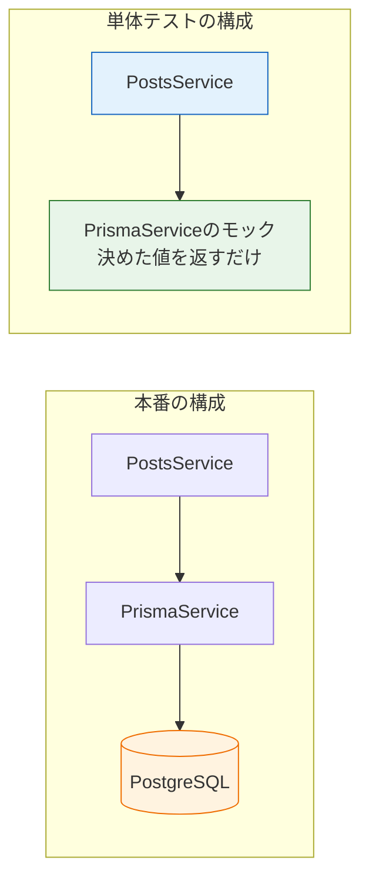

# 単体テスト

[前のページ](/testing/)で、単体テストは「関数やクラス1つを取り出し、依存をモックに置き換えて検証するテスト」だと学びました。このページでは、テストフレームワーク**Jest（ジェスト）**の基本文法を学び、SNSアプリの投稿機能を担う`PostsService`に対する単体テストを実際に書きます。

[Service・DI](/backend/service_and_di/)で学んだとおり、NestJSではビジネスロジックをServiceに集めます。つまり**Serviceこそが単体テストの主役**です。そしてNestJSのDI（依存性注入）の仕組みは、依存をモックに差し替えることをとても簡単にしてくれます。

## 学習目標

- Jestの`describe` / `it` / `expect`を使ってテストを書ける
- 代表的なマッチャー（`toBe` / `toEqual` / `rejects.toThrow`など）を使い分けられる
- モックを使う理由を説明できる
- `Test.createTestingModule`でPrismaServiceをモックに差し替え、Serviceの単体テストを書ける

## Jestとは

**Jest**は、JavaScript/TypeScriptで最も広く使われているテストフレームワークです。テストの記述・実行・結果表示・モック機能がすべて揃っています。NestJSのプロジェクトには**最初からJestが組み込まれている**ため、追加のインストールは不要です。本カリキュラムではJest 29を使います（NestJS 10のプロジェクトを作ると自動的に入ります）。

NestJSのプロジェクトでは、`xxx.service.ts`に対するテストを`xxx.service.spec.ts`という名前で同じディレクトリに置くのが規約です。Jestは`.spec.ts`で終わるファイルを自動的にテストとして見つけて実行します。

## Jestの基本文法: describe / it / expect

まずはNestJSから離れて、Jestの文法だけを最小の例で確認します。投稿の本文を検証する次の関数があるとします。

**`src/posts/post-content.ts`**

```typescript
export function isValidContent(content: string): boolean {
  const trimmed = content.trim();
  return trimmed.length >= 1 && trimmed.length <= 280;
}
```

SNSの投稿本文は「空白を除いて1文字以上280文字以内」が有効、というルールです。この関数のテストは次のように書きます。

**`src/posts/post-content.spec.ts`**

```typescript
import { isValidContent } from './post-content';

describe('isValidContent', () => {
  it('1文字以上280文字以内ならtrueを返す', () => {
    expect(isValidContent('こんにちは')).toBe(true);
  });

  it('空文字列ならfalseを返す', () => {
    expect(isValidContent('')).toBe(false);
  });

  it('空白だけの文字列ならfalseを返す', () => {
    expect(isValidContent('   ')).toBe(false);
  });

  it('281文字ならfalseを返す', () => {
    expect(isValidContent('あ'.repeat(281))).toBe(false);
  });
});
```

**コード解説**

- `describe('isValidContent', () => {...})` — テストの**グループ**を作ります。第1引数はグループ名（ここではテスト対象の関数名）です。
- `it('...', () => {...})` — **1つのテストケース**です。第1引数には「何を検証するか」を日本語で書きます。`test`という別名もありますが、本カリキュラムは`it`に統一します。
- `expect(値)` — 検証したい**実際の値**を渡します。
- `.toBe(期待値)` — 「実際の値が期待値と一致するはず」という**アサーション（assertion、表明）**です。一致しなければそのテストは失敗します。
- `'あ'.repeat(281)` — 「あ」を281回繰り返した文字列を作り、境界値（280文字の次）を検証しています。

テストは「**正常な場合**」と「**異常な場合**」の両方を書くのが基本です。境界値（1文字、280文字、281文字など）は特にバグが出やすいポイントです。

### テストの実行

NestJSプロジェクトには最初からテスト用のscriptがpackage.jsonのscriptsに定義されています。

```bash
pnpm run test
```

```text
 PASS  src/posts/post-content.spec.ts
  isValidContent
    ✓ 1文字以上280文字以内ならtrueを返す (2 ms)
    ✓ 空文字列ならfalseを返す
    ✓ 空白だけの文字列ならfalseを返す
    ✓ 281文字ならfalseを返す

Test Suites: 1 passed, 1 total
Tests:       4 passed, 4 total
Time:        1.873 s
```

`pnpm run test:watch`を使うと、ファイルを保存するたびに関連するテストだけが自動で再実行されます。テストを書きながら開発するときに便利です。

### よく使うマッチャー

`.toBe()`のような検証メソッドを**マッチャー（matcher）**と呼びます。よく使うものを押さえておきましょう。

| マッチャー | 意味 |
|---|---|
| `toBe(x)` | `===`での一致（数値・文字列・真偽値向け） |
| `toEqual(x)` | オブジェクトや配列の**中身**が一致 |
| `toHaveLength(n)` | 配列や文字列の長さが`n` |
| `toBeNull()` / `toBeUndefined()` | `null` / `undefined`である |
| `toContain(x)` | 配列や文字列に`x`が含まれる |
| `rejects.toThrow(X)` | Promiseが例外`X`で失敗する（async関数向け） |

`toBe`と`toEqual`の違いに注意してください。オブジェクト同士を`toBe`で比べると「同じ参照かどうか」の比較になり、中身が同じでも失敗します。**オブジェクトや配列の比較には`toEqual`**を使います。

## テスト対象: PostsService

それでは本題です。テスト対象として、SNSアプリの投稿機能を担う`PostsService`を用意します。[PrismaでのCRUD](/database/crud_with_prisma/)で作ったPrismaServiceをDIで受け取り、投稿の作成と取得を行うServiceです。

**`src/posts/posts.service.ts`**

```typescript
import { Injectable, NotFoundException } from '@nestjs/common';
import { PrismaService } from '../prisma/prisma.service';
import { CreatePostDto } from './dto/create-post.dto';

@Injectable()
export class PostsService {
  constructor(private readonly prisma: PrismaService) {}

  async create(authorId: number, dto: CreatePostDto) {
    return this.prisma.post.create({
      data: {
        content: dto.content,
        authorId,
      },
    });
  }

  async findAll() {
    return this.prisma.post.findMany({
      orderBy: { createdAt: 'desc' },
    });
  }

  async findOne(id: number) {
    const post = await this.prisma.post.findUnique({ where: { id } });
    if (!post) {
      throw new NotFoundException(`投稿 ${id} は存在しません`);
    }
    return post;
  }
}
```

**コード解説**

- `constructor(private readonly prisma: PrismaService)` — DIでPrismaServiceを受け取ります。この「外から注入される」構造が、後でモックに差し替えられる鍵です。
- `create` — 投稿者ID（`authorId`）とDTO（本文）を受け取り、`post`テーブルに行を作ります。
- `findAll` — 投稿を新しい順（`createdAt`の降順）で全件取得します。
- `findOne` — IDで1件取得し、存在しなければ`NotFoundException`（404を返す例外）を投げます。この「見つからないときの分岐」がテストすべきロジックです。

## なぜモックを使うのか

`PostsService`はPrismaService経由でデータベースに依存しています。これを本物のまま単体テストすると、次の問題が起きます。

- **遅い**: テストのたびにDBへ接続・問い合わせするため、テストが何百個にもなると実行時間が膨らみます。
- **環境に依存する**: PostgreSQLが起動していないとテストが動きません。
- **再現性がない**: DBに残っているデータ次第で結果が変わり、「昨日は通ったのに今日は落ちる」が起きます。

そこで単体テストでは、PrismaServiceを**モック**（本物そっくりの偽物）に置き換えます。モックは「呼ばれたら、あらかじめ決めた値を返すだけ」の存在で、さらに「どんな引数で何回呼ばれたか」を記録してくれます。



テスト対象の`PostsService`は本物のまま、依存先だけを偽物にする——これが単体テストの基本形です。検証するのは次の2点です。

1. **Serviceがモックを正しく呼んだか**（例: `create`に正しいデータを渡したか）
2. **モックの戻り値を使って、Serviceが正しい結果を返したか**（例: 見つからなければ例外を投げるか）

## PostsServiceの単体テストを書く

それでは`PostsService`のテストを書きます。少し長いので、まず全体を載せてから順に解説します。

**`src/posts/posts.service.spec.ts`**

```typescript
import { Test } from '@nestjs/testing';
import { NotFoundException } from '@nestjs/common';
import { PostsService } from './posts.service';
import { PrismaService } from '../prisma/prisma.service';

describe('PostsService', () => {
  let service: PostsService;

  const mockPrisma = {
    post: {
      create: jest.fn(),
      findMany: jest.fn(),
      findUnique: jest.fn(),
    },
  };

  beforeEach(async () => {
    jest.clearAllMocks();

    const moduleRef = await Test.createTestingModule({
      providers: [
        PostsService,
        { provide: PrismaService, useValue: mockPrisma },
      ],
    }).compile();

    service = moduleRef.get(PostsService);
  });

  describe('create', () => {
    it('本文と投稿者IDでprisma.post.createを呼び、作成された投稿を返す', async () => {
      const created = {
        id: 1,
        content: 'はじめての投稿です',
        authorId: 10,
        createdAt: new Date('2026-06-01T00:00:00Z'),
      };
      mockPrisma.post.create.mockResolvedValue(created);

      const result = await service.create(10, {
        content: 'はじめての投稿です',
      });

      expect(mockPrisma.post.create).toHaveBeenCalledWith({
        data: { content: 'はじめての投稿です', authorId: 10 },
      });
      expect(result).toEqual(created);
    });
  });

  describe('findAll', () => {
    it('投稿を新しい順で取得する', async () => {
      const posts = [
        { id: 2, content: '2件目', authorId: 10, createdAt: new Date() },
        { id: 1, content: '1件目', authorId: 10, createdAt: new Date() },
      ];
      mockPrisma.post.findMany.mockResolvedValue(posts);

      const result = await service.findAll();

      expect(mockPrisma.post.findMany).toHaveBeenCalledWith({
        orderBy: { createdAt: 'desc' },
      });
      expect(result).toHaveLength(2);
      expect(result).toEqual(posts);
    });
  });

  describe('findOne', () => {
    it('IDに一致する投稿を返す', async () => {
      const post = {
        id: 1,
        content: 'はじめての投稿です',
        authorId: 10,
        createdAt: new Date(),
      };
      mockPrisma.post.findUnique.mockResolvedValue(post);

      const result = await service.findOne(1);

      expect(mockPrisma.post.findUnique).toHaveBeenCalledWith({
        where: { id: 1 },
      });
      expect(result).toEqual(post);
    });

    it('投稿が存在しなければNotFoundExceptionを投げる', async () => {
      mockPrisma.post.findUnique.mockResolvedValue(null);

      await expect(service.findOne(999)).rejects.toThrow(NotFoundException);
    });
  });
});
```

**コード解説**

- `const mockPrisma = {...}` — PrismaServiceの偽物です。本物のPrismaServiceは`prisma.post.create(...)`のように使うので、同じ形（`post`プロパティの中に各メソッド）だけを再現します。
- `jest.fn()` — Jestが提供する**モック関数**を作ります。「呼ばれた引数・回数を記録し、指示された値を返す」だけの関数です。
- `beforeEach` — **各テストの直前に毎回**実行される準備処理です。テストごとにまっさらな状態から始めるために使います。
- `jest.clearAllMocks()` — すべてのモックの記録（呼び出し履歴や戻り値の設定）をリセットします。前のテストの影響が次のテストに漏れるのを防ぎます。
- `Test.createTestingModule({...})` — テスト専用のNestJSモジュールを組み立てます。[Service・DI](/backend/service_and_di/)で学んだModuleのテスト版です。
- `{ provide: PrismaService, useValue: mockPrisma }` — **DIの差し替え**です。「PrismaServiceが要求されたら、本物の代わりに`mockPrisma`を渡してください」という指定です。`PostsService`のコードは一切変えずに依存だけが偽物になります。
- `moduleRef.get(PostsService)` — 組み立てたモジュールからテスト対象のServiceを取り出します。
- `mockResolvedValue(created)` — このモック関数が「`created`で解決するPromiseを返す」よう設定します。async関数の戻り値を偽装するときに使います（同期関数なら`mockReturnValue`）。
- `toHaveBeenCalledWith({...})` — モックが**この引数で呼ばれたこと**を検証します。「Serviceが本文と投稿者IDを正しくPrismaに渡したか」という、Serviceの責務そのものの確認です。
- `mockResolvedValue(null)` — `findUnique`は見つからないとき`null`を返すので、その状況を偽装しています。
- `await expect(...).rejects.toThrow(NotFoundException)` — async関数が**例外で失敗すること**の検証です。`rejects`を忘れると正しく検証できないので注意してください。また`expect`の中の関数呼び出しに`await`を付けず、`expect`全体に`await`を付ける形になります。

実行してみましょう。

```bash
pnpm run test
```

```text
 PASS  src/posts/posts.service.spec.ts
  PostsService
    create
      ✓ 本文と投稿者IDでprisma.post.createを呼び、作成された投稿を返す (5 ms)
    findAll
      ✓ 投稿を新しい順で取得する (1 ms)
    findOne
      ✓ IDに一致する投稿を返す (1 ms)
      ✓ 投稿が存在しなければNotFoundExceptionを投げる (3 ms)

Test Suites: 1 passed, 1 total
Tests:       4 passed, 4 total
Time:        2.102 s
```

データベースを一切起動せずに、`PostsService`のロジック（Prismaへの引数の組み立て、見つからないときの例外）を検証できました。これが単体テストの威力です。

## 単体テストで「検証しないこと」

注意してほしいのは、この単体テストは**Prismaやデータベースが正しく動くことは検証していない**という点です。モックは「呼ばれたか」を記録するだけなので、たとえば`orderBy`のスペルを間違えていても、Service側とテスト側で同じように間違えていれば通ってしまいます。

「本当にDBに保存されるのか」「本当に新しい順で返るのか」は、次のページで学ぶ**E2Eテスト**の担当です。単体テストとE2Eテストは補完関係にある、と覚えておいてください。

## 理解度チェック

**Q1. `describe`と`it`の役割の違いを説明してください。**

<details markdown="1">
<summary>解答を見る</summary>

`describe`はテストの**グループ**（テスト対象のクラスやメソッドごとのまとまり）を作り、`it`はその中の**1つのテストケース**（「この入力ならこの結果になる」という検証1つ）を定義します。`describe`は入れ子にでき、この例では「PostsService > findOne > 投稿が存在しなければ…」のような階層で結果が表示されます。

</details>

**Q2. 単体テストでPrismaServiceをモックに置き換える理由を2つ挙げてください。**

<details markdown="1">
<summary>解答を見る</summary>

- **速度と独立性**: 本物のDBに接続しないため高速に実行でき、PostgreSQLが起動していない環境（CIなど）でも動きます。
- **再現性**: DBに残っているデータに左右されず、毎回同じ条件でテストできます。

加えて、失敗したときに「Serviceのロジックが悪い」と原因を絞り込みやすくなる、という利点もあります。

</details>

**Q3. `{ provide: PrismaService, useValue: mockPrisma }`は何をしていますか。**

<details markdown="1">
<summary>解答を見る</summary>

DI（依存性注入）の**差し替え**です。テスト用モジュールに対して「`PrismaService`という依存が要求されたら、本物の代わりに`mockPrisma`オブジェクトを渡す」よう指示しています。`PostsService`はコンストラクタで`PrismaService`を受け取る設計なので、Service側のコードを1行も変えずに依存先だけをモックにできます。これがDIがテストしやすさにつながる理由です。

</details>

**Q4. 次のテストには問題があります。どこが問題でしょうか。**

```typescript
it('投稿が存在しなければNotFoundExceptionを投げる', async () => {
  mockPrisma.post.findUnique.mockResolvedValue(null);
  expect(service.findOne(999)).rejects.toThrow(NotFoundException);
});
```

<details markdown="1">
<summary>解答を見る</summary>

`expect(...).rejects.toThrow(...)`に**`await`が付いていない**ことです。この検証は非同期に行われるため、`await`がないとテスト関数が検証の完了を待たずに終了してしまい、失敗しても検知されない（常に成功扱いになる）ことがあります。正しくは `await expect(service.findOne(999)).rejects.toThrow(NotFoundException);` です。

</details>

## セルフレビュー

- [ ] `describe` / `it` / `expect`の役割を自分の言葉で説明できる
- [ ] `toBe`と`toEqual`の使い分けを説明できる
- [ ] モックとは何か、なぜ単体テストで使うのかを説明できる
- [ ] `jest.fn()`と`mockResolvedValue`の役割を説明できる
- [ ] `Test.createTestingModule`での依存の差し替え（`provide` / `useValue`）を写経せずに書ける
- [ ] async関数が例外を投げることを`rejects.toThrow`で検証するテストを書ける
- [ ] `beforeEach`と`jest.clearAllMocks()`がなぜ必要かを説明できる

## 次のステップ

このページでは、Prismaをモックにして`PostsService`のロジックを高速に検証しました。しかし「本当にHTTPリクエストを受けてDBに保存されるのか」はまだ確認できていません。次のページ[E2Eテスト](/testing/e2e_test/)では、supertestを使って実際にAPIへリクエストを送り、テスト用データベースまで含めた全体を検証します。

ここで学んだJestの文法とモックの考え方は、最終プロジェクトの[SNSのテストを書く](/sns/testing/)でそのまま使います。
