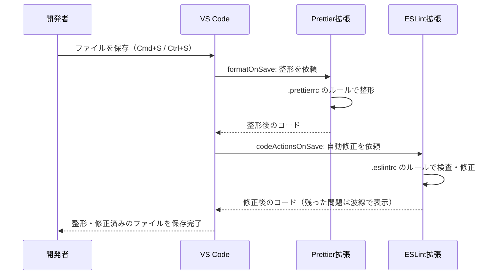

# エディタ連携とpnpm scripts

[Prettier](/tooling/prettier/)と[ESLint](/tooling/eslint/)を導入しましたが、今のままでは「コマンドを打ったときだけ」動く状態です。人間はコマンドを打ち忘れる生き物なので、これでは品質を守りきれません。このページでは、**ファイルを保存した瞬間に自動で整形・修正される**ようVS Codeを設定し、さらにチームの誰もが同じチェックを同じコマンドで実行できるように**pnpm scripts**を整備します。

## 学習目標

- Prettier拡張とESLint拡張をVS Codeにインストールできる
- `.vscode/settings.json` で保存時フォーマットを設定し、各設定の意味を説明できる
- ワークスペース設定をGitで共有する利点を説明できる
- `format` / `lint` 系のpnpm scriptsを整備し、使い分けられる
- 「エディタ・コマンド・CI」の三段構えの考え方を説明できる

## 品質を守る三段構え

最初に全体像を押さえましょう。コード品質のチェックは、次の3つのタイミングで多層的にかけるのが定石です。


- **第1段（エディタ）**: 書いているそばから直るので、開発者は品質をほぼ意識しなくて済みます。ただし、エディタの設定は個人環境に依存するため、これ「だけ」では確実ではありません。
- **第2段（pnpm scripts）**: エディタが何であっても、`pnpm run lint` のような共通コマンドで全ファイルを一括チェックできます。コミット前の最終確認に使います。
- **第3段（CI）**: 人間が忘れても、GitHubにプッシュされたコードをサーバー側が必ず検査します。これは[CI/CDの章](/cicd/ci_pipeline/)で構築します。

このページでは第1段と第2段を整備します。

## VS Code拡張機能をインストールする

VS Codeに次の2つの拡張機能をインストールします。拡張機能のインストール手順自体は[拡張機能のセットアップ](/environment/live_preview/)で学んだとおり、サイドバーのExtensionsアイコンから検索してInstallを押すだけです。

| 拡張機能名 | 発行元ID | 役割 |
|---|---|---|
| **Prettier - Code formatter** | `esbenp.prettier-vscode` | VS Codeのフォーマット機能としてPrettierを使えるようにする |
| **ESLint** | `dbaeumer.vscode-eslint` | ESLintの指摘をエディタ上に波線でリアルタイム表示する |

検索するときは、表の「発行元ID」で検索すると確実です。似た名前の拡張機能が複数ヒットすることがあるためです。たとえば `esbenp.prettier-vscode` と入力すれば、公式のPrettier拡張だけが表示されます。

インストールが終わると、この時点でESLint拡張はすでに働き始めます。[前のページ](/tooling/eslint/)で試したような未使用変数を書くと、コマンドを実行しなくても**その場で赤い波線**が引かれ、マウスを乗せるとルール名付きの説明が表示されます。エディタ下部の「問題」パネル（表示メニュー → 問題）にも一覧表示されます。

一方、Prettier拡張はインストールしただけでは自動で動きません。「いつ・どのフォーマッタで整形するか」を次の設定で指定する必要があります。

## 保存時フォーマットを設定する（settings.json）

### ユーザー設定とワークスペース設定

VS Codeの設定には2つの置き場所があります。

| 種類 | 保存場所 | 効く範囲 |
|---|---|---|
| ユーザー設定 | 個人のホームディレクトリ配下 | 自分のPCのすべてのプロジェクト |
| **ワークスペース設定** | プロジェクト内の `.vscode/settings.json` | そのプロジェクトだけ |

今回は**ワークスペース設定**を使います。理由は、`.vscode/settings.json` はプロジェクトの一部としてGitにコミットできるからです。コミットしておけば、リポジトリを `git clone` した**チームメンバー全員に同じ設定が自動で適用**されます。「各自で設定してください」という口頭ルールは必ず誰かが漏れますが、リポジトリに入っていれば漏れようがありません。

### settings.json を作成する

プロジェクトのルートに `.vscode` ディレクトリを作り、その中に `settings.json` を作成します。ReactプロジェクトとNestJSプロジェクトの両方で、同じ内容で構いません。

**`.vscode/settings.json`**

```json
{
  "editor.defaultFormatter": "esbenp.prettier-vscode",
  "editor.formatOnSave": true,
  "editor.codeActionsOnSave": {
    "source.fixAll.eslint": "explicit"
  }
}
```

**コード解説**

- `"editor.defaultFormatter": "esbenp.prettier-vscode"` — VS Codeの標準フォーマッタとしてPrettier拡張を指定します。値は拡張機能の発行元IDです。VS Codeには複数のフォーマッタが共存できるため、「どれを使うか」の明示が必要です。
- `"editor.formatOnSave": true` — **ファイルを保存するたびに、上で指定したフォーマッタで自動整形**します。この1行が今回の主役です。
- `"editor.codeActionsOnSave"` — 保存時に実行する「コードアクション（自動修正）」の指定です。
- `"source.fixAll.eslint": "explicit"` — 保存時にESLintの自動修正（`--fix` 相当）も実行します。`"explicit"` は「明示的な保存（Cmd+S / Ctrl+S）のときに実行する」という意味です。

### 動作を確認する

設定を保存したら、試しに `src` 配下の適当なファイルで書式を乱してみてください。

```typescript
const   message    =    "保存すると整形される"
```

このファイルを保存（Macは `Cmd+S`、Windowsは `Ctrl+S`）した瞬間、次のように整形されるはずです。

```typescript
const message = '保存すると整形される';
```

スペースが詰められ、[`.prettierrc`](/tooling/prettier/) の設定どおりシングルクォートになり、セミコロンが付きました。これが**保存時フォーマット**です。もし整形されない場合は、次を確認してください。

- 右下の通知や出力パネルにPrettier拡張のエラーが出ていないか
- `.vscode/settings.json` のJSONにカンマ忘れなどの文法ミスがないか
- 拡張機能（`esbenp.prettier-vscode`）が確かにインストールされ、有効になっているか

### 保存した瞬間に何が起きているか

保存時の処理の流れをシーケンス図で確認しましょう。



保存という1アクションの裏で、Prettierによる整形とESLintによる自動修正が順に走っています。どちらも各プロジェクトの設定ファイル（`.prettierrc` / `.eslintrc` 系）を読むので、**エディタでの整形結果とコマンド実行の結果は常に一致**します。

### .vscode をコミットする

設定ができたら、Gitにコミットしてチームに共有しましょう。

```bash
git add .vscode/settings.json
git commit -m "Add VS Code workspace settings for format on save"
```

なお、プロジェクトによっては `.gitignore` に `.vscode` が含まれていることがあります。その場合は、`settings.json` だけ共有する意図で `.gitignore` を `.vscode/*` と `!.vscode/settings.json` の組み合わせに変える方法もありますが、まずは「ワークスペース設定は共有する価値がある」という考え方を覚えておけば十分です。

## pnpm scriptsを整備する

エディタ連携（第1段）ができたので、次は共通コマンド（第2段）です。[これまでのページ](/tooling/prettier/)で `format` と `lint` は用意済みですが、ここで体系的に整理します。

pnpm scriptsとは、`package.json` の `scripts` に定義する「プロジェクト共通のコマンド集」です。`pnpm run <名前>` で誰でも同じコマンドを実行できます。長いコマンドを覚える必要がなくなり、「このプロジェクトで何ができるか」が `package.json` を見れば分かるという documentation（ドキュメント）としての価値もあります。

### 4つのスクリプトを揃える

「チェックだけ」と「修正もする」を両方そろえておくと便利です。Reactプロジェクトの `package.json` を次のように整備します。

**`package.json`（Reactプロジェクト、`scripts` 部分）**

```json
{
  "scripts": {
    "dev": "vite",
    "build": "tsc && vite build",
    "preview": "vite preview",
    "format": "prettier --write \"src/**/*.{ts,tsx,css}\"",
    "format:check": "prettier --check \"src/**/*.{ts,tsx,css}\"",
    "lint": "eslint . --ext ts,tsx --report-unused-disable-directives --max-warnings 0",
    "lint:fix": "eslint . --ext ts,tsx --report-unused-disable-directives --max-warnings 0 --fix"
  }
}
```

**コード解説**

- `"format"` — Prettierで全対象ファイルを**整形（上書き）**します。
- `"format:check"` — 整形が必要なファイルが**ないか確認だけ**します（`--check`）。ファイルは変更しません。CIではこちらを使います。
- `"lint"` — ESLintで**検査だけ**します（Viteテンプレートのデフォルトのまま）。
- `"lint:fix"` — 検査し、自動修正できる問題は**修正**します（`--fix` を追加）。
- `format:check` のようにコロンで区切る命名は、関連するスクリプトをグループ化する慣習です。

NestJSプロジェクトも同じ考え方で揃えます。テンプレートのデフォルトでは `lint` に `--fix` が付いている（実行すると書き換わる）ので、「`lint` はチェックだけ、`lint:fix` で修正」という規約に合わせて整理します。

**`package.json`（NestJSプロジェクト、`scripts` の該当部分）**

```json
{
  "scripts": {
    "format": "prettier --write \"src/**/*.ts\" \"test/**/*.ts\"",
    "format:check": "prettier --check \"src/**/*.ts\" \"test/**/*.ts\"",
    "lint": "eslint \"{src,apps,libs,test}/**/*.ts\"",
    "lint:fix": "eslint \"{src,apps,libs,test}/**/*.ts\" --fix"
  }
}
```

**コード解説**

- `"format"` — テンプレートのデフォルトのままです。
- `"format:check"` — `--write` を `--check` に変えた検査専用版を追加しました。
- `"lint"` — テンプレートのデフォルトから `--fix` を**外し**、検査専用にしました。
- `"lint:fix"` — `--fix` 付きの修正版を別名で用意しました。

これで、**どちらのプロジェクトでも同じ4コマンドが同じ意味で使える**状態になりました。プロジェクトをまたいで開発するとき、この統一が効いてきます。

### 使い分けの目安

| コマンド | いつ使うか | ファイルは変わるか |
|---|---|---|
| `pnpm run format` | 一括で整形したいとき（導入直後や設定変更後） | 変わる |
| `pnpm run format:check` | 整形漏れがないか確認したいとき・CI | 変わらない |
| `pnpm run lint` | 問題がないか確認したいとき・CI | 変わらない |
| `pnpm run lint:fix` | 指摘をまとめて自動修正したいとき | 変わる |

日常の開発では保存時フォーマットがほぼすべて面倒を見てくれるので、コマンドの出番は「コミット前の最終確認」と「CI」が中心になります。コミット前のおすすめの流れは次のとおりです。

```bash
pnpm run format:check
pnpm run lint
```

両方がエラーなく終われば、安心して `git commit` できます。実行結果の例です（問題がない場合）。

```
> my-react-app@0.0.0 format:check
> prettier --check "src/**/*.{ts,tsx,css}"

Checking formatting...
All matched files use Prettier code style!

> my-react-app@0.0.0 lint
> eslint . --ext ts,tsx --report-unused-disable-directives --max-warnings 0
```

`lint` は問題がないとき何も出力せずに終わります。「便りがないのは良い便り」です。

## CIへの布石

ここまでで三段構えのうち2段が完成しました。しかし、第2段のコマンドを**実行するかどうかはまだ人間任せ**です。急いでいるときにチェックを飛ばしてコミットしてしまう事故は、どんなに気をつけても起こります。

そこで最後の砦が第3段のCI（Continuous Integration、継続的インテグレーション）です。[CI/CDの章のCIパイプライン構築](/cicd/ci_pipeline/)では、GitHub Actionsを使って「プッシュやPull Requestのたびに、サーバー上で `pnpm run lint` などを自動実行し、失敗したらマージをブロックする」仕組みを作ります。そのとき実行されるのは、**まさにこのページで整備した pnpm scripts そのもの**です。スクリプト名を統一しておいたのは、CIの設定をシンプルに書けるようにするためでもあります。

## 理解度チェック

**Q1. コード品質チェックの「三段構え」とは何ですか。それぞれの段の役割を説明してください。**

<details markdown="1">
<summary>解答を見る</summary>

1. **エディタ（保存時フォーマット）** — 書いた直後に自動整形・自動修正し、開発者の負担をなくす。
2. **pnpm scripts（手元の一括チェック）** — エディタ環境に依存せず、コミット前に共通コマンドで全ファイルを検査する。
3. **CI（サーバー側の強制チェック）** — 人間が忘れてもプッシュのたびに自動検査し、問題のあるコードがマージされるのを防ぐ。

下の段ほど「最後の砦」として確実性が高く、上の段ほど開発体験が良い、という多層防御の考え方です。

</details>

**Q2. VS Codeのユーザー設定ではなく、ワークスペース設定（`.vscode/settings.json`）に保存時フォーマットを書くのはなぜですか。**

<details markdown="1">
<summary>解答を見る</summary>

ワークスペース設定は**プロジェクトの一部としてGitにコミットして共有できる**からです。リポジトリをcloneしたメンバー全員に同じ設定が自動適用されるため、「各自で設定してください」という運用ルールに頼らずに済みます。ユーザー設定は個人のPCにしか存在しないため、チームでの統一には使えません。

</details>

**Q3. `.vscode/settings.json` の `"editor.formatOnSave": true` と `"source.fixAll.eslint": "explicit"` は、それぞれ保存時に何を実行しますか。**

<details markdown="1">
<summary>解答を見る</summary>

`"editor.formatOnSave": true` は、保存時に**デフォルトフォーマッタ（ここではPrettier拡張）による整形**を実行します。`"source.fixAll.eslint": "explicit"` は、保存時に**ESLintの自動修正（`--fix` 相当）**を実行します。前者が書式、後者が品質ルールの自動修正を担当し、両方合わせて「保存すれば整う」状態を作ります。

</details>

**Q4. `format` と `format:check`、`lint` と `lint:fix` をそれぞれ分けて用意するのはなぜですか。**

<details markdown="1">
<summary>解答を見る</summary>

**「ファイルを変更するコマンド」と「検査だけのコマンド」を明確に区別する**ためです。CIではファイルを変更しても意味がない（検査結果だけが必要な）ので `format:check` / `lint` を使い、手元でまとめて直したいときは `format` / `lint:fix` を使います。区別がないと、CIで実行すべきものが分かりにくくなったり、確認のつもりがファイルを書き換えてしまったりします。

</details>

**Q5. 保存時フォーマットが効いていれば、pnpm scriptsやCIでのチェックは不要と言えますか。**

<details markdown="1">
<summary>解答を見る</summary>

言えません。保存時フォーマットは**個人のエディタ環境に依存**します。拡張機能を入れていない人、別のエディタを使う人、設定が壊れている場合などには働きません。また、エディタを経由しない変更（ファイルの自動生成など）も通り抜けます。だからこそ、環境に依存しないpnpm scriptsと、強制力のあるCIを重ねる「三段構え」が必要です。

</details>

## セルフレビュー

- [ ] Prettier拡張とESLint拡張を発行元IDで確認しながらインストールできる
- [ ] `.vscode/settings.json` を写経せずに書いて、保存時フォーマットを有効にできる
- [ ] `defaultFormatter` / `formatOnSave` / `codeActionsOnSave` の役割をそれぞれ説明できる
- [ ] ユーザー設定とワークスペース設定の違いと使い分けを説明できる
- [ ] 保存した瞬間に何が起きているか、処理の流れを順に説明できる
- [ ] `format` / `format:check` / `lint` / `lint:fix` の4つを使い分けられる
- [ ] 三段構えの考え方と、CIが「最後の砦」である理由を説明できる

## 次のステップ

これで「コード品質と開発ツール」の章は完了です。書く・保存する・コミットするという日常の動作の中に、品質を守る仕組みを組み込めました。

- 前のページ: [リンタとESLint](/tooling/eslint/)
- 次の章: [バックエンドテスト](/testing//) — 「コードの動作が正しいか」を自動で検証するテストを学びます。lintが「書き方」の品質なら、テストは「振る舞い」の品質です。
- この章の続きは[CIパイプラインの構築](/cicd/ci_pipeline/)で登場します。ここで整備した `lint` や `format:check` をGitHub Actionsに組み込み、プッシュのたびに自動実行させます。
- [SNS開発（最終プロジェクト）](/sns/project_setup/)でも、プロジェクトの立ち上げ時にこの章の手順で開発環境を整えます。
