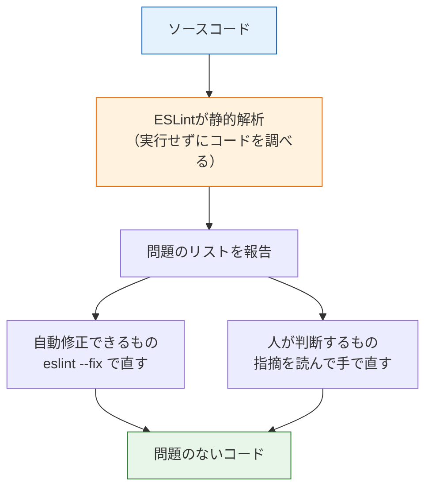
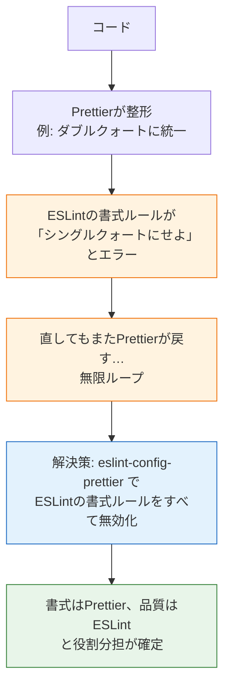

# リンタとESLint

[前のページ](/tooling/prettier/)では、コードの見た目を整えるフォーマッタを学びました。このページでは、コードの**中身の問題点**を検出する**リンタ（linter、リンタ）**を学びます。JavaScript/TypeScriptのリンタとして事実上の標準である**ESLint（イーエスリント）**を、ReactプロジェクトとNestJSプロジェクトの両方で使えるようにします。

なお、ESLintは現在「flat config」と呼ばれる新しい設定方式への移行期にありますが、このカリキュラムではNestJSとViteのテンプレートが採用している**ESLint 8系 + `.eslintrc` 系の設定ファイル**で統一します。テンプレートのデフォルトに合わせることで、生成されたファイルをそのまま読み解けるようになります。

## 学習目標

- リンタが何をするツールで、フォーマッタと何が違うのかを説明できる
- ESLintの指摘（エラー・警告）を読んで、コードを修正できる
- `.eslintrc` 系設定ファイルの `extends` / `rules` / `plugins` の役割を説明できる
- ViteとNestJSのテンプレートに含まれるESLint設定を読み解ける
- PrettierとESLintを衝突なく併用する方法を説明できる

## リンタとは

リンタとは、**コードを実行せずに解析し、バグの原因になりそうな箇所や望ましくない書き方を指摘するツール**です。このように「実行せずにコードを調べる」ことを**静的解析（static analysis、スタティックアナリシス）**と呼びます。

「lint（リント）」とは、もともと衣類に付く糸くずのことです。コードに付いた小さなゴミ（問題点）を取り除くツール、という意味で名付けられました。

具体的に、リンタはたとえば次のような問題を見つけてくれます。

```typescript
const unused = 'この変数はどこでも使われていない'; // 未使用変数

let count = 0;
if (count == '0') {
  // == は型を無視して比較するので意図しない一致が起きやすい
  console.log('zero');
}
```

このコードは**エラーなく動いてしまいます**。文法としては正しいからです。しかし、「使われていない変数」は消し忘れや書き間違いの兆候ですし、`==`（型を変換してから比較する演算子）は `===` と違って予想外の比較結果を生みやすく、バグの温床です。コンパイラ（[tsc](/typescript/compile/)）は文法と型の誤りを見つけますが、こうした「動くけれど危ない書き方」はリンタの守備範囲です。



図のとおり、リンタの指摘には「機械が自動で直せるもの」と「人間が意図を考えて直すべきもの」の2種類があります。前者は `--fix` オプションで自動修正できます。

### フォーマッタとの違い（再確認）

| | フォーマッタ（Prettier） | リンタ（ESLint） |
|---|---|---|
| 見るもの | 見た目（書式） | 中身（コードの品質） |
| 例 | インデントが乱れている | 変数が使われていない |
| 直すと動作は | 変わらない | 変わることがある（例: `==` を `===` に直す） |

役割が違うので、**両方を併用するのが標準**です。ただし併用には1つ落とし穴があり、それはこのページの後半で扱います。

## ESLintを体験する（Reactプロジェクト）

うれしいことに、[Viteで作成したReactプロジェクト](/react/setup/)には**ESLintが最初から入っています**。プロジェクトのルートにある `.eslintrc.cjs` が設定ファイルです（`.cjs` はCommonJS形式のJavaScriptファイルという意味ですが、今は「ESLintの設定ファイル」と理解すれば十分です）。

`package.json` の `scripts` にも、最初から `lint` コマンドが定義されています。

**`package.json`（Viteテンプレートの抜粋）**

```json
{
  "scripts": {
    "lint": "eslint . --ext ts,tsx --report-unused-disable-directives --max-warnings 0"
  }
}
```

**コード解説**

- `eslint .` — カレントディレクトリ以下のファイルを検査します。
- `--ext ts,tsx` — 対象を `.ts` と `.tsx` ファイルにします（ESLintのデフォルト対象は `.js` のため）。
- `--report-unused-disable-directives` — 「ESLintの指摘を無効化するコメント」のうち不要になったものを報告します。
- `--max-warnings 0` — 警告（warning）が1件でもあれば失敗扱いにします。警告を放置させない厳しめの設定です。

わざと問題のあるコードを書いて、検出されるか試しましょう。`src/App.tsx` の先頭に次の2行を足してみてください。

**`src/App.tsx`（先頭に追記）**

```typescript
const unusedValue = 123;
const unusedMessage = 'まだどこでも使っていない';
```

実行します。

```bash
pnpm run lint
```

実行結果の例です。

```
/Users/taro/my-react-app/src/App.tsx
  1:7  error  'unusedValue' is assigned a value but never used    @typescript-eslint/no-unused-vars
  2:7  error  'unusedMessage' is assigned a value but never used  @typescript-eslint/no-unused-vars

✖ 2 problems (2 errors, 0 warnings)
```

**実行結果の読み方**

- `1:7` — 問題のある場所（1行目の7文字目）です。
- `error` — 深刻度です。`error`（エラー）と `warn`（警告）の2段階があります。
- `'unusedValue' is assigned a value but never used` — 問題の説明（値を代入したのに一度も使っていない）です。
- `@typescript-eslint/no-unused-vars` — この指摘を出した**ルールの名前**です。ルール名で検索すれば公式ドキュメントの解説が見つかります。

このように、リンタは「どこが」「なぜ」「どのルールに」違反しているかを教えてくれます。確認できたら、追記した2行は削除しておいてください。

## 設定ファイルを読み解く（Vite編）

ESLintの動きは設定ファイルで決まります。Viteのreact-tsテンプレートが生成する `.eslintrc.cjs` を読んでみましょう。

**`.eslintrc.cjs`（Viteテンプレートのデフォルト）**

```javascript
module.exports = {
  root: true,
  env: { browser: true, es2020: true },
  extends: [
    'eslint:recommended',
    'plugin:@typescript-eslint/recommended',
    'plugin:react-hooks/recommended',
  ],
  ignorePatterns: ['dist', '.eslintrc.cjs'],
  parser: '@typescript-eslint/parser',
  plugins: ['react-refresh'],
  rules: {
    'react-refresh/only-export-components': [
      'warn',
      { allowConstantExports: true },
    ],
  },
};
```

**コード解説**

- `root: true` — 設定の探索をここで止めます。ESLintは親ディレクトリの設定も探しに行く仕組みがあり、これを止めて「このファイルがこのプロジェクトの大元」と宣言しています。
- `env: { browser: true, es2020: true }` — コードが動く環境を伝えます。`browser: true` にすると、`window` や `document` などブラウザ特有のグローバル変数を「未定義の変数」と誤検出しなくなります。
- `extends` — **既製のルールセットを継承**します。設定の核心部分です。
  - `eslint:recommended` — ESLint本体が推奨する基本ルール集（未使用変数の検出など）。
  - `plugin:@typescript-eslint/recommended` — TypeScript向けの推奨ルール集。
  - `plugin:react-hooks/recommended` — [Hooksの章](/react/hooks/)で学んだ「フックはトップレベルで呼ぶ」「依存配列を正しく書く」というルールを機械的に検査してくれます。
- `ignorePatterns` — 検査対象から外すパス。ビルド成果物の `dist` と、この設定ファイル自身を除外しています。
- `parser: '@typescript-eslint/parser'` — ESLintは素のままではTypeScriptを読めないため、TypeScript用の**パーサ（構文解析器）**に差し替えています。
- `plugins: ['react-refresh']` — **プラグイン**は追加ルールを提供する拡張パッケージです。`react-refresh` はViteの高速リロードが正しく動く書き方を検査します。
- `rules` — 個別ルールの上書きです。`'warn'` は深刻度（`'off'` / `'warn'` / `'error'` の3段階）を指定しています。

ポイントは、**`extends` で推奨セットをまとめて適用し、`rules` で個別調整する**という構造です。世の中のほとんどの `.eslintrc` はこの形をしています。

## NestJSプロジェクトの設定を読み解く

[NestJSプロジェクト](/backend/setup/)にも、Prettierと同様に**ESLintが最初から入っています**。設定ファイルは `.eslintrc.js` です。

**`.eslintrc.js`（NestJSテンプレートのデフォルト）**

```javascript
module.exports = {
  parser: '@typescript-eslint/parser',
  parserOptions: {
    project: 'tsconfig.json',
    tsconfigRootDir: __dirname,
    sourceType: 'module',
  },
  plugins: ['@typescript-eslint/eslint-plugin'],
  extends: [
    'plugin:@typescript-eslint/recommended',
    'plugin:prettier/recommended',
  ],
  root: true,
  env: {
    node: true,
    jest: true,
  },
  ignorePatterns: ['.eslintrc.js'],
  rules: {
    '@typescript-eslint/interface-name-prefix': 'off',
    '@typescript-eslint/explicit-function-return-type': 'off',
    '@typescript-eslint/explicit-module-boundary-types': 'off',
    '@typescript-eslint/no-explicit-any': 'off',
  },
};
```

**コード解説**

- `parserOptions.project: 'tsconfig.json'` — TypeScriptの型情報を使った高度な検査を有効にするため、`tsconfig.json` の場所を教えています。
- `env: { node: true, jest: true }` — バックエンドはブラウザではなくNode.jsで動くので `node: true`。テストフレームワークJest（[テストの章](/testing/)で学びます）のグローバル変数も許可しています。Vite側との違いに注目してください。**実行環境が違えば `env` も違う**のです。
- `extends` の `'plugin:prettier/recommended'` — **Prettierとの連携設定**です。次の節で詳しく説明します。
- `rules` — NestJSの開発スタイルに合わない推奨ルールを `'off'` で無効化しています。たとえば `@typescript-eslint/no-explicit-any` を `off` にして、[`any` 型](/typescript/basic_types/)の使用をエラーにしない設定です（学習段階では助かりますが、品質を上げたければ `error` に戻す選択肢もあります）。

`lint` スクリプトも最初から用意されています。

**`package.json`（NestJSテンプレートの抜粋）**

```json
{
  "scripts": {
    "lint": "eslint \"{src,apps,libs,test}/**/*.ts\" --fix"
  }
}
```

**コード解説**

- `"{src,apps,libs,test}/**/*.ts"` — `src`、`apps`、`libs`、`test` ディレクトリ以下のすべての `.ts` ファイルが対象です。
- `--fix` — 自動修正できる指摘は**その場で修正**します。Viteテンプレートの `lint`（チェックのみ）との違いです。

実行してみましょう。

```bash
pnpm run lint
```

問題がなければ何も表示されずに終了します。試しに `src/app.service.ts` に未使用の変数を足してから実行すると、次のように報告されます。

```
/Users/taro/my-api/src/app.service.ts
  5:9  error  'unused' is assigned a value but never used  @typescript-eslint/no-unused-vars

✖ 1 problem (1 error, 0 warnings)
```

## PrettierとESLintを併用する

ここで1つ問題があります。ESLintのルールの中には、「インデントはこう書け」「クォートはこちらを使え」といった**書式に関するルール**も存在します。これらを有効にしたままPrettierを使うと、**Prettierが整形した結果をESLintがエラーと報告する**（またはその逆）という衝突が起きます。



解決策はシンプルで、**「書式のことはPrettierに全部任せ、ESLintの書式系ルールはすべて無効化する」**ことです。そのための定番パッケージが2つあります。

| パッケージ | 役割 |
|---|---|
| `eslint-config-prettier` | Prettierと衝突するESLintの書式系ルールを一括で無効化する設定集 |
| `eslint-plugin-prettier` | Prettierの整形結果との差分を「ESLintのエラー」として報告するプラグイン |

NestJSテンプレートの `extends` にあった `'plugin:prettier/recommended'` は、実は**この2つを同時に適用する**省略記法です。つまりNestJSプロジェクトでは衝突対策が最初から済んでいます。

### Reactプロジェクトに衝突対策を追加する

Viteテンプレートには衝突対策が入っていないので、自分で追加します。最小構成として `eslint-config-prettier` を入れる方法を取ります（[前のページ](/tooling/prettier/)でPrettier本体は導入済みの前提です）。

```bash
pnpm add -D eslint-config-prettier
```

そして `.eslintrc.cjs` の `extends` の**最後**に `'prettier'` を追加します。

**`.eslintrc.cjs`（`extends` を変更）**

```javascript
  extends: [
    'eslint:recommended',
    'plugin:@typescript-eslint/recommended',
    'plugin:react-hooks/recommended',
    'prettier',
  ],
```

**コード解説**

- `'prettier'` — `eslint-config-prettier` を適用し、書式系ルールを無効化します。
- **最後に書くことが重要**です。`extends` は上から順に適用され、後のものが前のものを上書きします。最後に置くことで「どの推奨セットが書式ルールを有効にしていても、確実に無効化する」効果があります。

これで、ReactプロジェクトでもPrettier（書式）とESLint（品質）が衝突せずに共存します。

```bash
pnpm run format
pnpm run lint
```

の2つを順に実行して、どちらもエラーなく通ることを確認してください。

## まとめ: 2つのプロジェクトの状態

| | NestJS（Nest CLI） | React（Vite） |
|---|---|---|
| ESLint本体 | 最初から入っている | 最初から入っている |
| 設定ファイル | `.eslintrc.js` | `.eslintrc.cjs` |
| `lint` スクリプト | あり（`--fix` 付き） | あり（チェックのみ） |
| Prettierとの衝突対策 | 済み（`plugin:prettier/recommended`） | 自分で追加（`eslint-config-prettier`） |

## 理解度チェック

**Q1. リンタとフォーマッタの役割の違いを、それぞれの指摘の例を挙げて説明してください。**

<details markdown="1">
<summary>解答を見る</summary>

フォーマッタは**見た目（書式）**を整えるツールで、「インデントが乱れている」「クォートが統一されていない」といった、直しても動作が変わらない部分を自動で書き換えます。リンタは**中身（品質）**を検査するツールで、「宣言したのに使っていない変数がある」「`==` を使っている」といった、バグの原因になりうる書き方を指摘します。リンタの指摘に従って直すと動作が変わることがあります。

</details>

**Q2. 「静的解析」とはどういう意味ですか。**

<details markdown="1">
<summary>解答を見る</summary>

プログラムを**実行せずに**、ソースコードそのものを解析することです。実行しないので、テストのように環境を整える必要がなく、コードを書いたそばから問題を検出できます。ESLintによるlintやtscの型チェックは静的解析の代表例です。

</details>

**Q3. `.eslintrc` の `extends` と `rules` はそれぞれ何をする設定ですか。**

<details markdown="1">
<summary>解答を見る</summary>

`extends` は**既製のルールセット（推奨設定集）をまとめて継承**する設定です（例: `eslint:recommended`）。`rules` は**個別のルールを上書き**する設定で、`'off'` / `'warn'` / `'error'` の深刻度を指定します。「`extends` で土台を作り、`rules` でプロジェクト固有の調整をする」のが基本構造です。

</details>

**Q4. PrettierとESLintを併用すると、何も対策しない場合にどんな問題が起き、どう解決しますか。**

<details markdown="1">
<summary>解答を見る</summary>

ESLintには書式に関するルールも含まれているため、**Prettierの整形結果をESLintがエラーと報告する（修正し合いのループになる）**衝突が起きえます。解決策は `eslint-config-prettier` を導入し、`extends` の**最後**に `'prettier'` を追加して、Prettierと衝突する書式系ルールを一括で無効化することです。NestJSテンプレートでは `'plugin:prettier/recommended'` によって対策が最初から済んでいます。

</details>

**Q5. ESLintの指摘 `1:7 error 'unusedValue' is assigned a value but never used @typescript-eslint/no-unused-vars` から読み取れる情報を3つ挙げてください。**

<details markdown="1">
<summary>解答を見る</summary>

1. **場所**: 1行目の7文字目に問題がある。
2. **深刻度と内容**: `error` レベルで、「値を代入したのに一度も使われていない変数がある」。
3. **ルール名**: `@typescript-eslint/no-unused-vars` というルールによる指摘で、この名前で検索すれば公式の解説が読める。

</details>

**Q6. NestJSの `lint` スクリプトに付いている `--fix` オプションは何をしますか。**

<details markdown="1">
<summary>解答を見る</summary>

検出した問題のうち、**機械的に直して安全なものを自動修正してファイルを書き換え**ます。すべての指摘が自動修正できるわけではなく、ロジックの意図に関わる指摘（未使用変数をどう扱うか等）は人間が判断して直す必要があります。

</details>

## セルフレビュー

- [ ] リンタの役割を「静的解析」という言葉を使って自分の言葉で説明できる
- [ ] ESLintのエラーメッセージから、場所・内容・ルール名を読み取れる
- [ ] `extends` / `rules` / `plugins` / `env` の役割をそれぞれ説明できる
- [ ] ViteとNestJSのテンプレートの `.eslintrc` を見て、各行の意味を説明できる
- [ ] PrettierとESLintの衝突がなぜ起きるかを説明できる
- [ ] `eslint-config-prettier` を写経せずにReactプロジェクトへ導入できる
- [ ] `'prettier'` を `extends` の最後に書く理由を説明できる

## 次のステップ

これで「見た目はPrettier、品質はESLint」という体制が両プロジェクトに整いました。しかし、毎回手で `pnpm run format` と `pnpm run lint` を打つのは面倒ですし、忘れてしまいます。次の[エディタ連携とpnpm scripts](/tooling/editor_and_scripts/)では、**ファイルを保存した瞬間に自動で整形・修正される**ようVS Codeを設定し、チームの誰でも同じチェックを実行できるようにpnpm scriptsを整理します。

さらに[CI/CDの章](/cicd/ci_pipeline/)では、ここで作った `lint` をGitHub Actionsに組み込み、「lintに落ちるコードはマージできない」仕組みを作ります。

- 前のページ: [フォーマッタとPrettier](/tooling/prettier/)
- 次のページ: [エディタ連携とpnpm scripts](/tooling/editor_and_scripts/)
