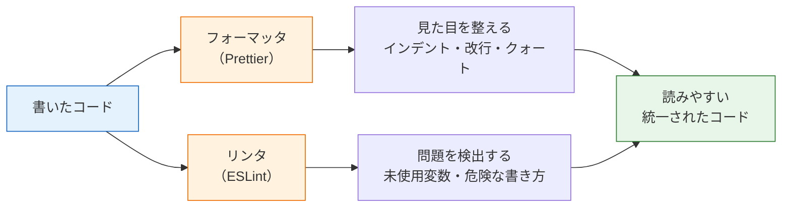
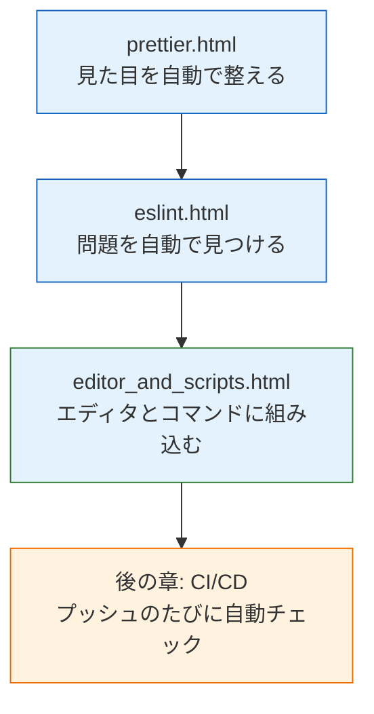

# コード品質と開発ツール

これまでの章で、[React](/react//)によるフロントエンド、[NestJS](/backend//)によるバックエンド、そして[データベース](/database//)を扱うコードを書いてきました。コードの量が増えてくると、「インデントが揃っていない」「使っていない変数が残っている」「人によって書き方がバラバラ」といった問題が目立つようになります。

この章では、こうした問題を**ツールの力で自動的に**解決する方法を学びます。具体的には、コードの見た目を整える**フォーマッタ（formatter）**のPrettier（プリティア）と、コードの問題点を検出する**リンタ（linter）**のESLint（イーエスリント）を扱います。

## なぜコード品質ツールが必要か

一人で小さなプログラムを書いているうちは、コードの書き方が多少乱れていても困ることは少ないかもしれません。しかし、次のような場面では話が変わります。

- **チーム開発**: 人によってインデント幅やクォートの種類が違うと、コードが読みにくくなります。さらに、[Pull Request](/git/github_and_pr/)の差分（diff）に「中身は同じだが見た目だけ変わった行」が大量に混ざり、レビューの妨げになります。
- **バグの予防**: 「宣言したのに使っていない変数」「`==` と `===` の取り違え」のような小さなミスは、目視のレビューでは見落としがちです。ツールなら機械的に、確実に検出できます。
- **議論の削減**: 「インデントは2か4か」「セミコロンは付けるか」といったスタイルの議論は、結論を出してもメンバー全員が守り続けるのは大変です。ツールに任せれば、議論そのものが不要になります。

つまり、コード品質ツールとは「人間が気をつける」のをやめて「機械に守らせる」ための仕組みです。人間は本来考えるべきこと（設計やロジック）に集中できるようになります。

## フォーマッタとリンタの違い

この章の主役である2つのツールは、似ているようで役割がはっきり分かれています。まず全体像を図で確認しましょう。

フォーマッタは「**見た目**」だけを変更し、コードの動作には一切影響を与えません。一方、リンタは「**中身**」に踏み込んで、バグの原因になりそうな書き方を指摘します。表で比較すると次のようになります。

| 観点 | フォーマッタ（Prettier） | リンタ（ESLint） |
|---|---|---|
| 目的 | コードの**見た目**を統一する | コードの**問題点**を検出する |
| 対象 | インデント、改行、クォート、セミコロンなど | 未使用変数、危険な比較、バグの温床になる書き方など |
| 動作への影響 | なし（整形してもプログラムの意味は同じ） | 指摘に従って直すと動作が変わることがある |
| 修正方法 | すべて自動で書き換える | 一部は自動修正（`--fix`）、残りは人間が判断して直す |
| 代表的なツール | Prettier | ESLint |

2つはどちらか一方を選ぶものではなく、**併用するのが標準**です。実際、この後学ぶように、NestJSの公式テンプレートには最初から両方が組み込まれています。

## この章で学ぶこと

この章は3つのページで構成されています。

1. **[フォーマッタとPrettier](/tooling/prettier/)** — フォーマッタとは何かを理解し、Prettierの導入・設定・実行方法を学びます。NestJSプロジェクトには最初から入っていること、Reactプロジェクトには自分で追加する必要があることも確認します。
2. **[リンタとESLint](/tooling/eslint/)** — リンタとは何かを理解し、ESLintのルールの読み方・実行方法を学びます。Prettierと併用するときの注意点（ルールの衝突と解決方法）も扱います。
3. **[エディタ連携とpnpm scripts](/tooling/editor_and_scripts/)** — VS Codeで「保存した瞬間に自動整形」される環境を作り、チーム全員が同じコマンドでチェックを実行できるようにpnpm scriptsを整備します。

## この章の前提

- [Node.jsのインストール](/environment/node/)が済んでいること（Node.js 20）と、pnpmが使えること（pnpmの導入は[React基礎のセットアップ](/react/setup/)を参照）
- [Viteで作成したReactプロジェクト](/react/setup/)と[Nest CLIで作成したNestJSプロジェクト](/backend/setup/)を一度でも作ったことがあること

この章のコマンドは、どちらのプロジェクトでもそのまま試せるように両方の手順を載せています。手元に過去の章で作ったプロジェクトがあれば、それを使って進めてください。

## 学習の流れ

この章で整備したチェックの仕組みは、[CI/CDの章](/cicd/ci_pipeline/)で「GitHubにプッシュするたびに自動実行される」ところまで発展させます。さらに[SNS開発（最終プロジェクト）](/sns//)でも、最初にこの章の内容を使って開発環境を整えるところから始めます。ここでしっかり手を動かしておきましょう。
