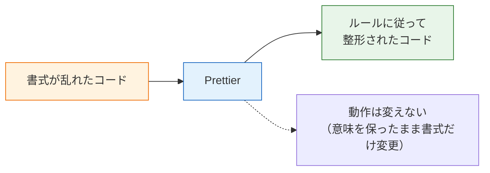

# フォーマッタとPrettier

このページでは、コードの見た目を自動で整える**フォーマッタ（formatter、フォーマッタ）**について学び、JavaScript/TypeScript界隈で標準的に使われている**Prettier（プリティア）**を実際のプロジェクトに導入します。[章の概要](/tooling/)で見たとおり、フォーマッタは「コードの見た目」を担当するツールです。

## 学習目標

- フォーマッタが何をするツールで、なぜ必要なのかを説明できる
- Prettierを手動で実行し、コードを整形できる
- `.prettierrc` で整形ルールを設定し、各オプションの意味を説明できる
- NestJSプロジェクトには最初からPrettierが入っていることを確認できる
- ReactプロジェクトにPrettierを自分で追加できる

## フォーマッタとは

フォーマッタとは、**コードの意味を変えずに、見た目（書式）だけを一定のルールに従って書き換えるツール**です。書式とは、インデントの幅、改行の位置、クォートの種類（`'` か `"` か）、セミコロンの有無、といった要素を指します。

例を見てみましょう。次のコードは動作はしますが、書式がバラバラです。

```typescript
const   user = {name:"太郎",age :25,
    email:'taro@example.com'}
function greet( user:{name:string} ){
        return "こんにちは、"+user.name+"さん"
}
```

これをPrettierに通すと、次のように書き換えられます。

```typescript
const user = {
  name: "太郎",
  age: 25,
  email: "taro@example.com",
};
function greet(user: { name: string }) {
  return "こんにちは、" + user.name + "さん";
}
```

インデント、スペース、改行、クォートが統一され、ぐっと読みやすくなりました。重要なのは、**プログラムの動作は1ミリも変わっていない**ことです。フォーマッタが変えるのは見た目だけです。



### なぜ手で揃えずツールに任せるのか

「気をつけて書けばいいのでは」と思うかもしれません。しかし、手作業での統一には限界があります。

- **人間は必ずミスをする**: 数千行のコードで一箇所もインデントを乱さないのは不可能に近いです。
- **人によって「正しい」が違う**: インデント2か4か、セミコロンを付けるか省くか。どちらでも動くからこそ、好みが分かれます。チーム開発では、この違いがそのままコードの読みにくさになります。
- **差分が汚れる**: [Gitの章](/git/basic_commands/)で学んだ `git diff` を思い出してください。誰かがエディタの設定でインデントを変えてしまうと、「中身は変わっていないのに何百行も差分が出る」コミットが生まれ、[Pull Requestのレビュー](/git/github_and_pr/)が困難になります。

Prettierの設計思想は「**opinionated（オピニオネイテッド、意見が強い）**」という言葉で表現されます。設定できる項目をあえて少なくし、「Prettierが決めたスタイルにみんなが従う」ことで、スタイル論争そのものをなくす、という考え方です。

## Prettierを体験する

まずは小さなファイルで動きを体験しましょう。練習用のディレクトリを作って試します（pnpmの導入がまだの場合は[React基礎のセットアップ](/react/setup/)を参照してください）。

```bash
mkdir prettier-demo
cd prettier-demo
pnpm init
pnpm add -D --save-exact prettier@3
```

**コード解説**

- `pnpm init` — `package.json` を質問なしで作成します。
- `pnpm add -D --save-exact prettier@3` — Prettier 3系をインストールします。`-D` は「開発時にだけ使うパッケージ」という意味で、`package.json` の `devDependencies` に記録されます。フォーマッタは開発中にしか使わない（本番のアプリには不要な）ツールなので、devDependenciesが適切です。
- `--save-exact` — バージョンを `3.2.5` のように完全固定で記録します。Prettierはバージョンが少し違うだけで整形結果が微妙に変わることがあり、チーム内で結果がズレないように固定するのが公式の推奨です。

実行結果の例です。

```
Packages: +1
+
Progress: resolved 1, reused 1, downloaded 0, added 1, done

devDependencies:
+ prettier 3.2.5
```

次に、わざと書式を乱したファイルを作ります。

**`sample.ts`**

```typescript
const   user = {name:"太郎",age :25,
    email:'taro@example.com'}
console.log( user )
```

### --check: 整形が必要か確認する

Prettierには大きく2つの実行モードがあります。まずは「チェックだけして書き換えない」モードです。

```bash
pnpm exec prettier --check sample.ts
```

実行結果の例です。

```
Checking formatting...
[warn] sample.ts
[warn] Code style issues found in the above file. Run Prettier with --write to fix.
```

「このファイルは整形ルールに従っていません」と警告されました。`--check` はファイルを変更しないので、後の章で学ぶCIのように「チェックに通るかどうかだけ知りたい」場面で使います。

### --write: 実際に整形する

次は実際に書き換えるモードです。

```bash
pnpm exec prettier --write sample.ts
```

実行結果の例です。

```
sample.ts 24ms
```

`sample.ts` を開くと、次のように整形されています。

```typescript
const user = { name: "太郎", age: 25, email: "taro@example.com" };
console.log(user);
```

**コード解説**

- `pnpm exec prettier` — プロジェクトにインストールしたPrettierを実行します。`pnpm exec` は `node_modules` の中のコマンドを呼び出すサブコマンドです。
- `--check` — 整形が必要なファイルを報告するだけで、変更はしません。
- `--write` — ファイルを整形ルールに従って上書きします。

ファイル名の代わりに `.`（カレントディレクトリ）を指定すると、対象になるすべてのファイルを一括処理できます。

```bash
pnpm exec prettier --write .
```

なお、`node_modules` の中身は自動的に対象外になるので心配いりません。

## .prettierrc で設定する

Prettierは設定ゼロでも動きますが、プロジェクトのルート（一番上のディレクトリ）に **`.prettierrc`** というファイルを置くと、いくつかの項目を調整できます。書式はJSONです。

**`.prettierrc`**

```json
{
  "singleQuote": true,
  "trailingComma": "all",
  "semi": true,
  "printWidth": 80,
  "tabWidth": 2
}
```

**コード解説**

- `"singleQuote": true` — 文字列をダブルクォート（`"`）ではなくシングルクォート（`'`）で書きます。デフォルトは `false`（ダブルクォート）です。
- `"trailingComma": "all"` — 配列やオブジェクトの最後の要素にもカンマを付けます（例: `age: 25,`）。後から要素を追加したとき、差分が「追加した行だけ」になるのが利点です。Prettier 3ではこれがデフォルトです。
- `"semi": true` — 文末にセミコロンを付けます（デフォルトのまま）。
- `"printWidth": 80` — 1行が80文字を超えそうなら改行します（デフォルトのまま）。
- `"tabWidth": 2` — インデントはスペース2個です（デフォルトのまま）。

デフォルトと同じ値をあえて書く必要はありませんが、初学者のうちは「このプロジェクトの方針」が目に見える形になっていると安心です。設定を変えたら、もう一度 `pnpm exec prettier --write .` を実行してみてください。先ほどの `sample.ts` のダブルクォートがシングルクォートに変わるはずです。

```typescript
const user = { name: '太郎', age: 25, email: 'taro@example.com' };
console.log(user);
```

### .prettierignore で対象外を指定する

整形してほしくないファイルやディレクトリは、**`.prettierignore`** に列挙します。書き方は[Gitの章で学んだ](/git/basic_commands/) `.gitignore` と同じです。

**`.prettierignore`**

```
dist
coverage
```

**コード解説**

- `dist` — ビルドの成果物（機械が生成したファイル）は整形する意味がないので除外します。
- `coverage` — テストのカバレッジレポート（後の[テストの章](/testing/)で登場します）も生成物なので除外します。

## NestJSプロジェクトでは最初から入っている

ここまで手作業で導入してきましたが、実は[バックエンドの章](/backend/setup/)で `nest new` コマンドを実行したとき、**Nest CLIがPrettier一式を自動でセットアップしています**。NestJSプロジェクトのルートを見てみましょう。

```bash
ls -a
```

実行結果の例です（一部抜粋）。

```
.eslintrc.js  .prettierrc  nest-cli.json  package.json  src  test  tsconfig.json
```

`.prettierrc` がすでに存在しています。中身は次のとおりです。

**`.prettierrc`（NestJSテンプレートのデフォルト）**

```json
{
  "singleQuote": true,
  "trailingComma": "all"
}
```

さらに `package.json` の `scripts` には、最初から `format` コマンドが定義されています。

**`package.json`（抜粋）**

```json
{
  "scripts": {
    "format": "prettier --write \"src/**/*.ts\" \"test/**/*.ts\""
  }
}
```

**コード解説**

- `"format"` — `pnpm run format` で実行できるスクリプト名です。
- `prettier --write "src/**/*.ts" "test/**/*.ts"` — `src` と `test` ディレクトリ以下のすべての `.ts` ファイルを整形します。`**` は「任意の深さのディレクトリ」を意味するパターンです。

つまり、NestJSプロジェクトでは次のコマンドを打つだけで全ファイルが整形されます。

```bash
pnpm run format
```

実行結果の例です。

```
> my-api@0.0.1 format
> prettier --write "src/**/*.ts" "test/**/*.ts"

src/app.controller.spec.ts 99ms
src/app.controller.ts 8ms
src/app.module.ts 4ms
src/app.service.ts 4ms
src/main.ts 5ms
test/app.e2e-spec.ts 11ms
```

「フレームワークの公式テンプレートに最初から組み込まれている」という事実は、Prettierがいかに標準的なツールかを物語っています。

## ReactプロジェクトにPrettierを追加する

一方、[Viteで作成したReactプロジェクト](/react/setup/)はどうでしょうか。Viteのテンプレートには**ESLintは含まれていますが、Prettierは含まれていません**（ESLintについては[次のページ](/tooling/eslint/)で詳しく見ます）。そこで、Reactプロジェクトには自分でPrettierを追加します。

Reactプロジェクトのルートで次を実行します。

```bash
pnpm add -D --save-exact prettier@3
```

設定ファイルを作成します。NestJS側と書き方を揃えておくと、2つのプロジェクトを行き来しても混乱しません。

**`.prettierrc`**

```json
{
  "singleQuote": true,
  "trailingComma": "all"
}
```

除外設定も作ります。Viteのビルド成果物は `dist` に出力されるためです。

**`.prettierignore`**

```
dist
```

最後に、NestJSに合わせて `format` スクリプトを `package.json` に追加します。Reactでは `.tsx` ファイルやCSSも整形対象にしたいので、パターンを少し広げます。

**`package.json`（`scripts` に追記）**

```json
{
  "scripts": {
    "dev": "vite",
    "build": "tsc && vite build",
    "preview": "vite preview",
    "format": "prettier --write \"src/**/*.{ts,tsx,css}\""
  }
}
```

**コード解説**

- `"format": "prettier --write \"src/**/*.{ts,tsx,css}\""` — `src` 以下の `.ts`、`.tsx`、`.css` ファイルをすべて整形します。`{ts,tsx,css}` は「このうちどれか」を意味するパターンです。
- JSON内では `"` をそのまま書けないため、`\"` と**エスケープ**（特別な記号を打ち消す書き方）しています。

実行してみましょう。

```bash
pnpm run format
```

実行結果の例です。

```
> my-react-app@0.0.0 format
> prettier --write "src/**/*.{ts,tsx,css}"

src/App.css 35ms
src/App.tsx 89ms
src/index.css 5ms
src/main.tsx 7ms
```

これでReactプロジェクトでも、NestJSプロジェクトと同じ `pnpm run format` 一発で整形できるようになりました。

## まとめ: 2つのプロジェクトの状態

| | NestJS（Nest CLI） | React（Vite） |
|---|---|---|
| Prettier本体 | 最初から入っている | 自分で追加する |
| `.prettierrc` | 最初からある | 自分で作る |
| `format` スクリプト | 最初からある | 自分で追加する |

「テンプレートに何が含まれているか」を知っておくと、新しいプロジェクトを始めるときに何を追加すべきかすぐ判断できます。

## 理解度チェック

**Q1. フォーマッタが変更するのはコードの何で、変更しないのは何ですか。**

<details markdown="1">
<summary>解答を見る</summary>

変更するのは**見た目（書式）**です。インデント、改行位置、クォートの種類、セミコロンの有無などを統一されたルールに従って書き換えます。変更しないのは**コードの意味（動作）**です。整形の前後でプログラムの実行結果は変わりません。

</details>

**Q2. `pnpm exec prettier --check .` と `pnpm exec prettier --write .` の違いを説明してください。**

<details markdown="1">
<summary>解答を見る</summary>

`--check` は整形ルールに従っていないファイルを**報告するだけ**で、ファイルは変更しません。CIのように「合格か不合格かだけ知りたい」場面で使います。`--write` はファイルを**実際に整形して上書き**します。手元で整形したいときに使います。

</details>

**Q3. Prettierを `pnpm add -D`（devDependencies）でインストールするのはなぜですか。**

<details markdown="1">
<summary>解答を見る</summary>

Prettierは**開発中にだけ使うツール**であり、ビルドして本番環境で動くアプリ本体には不要だからです。`-D` を付けてインストールすると `package.json` の `devDependencies` に記録され、「開発用の依存」であることが明示されます。

</details>

**Q4. NestJSプロジェクトとViteのReactプロジェクトで、Prettierの導入手順が違うのはなぜですか。**

<details markdown="1">
<summary>解答を見る</summary>

Nest CLI（`nest new`）のテンプレートには**Prettierと設定ファイル、`format` スクリプトが最初から含まれている**ため、追加作業が不要です。一方、Viteのテンプレートに含まれているのはESLintだけで、Prettierは含まれていないため、自分でインストール・設定する必要があります。

</details>

**Q5. `.prettierrc` の `"trailingComma": "all"` には、Git運用上どんな利点がありますか。**

<details markdown="1">
<summary>解答を見る</summary>

配列やオブジェクトの最後の要素にもカンマが付くため、**末尾に要素を追加したときの差分が「追加した行だけ」になる**点です。末尾カンマがないと、要素を追加するたびに「直前の行にカンマを足す変更」も差分に含まれてしまい、`git diff` やPull Requestのレビューで余計なノイズになります。

</details>

## セルフレビュー

- [ ] フォーマッタの役割を「見た目」「動作」という言葉を使って自分の言葉で説明できる
- [ ] Prettierが「opinionated」と呼ばれる理由を説明できる
- [ ] `--check` と `--write` を使い分けて実行できる
- [ ] `.prettierrc` の `singleQuote` / `trailingComma` / `printWidth` の意味を説明できる
- [ ] `.prettierignore` で生成物を整形対象から外せる
- [ ] ViteのReactプロジェクトに、写経せずにPrettierを導入して `format` スクリプトを追加できる
- [ ] NestJSプロジェクトで `pnpm run format` が何をするか説明できる

## 次のステップ

見た目はPrettierに任せられるようになりました。次の[リンタとESLint](/tooling/eslint/)では、コードの**中身の問題**（未使用変数や危険な書き方）を検出するリンタを学びます。そこでは「PrettierとESLintのルールが衝突する問題」とその解決方法も扱うので、このページの内容が前提になります。

また、このページで整備した `format` スクリプトは、[エディタ連携とpnpm scripts](/tooling/editor_and_scripts/)で「保存した瞬間に自動実行」へ進化させ、さらに[CI/CDの章](/cicd/ci_pipeline/)ではプッシュのたびに `--check` で自動検査する仕組みに組み込みます。

- 前のページ: [コード品質と開発ツール（章の概要）](/tooling/)
- 次のページ: [リンタとESLint](/tooling/eslint/)
