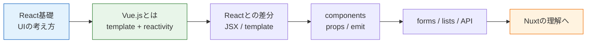

# Vue.js入門

Vue.jsは、HTMLに近いテンプレート構文とリアクティブな状態管理を使って、画面を作るためのフロントエンドフレームワークです。

Reactと同じようにコンポーネントでUIを作りますが、Vue.jsは `.vue` ファイルの中で `<template>`、`<script>`、`<style>` を分けて書く構成がよく使われます。HTML/CSSを学んだ直後の人にとって、画面の構造を追いやすいのが特徴です。

> このカリキュラムでは、TodoアプリとSNSアプリの実装解説はReactを基準に進めます。Vue.jsは、現場でVue案件に入ったときに「Reactと何が違うか」を読めるようにするために学びます。

## フレームワークとは

フレームワークは、アプリを作るための基本ルールと便利な機能をまとめたものです。

素のJavaScriptでも画面は作れます。しかし、フォーム、一覧、検索、モーダル、API通信が増えると、どのコードがどの画面を変更しているのか追いにくくなります。Vue.jsは、状態が変わったら画面も自動で変わる仕組みを提供し、そのうえでHTMLに近い形で画面を書けます。

## 学習ページ

| ページ | 内容 |
| --- | --- |
| [Vue.jsとは何か](/vue/what_is_vue/) | Vue.jsの役割、どんな場面で使うか、Reactと同じ目的 |
| [Reactとの違い](/vue/vue_vs_react/) | JSXとtemplate、stateとref、イベントやフォームの違い |
| [リアクティブとコンポーネント](/vue/reactivity_and_components/) | `ref`、props、emit、`.vue` ファイルの読み方 |
| [フォーム・一覧・API通信](/vue/directives_forms_api/) | `v-model`、`v-for`、`useFetch`ではなく通常のfetchで考える入口 |
| [このカリキュラムでの扱い](/vue/curriculum_scope/) | React中心で実践する理由、Vueは比較知識として学ぶ範囲 |

## 参考リンク

- [Vue.js Guide](https://vuejs.org/guide/introduction.html) - Vue公式ガイドです。
- [Vue.js 日本語ドキュメント](https://ja.vuejs.org/guide/introduction.html) - 公式ガイドの日本語版です。
- [Vue.js: Single-File Components](https://vuejs.org/guide/scaling-up/sfc.html) - `.vue` ファイルの構成を確認できます。
- [MDN: Getting started with Vue](https://developer.mozilla.org/en-US/docs/Learn_web_development/Core/Frameworks_libraries/Vue_getting_started) - MDNのVue入門です。
